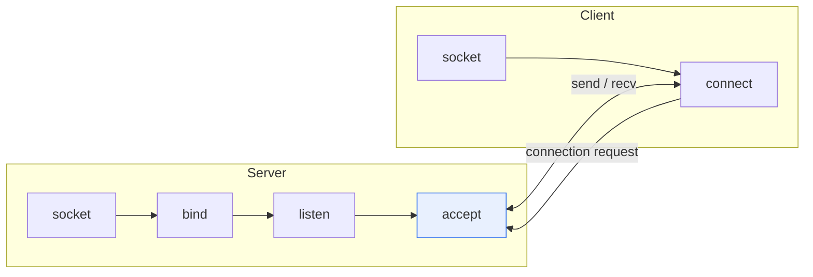

# Socket Communication

## 1. Overview

### A. Definition
> A **socket** is an **endpoint** for inter-process communication over a network, identified by the combination of an IP address and a port number. Socket communication is the method of sending and receiving data through this socket.

The key to understanding a socket is that it is "**an abstracted gateway that lets an application deal with a complex network**." The internal workings of TCP/IP (packet segmentation, routing, retransmission) are enormously complex, but a developer only needs to know the standard interface of the socket API (socket, connect, send, recv) to communicate without knowing this complexity. A socket specifies "which computer" via the IP address and "which program on that computer" via the port number. For example, a web server typically opens sockets on port 80 (HTTP) and port 443 (HTTPS) to wait for client connections. IP:port can be likened to "building address:room number."

### B. Necessity
For programs on different devices to communicate, a standard way to identify the counterpart and reliably exchange data is needed. The socket is this standard communication mechanism provided by the operating system, and it forms the foundation of almost all network applications such as the web, messengers, and games.

## 2. Communication Model Diagram and Types

In TCP socket communication, the server waits for the client in the order socket creation → bind (bind address) → listen (wait) → accept (accept connection), while the client creates a socket → requests a connection with connect. Once the connection is established, both sides exchange data with send/recv. Sockets are divided into two types depending on the protocol used. A **stream socket (TCP)** establishes a connection and guarantees the order and reliability of data, while a **datagram socket (UDP)** sends quickly without a connection but does not guarantee order or arrival.

| Type | Protocol | Characteristics |
|---|---|---|
| **Stream socket** | TCP | Connection-oriented, reliability·order guaranteed |
| **Datagram socket** | UDP | Connectionless, fast but unreliable (video·games) |

## 3. TCP Socket and WebSocket Flow

If a TCP socket is low-level communication that directly handles the transport layer, then **WebSocket** is a higher-layer technology for the web environment. WebSocket starts as an ordinary HTTP request, switches the protocol via the `Upgrade` header (handshake), and thereafter freely exchanges messages (full-duplex) between server and client over a single persistent connection. Thanks to this, "server push"—in which the server sends data to the client first—becomes possible, enabling real-time web services such as chat, real-time notifications, and stock quotes.

| Category | TCP Socket | WebSocket |
|---|---|---|
| **Layer** | Directly on the transport layer (TCP) | Application layer (upgrade over HTTP) |
| **Connection** | socket→connect→3-way handshake | Upgrade after HTTP handshake |
| **Communication** | Bidirectional stream | Bidirectional full-duplex (real-time) |
| **Use** | General network apps | Real-time web (chat·notifications) |

## 4. Comparison of Socket Communication and HTTP Communication

Socket communication and HTTP differ fundamentally in how they maintain connections. HTTP is a **stateless** method that closes the connection after a request-response, so the server cannot initiate contact, and when real-time is needed, it relies on inefficient polling in which the client repeatedly makes requests. Socket communication (especially WebSocket) maintains the connection, enabling bidirectional, real-time communication.

| Category | Socket Communication | HTTP Communication |
|---|---|---|
| **Connection** | Persistent connection (stateful) | Terminates after request-response (stateless) |
| **Direction** | Bidirectional (server push possible) | Unidirectional (client-initiated) |
| **Real-time** | High | Low (polling required) |
| **Use** | Real-time·bidirectional | Web documents·REST APIs |

## 5. Considerations and Implications

1. **Choosing to match requirement characteristics** is important. Simple request-response is straightforward with HTTP/REST, real-time bidirectional communication is suited to WebSocket, and if only unidirectional server push is needed, SSE (Server-Sent Events) is economical.
2. **For large-scale real-time services, connection management is the crux.** Maintaining a large number of persistent connections requires designing for server resources and scaling (message brokers, scale-out).
3. In the reliability-vs-speed trade-off, video and games are latency-sensitive and choose UDP, while files and transactions require accuracy and choose TCP—so data characteristics govern protocol choice.

---

> **In one line**: A socket is a communication endpoint identified by IP and port; there are TCP (reliable) and UDP (fast) sockets as well as the real-time bidirectional WebSocket, and socket communication, being persistent and bidirectional, contrasts with the request-response, stateless HTTP and is well suited to real-time services.
