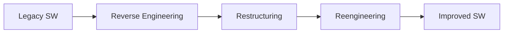
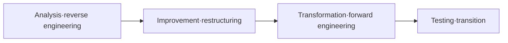

# Software Maintenance 3R (Reverse Engineering · Restructuring · Reengineering)

## 1. Overview

### A. Definition
> A concept (3R) collectively referring to three representative techniques—analyzing (reverse engineering), improving (restructuring), and rebuilding (reengineering) an existing system—in order to **raise the maintainability and reduce the cost** of aged and complex software.

The 3Rs are not independent techniques but lie on a continuum of **analysis → improvement → rebuilding**. If reverse engineering is the stage of "understanding what was built and how," restructuring is the stage of "organizing what is understood into something better within the same functionality," and reengineering is the stage of "creating anew," encompassing both of the former. In other words, reengineering is the most comprehensive, embracing reverse engineering and restructuring as sub-processes.

### B. Background and Necessity
In a long-operated legacy system, as staff change and documentation is lost, **those who know the structure disappear**, and frequent modifications pile up, so code complexity and **technical debt** balloon like a snowball. In this state, even a small change causes unpredictable side effects, and maintenance costs surge. Yet completely scrapping and building anew loses the accumulated business rules (domain knowledge) and carries high risk and cost. 3R is a compromise that lowers risk and cost by **reusing existing assets as much as possible**, and today it has become a core means of **legacy modernization** such as cloud migration and MSA transition.

## 2. The 3R Composition

The three techniques become clear when distinguished by the **direction of movement in abstraction level**. Reverse engineering is a **bottom-up** activity that ascends from implementation (code) to the higher-level concepts of design and specification. Restructuring improves only the representation **within the same level** without changing the abstraction level (e.g., modularizing spaghetti code). Reengineering is a **bottom-up→top-down round trip** activity that restores the higher-level specification via reverse engineering, then, after improvement, descends back to implementation via forward engineering.

- **Reverse Engineering**: Extracts and restores design and specification from source code, executables, and artifacts. It is the starting point for grasping the structure of a legacy without documentation, and its purpose is only to "understand" while leaving functionality intact.
- **Restructuring**: Improves the internal code and structure while keeping the externally visible functionality and behavior unchanged. It lowers readability, modularity, and complexity issues to make subsequent changes easy.
- **Reengineering**: Combines reverse engineering + improvement + forward engineering to rebuild the system. Beyond mere cleanup, it can improve functionality, quality, and even the platform.

| Technique | Purpose | Functional Change | Abstraction Direction |
|---|---|---|---|
| **Reverse engineering** | Extract design·specification (understanding) | None | Bottom-up (code→design) |
| **Restructuring** | Improve structure·readability | None | Same level |
| **Reengineering** | Rebuild·improve quality | Possible | Bottom-up→top-down |

## 3. Related Concepts

To use 3R accurately, one must distinguish its relationships with adjacent concepts. In particular, restructuring and refactoring, and reengineering and migration, are often confused.

| Concept | Description | Relationship with 3R |
|---|---|---|
| **Forward Engineering** | Forward development of specification→design→implementation | The final process of reengineering |
| **Migration** | Moving the platform, language, or DB to a different environment | A form or part of reengineering |
| **Refactoring** | Improving internal structure while preserving external behavior | Practicing restructuring at the code level |

Refactoring is a practical technique that repeatedly applies the concept of restructuring in small units at the source-code level, and migration can be seen as a special case of changing the target environment during the reengineering process.

## 4. The Reengineering Process

Reengineering first restores the structure and business rules of the existing system through **analysis·reverse engineering**, removes design defects and duplication through **improvement·restructuring**, re-implements it to fit the new platform and structure through **transformation·forward engineering**, and then verifies through **testing·transition** that existing functionality has been preserved and reflects it into operation. The most important control point in this process is the final testing stage: even after rebuilding, it must be confirmed via **regression testing** that the original functionality operates identically.

## 5. Considerations and Implications
From a professional engineer's perspective, the success of 3R hinges on the judgment of "what, why, and to what extent to touch." First, since not every legacy can be reengineered, targets must be prioritized based on **maintenance cost, business importance, and technical-debt level**. Second, to prevent existing functionality from being damaged during rebuilding, functional preservation through **regression testing and parallel operation** is essential. Third, 3R is a core means of the modernization strategy (refactor·re-architect) that transitions on-premises legacy systems to **cloud·MSA**, and recently **AI-based code analysis and automatic conversion tools** are greatly improving the efficiency of the reverse-engineering and transformation processes. That said, even automated results must pass human verification to guarantee quality.

---

> **In one line**: 3R is a legacy-improvement technique proceeding through *reverse engineering (design extraction) · restructuring (structural improvement) · reengineering (rebuilding)*, distinguished by abstraction direction and whether functionality changes, and premised on target prioritization and functional preservation based on regression testing, making it a core means of cloud·MSA modernization.
