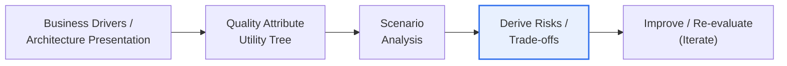
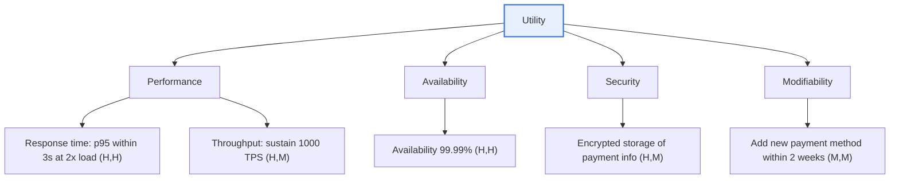

# Software Architecture Analysis and ATAM

## 1. Overview

### A. Definition and Background of Software Architecture Analysis

> **Software Architecture Analysis** is the activity of **evaluating, before implementation, whether a system's structure (architecture) satisfies the required quality attributes (performance, security, availability, modifiability, etc.), and deriving risks, trade-offs, and improvements**. The representative evaluation method is **ATAM (Architecture Trade-off Analysis Method)**, established by the SEI (Software Engineering Institute at Carnegie Mellon).

The fundamental reason architecture analysis is needed is that "**architectural defects are the most expensive to fix later**." Architecture is the skeleton of a system; once decided, all subsequent detailed design and implementation are built on top of it. Therefore, a wrong decision at the architecture stage (e.g., a single monolithic structure that does not consider scalability, or coupling between services bound only by synchronous calls) becomes harder to correct as development proceeds, and after completion invites the enormous cost of a complete redesign. It is a long-observed rule of thumb that the cost of fixing software defects grows exponentially the later the development stage, and reports have repeatedly shown that catching in the operation stage a problem that could have been caught at the requirements or design stage costs dozens of times more. Architectural defects are the target that must be caught at the leftmost point of this curve, i.e., where they are cheapest to fix.

Architecture is also the point where multiple quality attributes **collide**. **Trade-offs** lurk everywhere: introducing caching and denormalization to improve performance worsens data consistency and the cost of security validation, and adding abstraction layers to increase flexibility lowers performance and comprehensibility. These conflicts do not show up in a single line of code but manifest in the interactions of the whole structure, so no matter how well individual components are written, system quality collapses if the structure is wrong. Software architecture analysis evaluates precisely these structural decisions **before implementation**. It clarifies the quality attributes stakeholders require and systematically examines whether the architecture satisfies them and what trade-offs and risks are hidden. In doing so, it prevents costly late-stage rework and enables **evidence-based architectural decisions** rather than decisions based on gut feeling.

Behind architecture analysis becoming a full-fledged methodology lies the experience of large-system failures in the late 1990s. As more systems were discarded despite implementing all their functions because they failed to meet non-functional requirements (quality attributes) such as performance, scalability, and maintainability, awareness grew that "with what quality it will be built (structure)" must be verified in advance just as much as "what will be built (function)." The family of scenario-based evaluation methods such as ATAM, SAAM, and CBAM emerged during this period.

### B. Forward Analysis and Reverse Analysis

Architecture analysis is divided into forward and reverse according to "from which direction the structure is approached." Forward analysis derives and evaluates the architecture from requirements and design when code does not yet exist (or is not finalized), and is used in the design stage of new systems. Reverse analysis extracts and reconstructs the actual architecture from a legacy system that is already running but lacks documentation or has become outdated, in order to find improvements.

| Category | Timing / Target | Purpose | Representative Methods / Outputs |
|---|---|---|---|
| **Forward analysis** | Design stage, requirements / design artifacts | Evaluate whether the architecture reflects quality requirements | ATAM / SAAM, utility tree |
| **Reverse analysis** | Legacy in operation, source code / binaries | Reconstruct actual structure / identify technical debt | Architecture recovery tools, dependency analysis |

Forward analysis focuses on seeing whether the architecture of a new system reflects requirements well, while reverse analysis focuses on extracting the architecture actually implemented in an existing system and finding its divergence from design intent (architectural erosion). In practice, the two cycle. The legacy is analyzed in reverse to understand the current structure, the target architecture is redesigned forward on top of that, and then the migration result is verified again in reverse. For example, in a project converting a monolith to microservices, reverse analysis first maps the actual dependencies between domains, and service decomposition (forward) is designed based on those boundaries.

## 2. ATAM (Architecture Trade-off Analysis Method)

> **ATAM** is a scenario-based method that **analyzes trade-offs among multiple quality attributes** and evaluates, **together with stakeholders**, how well an architecture satisfies quality requirements and what risks exist. Its key point is that it looks not at a single quality but at **the mutual influence of multiple qualities** together.

ATAM proceeds broadly in a "preparation → evaluation → synthesis" flow: it confirms business drivers and receives a presentation of the architecture, structures quality requirements into a utility tree, and tests the architecture with concrete scenarios to derive risks and trade-offs. Below is a concept diagram of the overall flow.

### A. Utility Tree — Structuring Quality Requirements

ATAM's starting point is turning a vague "performance must be good" into **measurable quality scenarios**. To do this, a **Utility Tree** is built with quality attributes at the root and branches extending into sub-concerns. For example, under the root "Utility," branches for "performance, availability, security, modifiability" are placed; under "performance," leaves for "response time, throughput"; and concrete scenarios with priorities (importance, difficulty) are attached to each leaf. Below is a concept diagram of its detailed structure.

A concrete **quality attribute scenario** is attached to each leaf. A scenario consists of stimulus, environment, response, and response measure, written for example as "**Even when concurrent users during peak hours double from normal (stimulus/environment), query response is maintained within 3 seconds at the 95th percentile (response/measure)**." This turns the subjective requirement "fast" into a verifiable goal. Next, each scenario is rated high/medium/low on **(business importance, architectural difficulty of achievement)** to assign priority. Scenarios rated "high" on both — important to the business and structurally tricky to achieve — become the targets of focused analysis. Without this prioritization, the evaluation becomes scattered, and in a time-constrained workshop the truly important scenarios are missed.

### B. Scenario Analysis and Four Outputs

High-priority scenarios are selected, and the **architectural approaches (patterns and tactics)** the architecture adopted to satisfy each scenario are reviewed one by one. Decisions and rationale are exposed — "active-standby redundancy was used for 99.99% availability," "stateless servers were placed behind a load balancer for scalability" — and the ripple effects of those decisions on other qualities are examined. This analysis yields the following four outputs.

| Output | Definition | Example |
|---|---|---|
| **Sensitivity Point** | An architectural decision (parameter) that strongly affects a particular quality | Thread pool size governs throughput |
| **Trade-off Point** | A decision that affects two or more qualities in opposite directions | Encryption strength↑ → security↑ / performance↓ |
| **Risk** | A decision or unresolved issue that threatens achievement of quality goals | Concern about a scalability bottleneck with a single DB |
| **Non-risk** | A decision judged safe based on rationale | Stateless design eases horizontal scaling |

Here, a **sensitivity point** is a lever point where "changing this value greatly changes quality," and when that lever acts **on multiple qualities simultaneously and in opposite directions**, it becomes a **trade-off point**. Because trade-off points are precisely the key points requiring decisions, they are the output ATAM pays the most attention to. For example, raising the level of data replication increases availability but also increases write latency and cost — at this point, stakeholders must explicitly agree on "how many ms of latency and how much cost to accept for what % of availability." Risks and non-risks are then grouped into **risk themes** linked to business drivers and converted into remediation tasks.

### C. ATAM Phases and Two Rounds of Stakeholder Involvement

ATAM is usually divided into two phases. Phase 1 is a small session centered on the architect and key decision-makers: the ATAM method is introduced, business drivers and the architecture are presented, architectural approaches are identified, and a utility tree is built to perform a first analysis of high-priority scenarios. In Phase 2, a broader group of stakeholders joins to **brainstorm and vote on new scenarios**, reinforce the utility tree, re-analyze the architecture with the expanded scenarios, and present the synthesized results (risk themes and trade-offs).

There is a practical reason for splitting stakeholder involvement into two rounds. If the architect sets up the skeleton of the utility tree in advance in Phase 1, then when many stakeholders participate in Phase 2, discussion does not go astray but converges quickly on a structured framework. Conversely, in Phase 2, diverse perspectives from business, operations, security, and others join to draw out scenarios the architect missed (e.g., "does automatic recovery work during unattended night-time operation in a failure?"), filling the blind spots of an evaluation confined to a few viewpoints. In other words, it is a design that arranges "structure" and "diversity" in time sequence to obtain both.

In each scenario analysis, the micro-procedure of **architectural approach → quality attribute questions → identification of sensitivity points, trade-offs, and risks** repeats. For example, for the approach "stateless servers + load balancer," one asks "where is session state kept, and is linear scaling guaranteed when servers are added?" and from the answers draws out that "the session store is a sensitivity point for scalability," and further the trade-off that "centralizing the session store increases scalability but also the risk of a single point of failure (SPOF)." These micro-procedures accumulate for each scenario and are synthesized into the final risk themes.

## 3. Relationship and Comparison with Other Evaluation Methods

ATAM is the representative method for comprehensively evaluating multiple quality attributes, but it is not the only one. **SAAM (Software Architecture Analysis Method)**, an early scenario-based method, was a simple form that mainly evaluated **modifiability** through scenarios, and ATAM extended it by adding analysis of **trade-offs among multiple qualities**. **CBAM (Cost-Benefit Analysis Method)** adds the axis of **cost and benefit (economics)** to the architectural strategies derived by ATAM, helping set investment priorities based on "what is the expected utility relative to the cost of this improvement."

| Method | Focus | Characteristics / Limitations |
|---|---|---|
| **SAAM** | Modifiability-centered scenarios | First scenario-based method; weak on interactions among qualities |
| **ATAM** | Trade-offs among multiple quality attributes | Stakeholder workshops; derives risks, sensitivity points, trade-offs |
| **CBAM** | Economic evaluation based on cost-benefit | Links ATAM outputs to investment decisions |

The difference among these three arises not from a simple list of features but from the different **questions each evaluation seeks to answer**. SAAM asks "is this structure easy to change?", ATAM asks "what must be conceded while satisfying multiple quality requirements simultaneously?", and CBAM asks "is it worth spending money on those concessions and improvements?" In practice, they are often **linked**, with ATAM exposing trade-offs and risks and then CBAM evaluating the economics of improvement options. For example, if ATAM concluded for a payment system that "the synchronous payment authorization path is a trade-off point between performance and availability," CBAM would calculate "the utility of avoiding losses during outages relative to the development and operational costs of switching to an asynchronous, queue-based design" to decide whether to invest.

## 4. Advanced — Lightweight Architecture Evaluation and Practical Application in the Agile/DevOps Era

Traditional ATAM presupposed a heavy workshop conducted over two days with dozens of stakeholders. However, today, when iterative development and continuous deployment are routine, architecture evolves every sprint, so large-scale workshops cannot be held every time. Hence a trend has taken hold of **lightening** ATAM's core ideas (scenarios, trade-offs, risk derivation) and applying them iteratively.

First, a **Quality Attribute Workshop (QAW) or mini-ATAM** is placed at sprint boundaries to quickly evaluate only newly added scenarios. Second, architectural decisions are recorded as **ADRs (Architecture Decision Records)**, documenting the context, alternatives, trade-offs, and consequences of each decision. Because an ADR records "for which quality, and conceding what, this decision was made," it connects naturally with ATAM's trade-off analysis. Third, quality scenarios are automatically verified with **fitness functions**. In evolutionary architecture, quality goals such as "coupling does not exceed a threshold" and "p95 response is within 300ms" are measured constantly through tests and monitoring, and the pipeline alerts when the architecture deviates from its goals. This can be seen as embedding into CI/CD, and making continuous, the quality evaluation that used to be done only through human workshops.

As a practical case, organizations operating large-scale microservices carry on the spirit of ATAM by defining quality scenarios per service (availability SLOs, latency budgets), measuring them constantly with observability tools, and convening focused architecture reviews only for services with frequent SLO violations. In safety-critical domains such as the public sector and finance, formal ATAM workshops are still used to officially evaluate architectural risks before building large systems and to serve as a basis for IT audits. In other words, choosing between or combining "formal ATAM" and "lightweight, automated evaluation" according to the domain's risk level is close to the current practical standard.

## 5. Considerations and Implications (PE Perspective)

1. **Stakeholder participation determines success.** ATAM is not the architect's work alone but a forum where diverse stakeholders — business, operations, security, users — jointly agree on quality requirements and priorities. If participation is poor, the utility tree's priorities are distorted and truly important trade-offs are missed. Therefore, effort must be invested at the workshop design stage in **identifying key stakeholders and preparing in advance (organizing business drivers)**.

2. **Explicit management of trade-offs is the core value.** Not all qualities can be maximized simultaneously. Which quality to prioritize and what to concede must be **documented with rationale (ADR)** to secure transparency and traceability of decisions. Trade-offs recorded in this way become organizational assets that explain "why it was built this way" during later staff turnover or redesign.

3. **Minimize rework costs through early and iterative application.** The earlier architectural decisions are evaluated, the lower the cost of fixing defects. In agile environments, a system must be in place to evaluate the evolving architecture in a lightweight, iterative manner (mini-ATAM, fitness functions) and continuously correct it before architectural erosion and technical debt exceed thresholds.

4. **Make evaluation continuous through quantitative measurement and automation.** Defining quality scenarios as SLOs and fitness functions and connecting them to observability and CI allows evaluation that used to depend solely on human judgment to be performed continuously on a data-driven basis. This increases the objectivity and repeatability of evaluation and enables rapid intervention when violations occur.

5. **Linking evaluation results to execution is important.** Even if ATAM derives risks and trade-offs, if they are not converted into backlog items and improvement tasks and actually fixed, they remain only as documents. The derived risk themes must be linked to an **improvement roadmap and budget (CBAM linkage)** to secure execution, so that architecture analysis leads to organizational quality improvement.

## References
- SEI Carnegie Mellon, "Architecture Tradeoff Analysis Method (ATAM)": https://www.sei.cmu.edu/library/architecture-tradeoff-analysis-method-collection/
- SEI, "Evaluating Software Architectures: Methods and Case Studies" overview: https://insights.sei.cmu.edu/library/
- Neal Ford et al., Evolutionary Architecture / fitness functions concept: https://www.thoughtworks.com/insights/articles/fitness-function-driven-development
- ADR (Architecture Decision Records) overview: https://adr.github.io/

---

> **In one line**: Software architecture analysis is the activity of *evaluating before implementation whether the structure satisfies quality attribute requirements*; ATAM structures quality scenarios with a utility tree and derives sensitivity points, trade-offs, risks, and non-risks through scenario analysis to prevent costly late-stage rework, and its success depends on stakeholder participation, explicit management of trade-offs, and early, iterative application.
