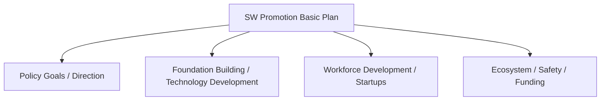

# Software Promotion Act (Effective 2023.10.19)

## 1. Overview

### A. Definition and Purpose
> A law that establishes the legal basis for **building the foundation of and promoting the software industry and for fostering SW safety and the ecosystem**; it fully revised (2020) the former Software Industry Promotion Act, shifting the paradigm from industry promotion to a **value-, safety-, and ecosystem-centered** approach.

The purpose of the Software Promotion Act goes beyond simple industry development: it is to create an environment in which, in a **SW-centered society** where SW has become the foundation of every area of society, the value of SW is fairly recognized and SW is used safely. Whereas the former Industry Promotion Act focused on "quantitative growth of the industry," the revised act differs in character in that it enshrines in law the qualitative foundations of **fair contracts, fair compensation, SW safety, workforce, and ecosystem**.

### B. Background and Need
In public SW projects, a long-standing practice persisted in which the scope of work expanded indefinitely after contracting (additional tasks) while compensation stayed the same, leaving developers financially weakened. In addition, as domains where SW defects directly lead to loss of life and property — such as autonomous vehicles, medical devices, and smart factories — grew rapidly, the need increased to treat SW not as a "deliverable" but as **social infrastructure whose safety must be guaranteed**. Against this background, the revised act, along with ensuring fairness in compensation calculation and scope changes, legislated the concept of **SW Safety** for the first time.

## 2. Article 5 — Contents of the Basic Plan for Software Promotion

The basic plan, established by the government every three years, is the **top-level roadmap** for SW promotion — a mechanism that ensures individual policies do not scatter but align in a consistent direction. The items contained in the basic plan can be understood broadly as a flow of **setting direction → building the foundation → developing people → securing ecosystem and safety**. First, the big picture is set with policy goals and direction, and the industrial foundation to support it — technology development, standardization, and so on — is built. On top of that, skilled professionals who will actually build SW are trained and startups and business growth are supported, and finally, the plan includes a healthy ecosystem that promotes the use and convergence of SW, SW safety, and a plan for funding to execute all of this. Thanks to this structure, the basic plan does not stop at a declaration but connects to execution and finance.

| Category | Contents (examples) |
|---|---|
| **Policy direction** | SW promotion policy goals and direction |
| **Foundation / technology** | Technology development and standardization, building the industrial foundation |
| **Workforce / startups** | Training skilled professionals, supporting startups and business growth |
| **Ecosystem** | Promoting SW convergence and use, creating a fair distribution environment |
| **Safety / funding** | Securing SW safety, funding and investment plans |

## 3. Article 30 — Contents of the SW Safety Assurance Guidelines

SW safety is a concept distinct from information security (confidentiality and integrity), aiming to **prevent damage to human life, body, and property caused by SW malfunctions and defects**. For example, a judgment error in autonomous driving control SW or a malfunction of medical device SW is fatal in itself even without hacking, so management from a safety perspective separate from security is needed. Article 30 requires the government to prepare such SW safety assurance guidelines and requires that the guidelines include the safety engineering procedure of **safety criteria → risk management → verification → incident response**. That is, establishing criteria for what is safe (criteria), identifying and assessing what risks exist (risk management), testing and inspecting whether it is actually safe (verification), and having a system to prevent and recover when incidents nonetheless occur (response).

| Category | Contents |
|---|---|
| **Safety criteria / methods** | Criteria, procedures, and methods for securing SW safety |
| **Risk analysis / management** | Identification, assessment, and response (mitigation) of safety risks |
| **Inspection / testing** | Methods for safety inspection, testing, and verification |
| **Incident response** | Incident prevention, response, and recovery system |

> SW safety: Safety assurance activities to **prevent damage to human life, body, and property** caused by SW defects and malfunctions, distinct from information security.

## 4. Major Institutions (Reference)

The act's promotion and safety goals are realized through several concrete institutions. **Fair contracts** prevent developers from becoming financially weakened by recalculating appropriate compensation when the scope of work changes and protecting subcontract payments, and the **SW impact assessment** protects the private ecosystem by examining in advance whether the public sector's direct development of SW infringes on the private market. The **SW safety system** supports the actual management of safety in the field through the assurance guidelines and diagnostics described above. These institutions each handle, in a balanced way, the different interests of "protecting developers – protecting the private market – social safety."

| Institution | Content | Protected Party |
|---|---|---|
| **Fair contracts** | Appropriate compensation upon scope change, protection of subcontract payments | Developers / workers |
| **SW impact assessment** | Prior assessment of the impact of public SW projects on the private market | Private SW market |
| **SW safety** | Safety assurance guidelines / safety diagnostics | Users / society |

## 5. Considerations and Implications (PE Perspective)
- **Growing importance of SW safety**: As embedded and CPS domains such as autonomous driving, healthcare, and smart factories expand, SW safety becomes a necessity rather than an option, and design linked with functional safety (ISO 26262, etc.) is required.
- **Securing fair compensation**: The key to effectiveness is guaranteeing fairness in scope changes by operating a task review committee in conjunction with the SW project compensation calculation guide.
- **Ecosystem perspective**: The industrial base should be broadened by promoting the use of open source and commercial SW and creating a fair distribution environment, and the institutions should be operated so that they act as catalysts for ecosystem growth rather than as regulation.
- **Enforceability of laws and institutions**: For the basic plan not to remain a declaration, governance is needed that combines it with funding and performance indicators and periodically checks implementation.

---

> **In one line**: The Software Promotion Act is *the legal basis for SW industry promotion, safety, and ecosystem*; it requires the Article 5 basic plan to include policy direction, foundation, workforce, ecosystem, safety, and funding, and the Article 30 SW safety guidelines to include safety criteria, risk management, verification, and incident response, thereby establishing, together with fair contracts and impact assessments, the qualitative foundation of a SW-centered society.
