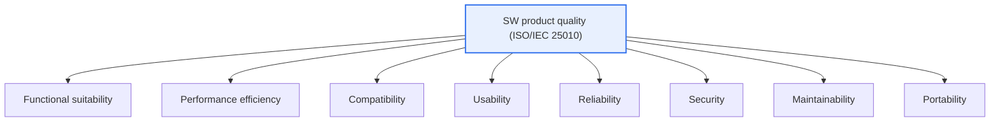
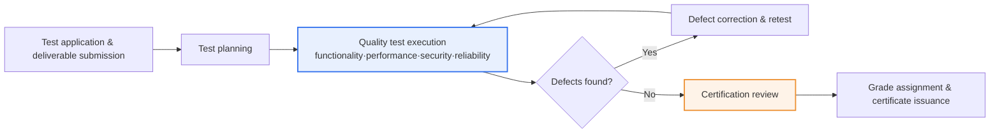

# Software Quality Certification (GS Certification)

## 1. Overview

### A. Definition
> **Software quality certification** is a scheme in which **a third-party testing body tests and evaluates a software product against recognized international and national standards (such as the ISO/IEC 25000 series) and officially certifies that it meets a given level of quality**. The representative Korean scheme is **GS (Good Software) certification**, under which accredited testing bodies (such as TTA) test and certify products on the basis of the Software Promotion Act.

The fundamental reason quality certification is needed is that **software quality is invisible, so a separate basis for objective trust is required**. Hardware can be touched and its performance checked against a specification, but software quality — whether functions work exactly as required, whether it withstands load, whether it is free of security vulnerabilities — is not apparent from the outside. Even if buyers receive the source code, it is hard for them to judge whether it works properly and is safe. This **information asymmetry** leads to market failure. If there is no way to prove quality, buyers choose on price alone, and good products that invested in quality are driven out instead — the "market for lemons" problem.

Quality certification is a **signaling mechanism** that resolves this information asymmetry. A third-party testing body with no stake in the outcome objectively tests the product against an international standard quality model and grants a certification mark if it passes. Buyers can then rely on the certification as grounds for trust and adopt the product with confidence, while developers gain competitiveness by objectively demonstrating quality. In Korea in particular, GS certification serves as **grounds for negotiated (private) contracts and priority purchasing in public procurement**, giving it a strong practical market-entry effect. In short, quality certification is both a foundation of market trust and an incentive structure that drives developers to invest in quality.

### B. Background and Need
Three trends lie behind the development of quality certification schemes. First, **the growing social impact of software**. As software penetrated domains such as finance, healthcare, transportation, and defense, where failure directly causes loss of life and property, calls grew for "independent verification" rather than "the maker's claims." Second, **international standardization of quality evaluation**. The 25000 series (SQuaRE), successor to ISO/IEC 9126, provided a common language and yardstick for measuring quality, making certifications that are valid across countries and companies possible. Third, **pump-priming policy in the public sector**. In Korea, linking GS certification to preferential treatment in public procurement gave small and medium-sized software companies a real incentive to invest in quality.

### C. Underlying Standards
The basis for quality evaluation is the international **ISO/IEC 25000 (SQuaRE, Systems and software Quality Requirements and Evaluation)** series. Within it, **ISO/IEC 25010**, which defines the quality model, specifies eight quality characteristics, and **ISO/IEC 25040**, which defines the evaluation process, specifies the testing procedure. GS certification testing is performed according to test criteria that adapt these standards to domestic conditions.

## 2. Quality Model — The Eight Quality Characteristics of ISO/IEC 25010

### A. Overall Structure of Quality Characteristics

ISO/IEC 25010 divides product quality into the eight top-level characteristics above and further subdivides each into sub-characteristics. For example, functional suitability splits into completeness, correctness, and appropriateness; reliability into maturity, availability, fault tolerance, and recoverability; and security into confidentiality, integrity, non-repudiation, accountability, and authenticity. The reason for this layering is to **reduce the vague judgment that "quality is good" to measurable indicators**. The testing body defines test items and pass criteria for each sub-characteristic, and a characteristic is deemed satisfied only when these are passed.

It is important to note that **trade-offs** exist between quality characteristics. Strengthening encryption and authentication to raise security can reduce performance efficiency and usability, and adding abstraction layers to improve portability can sacrifice performance. Quality certification is therefore not about "maximizing every characteristic" but about deciding at the requirements stage which characteristics to prioritize for the product's purpose and verifying that those criteria are met.

### B. Process Architecture of Quality Testing

This diagram shows that GS certification is not a one-off inspection but an **improvement loop that repeats defect correction**. The key is the cycle formed by "quality test execution" and "defect correction & retest" in the middle. When testing uncovers defects, the developer fixes them and is retested, repeating until defects fall below the threshold. In other words, the real value of certification lies less in the "pass stamp" itself than in the actual improvement of product quality through this iterative process. In the certification review stage on the right, a review committee examines the validity and reproducibility of the test results and confirms the grade.

Tests for each quality characteristic use different techniques. Functional suitability is assessed with requirements-based black-box testing; performance efficiency by measuring response time and throughput through load and stress testing; security through known-vulnerability checks and access control testing; and usability through scenario-based user testing. Because verification methods differ by characteristic, quality certification testing requires a broad, integrated range of testing capabilities.

### C. Details by Quality Characteristic
The table below summarizes the eight characteristics and supplements what the preceding paragraphs describe about their meaning and testing implications.

| Quality characteristic | Content | Typical test method |
|---|---|---|
| **Functional suitability** | Completeness, correctness, appropriateness of required functions | Requirements-based black-box testing |
| **Performance efficiency** | Response, throughput, and capacity relative to resources | Load and stress testing |
| **Compatibility** | Coexistence and interoperability with other systems | Interoperability testing |
| **Usability** | Ease of learning, operation, and access | User scenario testing |
| **Reliability** | Maturity, availability, fault tolerance, recoverability | Long-run operation and fault injection testing |
| **Security** | Confidentiality, integrity, authentication, accountability | Vulnerability checks, access control testing |
| **Maintainability** | Modularity, reusability, analyzability, modifiability | Static analysis, code quality measurement |
| **Portability** | Adaptability, installability, replaceability in other environments | Multi-environment installation and porting tests |

## 3. GS Certification Grades and Practical Procedure

GS certification awards **Grade 1 and Grade 2** according to test results. Typically, Grade 1 is given to products that meet international standard criteria and are mature enough for real-world use, while Grade 2 is given to products that meet basic requirements but are relatively less mature or narrower in scope (specific award criteria and names may change with revisions to the scheme, so the latest notices from testing bodies should be checked). Certified products receive preferential treatment in public procurement during the validity period, and if functionality changes significantly, certification is maintained through change testing.

From a procedural standpoint, the key practical point is **the completeness of deliverable preparation**. When applying for testing, developers must submit not only the product executables but also development deliverables such as the requirements specification, design documents, user manual, and test cases. If these deliverables are weak, testing itself is delayed. Therefore, if certification is the goal, deliverables must be managed systematically from early in development.

| Procedure | Content | Practical notes |
|---|---|---|
| **Test application** | Submit product and development deliverables | Ensure consistency and completeness of deliverables |
| **Test planning & execution** | Characteristic-specific testing per standard criteria | Ensure reproducibility of the test environment |
| **Defect correction** | Repeated fixing of found defects and retesting | Fix root causes, prevent regressions |
| **Certification review & issuance** | Grade assignment and certificate issuance after review | Manage validity period and change testing |

## 4. Comparison with Similar Certifications

Quality certification is not just GS certification; several types coexist according to purpose. Distinguishing them makes it possible to judge which certification is needed in which situation.

| Category | Target | Core perspective | Example |
|---|---|---|---|
| **Product quality certification** | Finished SW product | Does the product meet the criteria? | GS certification (ISO/IEC 25000) |
| **Process maturity** | Development organization and processes | Does it have the capability to build well? | CMMI, ISO/IEC 15504 (SPICE) |
| **Information security certification** | Security management system | Is security managed systematically? | ISMS-P, ISO/IEC 27001 |

The key difference lies in **"what is being assured."** A product certification such as GS assures an outcome — "this product meets the criteria now" — whereas a process certification such as CMMI assures a process — "this organization has the capability to repeatedly produce high-quality products." The practical implications also differ. An acquirer who wants to confirm the quality of a specific delivered product requires product certification, while one assessing the trustworthiness of a long-term outsourced development partner requires process certification. Mature acquiring organizations combine the two, selecting partners by process maturity and verifying deliverables by product certification.

As a concrete example, Korean public IT projects commonly take a dual approach: they favor GS-certified products when adopting commercial software, while requiring organizational process capability (quality management and security certifications) as eligibility criteria for large SI projects. This aims to verify "product quality" and "organizational capability" through different lenses.

## 5. Advanced — Expansion Trends in Quality Certification

Traditional quality certification tested finished products after the fact, but as software development and distribution methods change, the targets and methods of certification are also evolving.

First, **stronger incorporation of security and safety as quality characteristics**. As software has become social infrastructure, security and software safety have emerged as quality factors as important as functionality. In particular, as open-source use has become universal, the **SBOM (Software Bill of Materials)**, which tracks the provenance and vulnerabilities of components, and **secure coding**, which blocks vulnerabilities during development, are becoming core items of quality verification. The trend of regulations mandating SBOMs — such as the U.S. Executive Order and the EU Cyber Resilience Act (CRA) — suggests that quality certification will come to cover supply-chain security as well. [[software-safety-analysis]]

Second, **response to changes in development methods**. As Agile and DevOps shorten release cycles from weeks to days, a gap has opened between traditional certification that tests "the product at one point in time" and the reality of "a constantly changing product." Discussions therefore continue on embedding quality gates in continuous integration/delivery pipelines to perform automated quality measurement at all times and linking those results to certification. Embedding static analysis, automated test coverage, and vulnerability scanning in the pipeline is a representative example.

Third, **extension to AI- and data-driven software**. AI software whose behavior varies with training data is hard to assure through traditional functional testing alone. Standards addressing AI trustworthiness, fairness, and explainability (for example, the AI trustworthiness family such as ISO/IEC TR 24028) are being developed to complement the ISO/IEC 25000 series, and quality and governance certification linked to the AI management system standard (ISO/IEC 42001) is emerging as a new axis. [[iso-42001-ai-management-system]]

## 6. Considerations and Implications

From a Professional Engineer's perspective, quality certification should be approached not in terms of "pass or fail" but in terms of "how quality is internalized in the organization."

1. **Internalizing quality early in development (Shift-left).** Certification is only the final check; passing it requires considering quality characteristics throughout requirements engineering, design, implementation, and testing. If defects are fixed in bulk late in development or just before certification, correction costs grow exponentially (if the cost of fixing a defect at the requirements stage is 1, the operations stage is known to cost tens to hundreds of times more). Quality is not obtained through inspection; it is built in.
2. **A strategic lever for entering the public market.** In Korea, GS certification is grounds for preferential treatment and negotiated contracts in public procurement, making it a real key to market entry for small and medium-sized software companies. Certification is therefore both a technical activity and a business strategy, and the timing of certification and target grade should be reflected in the business plan with the target market (public/private) and procurement requirements in mind.
3. **An integrated view of quality, security, and safety.** As quality certification extends to SBOM, secure coding, and software safety, functional quality and security/safety should be designed as a single integrated quality system rather than as separate activities. Bolting security on later is both costly and less effective.
4. **Explicit management of trade-offs.** Because quality characteristics conflict with one another (security vs. performance and usability, portability vs. performance), priorities must be set according to the product's purpose and the rationale documented. Aiming for "the highest grade on every characteristic" wastes resources and is a shortcut to failure.
5. **Ensuring the continuity of certification.** In Agile and DevOps environments, a one-time certification quickly becomes outdated. Certification retains its value only with a continuous quality system that embeds quality gates (static analysis, coverage, vulnerability scanning) in the CI/CD pipeline to measure quality constantly and manages recertification and change testing when changes occur.

## References
- ISO/IEC 25010:2011 (product quality model), ISO/IEC 25040 (evaluation process) — SQuaRE series
- TTA Software Testing & Certification Laboratory, GS certification guide: https://www.tta.or.kr/
- Software Promotion Act (Korea) — basis for quality certification and public procurement preference
- ISO/IEC 42001:2023 — AI management system standard

---

> **In one line**: Software quality certification (GS certification) is a scheme in which *a third party tests and certifies product quality against ISO/IEC 25000* to resolve information asymmetry and provide grounds for preferential public procurement; the key is to internalize quality throughout development and expand it into a continuous quality system that also covers security, SBOM, and AI trustworthiness.
