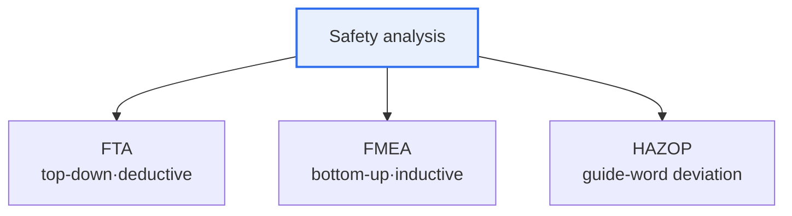

# Software Safety Analysis

## 1. Overview

### A. Definition and Need
> An activity that **identifies and analyzes potential hazards inherent in software in advance to prevent accidents**; it is essential in safety-critical systems such as autonomous driving, medical devices, aviation, and nuclear power, where errors translate directly into loss of life and property.

The fundamental reason software safety analysis has become important is that software now goes beyond processing information on a screen to **directly controlling the physical world**. Defects in software controlling a car's brakes, a ventilator, or an aircraft are not screen errors but immediate accidents and casualties. Therefore, the reactive approach of creating defects and then finding them through testing is not enough; a preventive analysis that systematically predicts and eliminates "what can go wrong" from the earliest design stage is needed. Analysis techniques are divided by direction into **top-down (deductive)** approaches, which trace back from effects to causes, and **bottom-up (inductive)** approaches, which reason from causes to effects.

### B. Convergence of Safety and Security
Recently, as physical control and network connectivity have combined, as in autonomous driving and IoT, malfunctions (Safety) and hacking (Security) together cause accidents. Consequently, there is a growing tendency to perform safety analysis and security analysis in an integrated manner.

## 2. Overview of Analysis Techniques

### A. FTA (Fault Tree Analysis)
> A deductive analysis that starts from a Top Event (the accident of concern) and **expands its causes downward using logic gates (AND, OR)**. It traces in tree form "which lower-level causes must combine, and how, for this accident to occur."

The strength of FTA is that it clearly exposes the paths by which multiple intertwined causes produce an accident, and by inserting the occurrence probability of each cause, the accident probability can be calculated quantitatively. It focuses the analysis on one specific accident (Top Event).

### B. FMEA (Failure Mode and Effects Analysis)
> An inductive analysis that **exhaustively lists the failure modes of each component of a system and evaluates their effects**. The order of response is determined by the **Risk Priority Number (RPN)**, the product of each failure's severity, occurrence, and detection ratings.

Because FMEA systematically examines how each individual part can fail and what effect that has on the system, it is a prevention-oriented bottom-up approach. Failures with the highest RPN are addressed first.

### C. HAZOP (Hazard and Operability Analysis)
> A qualitative analysis that **applies guide words (No, More, Less, Reverse, etc.) to the design intent** to derive deviations from normal operation and the resulting hazards. Multidisciplinary experts uncover, in workshops, "what happens if there is no flow (No Flow) or too much flow (More Flow)."

HAZOP originated in chemical processes but is also used for hazard analysis of software and system operation. Its distinguishing feature is that it also examines operability.

## 3. Comparison of Techniques

| Category | FTA | FMEA | HAZOP |
|---|---|---|---|
| **Direction** | Top-down (deductive) | Bottom-up (inductive) | Deviation analysis |
| **Starting point** | Accident (Top Event) | Component failure | Design intent |
| **Core tool** | Logic gates, probability | RPN prioritization | Guide words |
| **Strength** | Accident paths, probability | Per-component prevention | Uncovering operational deviations |

## 4. Considerations and Implications

1. **Use the techniques in parallel, as complements.** Analyzing the paths of specific accidents with FTA, per-component failures with FMEA, and operational deviations with HAZOP makes it possible to uncover hazards comprehensively from different angles.
2. **Link with safety standards.** Functional safety standards such as ISO 26262 for automobiles and IEC 61508 across industry require the application of these analysis techniques, and they must be integrated from early in development.
3. **Early application is key.** The earlier hazards are found and eliminated at the design stage, the lower the cost and the greater the effect, so safety analysis should be performed from the requirements and design stages.

---

> **In one line**: Software safety analysis proactively prevents hazards in safety-critical systems, using *FTA (top-down accident paths), FMEA (bottom-up component failures, RPN), and HAZOP (guide-word deviations)* as complements and applying them from the earliest design stage in conjunction with functional safety standards.
