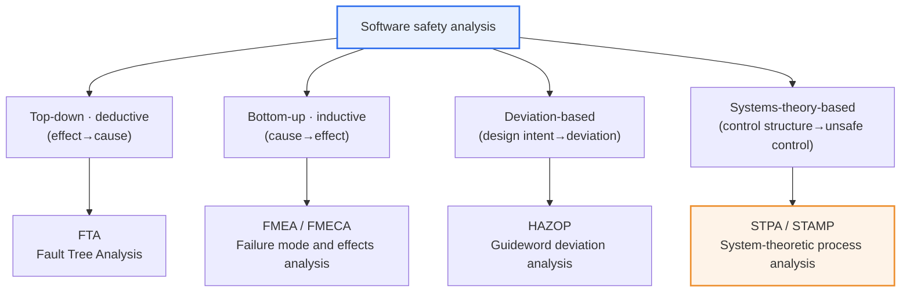
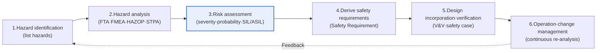

# Software Safety Analysis

## 1. Overview

### A. Definition and Necessity
> Software safety analysis is a systematic engineering activity that **prevents accidents by identifying, analyzing, and eliminating in advance the potential hazards inherent in software throughout the development lifecycle**. It is essential in safety-critical systems — such as autonomous driving, medical devices, aviation, railways, and nuclear power — where errors lead directly to loss of life and property.

The fundamental reason software safety analysis became an independent engineering discipline is that software now goes beyond processing on-screen information to **directly controlling the physical world**. In the past, software defects ended in screen errors or data corruption, but today, defects in automotive brake control, oxygen supply in ventilators, or aircraft fly-by-wire software lead directly to accidents and casualties. In fact, the software race condition defect in the Therac-25 radiation therapy machine in 1985–1987 delivered radiation hundreds of times the normal dose to patients, killing at least three — a representative case that remains a symbol of the dangers of software controlling the physical world.

Such risks cannot be sufficiently controlled by the reactive approach of creating defects first and then finding them through testing. The reliability required of safety-critical systems is typically a hazard probability of 10⁻⁷ to 10⁻⁹ per hour (corresponding to SIL 3–4 in IEC 61508), which is a range that cannot even be statistically demonstrated through finite testing alone. Therefore, proactive analysis that systematically predicts and eliminates "what can go wrong" from the earliest stages of design must accompany testing.

Analysis techniques fall broadly into two branches depending on the direction of logical development: **top-down (deductive)** techniques that start from the feared outcome (accident) and trace its causes backward, and **bottom-up (inductive)** techniques that start from the failure causes of individual components and examine what outcomes they produce. Added to these are guideword-based techniques that explore deviations from the normal design intent and, more recently, systems-theory-based techniques.

### B. Convergence of Safety and Security
Traditionally, safety analysis dealt with random, accidental failures, while security analysis dealt with malicious attacks, as separate domains. However, as physical control and network connectivity are combined in autonomous vehicles, smart medical devices, and the industrial IoT, situations in which malfunctions (Safety) and hacking (Security) combine to cause a single accident are increasing. For example, an attack that remotely manipulates a brake ECU is clearly a security incident, but its result is a fatal accident — that is, a safety problem. Therefore, recent standards such as SAE J3061 and ISO/SAE 21434 recommend performing safety analysis and threat analysis (TARA) in an integrated manner, and concepts such as "Safety of the Intended Functionality (SOTIF, ISO 21448)," which addresses risks caused not by malfunction but by functional limitations, are also spreading.

## 2. Overview of Safety Analysis Techniques

As shown in the figure above, software safety analysis techniques are grouped according to their approach logic into top-down, bottom-up, deviation-based, and systems-theory-based families. These four families should be understood not as competitors but as **complementary tools that illuminate hazards from different angles**, because hazards missed by one technique are caught by another. Below, the principles, procedures, and application contexts of each technique are explained in turn.

### A. FTA (Fault Tree Analysis)
> FTA is a deductive analysis technique that starts from a single feared undesired event (Top Event, top-level accident) and traces down to root causes by **developing its causes downward with logic gates (AND, OR, inhibit gates, etc.)**.

The line of thought in FTA asks, "For this accident to occur, which lower-level events must combine, and in what logical combination?" With the top-level accident as the root, its causes are spread downward like branches, and each intermediate event is decomposed further into lower-level causes. An AND gate indicates that all lower events must occur simultaneously for the upper event to occur (the effect of redundancy and defense in depth), while an OR gate indicates that the upper event occurs if even one lower event occurs (the vulnerability of a single point of failure).

FTA's greatest strength is that it clearly and visually reveals the paths through which multiple causes intertwine to cause an accident. In particular, if a probability of occurrence is assigned to each basic event, Boolean algebra can be used to find the minimal cut sets and quantitatively calculate the probability of the top-level accident. For example, in an aircraft control system, the accident "all triple-redundant flight control computers fail" is an AND combination of the three computer failures, so if each individual failure probability is 10⁻³, it provides quantitative grounds that the probability theoretically drops to the order of 10⁻⁹.

However, since FTA limits the analysis target to one specific accident (Top Event), there is a limitation that types of accidents the analyst failed to imagine never appear in the tree in the first place. Also, for targets with complex states, timing, and interactions such as software, the meaning of "probability" becomes ambiguous, so FTA is often used to grasp qualitative cause structures rather than for quantitative analysis.

### B. FMEA / FMECA (Failure Mode and Effects Analysis)
> FMEA is a bottom-up, inductive analysis technique that **exhaustively lists the failure modes of each element making up the system and evaluates their effects and causes**, and determines the order of response using the **Risk Priority Number (RPN)**, the product of severity, occurrence, and detection.

FMEA approaches in exactly the opposite direction from FTA. It starts not from the accident but from **failures at the component, module, or function level**, and checks item by item in tabular form "if this element fails this way, what effects propagate to the whole system?" For each failure mode, Severity (1–10), Occurrence (1–10), and Detection (1–10) are evaluated, and the three are multiplied to calculate the RPN (maximum 1000). Response resources such as design improvements and enhanced detection are allocated first to failures with high RPN.

FMECA (Failure Mode, Effects and Criticality Analysis) is an extension of FMEA that strengthens criticality assessment, and in the automotive industry, the revised edition published by AIAG-VDA in 2019 introduced **Action Priority (AP)** in place of RPN to address the limitations of the practice of judging only by the product of numbers. This reflects the practical insight that even with the same RPN value, a failure with high severity is more dangerous than a failure with poor detectability.

FMEA's strengths lie in its exhaustiveness in scanning every element and its prevention focus, but because it treats each failure independently, it has the limitation of struggling to capture **compound failures arising from simultaneous interactions among multiple elements**. This is precisely why complementing it with FTA (tracing compound causes) or STPA (interaction analysis) is necessary.

### C. HAZOP (Hazard and Operability Analysis)
> HAZOP is a qualitative analysis technique that systematically derives deviations from normal and the resulting hazards and operability problems by **applying guidewords (No, More, Less, Reverse, Part of, As well as, etc.)** to the design intent.

HAZOP originally began in the British chemical process industry (ICI) in the 1960s, but was later extended to hazard analysis of software and system operation. The core is to specify the "normal design intent," then combine guidewords with each parameter (flow, pressure, data, timing, etc.) to forcibly generate deviation scenarios such as "what if there is no flow (No Flow)," "what if too much data arrives (More)," or "what if the signal is reversed (Reverse)." In this way, hazards are discovered without omission rather than relying solely on the analyst's imagination.

HAZOP is characterized by checking not only safety but also **operability**, and by being conducted as a structured workshop involving multidisciplinary experts in process, instrumentation, control, and operation. Thanks to this collaborative nature, even organizational and operational hazards that individuals tend to miss are revealed. However, because it is meeting-centric, it takes much time and cost, and in large systems the amount of analysis becomes enormous due to combinatorial explosion.

## 3. Comparison of Techniques

The differences among techniques do not stop at "the directions differ," but lead to the practical implication of **which kinds of hazards each captures well and what each misses**. FTA handles the cause structure and probability of specific accidents well but is vulnerable to unimagined accidents; FMEA excels in element-by-element exhaustiveness but is weak on interaction failures; HAZOP is strong at uncovering operational deviations but is costly. Therefore, they should be combined according to the nature of the system and the development stage.

| Category | FTA | FMEA / FMECA | HAZOP | STPA |
|---|---|---|---|---|
| **Direction** | Top-down (deductive) | Bottom-up (inductive) | Deviation analysis | Systems theory (top-down) |
| **Starting point** | Accident (Top Event) | Component failure | Design intent | Control structure |
| **Key tools** | Logic gates, probability, cut sets | RPN / AP prioritization | Guidewords | Unsafe control actions (UCA) |
| **Strengths** | Accident paths, quantitative probability | Element-level prevention, exhaustiveness | Operational deviations, collaborative discovery | Interactions, SW/human factors |
| **Limitations** | Misses unimagined accidents | Weak on compound/interaction failures | Excessive time and cost | Weak quantitative risk assessment |
| **Suitable targets** | HW reliability, redundancy | Component/function-level systems | Process and operational systems | Software-intensive systems |

Notably, whereas traditional FTA and FMEA regard "component failure" as the cause of accidents, STPA, described later, also handles "**cases in which no element failed but the interactions were unsafe**." Since software has no physical failures such as wear or breakage and most accidents originate from requirement errors or incorrect interactions among components, the more software-intensive a system is, the greater the importance of systems-theory-based techniques.

## 4. Analysis Procedure and Links to Standards

Safety analysis is not a one-off activity but, as shown above, is performed as a cyclical process of **hazard identification → analysis → assessment → derivation of safety requirements → design incorporation and verification → operation and change management**. In particular, the risk assessment in step 3 is directly linked to the integrity levels of functional safety standards.

**IEC 61508**, the foundational standard across industries, defines the required level of risk reduction as SIL (Safety Integrity Level) 1–4, and the higher the level, the stricter the required development rigor and verification level. **ISO 26262**, the derivative standard for the automotive sector, determines the ASIL (A–D, with QM for non-safety functions) level by combining three factors — severity (S), exposure (E), and controllability (C) — through hazard analysis and risk assessment (HARA), which differs in determination method from IEC 61508, which sets SIL from a single hazard probability. For example, a function such as loss of braking, for which severity, exposure, and uncontrollability are all high, is classified as ASIL D, the highest level, requiring the strictest development and verification such as formal verification and MC/DC coverage.

In addition, domain-specific standards such as aviation (DO-178C), medical devices (IEC 62304), and railways (EN 50128/50657) each require safety analysis and corresponding development processes. Since analysis techniques are thus a means of substantiating the integrity level required by the standard, they must be planned in integration with the standard from the beginning of development.

In particular, the integrity level is not a simple label but acts as a "control knob" that determines the rigor of the entire subsequent development process. As the level rises, the required verification activities — static analysis, coverage criteria, independent verification and validation (Independent V&V), and the scope of formal methods — are strengthened step by step, and all this evidence is woven into a single **Safety Case**, which becomes the argumentation framework for persuading the certification body. Therefore, the outputs of safety analysis do not end in themselves; their value is recognized only when they are connected with bidirectional traceability to each artifact of requirements, design, implementation, and testing.

## 5. Advanced — Systems-Theory-Based Analysis (STPA/STAMP) and Latest Trends

Traditional techniques (FTA, FMEA) are based on the accident model of a "chain of events." However, many accidents in modern software-intensive systems arise from **interactions among components and defects in the requirements themselves**, even though no part failed. Starting from this insight, Professor Nancy Leveson of MIT proposed the **STAMP (System-Theoretic Accident Model and Processes)** accident model and the analysis technique based on it, **STPA (System-Theoretic Process Analysis)**.

STPA models the system as a **hierarchical control structure** consisting of "Controller – Control Action – controlled process – feedback," and derives the **Unsafe Control Actions (UCA)** that can occur in this structure. UCAs are systematized into four types: (1) not providing a required control, (2) providing an unsafe control, (3) providing control at the wrong time or in the wrong order, and (4) continuing for too long or too short. Then, the causal scenarios (Loss Scenarios) in which each UCA occurs are analyzed to derive safety requirements.

STPA's strength is that it can handle software logic errors, incompleteness of requirements, and even human factors within a single framework. Its adoption is increasing rapidly in autonomous driving, aviation, and defense, and STPA-Sec, an extension that addresses safety and security together, and CAST (Causal Analysis based on STAMP), for post-accident analysis, are also used. However, since STPA does not itself provide the quantitative risk assessment (probability calculation) required by most international safety standards, a **hybrid approach** is recommended in practice in which scenarios are discovered with STPA and quantitative assessment is supplemented with FMEA and FTA. Likely exam directions include "differences in accident models between FTA/FMEA and STPA," "linking autonomous driving/SOTIF with safety analysis," and "integrated safety-security analysis."

## 6. Considerations and Implications

1. **Use techniques in parallel as complements.** A single technique inevitably has blind spots. Analyzing the paths and probability of specific accidents with FTA, element failures with FMEA, operational deviations with HAZOP, and interaction and requirement defects with STPA allows hazards to be discovered comprehensively from different angles. From a Professional Engineer's perspective, the core competency is designing "what to use, when, and in what combination" according to the nature of the system (HW-centric vs. SW-intensive).

2. **Minimize cost by applying early in development.** The cost of fixing defects increases exponentially from the requirements and design stages to the operation stage (commonly the 1:10:100 rule). The earlier hazards are found and eliminated in the design stage, the greater the effect at lower cost, so a Shift-Left strategy that integrates safety analysis from the left side (requirements, design) of the V-model is required.

3. **Link consistently with functional safety standards.** ISO 26262 (automotive), IEC 61508 (general), IEC 62304 (medical), DO-178C (aviation), and others require analysis techniques and verification levels corresponding to each integrity level (ASIL, SIL). Since analysis results are ultimately structured into a **Safety Case** and used for certification and audits, documentation with traceability must be managed together as a trade-off.

4. **Handle safety and security in an integrated manner.** In connected and autonomous systems, hacking leads directly to safety accidents. The field is evolving toward performing threat analysis (TARA) and safety analysis in an integrated way in connection with ISO/SAE 21434 (automotive cybersecurity) and ISO 21448 (SOTIF).

5. **Operate analysis as a continuous activity.** Systems are changed and updated, and hazards change with them. In an era where behavior changes after deployment — such as with OTA (over-the-air) updates and the introduction of AI-based functions — a continuous re-analysis (Continuous Safety Assurance) system linked with change management is needed.

## References
- itemis, "Functional Safety: ISO 26262, IEC 61508, ASIL, Safety Case" — https://www.itemis.com/en/compliance-intelligence/functional-safety/
- Wikipedia, "Automotive Safety Integrity Level (ASIL)" — https://en.wikipedia.org/wiki/Automotive_safety_integrity_level
- UL Solutions, "Understanding STAMP, STPA, and CAST: Safety Engineering" — https://www.ul.com/sis/blog/introduction-to-stamp-stpa-and-cast
- Software Quality Journal, "Comparison of the FMEA and STPA safety analysis methods" — https://dl.acm.org/doi/10.1007/s11219-017-9396-0

---

> **In one line**: Software safety analysis proactively prevents hazards in safety-critical systems from the earliest design stages, using *FTA (top-down accident paths and probability), FMEA (bottom-up component failures and RPN), HAZOP (guideword deviations), and STPA (systems theory and interactions)* as complements, and demonstrates safety through a safety case integrated with functional safety standards such as ISO 26262 and IEC 61508 and with security (TARA).
