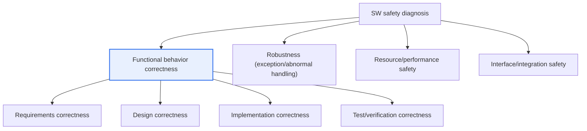
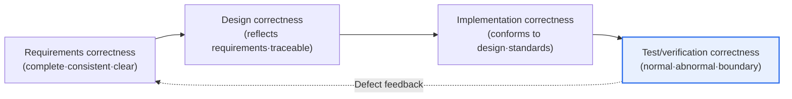

# Software Safety Diagnosis — Functional Behavior Correctness Diagnosis

## 1. Overview

### A. Concept
> **Software safety diagnosis** is an activity that, following the "Software Safety Diagnosis Guide," **systematically diagnoses whether software behaves safely in both expected and abnormal situations**. Among its items, **functional behavior correctness diagnosis** is a core item that verifies whether the software performs its required functions correctly and whether it handles exceptional and boundary situations safely, without unintended behavior.

Functional behavior correctness diagnosis matters because **software is deeply involved in industry and safety, and malfunctions lead directly to physical accidents**. As software is widely used in safety-critical domains such as automobiles, healthcare, power generation, railways, and transportation, confirming that software behaves correctly and safely not only in normal situations but also under exceptional and abnormal inputs has become essential. If functions are not performed exactly as required (malfunction, unintended behavior, no response), the result is not merely a screen error but can lead directly to loss of life and property, such as braking failure, dosage errors, or equipment runaway.

It is important to understand that "functional behavior correctness" embraces requirements in two directions. One is **whether intended functions are performed as required (should-do, correctness of normal functions)**, and the other is **whether unintended behavior is prevented (should-not-do, assurance of safety properties)**. From a safety standpoint, the latter is especially important. Even if the software works well with normal inputs, safety collapses if unexpected hazardous behavior appears under abnormal inputs, boundary conditions, or failure situations. The diagnosis is therefore designed to deliberately include exceptional, boundary, and error situations, not just normal scenarios.

To prevent this, the safety diagnosis guide checks software safety by dividing it into several diagnosis items, and functional behavior correctness is its core axis. The diagnosis confirms **step by step** whether requirements are clear and complete, whether the design accurately reflects the requirements, whether the implementation behaves as designed, and whether testing has sufficiently verified normal, abnormal, and boundary conditions. In other words, correctness is confirmed at each stage of requirements → design → implementation → testing, preventing defects from earlier stages from propagating to later stages and ultimately growing into accidents.

### B. Need
As software has spread across society and the impact of malfunctions has grown, it has become difficult to guarantee safety through a reactive approach that checks quality only at the testing stage. If defects are already conceived at the requirements or design stage, fixing them costs dozens of times more even when found later, and the risk of omission is high. A "preventive safety" approach that systematically diagnoses and ensures correctness throughout the development process is therefore needed.

## 2. Overall Structure — Functional Behavior Correctness within Safety Diagnosis Items

To understand where functional behavior correctness diagnosis fits, we must first look at the overall structure in which safety diagnosis is a bundle of several perspectives. The structural diagram below shows that safety diagnosis forms a single system centered on functional behavior correctness, together with adjacent perspectives such as robustness, resources, and interfaces.

**Functional behavior correctness** is the center of this system and examines "whether required functions are conveyed, implemented, and verified accurately and without distortion at each development stage." The **robustness** perspective covers defensive handling under incorrect inputs and failure situations, **resource/performance safety** covers adherence to memory and timing budgets, and **interface safety** covers the correctness of integration between modules and external systems. These perspectives overlap and complement one another. For example, even if a function is correct, safety breaks down if there is no defense against exceptional inputs, so functional behavior correctness diagnosis is naturally performed in tandem with robustness diagnosis.

This structure is needed because safety is a "product of the entire process" that cannot be proven by a single test alone. If requirements are ambiguous, no amount of testing can fix the very criteria for judging what correct behavior is. The diagnosis therefore looks not only at test results but also at the correctness of earlier stages and the links between stages (traceability).

## 3. Stage-by-Stage Procedure of Functional Behavior Correctness Diagnosis

The procedure diagram below shows how correctness is confirmed at each development stage and carried into the next. The key point is that the stages are not inspected independently but are **linked forward and backward through traceability**.

The **requirements correctness** stage is the starting point of all correctness. If requirements are incomplete (omissions), inconsistent (contradictions), or ambiguous, the design, implementation, and testing built on them all become shaky. At this stage, reviewers check whether safety requirements have been fully identified, whether each requirement is written in a verifiable form, and whether there are conflicting requirements. For example, a requirement that "in a hazardous situation the system transitions to a safe state" becomes a diagnostic criterion only when it clearly specifies which situations are hazardous, what the safe state is, and what the transition time constraint is.

The **design correctness** stage examines whether requirements are accurately reflected in the design and whether the design neither exceeds nor omits requirements. Here the traceability matrix is the key instrument. By mapping bidirectionally which design elements realize each requirement and, conversely, which requirement each design element derives from, it uncovers unjustified design (functions without requirements) and unrealized requirements (requirements without design). This stage also confirms how safety requirements are realized through specific architectures (redundancy, monitoring, safe states).

The **implementation correctness** stage checks whether the code is implemented as designed and complies with coding rules. Static analysis automatically detects standard violations and latent defects (null references, out-of-bounds access, uninitialized variables, dead code), and code reviews confirm consistency with design intent. For safety-critical code, coding standards that restrict dangerous language features (e.g., MISRA C) are also applied to fundamentally block undefined behavior and ambiguous constructs.

The **test/verification correctness** stage confirms behavior through actual execution. Here, **abnormal inputs, boundary values, and error situations** must be included, not just normal inputs. The input space is systematically partitioned with boundary value analysis and equivalence partitioning, exception paths are exercised through fault injection, and the sufficiency of verification is quantified with coverage (statement, branch, MC/DC). Defects found in test results are fed back and corrected all the way up to defects in requirements and design.

| Stage | Main activities | Outputs/evidence |
|---|---|---|
| **Requirements correctness** | Check completeness, consistency, ambiguity; identify safety requirements | Requirements review results, safety requirements list |
| **Design correctness** | Confirm requirements reflected in design and traceability | Traceability matrix |
| **Implementation correctness** | Design conformance, coding standards, static analysis | Static analysis reports, review records |
| **Test/verification correctness** | Normal, abnormal, and boundary testing; coverage | Test cases, coverage reports |

## 4. Key Diagnosis Techniques — Comparison and Practical Implications

Diagnosis techniques are not complete on their own; they are combined so that each fills the others' gaps. Below, the principles and limitations of representative techniques are compared.

**Requirements review (reviews, inspections)** is the cheapest way to catch defects before execution. People check requirements for completeness, consistency, and verifiability, and using formal inspection (checklists, role assignment) improves reproducibility. However, because reviews depend on human judgment, omissions occur when specifications are large.

**Static analysis** automatically detects defects and standard violations without executing code. Its advantage is catching defects such as null references, out-of-bounds access, and uninitialized variables broadly and early. On the other hand, because it cannot fully know the execution context, false positives occur, and it cannot catch timing- or environment-dependent problems that arise during actual execution.

**Dynamic testing** confirms behavior through actual execution. Test cases covering normal, abnormal, and boundary conditions are created and executed, and coverage is measured. Its strength is direct observation of actual behavior, but its fundamental limitation is that when the input space is large, "unexecuted paths" remain. Static analysis therefore complements it with "properties of all paths," and coverage quantifies "how much was executed."

**Traceability analysis** maps requirements–design–implementation–testing bidirectionally, revealing which requirements have not been verified and which code lacks justification. This is a tool unique to safety diagnosis that catches "omissions between stages" missed by individual techniques.

The principle behind combining these techniques is that "one technique's blind spot is covered by another." Correctness diagnosis is effective only when reviews (human, semantic) + static analysis (automated, all paths) + dynamic testing (actual behavior) + traceability (stage linkage) are used together.

Here, coverage metrics serve as a common yardstick quantifying "how much verification was done." Statement coverage is the minimum criterion, followed by branch and condition coverage, and MC/DC is required for code with high safety integrity. Note, however, that coverage only indicates "a lower bound of sufficiency" and does not guarantee correctness. Even with 100% coverage, a defect passes if judged against an incorrect expected value in the first place. What distinguishes the maturity of a diagnosis, therefore, is reviewing the validity of expected results (the oracle problem) and the representativeness of scenarios alongside coverage numbers.

| Technique | Strength | Limitation | Complement |
|---|---|---|---|
| **Requirements review** | Early, low cost | Human-dependent, omissions | Checklists, inspections |
| **Static analysis** | Broad, all paths | False positives, ignores environment | Confirm with dynamic testing |
| **Dynamic testing** | Observes actual behavior | Unexecuted paths remain | Coverage, static analysis |
| **Traceability analysis** | Detects omissions between stages | Management burden | Tool automation |

### Judging Diagnosis Results and the Rework Loop

Diagnosis does not end with finding defects. Defects found must be traced back to their root stage and corrected. For example, if boundary value errors appear repeatedly in testing, one must determine whether the cause is an implementation mistake, whether the design omitted boundary handling, or whether the requirements never specified boundary behavior in the first place. If the cause lies in the requirements stage, fixing only the code will lead to recurrence. Therefore, like the "defect feedback" path in the procedure diagram, diagnosis results are handled as a closed loop that returns to requirements and design.

The efficiency of this rework loop ultimately depends on the quality of traceability. If requirements, design, implementation, and testing are accurately mapped, it is quick to identify which stage a defect originated in and which other artifacts it affects. Conversely, if traceability is poor, the same defect resurfaces in multiple places, and fixes trigger new defects in a vicious cycle. This is why safety diagnosis must be "an ongoing system" rather than "a one-time test."

## 5. Advanced — Linking to Functional Safety Standards and Practical Application

Functional behavior correctness diagnosis becomes effective when linked to domain-specific **functional safety standards**. ISO 26262 in the automotive domain assigns ASIL (A–D) levels according to risk, and the higher the level, the stronger the verification required (e.g., MC/DC coverage and recommended formal verification at higher levels). IEC 61508 for industry in general defines safety integrity with SIL (1–4) and recommends or requires techniques appropriate to each level. Medical devices (IEC 62304) vary the rigor of requirements, design, and verification according to software safety class (A–C). Because these standards require evidence of "what was verified, and how rigorously," functional behavior correctness diagnosis becomes the process that generates the supporting evidence for safety certification.

As a concrete example, safety-critical development organizations automatically run static analysis and unit tests on every commit and set gates that block merges if coverage falls short of the target (e.g., 100% MC/DC at higher levels). They also integrate requirements management tools with test management tools to update traceability automatically, so that when a requirement changes, the affected design and tests are immediately identified. This makes it possible, even for large-scale software, to go beyond the limits of manual diagnosis and continuously reconfirm correctness with every change.

As another example, in medical device software (IEC 62304 Class C), the flow control logic of an infusion pump is tested not only with normal prescriptions but also with abnormal situations such as sensor faults, momentary power loss, and communication delays through fault injection, and traceability is used to confirm that the results satisfy the requirement to "transition to a safe stopped state." In this way, functional behavior correctness diagnosis is applied by concretizing "what constitutes hazardous behavior" for each domain and tracing through to the end whether requirements that avoid that hazard have actually been implemented and verified.

Three recent trends stand out. First, **advances in static analysis and formal verification**: approaches that mathematically prove the absence of specific errors (runtime exceptions, integer overflow) are expanding in safety-critical domains. Second, **continuous verification within the development pipeline**: diagnosis is not a separate stage but is embedded in CI and performed at all times. Third, **correctness diagnosis of AI-based software**: in learning-based components, the specification is implicit in the data, making it difficult to apply traditional requirements–traceability diagnosis as is, and new diagnostic criteria from the perspectives of data quality, distribution, and scenario coverage are required. This suggests that the targets and methods of functional behavior correctness diagnosis are expanding.

## 6. Considerations and Implications

1. **Ensuring correctness throughout the development process is key.** Safety cannot be guaranteed by testing alone; correctness must be confirmed at each of the requirements, design, and implementation stages to prevent defects from propagating to later stages. In particular, removing ambiguity at the requirements stage governs the judgment criteria of all subsequent diagnosis and should be the first investment.
2. **Make traceability the backbone of diagnosis.** Bidirectional mapping of requirements–design–implementation–testing must be maintained with tools to expose unverified requirements and unjustified code. In large-scale software with frequent changes, traceability is the foundation for impact analysis and regression diagnosis.
3. **Ensure effectiveness by linking to functional safety standards.** Diagnosis plans should be built in conjunction with the level-specific requirements (coverage, verification procedures) of domain standards such as ISO 26262, IEC 61508, and IEC 62304, so that certification evidence is generated naturally and rework is reduced. [[software-safety-analysis]]
4. **Combine static, dynamic, review, and traceability techniques to eliminate blind spots.** Since no single technique is complete, early and low-cost reviews, all-path static analysis, dynamic testing of actual behavior, and stage-linking traceability should be combined as complements.
5. **Prepare for automation, continuous diagnosis, and new criteria in the AI era.** Manual diagnosis has limits for large-scale software, so diagnosis should be embedded in CI and performed continuously, and new correctness criteria such as data and scenario coverage should be established for learning-based components.

## References
- ISO 26262 Road vehicles — Functional safety, https://www.iso.org/standard/68383.html
- IEC 61508 Functional safety of E/E/PE safety-related systems, https://www.iec.ch/functional-safety
- IEC 62304 Medical device software — Software life cycle processes, https://www.iso.org/standard/38421.html

---

> **In one line**: Functional behavior correctness diagnosis in SW safety diagnosis is a preventive activity that *verifies correctness at each stage of requirements → design → implementation → testing on the basis of traceability*; it checks both "what the software should do" and "what it must not do," including abnormal and boundary conditions as well as normal ones, and generates evidence for safety certification in conjunction with functional safety standards such as ISO 26262 and IEC 61508.
