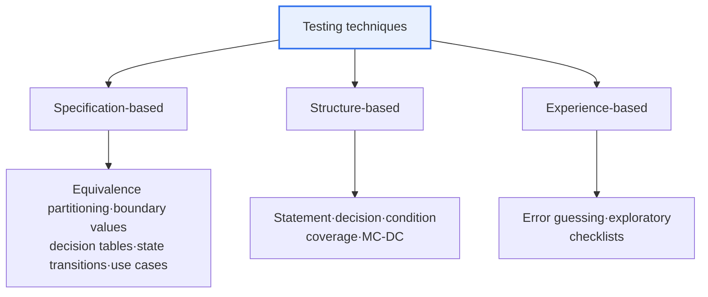

# Software Testing

## 1. Overview

### A. Definition
> An activity that ensures quality by **discovering latent defects** in software and verifying and validating whether requirements are met. Its purpose is to prevent errors and improve reliability.

A common misconception about testing is that it "proves the absence of defects." However, because software has a practically infinite number of input combinations, not every case can be checked, so all testing can do is **reveal the presence of defects**. Only by starting from this recognition can testing be established as a strategic activity that "finds defects most efficiently with limited resources." It encompasses Verification (did we build it right?) and Validation (did we build the right thing?), and has evolved beyond inspecting quality after the fact toward **preventing defects from the outset**.

### B. Need
The later a defect is found, the more its correction cost grows exponentially. It is a long-standing rule of thumb that errors from the requirements or design stage can cost dozens of times more if discovered in operation. Testing is therefore not mere inspection but **a quality assurance means of filtering out defects early and at low cost**, and the principles below are practical guidelines for achieving this goal.

## 2. Principles of Software Testing (A)

The seven testing principles form a single interconnected logic. Because "exhaustive testing is impossible," tests must be selected based on risk (context dependence); because defects "cluster in a few modules," resources are concentrated there; and because test cases lose effectiveness when repeated (the pesticide paradox), they must be continually updated. The table below shows each principle and its practical implications.

| Principle | Content and implications |
|---|---|
| **Testing shows the presence of defects** | Reveals the presence of defects but cannot prove their absence → the purpose of testing is to find defects |
| **Exhaustive testing is impossible** | All combinations of inputs and paths are impossible → risk-based selection |
| **Early Testing** | Test from early in development → reduces defect correction cost |
| **Defect clustering (Pareto)** | Defects concentrate in a few modules → prioritize resource allocation |
| **Pesticide paradox** | Repeating the same tests finds no new defects → update test cases |
| **Context dependence** | Test differently depending on domain and risk |
| **Absence-of-errors fallacy** | Even without defects, quality is poor if requirements are not met |

In particular, the "absence-of-errors fallacy" points out that even if software is technically bug-free, it is useless if it fails to deliver what users want, reminding us that testing must go beyond code verification to include **validating the appropriateness of requirements**.

## 3. Black-Box vs. White-Box Testing (B)

The two approaches diverge on "what basis test cases are created from." **Black-box** testing verifies input–output consistency by looking only at the specification without knowing the internal structure, so it is good at catching defects from the user and requirements perspective, but it has difficulty detecting unexecuted code (dead code) or missing internal paths. **White-box** testing looks at the code's internal structure and verifies that all branches and paths are executed, so it is strong against logic defects, but it cannot find missing functions that are absent from the specification, because they are not in the code. Because of this complementarity, the two must be used together.

| Category | Black-box | White-box |
|---|---|---|
| **Perspective** | Specification-based (internal structure unknown) | Based on internal structure and logic |
| **Purpose** | Confirm that functions and requirements are met | Verify code coverage and paths |
| **Techniques** | Equivalence partitioning, boundary values, decision tables, state transitions | Statement, decision, and condition coverage |
| **Performed by** | Mainly QA / user perspective | Developer perspective |
| **Limitation** | Misses internal paths and dead code | Cannot find functions missing from the specification |

For example, for a specification "inputs 1–100 allowed," black-box **boundary value analysis** focuses on verifying 0, 1, 100, and 101 to target off-by-one errors. This leverages the rule of thumb that defects frequently occur at boundaries.

## 4. Testing Techniques (C)

Test case derivation techniques fall into three branches according to their basis. Specification-based techniques derive cases from what the software should do, structure-based techniques from how the code is written, and experience-based techniques from the tester's intuition. The three fill one another's blind spots.

**Specification-based (black-box)** techniques derive cases from requirements and specifications; representative examples are equivalence partitioning, which groups inputs into representative-value classes, boundary value analysis, which focuses on boundaries, and decision tables, which organize combinations of conditions in a table. **Structure-based (white-box)** techniques measure with coverage how much of the code structure has been executed; decision/condition coverage, which considers branches and conditions together, is stricter than statement coverage, which executes every statement, and **MC-DC**, required for safety-critical systems, is stricter still. **Experience-based** techniques include error guessing, in which the tester estimates where defects are likely, and exploratory testing, in which the tester explores while learning without prior planning.

| Technique | Description |
|---|---|
| **Specification-based** (black-box) | Derived from requirements and specifications (equivalence partitioning, boundary values, decision tables, state transitions) |
| **Structure-based** (white-box) | Code structure coverage (statement, decision, condition, MC-DC) |
| **Experience-based** | Tester experience and intuition (error guessing, exploratory testing) |

## 5. Considerations and Implications
From a Professional Engineer's perspective, the key to effective testing is **combining techniques and risk-based prioritization**. Specification, structure, and experience techniques must be used together to fill each one's blind spots and maximize coverage, and resources should be allocated first to areas of defect clustering (Pareto) and high risk. Changes in development methods must also be reflected. In CI/CD environments, **test automation** is essential to catch regression defects quickly, and **TDD**, in which tests are written first to drive design, and pipelines that automatically verify every code change have become standard. Recently, testing has expanded to AI-based test case generation and visual regression testing, but the fundamentals still lie in the principle of filtering out defects early — "**from the start, risk-focused, and combining multiple techniques**."

---

> **In one line**: Software testing is an activity that, grounded in *the seven principles stating that only the presence of defects can be proven*, combines *specification-, structure-, and experience-based* techniques in a risk-focused way from the complementary perspectives of *black-box (specification) and white-box (structure)* testing to discover and prevent defects early.
