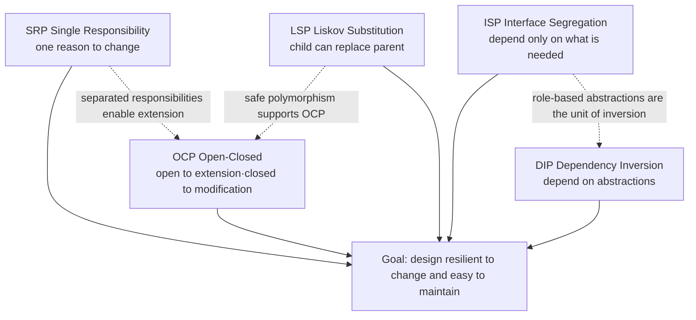
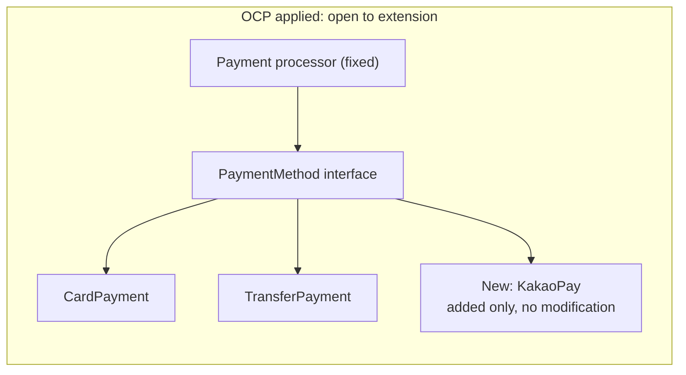
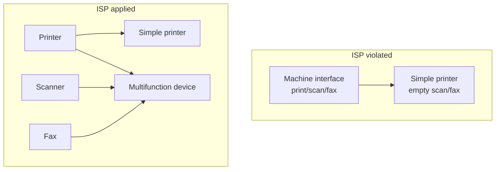
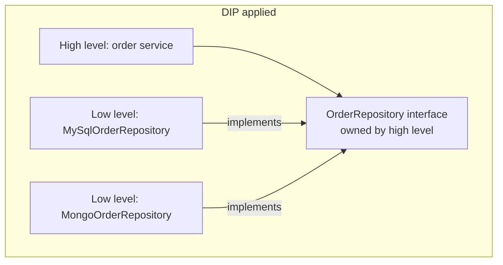

# SOLID Object-Oriented Design Principles (SOLID Principles)

## 1. Overview

### A. Definition
> **SOLID** is an acronym, organized and named by Robert C. Martin (Uncle Bob), for **the five principles of object-oriented design (OOD)** — Single Responsibility (SRP), Open-Closed (OCP), Liskov Substitution (LSP), Interface Segregation (ISP), and Dependency Inversion (DIP). It is a set of guidelines for building **software structures that are resilient to change (flexible) and easy to understand, extend, and reuse (highly maintainable)**.

The single goal running through SOLID is "**minimizing the cost of change**." Software is modified whenever requirements change, and in a structure with high coupling and low cohesion, fixing one place unexpectedly breaks several others. To suppress this "ripple effect" of change, SOLID offers five prescriptions that **control the direction and magnitude of dependencies**: split responsibilities finely (SRP), open for extension but closed for modification (OCP), guarantee polymorphism safely (LSP), cut unnecessary dependencies (ISP), and rely on abstractions rather than concretions (DIP).

Note that SOLID was not "invented" by Martin; in the late 1990s he **collected and reorganized several earlier works and named them as a single, easy-to-remember system**. For example, LSP is the substitution concept presented by Barbara Liskov in 1987, and OCP is a concept mentioned by Bertrand Meyer in his 1988 book. SOLID should therefore be understood less for the originality of its individual principles than as "**a bundle of design sensibilities that create synergy when applied together**."

### B. Background and Need
As object-oriented languages (C++, Java, etc.) spread, powerful techniques such as inheritance and polymorphism became available, but paradoxically, misusing them produced structures more complex and fragile than procedural code. It was common for inheritance to be abused so that parent and child were tightly entangled, or for a single huge class to take on every responsibility — a "**God Class**." Martin defined the symptoms of such decay-prone designs as **Rigidity (a small change triggers cascading modifications)**, **Fragility (fixing something breaks unrelated places)**, **Immobility (too many dependencies come along to extract anything for reuse)**, and **Viscosity (hacks are easier than the right way)**, and presented SOLID as design norms to prevent them.

The need arises from the life-cycle cost structure of software. Typically 60–80% of total software cost occurs in the **maintenance phase** after development, and most of it goes into "understanding the code and changing it safely." SOLID is an investment that structurally lowers exactly this cost of understanding and modification. Especially today, when features are added and changed in short cycles in Agile and DevOps environments and systems are split finely into microservices, each component must be independently changeable and deployable, so SOLID's coupling-control principles are extended beyond the code level to the architecture level.

## 2. Overall Structure of the Five SOLID Principles

Rather than being listed independently, the five principles are connected as a single flow: "**divide responsibilities (SRP) → open those boundaries for extension (OCP) → guarantee safe polymorphic substitution (LSP) → split interfaces finely (ISP) → invert the direction of dependency toward abstractions (DIP)**." The overall structure diagram below shows how the five principles converge on a common goal (a design resilient to change).

There are interdependencies among the principles. To realize OCP (extension without modification), new functionality must be pluggable through polymorphism, and for that polymorphism not to malfunction, LSP (a child fully substituting for its parent) must be upheld. Also, to do DIP (depending on abstractions) properly, ISP (separating interfaces by role) must come first so that those abstractions do not become bloated. It is therefore important to internalize SOLID not as "five rules" but as "**a single design principle whose parts support one another**."

The table below summarizes the five principles at a glance, while the "why" of each principle is explained in prose in the following sections.

| Principle | Core statement | What it controls | Representative techniques |
|---|---|---|---|
| **SRP** Single Responsibility | A class should have only one reason to change | Cohesion (separation of responsibilities) | Separate classes by responsibility, separation of concerns |
| **OCP** Open-Closed | Open for extension, closed for modification | Stability of extension points | Abstraction, polymorphism, Strategy pattern |
| **LSP** Liskov Substitution | The program must work correctly when a subtype replaces its base type | Safety of inheritance | Adherence to contracts (pre-/postconditions) |
| **ISP** Interface Segregation | Clients must not depend on methods they do not use | Interface coupling | Split interfaces by role |
| **DIP** Dependency Inversion | Both high- and low-level modules should depend on abstractions | Direction of dependency | Interfaces, DI (dependency injection) |

## 3. Principles and Application of Each Principle

### A. SRP — Single Responsibility Principle
SRP states that "**a class should have only one responsibility, and there should be only one reason for a class to change**." Here, "responsibility" in Martin's refined definition means "**the actor (a group of stakeholders) that demands a change**." In other words, gather together code that must change together because of the demands of a given stakeholder, and separate code that changes for different reasons. The aim is to raise cohesion and localize the ripple effect of change.

A typical violation is a single `Employee` class containing pay calculation (owned by accounting), work-hour reporting (owned by HR), and DB persistence (owned by the DBA). An incident occurs in which the pay logic is modified because an accounting rule changed, and the reporting function breaks along with it — because three actors share one piece of code. Applying SRP separates the responsibilities into `PayCalculator`, `HourReporter`, and `EmployeeRepository`, isolating changes from accounting so they do not affect HR functions.

In practice, SRP serves as the criterion for setting boundaries not only for classes but also for functions, modules, and microservices. However, splitting too finely causes the number of classes to explode and collaboration relationships to become complex, which paradoxically makes understanding harder. A balance is therefore needed: split along the "axis of change (who changes this code, and why)," but keep together what changes together. A representative example of applying SRP at the architecture level is a large payment system that initially put "settlement rules" and "notification delivery" in one service, then split it into two services after accumulating the cost of redeploying and revalidating settlement code every time a notification channel was added (SMS → KakaoTalk).

### B. OCP — Open-Closed Principle
OCP states that "**software entities (classes, modules, functions) should be open for extension but closed for modification**." It means that when a new requirement arises, one should be able to respond by **adding new code** instead of tearing apart existing, verified code. Because code that has already passed testing and is in production is not touched, regression risk is reduced and change is localized.

The key means of realization is **abstraction and polymorphism**. Points expected to change are extracted into interfaces (abstractions), creating a structure in which concrete implementations can be swapped. For example, when adding bank transfer to code that supports only card payments, continually adding branches like `if(type=="card") ... else if(type=="transfer") ...` requires modifying core logic whenever a payment method is added (an OCP violation). Instead, by defining a `PaymentMethod` interface with `CardPayment` and `TransferPayment` as implementations, adding a new method (simple pay) requires only a new class, and the existing payment processor is left untouched. In practice, PG (payment gateway) integration modules use this structure to extend to dozens of payment channels without downtime.

However, excessive generalization that tries to make "everything extensible in advance" goes against the YAGNI (You Aren't Gonna Need It) principle and creates unnecessary complexity. OCP must be applied with the pragmatic judgment to "**identify the axes where change actually occurs frequently and place extension points only on those axes**." GoF patterns such as Strategy, Template Method, and Decorator are representative tools for implementing OCP.

### C. LSP — Liskov Substitution Principle
LSP states that "**a subtype (child type) must always be substitutable for its base type (parent type), and the substitution must not break the correctness of the program**." It requires that inheritance be not merely a means of code reuse but that it "**preserve even the behavioral contract in an is-a relationship**." A child must not strengthen the parent's preconditions or weaken its postconditions, nor violate the invariants the parent maintained.

The most famous counterexample is the "**square–rectangle problem**." Mathematically, a square is a rectangle, so `Square extends Rectangle` seems natural, but from the perspective of a client that calls `setWidth`/`setHeight` independently, a square breaks the parent's behavioral contract because of its constraint that both values must always be equal. The code `rect.setWidth(5); rect.setHeight(4); assert(area==20)` fails on a square instance. In other words, the child cannot substitute for the parent, so this is an LSP violation — a signal that inheritance has been misused (it should be redesigned with another relationship such as composition).

The practical reason LSP matters is that it is **the safety valve for OCP and polymorphism**. Multiple implementations are plugged into an interface for OCP, but if some implementation breaks the parent's contract (e.g., rejecting a particular method with `throw new UnsupportedOperationException()`), the higher-level code using that polymorphism must specially handle that implementation as an exception. This leads directly to the collapse of OCP. In fact, a design in a collection framework in which a "read-only list" blocks `add()` with an exception is often discussed as a subtle violation of LSP, and the fact that in such cases it is better to separate the interfaces from the start (ISP) reveals the linkage between the principles.

### D. ISP — Interface Segregation Principle
ISP states that "**clients should not be forced to depend on methods they do not use**," holding that several **small interfaces divided by role** are better than one large, general-purpose interface. Depending on a fat interface causes problems: clients are recompiled and redeployed even when methods they do not actually use change, or implementing classes are forced to implement unneeded methods (with empty methods or by throwing exceptions).

A typical violation is putting `print()`, `scan()`, and `fax()` all in a single `Machine` interface. A multifunction printer can implement all three methods, but a simple print-only printer must fill `scan()` and `fax()` with empty implementations or exceptions. This creates a risk of violating LSP as well. Applying ISP separates the interfaces into `Printer`, `Scanner`, and `Fax`, and each device implements only the roles it supports. Clients also depend only on the role interfaces they need, minimizing coupling.

In the microservices era, ISP also extends to an API design principle. If a single giant shared API imposes the same contract on all consumers, adding one field for a particular consumer affects every consumer. To mitigate this, the **BFF (Backend For Frontend)** pattern, which provides consumer-specific APIs, emerged, and it can be seen as an architectural implementation of the spirit of ISP.

### E. DIP — Dependency Inversion Principle
DIP consists of two statements. ① "**High-level modules should not depend on low-level modules; both should depend on abstractions**." ② "**Abstractions should not depend on details; details should depend on abstractions**." Traditionally, when higher-level policy (business logic) directly calls lower-level technical details (DB, external APIs), changes in the lower-level technology shake the higher-level policy as well. DIP **flips (inverts)** this arrow of dependency so that both upper and lower levels look to an interface (abstraction) defined by the upper level.

For example, if the order service (high level) directly calls the MySQL driver (low level), the order logic must be modified when switching the DB to PostgreSQL or NoSQL. Applying DIP, one defines an `OrderRepository` interface owned by the order service and has `MySqlOrderRepository` implement it. Now the direction of dependency is "DB implementation → interface ← order service," so the low level conforms to the high level's abstraction. Replacing the DB only requires creating a new implementation, and the core policy remains unchanged.

The mechanisms that actually make DIP work are **dependency injection (DI)** and **IoC (Inversion of Control) containers**. Objects do not create their dependencies directly with `new`; instead, something external (such as the Spring container) injects the implementation. The fact that modern frameworks such as Spring, .NET Core, and NestJS adopt DI by default has made DIP a de facto standard practice. DIP is also the theoretical foundation of the "dependency rule (inner circles know nothing of outer ones)" in Robert Martin's **Clean Architecture**.

## 4. Relationships Among Principles and Common Misconceptions (Comparison)

Memorizing SOLID only as individual rules leads to conflicts in practice. For example, pushing SRP to the extreme splits classes excessively, causing an explosion of interfaces intended to satisfy ISP and DIP and complicating the collaboration structure, which in turn makes understanding harder. Conversely, planting abstractions everywhere for OCP violates YAGNI and creates unnecessary complexity. SOLID should therefore be treated not as "**absolute rules**" but as "**a language for trade-off judgments aimed at lowering the cost of change**."

There is also a hierarchy among the principles. LSP is a prerequisite of OCP (without safe polymorphism, extension malfunctions), and ISP provides the unit for DIP (dependency inversion is clean only with well-divided role interfaces). SRP is the starting point of all the other principles; when responsibilities are tangled, none of the principles can be applied properly. The table below contrasts the symptoms of violating each principle with common misconceptions.

| Principle | Symptoms of violation | Common misconception |
|---|---|---|
| SRP | Modifying one place breaks unrelated functions | Mistaken as "one class = one method" (actually based on reasons for change) |
| OCP | Branches in core code grow with each added feature | Abstracting everything in advance (over-engineering) |
| LSP | Branches that special-case particular children appear | Mistaken as "inheritance = code reuse" (the behavioral contract is key) |
| ISP | Empty methods and unsupported-operation exceptions proliferate | Making interfaces large by default (illusion of generality) |
| DIP | Core logic changes when DB or external technology is replaced | Mistakenly believing that using a DI framework achieves DIP |

A particularly important misconception is the belief that "using a DI framework (Spring, etc.) means DIP is upheld." If a concrete class is injected as is, without an interface, the direction of dependency is still high level → low level, so DIP is violated. The essence of DIP lies not in the tool but in "**who owns the abstraction and which way the dependency points**."

## 5. Advanced — Clean Architecture, Modern Development, and the Extension of SOLID

SOLID was first presented as a set of class design principles, but today it has been **elevated to architectural principles**. Robert Martin's *Clean Architecture* (2017) raises SOLID to the component and architecture levels, enforcing that in the concentric structure "entities → use cases → interface adapters → frameworks," **dependencies always point inward (toward high-level policy)**. This "dependency rule" is precisely the large-scale application of DIP, and placing interfaces at each layer boundary is a combination of OCP and DIP. Hexagonal architecture (ports and adapters) and onion architecture share the same spirit.

In microservices (MSA), SOLID also serves as a guideline for service decomposition. Dividing services so that each has only a single business capability is the service version of SRP, and abstracting inter-service communication into well-defined contracts (APIs, events) so that changes in internal implementation do not leak to consumers is an application of OCP and DIP. MSA practices such as database per service, event-driven communication, and consumer-specific APIs (BFP/BFF) can be seen as a distributed-systems reinterpretation of SOLID principles.

Meanwhile, the spread of functional programming and modern languages has prompted a relativization of SOLID. In the functional style centered on pure functions and immutability, inheritance is rare, reducing the weight of LSP, and higher-order functions achieve OCP and DIP more lightly. Moreover, in an era in which AI coding tools generate code in bulk, the value of "structures that humans can read and change safely" actually increases, so SOLID's importance as a common language for code review, refactoring, and architecture review remains. From the perspective of the Information Management Professional Engineer exam, a high-scoring answer requires being able to describe SOLID not as something to memorize in isolation but **in connection with** GoF design patterns, Clean Architecture, MSA, and DevSecOps.

## 6. Considerations and Implications

- **Application strategy (incremental adoption)**: Rather than applying SOLID wholesale to new development, it is effective to combine it with refactoring and apply it incrementally, starting from "hotspots where change is frequent." In the order of detecting code smells (rigidity, fragility) → diagnosing principle violations → securing tests → making small-scale improvements, the cost of change in legacy systems is lowered step by step.

- **Trade-off (simplicity vs. flexibility)**: In exchange for flexibility to prepare for future change, SOLID incurs the complexity cost of more classes and interfaces and more indirection. Applying it mechanically even to simple modules that rarely change violates KISS and YAGNI, so the intensity of application should be adjusted based on "whether the likelihood of change is actually high."

- **Linkage with verification and measurement**: Because SOLID compliance tends to remain a qualitative judgment, it is advisable to supplement it with quantitative indicators such as coupling (afferent/efferent coupling), cyclomatic complexity, and cohesion, together with static analysis tools (SonarQube, etc.) and architecture conformance tests (ArchUnit), and to monitor continuously.

- **Organizational and process perspective**: The "actor" in SRP ties into organizational structure. As Conway's Law suggests, system boundaries resemble team boundaries, so SOLID-based module decomposition is effective only when designed together with team formation and ownership definition.

- **Outlook (persistence as an architectural principle)**: Although the form in which individual principles are applied changes with the spread of functional and AI-assisted coding, SOLID's essence — "lower coupling and localize change" — remains valid as it carries into Clean Architecture, MSA, and platform engineering. A Professional Engineer should be able to use SOLID broadly, not as code-level rules but as **the vocabulary of design governance for securing maintainability and extensibility**.

## References
- Robert C. Martin, "Design Principles and Design Patterns" (2000): https://web.archive.org/web/20150906155800/http://www.objectmentor.com/resources/articles/Principles_and_Patterns.pdf
- Robert C. Martin, *Clean Architecture*, Prentice Hall, 2017: https://www.oreilly.com/library/view/clean-architecture-a/9780134494272/
- Barbara Liskov, "Data Abstraction and Hierarchy" (OOPSLA 1987) — original source of LSP: https://dl.acm.org/doi/10.1145/62139.62141
- Wikipedia, "SOLID": https://en.wikipedia.org/wiki/SOLID

---
> **In one line**: SOLID (SRP, OCP, LSP, ISP, DIP) comprises five object-oriented principles that realize "a design resilient to change" by dividing responsibilities and controlling the direction and magnitude of dependencies through abstractions; today it is a common language for securing maintainability that extends to Clean Architecture and MSA.
