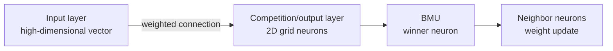

# SOM (Self Organizing Map)

## 1. Overview

### A. Definition
> An **unsupervised learning neural network** proposed by Kohonen (1982) that clusters and visualizes high-dimensional input data by **mapping it onto a low-dimensional (usually 2D) grid while preserving topology**.

The core idea of SOM comes from the way the human cerebral cortex works. Just as similar sensory stimuli are processed in adjacent regions of neurons in the brain, a SOM organizes itself so that **similar inputs correspond to nearby neurons on the output grid**. As a result, the complex neighborhood relationships of high-dimensional data are laid out on a two-dimensional map in a form that people can inspect with their eyes. This "topology preservation" is the decisive feature that distinguishes SOM from simple clustering.

### B. Characteristics
SOM is an unsupervised method that learns the internal structure of data without ground-truth labels, and it operates through **competitive learning**, in which neurons compete over an input to select a winner. In particular, updating not only the winner but also **the winner's neighbors together** makes adjacent neurons take on similar values, thereby realizing topology preservation.

| Characteristic | Description |
|---|---|
| Unsupervised learning | Learns data structure without ground-truth labels |
| Topology preservation | Maintains adjacency relationships of the input space on the output grid |
| Competitive learning | Selects a winner (BMU) through competition among neurons |
| Dimensionality reduction & visualization | Clusters and visualizes high dimensions on a 2D grid |

## 2. SOM Components

Unlike a general neural network with multiple hidden layers, SOM has a simple structure consisting of **only two layers: an input layer and a competition layer (output layer)**. The input layer receives the high-dimensional input vector, and the competition layer consists of neurons arranged on a 2D grid, where **each neuron holds a weight (reference) vector of the same dimension as the input**. When an input arrives, distances to the weight vectors of all neurons are compared, and the closest neuron is selected as the winner, that is, the **BMU (Best Matching Unit)**; then the weights of the BMU and its neighbor neurons are pulled toward the input. How much the neighbors are pulled together is determined by a **neighborhood function (usually Gaussian)** that decreases with distance.

| Component | Description |
|---|---|
| Input layer | High-dimensional input vector |
| Competition layer (output layer) | 2D grid neurons, each holding a weight vector |
| Weight vector | Reference vector compared against the input |
| BMU (Best Matching Unit) | Winner neuron most similar to the input |
| Neighborhood function | Updates neurons around the BMU together (Gaussian) |

## 3. Learning Procedure

The essence of learning is to **"repeatedly select a winner and move the winner and its neighbors little by little toward the input."** An important point is that as learning progresses, the learning rate and neighborhood radius are **gradually reduced**: early on, a wide neighborhood is moved greatly to establish the overall framework of the map (global alignment), and later a narrow neighborhood is fine-tuned to refine the detailed structure (local fine-tuning). This gradual shrinkage enables stable convergence and topology preservation at the same time.

| Step | Description |
|---|---|
| 1 | Present the input vector |
| 2 | Compare distances to all neurons → select the minimum-distance neuron as the BMU |
| 3 | Update the BMU and neighbor weights toward the input direction |
| 4 | Repeat while reducing the learning rate and neighborhood radius |

## 4. Difference Between SOM and Supervised Learning Neural Networks

SOM and general supervised learning neural networks such as MLP (Multilayer Perceptron) have fundamentally different purposes. MLP learns classification and prediction by providing the correct answer and **backpropagating the error**, whereas SOM grasps the structure of data without labels through **competitive learning (winner-take-all)** to cluster and visualize. The absence of backpropagation and the output of a topology-preserving 2D map are fundamental differences.

| Category | SOM | MLP and other supervised learning |
|---|---|---|
| Learning method | Unsupervised | Mainly supervised |
| Learning rule | Competitive learning (winner-take-all) | Backpropagation |
| Purpose | Clustering, dimensionality reduction, visualization | Classification, prediction |
| Output | Topology-preserving 2D map | Class or continuous value |
| Structure | Input-competition layer (2 layers) | Multiple hidden layers |

## 5. Considerations and Implications
The practical value of SOM lies in the fact that **its results can be interpreted by people**. For example, when segmenting customers by purchase pattern, K-means gives only cluster numbers, but SOM places similar customer groups in adjacent regions on the map, thereby showing even **the relationships (adjacency) between clusters**. This makes it useful for customer segmentation, credit-risk visualization, anomaly detection, and pattern analysis. However, results are sensitive to hyperparameters such as grid size, learning rate, and neighborhood radius, so tuning is required, and there are limits to learning cost and interpretability for large-scale, ultra-high-dimensional data. From a professional engineer's perspective, it is appropriate to position SOM not as a substitute for a predictive model, but as an **exploratory analysis and explanation tool** for understanding data structure and communicating it visually before modeling.

---

> **In one line**: SOM is an *unsupervised neural network based on competitive learning* that maps high-dimensional data onto a 2D grid while preserving topology (clustering and visualization); it differs from backpropagation-based supervised learning neural networks in purpose and learning rule in that it updates the winner (BMU) and its neighbors together and converges by reducing the learning rate and radius.
