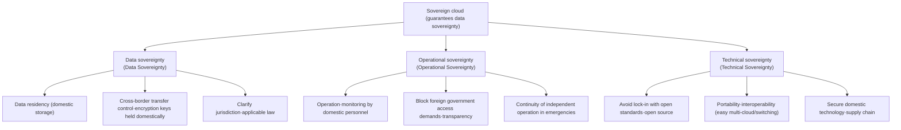
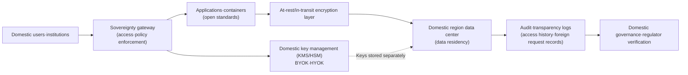

# Sovereign Cloud

## 1. Overview

### A. Definition

> A **Sovereign Cloud** is a cloud designed so that **storage, processing, operation, and control of data are fully contained within the laws, regulations, and jurisdiction** of a specific country or region; it is a cloud construction and usage model that guarantees Data Sovereignty at three levels — technical, operational, and legal.

A sovereign cloud means more than simply "keeping data in a domestic data center." It is a concept that addresses not only physical location (data residency) but also **who can access the data, which country's laws apply to it, and who holds ultimate control in the event of an outage or dispute**. In other words, even if data resides domestically, true sovereignty can hardly be said to be secured if it can be subject to disclosure demands under the laws of a foreign provider's headquarters country (e.g., the U.S. CLOUD Act). The sovereign cloud is a topic typical of the Information Management Professional Engineer exam in that it squarely tackles this problem of "conflicting jurisdictions."

Therefore, a sovereign cloud is established not along the single axis of storage location but only when three axes — **data sovereignty, operational sovereignty, and technical sovereignty** — are satisfied simultaneously. It is closer to a set of architecture and governance design principles for regulatory compliance than to a specific product name.

### B. Background and Need

First, **cross-border data flows and jurisdictional conflicts**. With the spread of global hyperscalers (AWS, Azure, GCP), data can be subject to the extraterritorial application of foreign laws wherever it is physically located. Notably, the U.S. CLOUD Act (2018) can require U.S. companies to hand over data they hold or control to the U.S. government even if it is stored abroad, sharply increasing data sovereignty concerns, particularly in the EU.

Second, **stronger EU regulation and changes in case law**. Along with the GDPR, the 2020 Schrems II ruling invalidated the EU–U.S. Privacy Shield, making cross-border transfers of personal data very difficult. In response, the EU began promoting a trustworthy European cloud ecosystem of its own through GAIA-X, EUCS (EU Cloud Certification Scheme), and other initiatives.

Third, **the cloud migration of sensitive sectors such as the public sector, finance, and defense**. As governments, public institutions, and the financial sector move to the cloud, the risks of national core data becoming dependent on foreign providers (vendor lock-in) and of losing control of services in emergencies have come to the fore. Korea shows a similar trend with CSAP (Cloud Security Assurance Program), network separation, and domestic region requirements.

Fourth, **geopolitical risk and supply chain stability**. As the risk that a given country's provider's services could be suspended or access blocked during interstate conflicts or sanctions has become real, demand has grown for "a cloud that the nation can operate and control independently even in emergencies."

## 2. The Three-Layer Structure of Data Sovereignty

The "sovereignty" that a sovereign cloud seeks to guarantee should be understood not as a single control but as a structure in which three controls of different natures overlap. The concept diagram below shows the three axes of sovereignty and the concrete control elements beneath them.

**Data Sovereignty** means that data follows the laws and regulations of the country where it was created, that its physical storage location is domestic, and that its cross-border transfer is controlled. The key is encryption and **key management (BYOK/HYOK, Bring/Hold Your Own Key)**: even if data is replicated to foreign regions or backups, keeping the decryption keys within domestic jurisdiction maintains de facto control. This is why data residency alone is insufficient and must be combined with access control and encryption-key sovereignty.

**Operational Sovereignty** is control over who operates and monitors the cloud and whether outsiders (especially foreign governments or headquarters) can access the data. It includes operation by personnel of domestic nationality, refusal of and transparency reporting on foreign governments' data disclosure demands, and the continuity to let the nation carry on services independently even when supply is interrupted. Even if the physical location is domestic, operational sovereignty is compromised if remote administrators access it from abroad with root privileges.

**Technical Sovereignty** means the autonomy to avoid dependence on a particular provider and to move to another environment at any time by securing portability based on open standards, open source, and containers. Adopting open technologies such as Kubernetes and OpenStack leaves the option of replacing providers in an emergency, raising both negotiating power and resilience.

## 3. Reference Architecture and Key Control Elements

A sovereign cloud is designed by layering control tiers for guaranteeing sovereignty on top of an ordinary cloud. The architecture below shows the data flow and the sovereignty controls at each point.

First, **data residency and domestic regions**. Originals, backups, logs, and even metadata are kept in data centers under domestic jurisdiction, and DR (disaster recovery) sites are also configured domestically. The entire data flow must be checked so that CDN caches or telemetry data do not inadvertently leave the country.

Second, **encryption and key sovereignty**. Data is encrypted both at rest and in transit, and keys are held by the using organization rather than the provider (HYOK) or at least managed in a domestic KMS/HSM (BYOK). Even if the provider physically holds the data, it cannot be decrypted without the keys, so this becomes the last line of defense against actual exposure even when a foreign government demands disclosure.

Third, **access control and privileged access management**. Following zero-trust principles, operator and administrator access is controlled with least privilege, and privileged access by personnel located abroad is blocked and monitored. All administrative actions are recorded in tamper-proof logs.

Fourth, **transparency and auditability**. Who accessed what data and when, and whether there were access requests from foreign governments, are recorded and reported so that regulators can verify them. This is a means of proving operational sovereignty after the fact.

Fifth, **portability based on open technologies**. Workloads are encapsulated with containers, IaC, and open APIs to reduce dependence on specific providers and lower switching costs in emergencies.

## 4. Comparison of Deployment Types

A sovereign cloud is not a single form but is implemented in several models according to the balance between the level of sovereignty and cost/functionality. Each type involves a trade-off between "how strongly sovereignty is guaranteed" and "how much of the innovation and scalability of global clouds is enjoyed."

| Deployment type | Concept | Sovereignty level | Trade-off |
|---|---|---|---|
| Using domestic regions | Store data in a global provider's domestic region | Low–medium | High convenience and functionality, but headquarters jurisdiction risk remains |
| Partner-operated | Global technology + operation and monitoring by a trusted domestic partner | Medium–high | Stronger operational sovereignty, technology still foreign-dependent |
| Dedicated/isolated | Build a physically and logically separated dedicated sovereign zone | High | High cost and build burden, possible delays in feature updates |
| Domestic independent | Built and operated independently with domestic technology and open source | Very high | Full autonomy, but hard to secure scale and the latest features |

Using domestic regions is easy to adopt and provides the latest features as is, but if the provider's headquarters is subject to foreign law, it may be exposed to extraterritorial demands such as the CLOUD Act, so it can hardly be considered true sovereignty. The partner-operated model is a compromise that uses global technology but has a trusted domestic partner take over operation and monitoring, greatly raising operational sovereignty; it is commonly adopted in the EU. The dedicated/isolated model physically separates a sovereign-only zone, achieving a high level of sovereignty at the price of cost and delayed feature updates. The domestic independent model offers complete autonomy but has the practical limitation that it is difficult to catch up on one's own with hyperscaler-level scale and the latest AI infrastructure. In practice, therefore, it is common to classify workloads by data sensitivity and mix types.

## 5. Cases and Domestic/International Trends

In Europe, **GAIA-X** is the representative example. Started under German and French leadership, this initiative aims not to create a new cloud but to establish a **federated trust framework** under which multiple providers comply with common rules (policy and technical standards) of interoperability, portability, and transparency. The EU has also continued to debate whether to include sovereignty requirements in EUCS, its cloud security certification scheme, which illustrates the tension between strengthening sovereignty and opening markets. France, through its "Cloud de Confiance (trusted cloud)" policy, promoted a partner-operated model in which domestic companies license global technology and operate it (e.g., Bleu, S3ns).

In Korea, the public sector is subject to **CSAP (Cloud Security Assurance Program)** and a tiered system (high, medium, low) that imposes stronger requirements, such as domestic regions and physical network separation, on more sensitive systems, in line with the concept of data sovereignty. Recently, global providers have also been offering sovereign-specific services or partner-operated models in Korea, and the discussion is expanding beyond "domestic storage" to "operational and key sovereignty." However, detailed certification requirements and policies are continually revised, so it is safer to check and apply the latest notices rather than asserting the requirements of a specific tier.

## 6. Considerations and Implications

First, **the trade-off between sovereignty and innovation/cost must be designed strategically**. Isolating all data at the highest level increases cost and feature delays, so a realistic hybrid strategy is to classify workloads (tiering) by data sensitivity and regulatory tier, placing sensitive data in dedicated/independent types and general data in domestic-region types.

Second, **the approach should center on control rather than data location**. Since "domestic storage" alone leaves jurisdictional risk, the goal should be a structure in which even the provider and foreign governments cannot effectively view the data, by combining encryption-key sovereignty (HYOK) and access transparency. Key management sovereignty is the core differentiator of a sovereign cloud.

Third, **lock-in avoidance and an exit strategy must be designed in advance**. Portability should be secured with open standards, containers, and IaC, and data return, transition support, and continuity clauses upon service termination should be specified at the contract stage so that control is not lost in an emergency.

Fourth, **continuous review of governance, auditing, and legal compliance** is needed. Regulations such as the GDPR, the Personal Information Protection Act, and CSAP, as well as case law (Schrems II, etc.), keep changing, so a governance system that tracks data lineage, cross-border transfers, and access history must be in place, and compliance must be periodically re-verified.

Fifth, **digital sovereignty must be viewed from the perspective of national competitiveness and resilience**. Beyond mere regulatory compliance, a sovereign cloud is the foundation of national digital resilience that enables a nation to sustain and control core services even under geopolitical risk, and it should be pursued over the long term in conjunction with policies to foster domestic cloud and AI infrastructure.

## References
- GAIA-X European Association for Data and Cloud: https://gaia-x.eu/
- ENISA, European Cybersecurity Certification Scheme for Cloud Services (EUCS): https://www.enisa.europa.eu/
- Korea Internet & Security Agency (KISA) Cloud Security Assurance Program (CSAP): https://isms.kisa.or.kr/

---

> **In one line**: A sovereign cloud is a cloud model that guarantees **data, operational, and technical sovereignty** together, going beyond where data is stored; it aims to protect national control and digital resilience from foreign jurisdiction and lock-in risks by combining domestic regions, encryption-key sovereignty (HYOK/BYOK), access transparency, and open standards.
