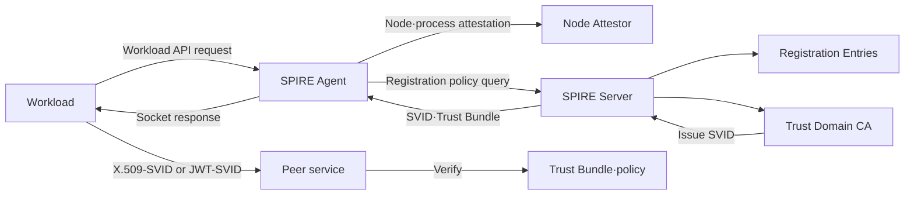
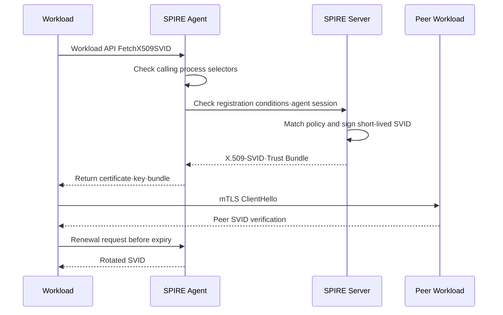

# SPIFFE/SPIRE-Based Workload Identity and Secretless Service Authentication

## 1. Overview

> **Definition**: SPIFFE (Secure Production Identity Framework for Everyone) is an open standard that assigns platform-independent identities to software workloads in distributed environments, expresses those identities as verifiable documents, and defines a standard API through which workloads obtain their identities.

Traditional service authentication began with placing long-lived API keys or certificates in application configuration files, environment variables, or secret stores. However, as microservices and containers multiply, the number of services, deployment frequency, and network boundaries all grow, and it becomes difficult for humans to manage which process communicates under which credentials. If access is decided solely by a server's IP address or namespace, the meaning of identity becomes unstable in situations involving relocation, autoscaling, and multi-cloud.

A workload identity is the identity not of a human account but of a running application, job, agent, or batch process. Because the same container image must have different permissions in development, staging, and production, the image itself is not the identity; the execution location and deployment context must be verified together. SPIFFE standardizes this identity in the form of a logical URI and presents it as an SVID (SPIFFE Verifiable Identity Document).

SPIRE (SPIFFE Runtime Environment) is the representative implementation of the SPIFFE standard. The SPIRE server manages the policies and registration information of a trust domain, and the SPIRE agent attests workloads on a node and then delivers SVIDs to them. Applications do not store long-lived secrets directly but obtain short-lived identity material through the Workload API.

The core of this topic is not introducing yet another tool that issues certificates. It lies in turning into an operational system the workload attestation that grounds identity issuance, the separation of identity from authorization policy, automatic renewal and revocation, and federation between trust domains. A Professional Engineer's answer should therefore explain not only the components but also the boundaries with existing PKI, service meshes, and zero trust, as well as the adoption stages.

## 2. Background and Problems Solved

### 2.1 Structural Limitations of Long-Lived Credentials

Long-lived keys are convenient at issuance but have a long damage window if leaked. If an image storing a key is copied externally or exposed in logs or dumps, an attacker can keep using it as long as the application is not stopped. Shortening the key rotation cycle overwhelms operators with deployments and outages, while delaying rotation accumulates risk.

IP allowlists mistake location for identity. When addresses change due to autoscaling or traffic passes through proxies or NAT, the mapping between caller and address becomes unclear. Once the network has already been compromised, an attacker with an internal address may look like a legitimate service.

Mapping permissions by service account name alone is also insufficient, because the same name may be reused in a different cluster, or a deployment pipeline may inject a token into the wrong target. Identity must combine, through policy, not only the name but also the trust domain, measurements of executables and containers, the namespace, the service account, and the results of node attestation.

### 2.2 The Three Standard Elements of SPIFFE

SPIFFE consists of, first, the SPIFFE ID as the identity namespace; second, the SVID that carries that ID; and third, the Workload API through which workloads obtain and verify SVIDs. Separating these three elements makes applications less dependent on cloud-specific metadata or CA implementation details.

A SPIFFE ID is a URI of the form `spiffe://trust-domain/workload-identifier`. For example, `spiffe://prod.example.com/ns/payment/sa/ledger` can represent a payment namespace/service account combination within the production trust domain. The actual path design should reflect the organization's responsibility and permission boundaries, and should not end with simply copying existing DNS names.

An SVID places a SPIFFE ID in a cryptographically verifiable document. An X.509-SVID is suitable for configuring mTLS using a certificate and private key, while a JWT-SVID can be used where a certificate handshake is not appropriate, such as token exchange or HTTP-based calls. A trust bundle is the set of trust anchors needed to verify a peer's identity.

The Workload API is the channel through which a workload retrieves its SVID and trust bundle. In typical implementations it is exposed via a local socket within the node, so long-lived tokens are not transmitted over the network. The OS and container attributes of the process calling the API are verified separately by the agent, and the application is relieved of responsibility for issuance and lifetime management.

## 3. Overall Architecture and Operating Principles

In the structure above, the SPIRE server is the central point of trust but does not relay all application traffic. Because it separates the control plane of issuance and policy distribution from the data plane of actual service calls, it can reduce data-plane latency while centrally controlling identity lifetimes and policy.

The SPIRE agent is the local intermediary between the server and workloads. The agent does not hand out the same SVID to every workload; it checks whether the requesting process matches the registration conditions and delivers the document appropriate to that identity. The agent's socket permissions and node isolation therefore become an important part of the overall security boundary.

The SPIRE server combines registration entries, node attestation results, and workload attestation results. A registration entry is policy data indicating which combination of selectors may receive which SPIFFE ID. For example, conditions may be a combination of Kubernetes namespace and service account, cloud instance tags, or a container image identifier.

The CA signs SVIDs and distributes trust bundles. An operating organization may fully separate the SPIFFE CA from its existing enterprise PKI, or link it with an external CA, HSM, or certificate management system. In either model, root key protection, intermediate CA rotation, trust bundle renewal, and emergency revocation procedures must be specified.

### 3.1 Node Attestation and Workload Attestation

Node attestation is the step in which the agent proves to the server which machine or virtual node it is running on. Means such as cloud instance identity documents, machine identifiers, join tokens, and TPMs can be used, and the trustworthiness of each means varies with the threat model and operating environment.

Workload attestation is the step that confirms the execution context of the actual process. In Kubernetes, namespace, service account, and pod labels can be used; in VM environments, process user, executable path, parent process, and instance tags can be combined. Trusting only one selector magnifies the impact of misconfiguration or label forgery.

Attestation does not solve authentication and authorization at the same time. Attestation is the process of confirming "which registration condition this executing entity matches" and issuing an ID. Whether the payment service can actually call a specific API of the ledger service requires applying the mTLS peer ID, service policy, and application permission checks together.

### 3.2 SVID Issuance and Renewal Flow

When a workload first calls the API, the agent reads the caller's process characteristics and compares them with registration entries. If no entry matches, no SVID is issued. This failure should be treated differently from a simple network error, and missing registration policies, node attestation failures, and trust bundle mismatches should each be observed separately.

Issued SVIDs are designed to have shorter lifetimes than long-lived credentials. Short lifetimes reduce the window in which a stolen document can be reused, but they make the system sensitive to renewal delays, clock skew, and agent failures. Workloads should therefore renew with ample margin rather than just before expiry, and for temporary server outages apply limited retries and a policy for safely using the last valid document.

The private key of an X.509-SVID should, where possible, be generated by the agent and exposed to the workload only as far as needed. Avoiding leaving it in plaintext on the file system for long periods and using memory or a protected socket reduces the attack surface. However, fully protecting process memory and node administrator privileges is a separate OS and runtime security problem.

A JWT-SVID carries verifiable claims such as issuer, audience, and expiration. Restricting a token's audience per call target reduces the risk of reusing the token against other services. JWTs are easy to pass along, but in return their transmission paths and replay prevention, signing key/JWKS rotation, and token masking in logs must be designed separately.

### 3.3 Trust Domains and Federation

A trust domain is the first path element of a SPIFFE ID and is the unit that manages ID uniqueness and issuance authority within a single organization, environment, or security boundary. Putting development, staging, and production in the same domain is convenient, but an incorrect registration could encroach on production IDs, so it is usually safer to separate the boundaries.

In multi-cloud or merger-and-acquisition environments, services in different trust domains must communicate. In this case, the two sides federate so that each trusts the other domain's trust bundle, and the permitted ID paths and purposes are specified. Simply having all root CAs trust each other effectively turns the federation into a single giant authority, so the scope of federation must be minimized.

Federation must separate cryptographic trust from business authorization. The mere fact that B can verify an SVID issued by domain A must not grant access to all of B's resources. Per-service allowlists, audience, call purpose, data classification, and contracted API scope must also be checked.

## 4. Key Components and Operational Responsibilities

### 4.1 SPIRE Server

The server manages registration entries and trust domains and performs SVID issuance. Because the server's data store contains the relationships between IDs and registration policies, access control and backup encryption are required. If the server is compromised, an attacker can issue identities to arbitrary workloads, so the highest level of protection is applied to the server host and CA keys.

In a high-availability configuration, the consistency of the state store among server instances and leader election are reviewed. Merely running multiple servers does not ensure availability; the recovery order of trust bundles, registration policies, and CA keys must be included in actual failure procedures. After recovery, it must also be decided whether to continue trusting previously issued SVIDs or to urgently replace the trust bundle.

### 4.2 SPIRE Agent

An agent is deployed on each node and provides the local Workload API. In Kubernetes it is deployed per node, like a DaemonSet, and when mounting the socket into pods, file system permissions and runtime isolation are checked so that an arbitrary pod cannot request another pod's identity.

The agent must also prove itself in communicating with the server. Because a compromised agent can lead to misuse of the identities of workloads on that node, the agent process's privileges are minimized and host log, file, and socket access is monitored. Node reimaging and revocation of agent join tokens are also made standard operating procedures.

### 4.3 Workload API Consumers

Applications consume SVIDs through the SPIFFE SDK or through a service mesh or proxy. Using the SDK directly lets the application finely control peer verification and certificate rotation, but increases per-language implementation differences and operational complexity. Using a proxy allows mTLS to be applied without modifying legacy applications, but creates a new trust boundary between the proxy and the application.

Consumers should not trust only the subject ID of an SVID but must check authorization for the APIs and data provided by the peer service. For example, the ID `spiffe://prod.example.com/ns/billing/sa/ledger` describes the origin of the caller but does not mean business authority over all ledger accounts.

## 5. Comparison of Authentication Methods and Related Technologies

The basis for comparison is not "what issues the certificate" but "on what grounds identity is bound, how it is rotated, and by what policy it is restricted at call time." Even with the same mTLS, the operational risk of manually distributing long-lived certificates differs greatly from that of automatically issuing short-lived ones with SPIFFE.

| Category | Long-lived API key | Manual PKI certificate | SPIFFE/SPIRE | Cloud Workload Identity |
|---|---|---|---|---|
| Basis of identity | Stored secret | Issuance and distribution process | Node and workload attestation | Cloud execution context |
| Lifetime management | Risk of missed rotation | Depends on automation level | Short lifetime, automatic rotation | Token and role policy-centric |
| Interoperability | Varies by API | X.509-based | Standard ID, SVID, API | May be cloud-dependent |
| Service-to-service mTLS | Separate implementation | Possible | Well suited as default | Per-service integration needed |
| Representative risk | Key leakage and reuse | Private key distribution and revocation | Agent and registration misconfiguration | Excessive role permissions |

API keys are easy for applications to handle directly, but the very existence of a key adds to the number of secrets that must be managed. Even with a secret store, an exposure surface is created the moment the application pulls a long-lived secret at startup. SPIFFE does not eliminate this entirely, but it changes things so that short-lived material is obtained only when the execution context has been verified.

Enterprises often have already invested in PKI for device, user, and external-system certificates. Rather than SPIFFE replacing PKI, it is more reasonable to view it as providing an issuance layer suited to the dynamic lifetimes and automatic rotation of service workloads. Enterprise root protection policies, auditing, and certificate transparency requirements should be connected to SPIFFE operations.

A cloud provider's workload identity is strong for accessing that cloud's resources and managed services. On the other hand, when service-to-service mTLS across multiple clouds and on-premises, service meshes, or cross-organization domain federation is needed, a hybrid design using SPIFFE together with cloud tokens is advantageous. Rather than choosing one side wholesale, separate the requirements of the data plane and the management plane.

A service mesh and SPIFFE are not competitors. A combination is possible in which the mesh handles traffic encryption, retries, observability, and policy enforcement while SPIFFE/SPIRE provides standard workload identities. However, the boundaries of responsibility must be documented so that the certificate issuer used by the mesh and the trust domain of the Workload API used directly by applications do not diverge.

## 6. Implementation Procedure and Control Items

The first step is to inventory assets and communication flows. Do not stop at collecting service names; link callers, callees, data classification, call direction, permitted methods, deployment environment, and responsible operators. Only with this inventory can registration entries and authorization policies be written with least privilege.

Second, define trust domains and ID naming rules. Review which elements — environment, organization, service, instance — to put in the path, whether IDs persist across redeployments, and whether authorization policies depend excessively on ID paths. Frequently changing names destabilizes operations, and overly broad names lead to concentration of privilege.

Third, choose attestation means and create registration entries at the smallest unit. Instead of using `namespace=payment` alone as a condition, service account, image provenance, node attributes, and deployment environment can be combined. However, attaching too many conditions can cause normal rolling updates to fail, so change impact and rollback are tested together.

Fourth, verify SVID issuance and rotation in non-production environments. Test not only normal issuance but also unregistered pods, forged labels, agent outages, server delays, trust bundle mismatches, and clock skew. Tests should not look only at connection success rates but confirm that failures are observed with the correct reasons and a safe default deny.

Fifth, apply mTLS to a limited set of service pairs. First select calls carrying sensitive data or paths with high lateral-movement risk, and measure certificate lifetime, CPU overhead, handshake latency, and rotation failure rate. Performance problems are solved not by turning authentication off but by tuning connection reuse, session settings, proxy capacity, and policy caches.

Sixth, link authorization policy to peer IDs and business attributes. Even after mTLS succeeds at the network level, methods, resources, and data classifications must be checked at the API gateway or in service code. Policy changes go through code review and approval, testing, progressive rollout, and audit logs.

Seventh, establish operational metrics and incident response. Build dashboards for SVID issuance and renewal success rates, workloads nearing expiry, attestation failures, registration mismatches, trust bundle changes, and agent connection status. If ID misuse is suspected, isolate the relevant registration entries and trust domain, and define the order of issuing new bundles and restarting services.

## 7. Application Cases

### 7.1 E-Commerce Microservices

Assume an e-commerce platform in which an order service calls a payment service and an inventory service. If the order pod holds a reusable long-lived payment API key, then when the pod is compromised the attacker can call the entire payment API beyond the scope of order processing. Separating SPIFFE IDs per service, `order` and `payment`, lets the peer service reject requests that do not come from the expected peer ID.

Permitting mTLS at the payment service is the first condition of authentication. The payment API then checks business rules such as order ID, amount, idempotency key, and customer consent. In other words, the SVID proves "which service the call came from," and application permissions determine "what it can do."

When the order service is replaced with a new image during deployment, identity rotation can occur without connection interruption as long as the same service account and registration conditions are maintained. Conversely, if a debug pod reuses a production service account, it receives the same ID, so service account issuance, RBAC, image approval, and SPIRE registration must be bundled into a single change flow.

### 7.2 Multi-Cloud Data Platform

When an ingestion service in cloud A delivers data to an analytics service in cloud B, private network connectivity between the two alone does not sufficiently describe the caller's identity. If the SPIFFE trust domains of each cloud are separated and only specific data pipeline IDs are federated, unauthorized services cannot pass mTLS verification even if the network is open.

If the data is classified as personal information, identity federation alone does not permit the transfer. Dataset classification, purpose limitation, retention period, transfer region, and processing consent status are included in the data policy, and SVIDs are stored together with audit logs. Only then can technical authentication be linked to privacy protection responsibilities.

### 7.3 Incremental Migration of Legacy Systems

If it is difficult to modify a legacy application to use the SPIFFE SDK all at once, a front proxy or service mesh can receive SVIDs from the Workload API and handle mTLS. Initially, legacy internal communication is maintained and peer authentication is applied at the external boundary; then application-level authorization is added starting with critical paths.

The proxy approach is advantageous for quick adoption, but the proxy must not hold all privileges on behalf of the application. Manage proxy configuration files and socket access permissions, and verify the trust boundary of headers and metadata so that the original peer identity passed to the application cannot be forged.

## 8. Advanced: Linking with Zero Trust and Software Supply Chain

From NIST's zero trust perspective, trust must not be based on network location alone; resource access must be evaluated per session. SPIFFE/SPIRE provides the foundation for continuously verifying workload identity within this principle, but it does not replace user authentication, device posture, data policy, or session risk assessment. A policy engine that combines user, device, and workload identities is therefore needed.

Microsegmentation is a technology that shrinks network boundaries, while SPIFFE is a technology that identifies service principals inside and outside those boundaries. If IP/port-based rules judge "where it came from," SVID-based rules judge "which verified workload it is." Using both together combines coarse blocking by firewalls with fine-grained application-level permissions.

In the software supply chain, image signing can be linked with runtime identity. Including approved images, build pipelines, and deployment environments in attestation conditions can prevent unapproved images bearing the same service account string from receiving production SVIDs. However, since an image digest alone cannot guarantee all behaviors of a runtime process, post-execution observation and behavior-based detection are used in parallel.

Container orchestrator labels and service accounts are convenient, but if the management API is compromised, incorrect values can become the basis for issuance. For high-risk resources, node attestation, image verification, admission policies, and runtime isolation are designed as multiple layers of control. The key is ensuring that sensitive IDs are not issued even if one attribute is tampered with.

Recent workload identity integration also extends to OIDC and token exchange. When exchanging a JWT-SVID for a short-lived token for an external resource, strictly verify the issuer, audience, expiration, and signing key discovery URL, and check whether the external system directly supports X.509-SVIDs. Even if the standard names are the same, implementations may differ in accepted claims and trust procedures.

The CNCF manages SPIFFE and SPIRE as projects of the cloud native ecosystem, and SPIRE implements the SPIFFE standard to perform node and workload attestation and SVID issuance. When adopting them, it is therefore advisable to evaluate standard API compatibility, operator capability, failure response, and version upgrade paths rather than product feature lists.

## 9. Considerations and Implications

### 9.1 Root of Trust and Separation of Operations

Do not give the CA root key and SPIRE server administrative privileges entirely to application operators. Divide roles for issuance policy changes, CA key use, registration entry creation, and deployment approval, and apply dual approval to high-risk changes. Emergency procedures for reissuing identities for all services when the root of trust is compromised should also be rehearsed regularly.

### 9.2 Default Deny and Exception Management

Unregistered workloads must not receive SVIDs, and unauthorized peers must be denied at authorization even after mTLS. Leaving an allow-all rule in production as an outage workaround turns early convenience into a permanent security hole. Exceptions should carry an expiration date, owner, scope of impact, and revocation conditions.

### 9.3 Availability and Performance

Short-lived SVIDs increase security but are affected by failures of the issuance/renewal control plane. Design agent caching, server redundancy, pre-distribution of trust bundles, reasonable retries, and clock synchronization, but never allow expired credentials indefinitely. Measure mTLS overhead with real traffic patterns and consider connection reuse and hardware acceleration.

### 9.4 Auditing and Privacy

Because SVIDs express service identities in detail, combining them with call logs increases the traceability of operational actions. On the other hand, excessively linking pods, jobs, and user flows can produce personal or internal information. Include log retention periods, access permissions, ID masking, and restrictions on use beyond purpose in the design of security observability.

### 9.5 Organization and Responsibility

A model in which the platform team installs SPIRE and application teams need not know any policy is prone to failure. The platform team should provide common capabilities for issuance, attestation, and agents; application teams should own service call contracts and business permissions; and the security team should govern standards, audits, and incident response.

### 9.6 Phased Adoption

Rather than enforcing it on all services immediately, expand in the order of asset inventory, single-trust-domain experiments, mTLS for non-core services, enforcement on sensitive paths, and multi-domain federation. Measuring issuance success rate, policy denial rate, failure recovery time, number of exceptions, and volume of unregistered communication at each stage provides the evidence for the next stage.

### 9.7 Connections from a Professional Engineer's Perspective

SPIFFE/SPIRE is a foundational technology connecting PKI, zero trust, service meshes, secret management, software supply chain security, and API authorization. An answer should depict the life cycle of identification, attestation, issuance, delivery, verification, authorization, auditing, and revocation rather than listing product names. The ultimate goal is not certificate automation itself but continuously enforcing least privilege with verifiable identities even in dynamic environments.

## References

- SPIFFE, “SPIFFE Concepts”: https://spiffe.io/docs/latest/spiffe-about/spiffe-concepts/
- SPIFFE, “Secure Production Identity Framework for Everyone”: https://spiffe.io/docs/latest/spiffe-specs/spiffe/
- SPIFFE, “SPIFFE Workload API”: https://spiffe.io/docs/latest/spiffe-specs/spiffe_workload_api/
- SPIFFE, “SPIRE Concepts”: https://spiffe.io/docs/latest/spire-about/spire-concepts/
- SPIFFE, “Working with SVIDs”: https://spiffe.io/docs/latest/deploying/svids/
- Cloud Native Computing Foundation, “SPIFFE”: https://www.cncf.io/projects/spiffe/
- Cloud Native Computing Foundation, “SPIRE”: https://www.cncf.io/projects/spire/
- NIST, “Zero Trust Architecture, SP 800-207”: https://csrc.nist.gov/pubs/sp/800/207/final

---

> **In one line**: SPIFFE/SPIRE is a system that attests workloads by their execution context to automatically issue short-lived SVIDs, making them the standard identity foundation for zero trust, mTLS, and least-privilege policies.
