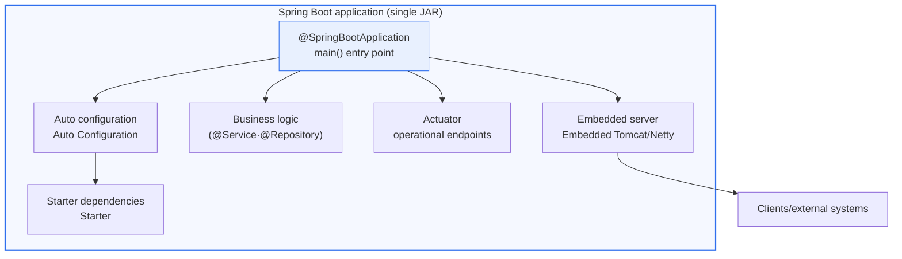
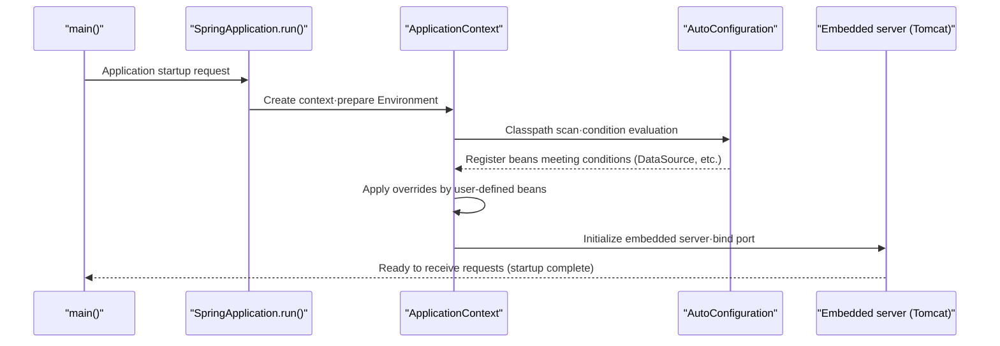

# Spring Boot

## 1. Overview

### A. Definition
> **Spring Boot** is an opinionated framework that automates the complex configuration of the Java-based Spring Framework, helping developers **quickly develop and deploy stand-alone, production-grade applications with minimal configuration**.

The core value of Spring Boot lies in '**freeing developers from configuration hell**.' The original Spring Framework provides powerful features such as dependency injection (DI), aspect-oriented programming (AOP), and transaction management, but just to bring up a single web application, developers had to handle numerous XML configurations such as `web.xml`, `applicationContext.xml`, and `dispatcher-servlet.xml`, coordinate library version compatibility, and install and deploy a servlet container themselves. Because of this barrier to entry, it commonly took hours to a day to see "the first working screen."

Spring Boot solves this with the philosophy of "**Convention over Configuration**" and "**sensible defaults**." The framework infers in advance the configuration that most projects commonly need and performs Auto Configuration, provides Starters that bundle libraries by feature, and embeds the servlet container (Tomcat) inside the application to produce a single artifact that runs without installing a separate server. As a result, developers can focus the time they used to spend on configuration on actual business logic and turn ideas into working services within minutes.

Thanks to this productivity, Spring Boot has become the de facto standard for Java web and microservice development. Korea's standard framework for the public and financial sectors (the eGovernment Standard Framework) is also Spring-based, and recent versions adopt Spring Boot, so from a Professional Engineer's perspective it should be treated as a key tool of software engineering and architecture design.

### B. Background and Need
The emergence of Spring Boot is the result of two converging trends. First, **the accumulated configuration complexity of Spring itself**. Spring evolved over its versions toward annotation-based configuration (`@Configuration`, `@Component`), but developers still had to decide which beans to register under which conditions and which library versions to use together to avoid conflicts. This "boilerplate configuration," repeated in every project, was the bottleneck of productivity.

Second, **the demands of the microservices and cloud-native era**. Since the mid-2010s, applications have split from a single giant WAR deployed to a WAS into small services that are deployed and scaled independently. In this paradigm, an approach in which "the application contains its own runtime environment" is far more advantageous than traditional deployment that "places the application on a container pre-installed on a server." Spring Boot's embedded-server, single-JAR execution model fit this demand exactly and connected naturally to Docker imaging and Kubernetes deployment.

## 2. Architecture and Core Components

Spring Boot is structured as a thin but powerful automation layer on top of the Spring Framework. The overall structure in broad terms is as follows.

### A. Auto Configuration
Auto configuration is the heart of Spring Boot. When `@EnableAutoConfiguration`, included in `@SpringBootApplication`, takes effect, Boot conditionally registers the necessary beans based on **which libraries are present on the classpath**. For example, if `H2` and `spring-jdbc` are on the classpath, it auto-configures an in-memory data source, and if `spring-webmvc` is present, it registers the `DispatcherServlet`.

This conditional registration is based on condition annotations such as `@ConditionalOnClass` and `@ConditionalOnMissingBean`. Because default beans are registered "only when a particular class exists" and "only when the user has not defined their own bean," developers can override them with their own configuration whenever they wish. In other words, auto configuration is not coercive but an open structure that "provides sensible defaults while allowing overrides."

Understanding the principle matters in practice because of troubleshooting. As convenient as auto configuration is, "why this bean was registered, and why my configuration is being ignored" can become opaque. In such cases, the auto-configuration report (Condition Evaluation Report) printed with the `--debug` option lets you trace which conditions matched or did not, making it the practical key to balancing "the convenience of convention" with "internal understanding."

### B. Starter Dependencies
A starter encapsulates, as a single dependency, the bundle of libraries needed to implement a particular feature. For example, adding `spring-boot-starter-web` brings in Spring MVC, embedded Tomcat, Jackson (JSON serialization), validation, and more at mutually compatible versions in one go. Developers escape the "dependency hell" of coordinating individual library versions.

The basis for version consistency is the BOM (Bill of Materials) in the parent POM, `spring-boot-dependencies`. Because the set of library versions validated together by the Spring Boot team is managed in one place, using starters applies a validated combination without specifying individual versions. This greatly reduces in advance runtime errors caused by incompatibilities between libraries (e.g., deserialization failures due to Jackson version conflicts).

The main starters are summarized below, but the table is only a summary aid; the actual choice comes from the architectural decision of "which communication and storage technologies to use."

| Starter | Included features |
|---|---|
| `spring-boot-starter-web` | REST/MVC, embedded Tomcat, JSON |
| `spring-boot-starter-webflux` | Reactive web, embedded Netty |
| `spring-boot-starter-data-jpa` | JPA/Hibernate, transactions |
| `spring-boot-starter-security` | Authentication and authorization (Spring Security) |
| `spring-boot-starter-actuator` | Operational endpoints such as health and metrics |

### C. Embedded Server and Single Artifact
Traditional Java web deployment involved uploading a WAR file to a separately installed WAS (e.g., Tomcat, WebLogic). Spring Boot does the opposite, embedding Tomcat (or Jetty/Undertow, or Netty in the reactive stack) as an application dependency. As a result, the server starts with a single line, `java -jar app.jar`, and "the application contains its own runtime environment."

The practical implication of this approach is simplified deployment and operation. The work of matching and tuning container versions on each server disappears, and because "the built artifact behaves the same anywhere," inconsistencies among development, test, and production environments (the "works on my machine" problem) are reduced. In particular, since only a single JAR needs to go into a Docker image, it pairs well with container- and Kubernetes-based deployment.

The build artifact is an executable JAR (fat/uber JAR) structure that wraps the application classes and all dependent libraries into one. Recently, a widely used technique is the Layered JAR, which separates dependencies from application code so that when only the code changes, Docker image layer caches are reused to shorten image build and deployment times.

### D. Actuator and Operational Support
Actuator is an operational support module that exposes the state of a running application externally. It provides health checks via `/actuator/health`, metrics via `/actuator/metrics`, and meta-information via `/actuator/info`, and integrates with monitoring systems such as Prometheus through Micrometer.

From an operations perspective, Actuator matters because the framework provides a minimal entry point to observability by default. By connecting Kubernetes Liveness/Readiness probes to `/actuator/health/liveness` and `/readiness`, the container orchestrator can automatically restart and isolate unhealthy instances. However, because status endpoints expose internal information, in production the exposure scope should be minimized and access controlled with Spring Security.

### E. Bootstrap Procedure
Looking in detail, from a process perspective, at how auto configuration actually operates, the flow is as follows.

## 3. Comparison — Spring vs. Spring Boot, and WAR vs. Embedded Server

It is easy to misunderstand Spring Boot as "a new framework," but precisely speaking it is a higher layer that makes the Spring Framework easier to use. The difference between the two stems not from the presence or absence of features but from **where configuration responsibility lies**. Spring delegates configuration decisions to developers for flexibility, whereas Spring Boot makes, on the developer's behalf, the default decisions most would agree with.

| Category | Spring Framework | Spring Boot |
|---|---|---|
| Configuration | Done by developers (XML/Java Config) | Auto configuration + overrides |
| Dependencies | Individual version management | Validated bundles via starters and BOM |
| Server | External WAS installation and deployment (WAR) | Embedded server, single JAR |
| Initial startup | Takes relatively long | Running within minutes |

The practical implication of this difference is clear. The same application can be built with Spring alone, but the initial setup and maintenance costs are high. Spring Boot, on the other hand, enforces conventions in exchange for hiding some fine-grained control behind abstraction. Therefore, unless "special legacy integration or extreme customization" is needed, new Java projects today take Spring Boot as the default choice.

As a real example, when a startup builds a REST API backend with Spring Boot, it typically takes around 10 minutes from project creation (start.spring.io) to the first endpoint response. In contrast, doing the same with plain Spring requires hundreds of lines of XML/configuration code just for the servlet, dispatcher, view resolver, and data source settings. This difference in initial speed determines the validation cycle of an MVP (minimum viable product).

## 4. Advanced — Cloud-Native Trends and Recent Changes

Spring Boot is evolving rapidly to meet cloud-native demands. However, since specific versions and release timings vary considerably, it is safer in a Professional Engineer's answer to describe directions rather than definitive figures.

First, **the transition of the Java standard namespace**. The Spring Boot 3.x line moved to a Jakarta EE 9+ base that switched the Java (EE) `javax.*` namespace to `jakarta.*`, and it requires a recent LTS Java (generally Java 17 or later) to run. This means library compatibility checks are needed when migrating legacy systems.

Second, **native image (GraalVM Native Image) support**. AOT (Ahead-Of-Time) compilation turns the application into a native binary, cutting startup time to the level of hundreds of milliseconds and greatly reducing memory usage. This is advantageous for lowering cold-start latency and resource costs in serverless (FaaS) or large-scale scale-out environments. However, code with heavy use of reflection and dynamic proxies requires hint configuration, making the transition somewhat difficult.

Third, **the coexistence of virtual threads and reactive programming**. Using the virtual threads of recent Java makes it possible to achieve high concurrency while keeping the existing imperative (blocking) code style, widening the options for improving throughput without necessarily moving to reactive (WebFlux). This is a trend that softens the "blocking vs. non-blocking" dichotomy in architecture choices.

Fourth, **integration of observability standards**. Through Micrometer and Micrometer Tracing, metrics and traces are exported to standards such as OpenTelemetry, and the framework is being strengthened to support distributed tracing and integrated monitoring at the framework level.

## 5. Considerations and Implications (Professional Engineer's Perspective)

1. **Balancing the convenience of auto configuration with internal understanding.** Auto configuration maximizes productivity, but using it without knowing its principles makes tracing root causes difficult during incidents. Use the condition evaluation report and `spring-boot-starter-actuator` to make "what was configured and why" continuously observable, and pursue team-wide learning in parallel.

2. **Positioning as a foundational technology for microservices and cloud native.** Its stand-alone execution and embedded server characteristics align with containers, MSA, and serverless. Combine it with Spring Cloud (service discovery, config server, gateway) to build distributed systems, while also considering distributed design challenges such as service boundaries and data consistency (e.g., the saga pattern).

3. **Value as a standardization and governance tool.** Eliminating repetitive configuration and enforcing conventions raise code consistency and onboarding speed across the team. It can be used as a means of organization-wide architecture governance through linkage with the public/financial standard framework and internal common starters (encapsulating in-house standard libraries as starters).

4. **Managing security and operational risks.** The embedded server and automatic inclusion of dependencies are convenient, but vulnerable libraries (e.g., cases like the past Log4Shell) may be included in the fat JAR as well. SBOM (Software Bill of Materials) management, dependency vulnerability scanning, and access control of Actuator endpoints should be internalized in the DevSecOps pipeline.

5. **Performance and cost optimization strategy.** JVM-based startup latency and memory usage translate directly into cost in large-scale scale-out and serverless. Recent techniques such as native images, layered JARs, and virtual threads should be applied selectively according to workload characteristics to manage cold starts and resource efficiency together.

## References
- Spring Boot Reference Documentation — https://docs.spring.io/spring-boot/docs/current/reference/html/
- Spring Boot Project — https://spring.io/projects/spring-boot

---

> **In one line**: Spring Boot is a framework that *uses auto configuration, starters, and an embedded server to quickly develop and deploy stand-alone, production-grade applications with minimal configuration*; its "convention over configuration" philosophy boosted productivity and made it the de facto standard for Java web and microservice development, and it continues to evolve for the cloud-native era with native images, virtual threads, and enhanced observability.
