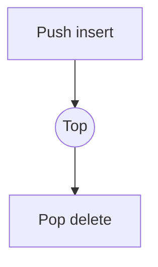

# Linear Data Structures: Stack · Queue · List

## 1. Overview

### A. Definition
> Data structures that store data **arranged in a line (linear, one-dimensional)**, in which each element is adjacent only one-to-one to its preceding and following elements; according to their input/output rules they are divided into **stacks (LIFO), queues (FIFO), and lists (arbitrary access)**.

Unlike non-linear structures such as trees and graphs, linear data structures define the relationship between elements only by a simple "previous–next" order. Although they seem simple at first glance, entirely different properties and uses arise depending on **where input and output are allowed**. Stacks and queues deliberately restrict access points (both ends or one end) to enforce a specific processing order, while lists allow arbitrary positional access without restriction.

### B. Background and Need
The correctness and efficiency of an algorithm depend on "**in what order data is inserted and removed**." For example, function calls naturally follow LIFO because the most recently called function must finish first, while a printer queue naturally follows FIFO because the job requested first should be processed first. In other words, choosing a data structure is a design decision to **minimize operation cost according to the problem's access pattern**. A wrong choice can turn an O(1) operation into an O(n) one.

## 2. Stack

A stack is a **LIFO (Last In First Out)** structure in which insertion and deletion occur **only at one end (Top)**. Like stacking plates and taking them from the top, the data inserted last comes out first. This property is powerful wherever "undoing" is needed. Typically, the **function call stack** directly represents the nested relationship of call → return, and an editor's **undo**, parenthesis checking and postfix evaluation of expressions, and graph **DFS (depth-first search)** are implemented with stacks. Push, pop, and peek all touch only the Top, so they are O(1).

| Item | Content |
|---|---|
| Principle | **LIFO** — input/output only at Top |
| Operations | push (insert), pop (delete), peek (view), all O(1) |
| Uses | Function call stack, undo, expression evaluation, DFS |

## 3. Queue

A queue is a **FIFO (First In First Out)** structure that **inserts at the rear and deletes at the front**, like standing in line. Because data that comes in first is processed first, it is used where **guaranteed fair ordering** is needed. Representative cases are job scheduling in operating systems, **buffers** that absorb differences between production and consumption rates, and graph **BFS (breadth-first search)**. If a queue is implemented with a simple array, the front keeps shifting backward after each dequeue, wasting space, so a **Circular Queue** that connects the front and back for reuse is used. The **Deque**, which allows input and output at both ends, and the **priority queue**, which removes items by priority, are variants of the queue.

| Item | Content |
|---|---|
| Principle | **FIFO** — insert at rear, delete at front |
| Operations | enqueue (insert), dequeue (delete) |
| Variants | Circular queue, Deque, priority queue |
| Uses | Job scheduling, buffers, BFS |

## 4. List

A list is a general-purpose linear structure that places no restriction on access position, allowing **insertion, deletion, and retrieval at arbitrary positions**. Its properties vary greatly with the implementation method, and this difference is the crux of practical selection. An **array list** keeps elements in contiguous memory, enabling immediate O(1) access by index, but inserting or deleting in the middle requires shifting all subsequent elements, which is O(n). In a **linked list**, each node points to the address of the next node (a pointer), so insertion and deletion are O(1) by merely changing pointers, but finding a particular element requires following links from the beginning, making access O(n). The principle, therefore, is "**arrays for retrieval-heavy workloads, linked lists for insertion/deletion-heavy workloads**." Linked lists are divided into singly linked, doubly linked (bidirectional), and circular.

| Implementation | Access | Insert/Delete | Characteristics |
|---|---|---|---|
| Array list | O(1) | O(n) | Contiguous memory, cache efficiency |
| Linked list | O(n) | O(1) | Pointer links, dynamic size |

## 5. Comparison and Implications

The differences among the three structures ultimately stem from "**how much access is restricted**." Stacks and queues restrict access points to guarantee a processing order (LIFO/FIFO) at the cost of giving up arbitrary access, while lists do the opposite.

| Category | Stack | Queue | List |
|---|---|---|---|
| Input/output | LIFO | FIFO | Arbitrary |
| Access | Top only | Front/Rear | Sequential/index |
| Typical uses | DFS, undo | BFS, buffers | General-purpose sequential management |

- **Selection criteria**: Choose according to the required processing order and access pattern; for lists, weigh the **trade-off between arrays and linked structures (O(1) access vs. O(1) insertion/deletion)**.
- **Extension perspective**: Stacks, queues, and lists are used on their own, but they are also **the basic building blocks of non-linear and composite data structures** such as trees, graphs, and hashes. For example, tree traversal uses stacks/queues internally.

---

> **In one line**: A stack is a *LIFO structure with input/output only at the Top*, a queue is a *FIFO structure that inserts at the rear and deletes at the front*, and a list is a linear data structure that allows *access, insertion, and deletion at arbitrary positions*; choose among them according to processing order and access pattern, considering the degree of access restriction and the array vs. linked trade-off.
