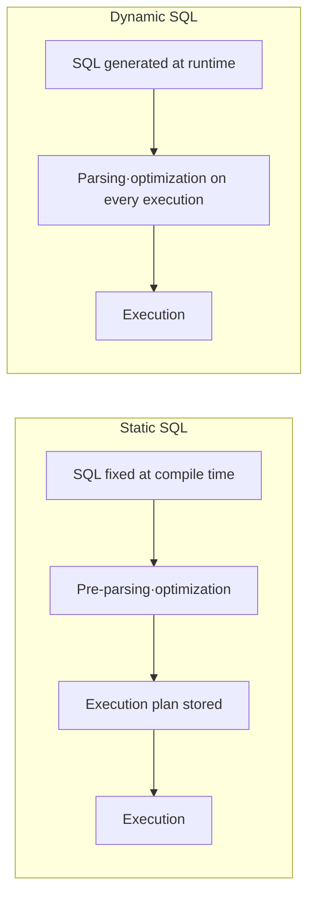

# Static SQL vs. Dynamic SQL

## 1. Overview

### A. Definition
> **Static SQL** is a method in which the structure of an SQL statement is fixed at program-writing (compile) time and is parsed and optimized in advance, while **dynamic SQL** is a method in which the program assembles SQL as a string at execution (runtime) and executes it on the spot.

### B. Why They Are Distinguished
The fundamental axis dividing the two is **"when the SQL is fixed,"** and this difference in timing produces three conflicting outcomes: performance, flexibility, and security. If SQL is fixed in advance, the DB can create an execution plan once and reuse it, making it fast, but it is hard to accommodate screens whose query conditions vary with the situation. Conversely, building statements at runtime can accommodate any combination of conditions, but it is slow because it must be parsed every time, and external input gets mixed into the SQL statement, creating a risk of **SQL Injection**. Choosing between them is therefore a matter of weighing this trade-off according to the situation.

## 2. Comparison of Processing Timing

Because static SQL statements are fixed at the compile stage, parsing, optimization, and execution plan creation are performed **just once**, and the plan is stored and reused in subsequent executions. Dynamic SQL, on the other hand, is fixed only just before execution, so in principle it **goes through the parsing and optimization process again on every execution.** This difference between "one-time preprocessing" and "reprocessing every time" is the root of the performance gap between the two methods.

## 3. Comparison

| Category | Static SQL | Dynamic SQL |
|---|---|---|
| When SQL is fixed | At compile (writing) time | At execution (runtime) |
| Parsing/optimization | Performed once in advance | Performed on every execution |
| Performance | Fast (execution plan reuse) | Relatively slow |
| Flexibility | Low (fixed structure) | High (changes with conditions) |
| Security | Safe (fixed structure, binding) | SQL Injection risk |
| Typical use | Structured repetitive queries (batch, transactions) | Variable searches, administration tools |

Digging a little deeper into why the performance difference arises, it is because the **hard parse (syntax analysis + search for an optimal execution plan)** that the DB performs before executing SQL accounts for a considerable cost. Static SQL pays this cost only the first time, but dynamic SQL, which produces a different string each time, cannot reuse plans and repeatedly triggers hard parses. Flexibility is the exact opposite. For example, if a search screen must attach to the WHERE clause only those conditions the user has entered among name, period, and region, there are dozens of condition combinations, making it hard to write them all in advance with static SQL, and it is more natural to assemble them on the spot with dynamic SQL.

## 4. Countering SQL Injection (Dynamic SQL)

The greatest risk of dynamic SQL is SQL Injection. For example, if a login query is built by string concatenation such as `"SELECT * FROM users WHERE id='" + input + "'"`, an attacker can enter `' OR '1'='1` in the input field to make the WHERE condition always true and bypass authentication. The root cause is that **user input (data) is interpreted as part of the SQL syntax (code)**, so the key to defense is to make input be treated as pure data rather than code.

| Countermeasure | Content | Principle |
|---|---|---|
| **Bind variables** | Prepared Statement, parameter binding | Fix the statement structure first and inject only values later → input cannot be interpreted as code |
| **Input validation** | Whitelist, type, and length validation | Only permitted forms pass |
| **Least privilege** | Minimize DB account privileges | Reduce the scope of damage upon compromise |
| **Error handling** | Block exposure of detailed error messages | Prevent leakage of DB structure information |

The most reliable defense is **bind variables (Prepared Statement)**. If the statement structure is compiled first with placeholders such as `WHERE id = ?` and only values are passed as parameters, whatever is entered is processed only as data, not syntax, fundamentally blocking injection. Moreover, since with bind variables only the values differ while the statement structure stays the same, the DB can **cache and reuse the execution plan**, which also substantially mitigates the performance weakness of dynamic SQL — killing two birds with one stone.

## 5. Considerations and Implications
- **Always use dynamic SQL with bind variables**: Avoiding string concatenation and enforcing parameter binding achieves both injection defense and reuse of cached execution plans.
- **Hybrid design**: It is realistic to apply static SQL to performance-critical structured repetitive queries (transactions, batch) and dynamic SQL to searches and reports with variable conditions.
- **Leveraging frameworks**: ORM/persistence frameworks such as MyBatis and JPA use binding internally, so using them correctly secures both the flexibility and the safety of dynamic queries. However, even in frameworks, string substitution (e.g., `${}`) is exposed to injection, so caution is required.

---

> **In one line**: Static SQL is *fixed at compile time and pre-optimized, making it fast and safe*, while dynamic SQL is *assembled at runtime, making it flexible but slow due to parsing every time and vulnerable to injection*; using bind variables (Prepared Statement) fundamentally blocks injection and also compensates for performance through execution plan reuse.
