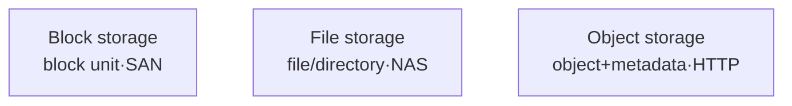

# Data Access Methods of Block, File, and Object Storage

## 1. Overview

### A. Definition
> Storage is classified into **Block, File, and Object** according to the **minimum Unit of Access** and the interface used to store and access data; each differs in access method, scalability, and use case.

The essential difference among the three lies in "**who handles data, and in what unit**." Block storage does not provide a structure such as a file system; it exposes only raw blocks, and the upper-layer OS imposes structure on them directly. File storage already has its own file system and provides paths and hierarchy. Object storage abandons hierarchy altogether and handles each object as a whole via a unique ID and metadata. This "difference in abstraction level" produces the differences in performance, scalability, and shareability.

### B. Background and Necessity
Initially there was only block storage directly attached to servers (DAS). As the need for multiple users to share files grew, file storage (NAS) emerged; then, as the need to store virtually unlimited web-scale unstructured data (photos, logs, backups) grew, object storage appeared. In other words, the three are not in a hierarchy of superiority but are **chosen according to workload characteristics (performance, sharing, scale, cost)**. A workload for which low latency is vital, such as a database, a workload where a team co-edits documents, and a workload that cheaply accumulates petabytes of media each require a different unit of access.

## 2. Comparison of Access Methods

As the unit of access grows (block → file → object), each request carries richer context but incurs more overhead, increasing latency; conversely, structural coupling loosens, making horizontal scaling easier. The performance and scalability differences in the table below all derive from this principle.

| Category | Block | File | Object |
|---|---|---|---|
| **Unit of access** | Fixed-size block (LBA) | File (path/hierarchy) | Object (unique ID + metadata) |
| **Interface** | iSCSI·FC (SAN) | NFS·SMB (NAS) | REST API (HTTP) |
| **Structure** | Logical volume | Hierarchical directories | Flat namespace |
| **Performance** | Highest (low latency) | Medium | Relatively low (high latency) |
| **Scalability** | Limited | Medium | Very high (unlimited scaling) |
| **Use cases** | DB·VM·transactions | File sharing·collaboration | Backup·archive·media·big data |

## 3. Detailed Characteristics by Type

### A. Block Storage
Block storage presents a disk only as **an array of fixed-size blocks addressed by LBA (Logical Block Address)**. There is no concept of files or directories at the storage layer; how the blocks are used is decided entirely by the upper-layer OS file system (ext4, NTFS, etc.) or the DBMS. Because the storage does only the minimum, **there is little additional processing, giving the lowest latency**, and it is strong at random I/O. However, a block volume is, in principle, mounted to a single host, making **concurrent sharing difficult**. It is connected via iSCSI/FC-based SAN and used where low latency and transactional integrity are required, such as database data files and virtual machine boot disks.

### B. File Storage
In file storage, the storage device itself has a file system and provides access through **paths (e.g., `/home/user/report.docx`) and a directory hierarchy**. Because it is exposed on the network via NFS/SMB protocols (NAS), **multiple clients can mount the same file system simultaneously for sharing and collaboration**, leveraging POSIX file permissions and locking as-is. Due to the overhead of traversing the hierarchy and processing network file protocols, latency is higher than block storage, and when directories become deep and the number of files grows to hundreds of millions, the burden of metadata management limits scalability. It is well suited for departmental shared folders, shared development source trees, and collaborative media editing.

### C. Object Storage
Object storage abandons hierarchy and handles data **as objects accessed via a unique identifier (key)**. Each object consists of the data body + user-defined **metadata** + a unique ID and is stored in a flat namespace. Because there is no need to maintain or traverse a directory tree, **horizontal scaling is virtually unlimited**, reaching petabyte scale simply by adding nodes. Access is via an HTTP-based REST API (GET/PUT), and rather than modifying part of a file, it **writes an object as a whole**. Each request incurs HTTP and metadata processing overhead, so latency is the highest, but it is optimal—at low cost and high durability—for large-scale, unstructured, read-heavy data (backups, logs, images/video, data lakes). AWS S3 is the representative example, providing 99.999999999% (11 nines) durability by automatically replicating across multiple data centers.

## 4. Selection Criteria

Once the principle of the unit of access is understood, selection follows naturally. If **low latency and random I/O** are needed, choose block; if **concurrent sharing and POSIX semantics** are needed, choose file; if **large-scale, unstructured, low-cost scaling** is needed, choose object.

| Requirement | Suitable | Reason |
|---|---|---|
| **High-performance transactions (DB·VM)** | Block | Minimal overhead·low latency·random I/O |
| **Multi-user file sharing** | File | File system·POSIX sharing built in |
| **Large-scale unstructured·archive** | Object | Unlimited scaling·metadata·low cost |

## 5. Considerations and Implications
The cloud provides these three methods as **EBS (block), EFS (file), and S3 (object)** respectively, and in practice it is common to **mix them (hybrid)** by workload rather than using only one. For example, the application server's DB goes on block, team shared materials on file, and user uploads and backups on object. From a Professional Engineer's perspective, the key point is that object storage can optimize cost by automatically moving old data to low-cost tiers (cold/archive) through object **immutability (WORM), versioning, and Lifecycle policies**. However, because object storage is weak at partial modification and strong transactional consistency, it should be limited to data that is "stored cheaply and at scale, but not frequently modified."

---

> **In one line**: Block suits *high-performance DB/VM in block units (SAN)*, file suits *sharing in file units (NAS)*, and object suits *large-scale archiving with object+metadata (HTTP)*; the trade-off that latency increases while scalability improves as the unit of access grows creates the differences in interface and use case.
