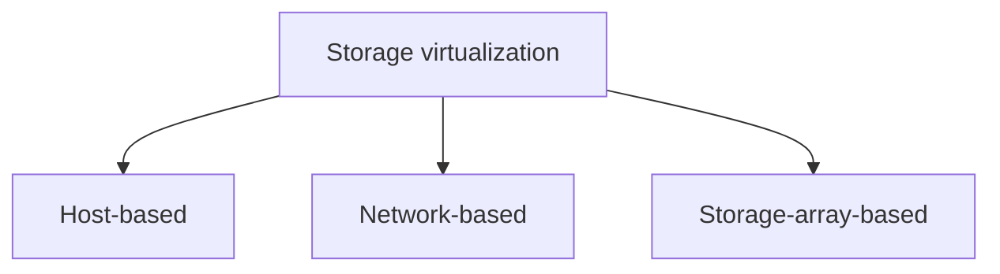

# Storage Virtualization

## 1. Overview

### A. Definition
> A technology that **logically integrates (abstracts)** physically distributed, heterogeneous storage resources and presents them to users and applications as a **single storage Pool**, independent of the physical configuration.

The core of storage virtualization is **decoupling physical storage devices from logical volumes**. Applications see only the logical volume, without needing to know on which disk or which vendor's device the actual data resides. Thanks to this decoupling, the logical view remains unchanged even when physical equipment is replaced, relocated, or expanded, making data movement transparent to applications. Just as server virtualization separates physical servers from VMs, storage virtualization separates physical disks from logical volumes.

### B. Background and Necessity
As enterprises grow and adopt storage from multiple vendors over time, each device has different management tools, creating **management silos**, and **utilization imbalance** arises, with some devices underused and others saturated. In addition, moving data at every equipment replacement required service downtime. Storage virtualization is needed to bundle heterogeneous resources into a single pool to achieve **integrated management and higher utilization**, to **optimize cost** through thin provisioning, and to provide **operational flexibility** through non-disruptive migration.

## 2. Types by Implementation Location

Types are divided according to **where the virtualization layer is placed**, which determines the trade-off among performance, heterogeneous integration, and vendor lock-in. The closer the virtualization point is to the server, the easier and cheaper it is to implement but the more load it places on the host; the closer it is to storage, the higher the performance and stability, but the more it is tied to a specific vendor.

- **Host-based**: The server OS volume manager (LVM, etc.) or software handles virtualization. It is **simple and low-cost to implement** without separate equipment, but because virtualization operations use server CPU, it loads the host and has limitations in scaling and integrated management across multiple servers.
- **Network-based**: A SAN switch or dedicated appliance performs virtualization **between (in-band/out-of-band)** servers and storage. Being independent of servers and storage, it is **best for heterogeneous integration and centralized management**, but the added layer makes configuration complex and can itself become a bottleneck or point of failure.
- **Storage-array-based**: The storage controller virtualizes on its own or with third-party storage attached behind it. Tightly coupled with hardware, it offers **high performance and stability**, but has the drawback of **lock-in** to that vendor's equipment.

| Type | Implementation location | Advantages | Disadvantages |
|---|---|---|---|
| **Host-based** | Server OS/LVM | Simple·low cost | Host load·limited scalability |
| **Network-based** | SAN switch·appliance | Excellent heterogeneous integration·central management | Complex configuration·separate point of failure |
| **Storage-based** | Storage controller | High performance·stability | Vendor lock-in |

## 3. Data Access Methods

Access to virtualized storage is divided into block and file according to the **unit** in which data is handled. This distinction governs performance and use case.

- **Block level (SAN)**: Handles data in **block units** without a file system concept. To the server it looks like a local disk, and with little overhead it provides **high performance and low latency**. It is suited to transaction-heavy **databases** and virtualization datastores.
- **File level (NAS)**: Access is by file system (NFS·SMB), making it easy for multiple clients to **share and collaborate on files**. It has more overhead than block but is suited to shared file servers and document storage.

| Category | Unit·protocol | Suitable use |
|---|---|---|
| **Block level** | Block (SAN, iSCSI/FC) | DB·high-performance transactions |
| **File level** | File (NAS, NFS/SMB) | File sharing·collaboration |

## 4. Key Technologies and Effects

Several storage efficiency technologies operate on top of the logical abstraction provided by virtualization. Notably, **thin provisioning** dynamically allocates physical space only for actual usage, greatly increasing utilization — for example, even if 1TB is allocated to a user, if only 100GB is actually used, only that much is physically consumed, reducing initial over-purchasing. **Automated tiering** analyzes access frequency and automatically places frequently used data (hot) on SSD and rarely used data (cold) on HDD, achieving both performance and cost.

| Technology | Principle | Effect |
|---|---|---|
| **Thin provisioning** | Dynamic allocation by usage | Utilization↑·initial cost↓ |
| **Automated Tiering** | SSD/HDD placement by access frequency | Performance·cost balance |
| **Non-disruptive migration** | Physical move while keeping logical view | Non-disruptive equipment replacement |
| **Snapshot·replication** | Point-in-time copy·remote replication | Backup·disaster recovery (DR) |

## 5. Considerations and Implications
- **Foundation of SDS and cloud**: Storage virtualization is the foundation of **SDS (Software Defined Storage)**, which separates control functions from hardware, and of cloud block and object storage.
- **Evolution to HCI**: In **hyper-converged infrastructure (HCI)**, compute, network, and storage are integrated and virtualized in software, bundling the local disks of standard x86 servers into a single distributed storage pool.
- **Trade-offs**: Because the virtualization layer can introduce performance overhead and a new single point of failure, the type must be chosen by weighing **performance, availability, and vendor lock-in**. For example, array-based is advantageous when maximum performance is needed, and network-based when heterogeneous integration is urgent.
- **Outlook**: It is expanding into NVMe-oF, object storage, and cloud-linked hybrid storage, with increasing emphasis on data mobility and automation.

---

> **In one line**: Storage virtualization *abstracts heterogeneous storage resources into a single logical pool (physical-logical decoupling)*, and through **host-, network-, and array-based** types, **block/file-level** access, and thin provisioning, automated tiering, and non-disruptive migration, it raises utilization and flexibility, serving as the foundation of SDS, HCI, and the cloud.
