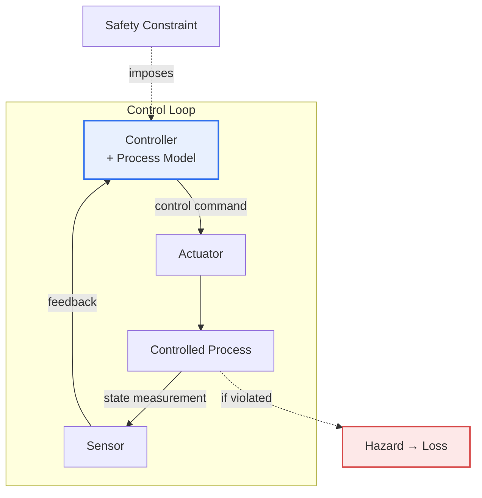
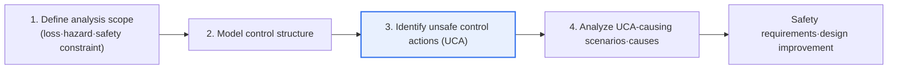

# STPA (System Theoretic Process Analysis) — Comparison with FMEA·HAZOP

## 1. Overview

### A. Concept and Background
> **STPA** is a Hazard Analysis technique based on systems theory that views accidents not as 'component failures' but as '**inadequate control that violates safety constraints (Unsafe Control Action)**', and derives hazards top-down from the system's control structure. It is rooted in **STAMP** (System-Theoretic Accident Model and Processes), the accident causality model proposed by Nancy Leveson of MIT.

The fundamental reason STPA emerged is that '**modern accidents arise more from problems of interaction and control than from component failures**.' To understand this background, one must first look at the assumptions on which traditional safety analysis rests. Classic techniques such as FMEA and HAZOP ask, 'What happens if this component fails?' Beneath this lies the assumption of Reliability Theory that **if each component is normal, the system is also safe**. This assumption was valid in the machine-centric era, when component failure was the dominant cause of accidents.

However, in complex systems where software integrates and controls multiple elements—such as autonomous driving, aviation, medical devices, and nuclear power—this assumption collapses. Even when all components operate normally to specification, accidents occur because of **incorrect interactions between components or control commands inappropriate to the situation**. For example, even if a sensor and a controller each pass individual testing, an accident occurs if the controller issues an inappropriate command due to a mistaken situational awareness (Process Model error). Software does not physically 'fail'—it behaves as designed, but that designed behavior is hazardous in a particular context. Therefore software risk cannot be explained by 'failure rates.'

STPA shifts perspective at this point. It redefines safety not as 'a state in which components do not fail' but as '**a state in which the system is controlled so as to continuously satisfy Safety Constraints**,' and views accidents as the result of that control failing. In other words, it treats safety as a **Control Problem**. Thanks to this shift, STPA uncovers not only component failures but also hazards that traditional techniques missed, such as inadequate requirements, controller situational-awareness errors, and human-automation interaction errors.

### B. Characteristics and Limitations of FMEA·HAZOP
FMEA and HAZOP are long-proven techniques, but they share common limitations. **FMEA** (Failure Mode and Effects Analysis) lists the Failure Modes of each component and analyzes their effects bottom-up, prioritizing by the RPN (Risk Priority Number), the product of severity, occurrence, and detection. **HAZOP** (Hazard and Operability Study) systematically finds Deviations from design intent by applying guidewords such as 'No', 'More', and 'Less' to process variables.

| Technique | Approach | Strengths | Limitations |
|---|---|---|---|
| **FMEA** | Bottom-up analysis of component failure modes·effects, RPN prioritization | Strong at quantifying individual component reliability | Focused on individual component failures; misses inter-component interaction·SW errors |
| **HAZOP** | Analysis of process design deviations using guidewords | Proven in chemical·process plants | Process-flow-centric; limited for complex control·SW logic |

The limitations of both techniques stem from the fact that their unit of analysis is the 'component (or process variable).' Because components are examined one at a time, interaction and control errors that occur even when all components are normal structurally fall outside the field of view. This is precisely the point STPA seeks to complement.

Historically, this limitation was revealed in actual major accidents. Analyses have accumulated showing that a substantial portion of accidents in software-controlled systems stemmed not from physical failures of individual components but from incomplete requirements, misunderstandings between operators and automation, or control commands inappropriate to the situation. Within the framework of FMEA and HAZOP, it is difficult to answer the question, 'Why did an accident occur when every component met its specification?'—and this very gap gave rise to the need for a new analysis technique grounded in systems theory.

## 2. The STAMP Accident Model and STPA's Position

To properly understand STPA, one must first look at its underlying theory, STAMP. STAMP views a system as a hierarchical control structure in which higher layers impose safety constraints on and control lower layers. Below is an overall structure diagram showing the relationship between the STAMP control loop and the safety constraints that STPA addresses.

STAMP has three core concepts. First, the **Control Structure** — the system is represented as a hierarchy of control loops composed of controllers, actuators, controlled processes, and sensors. Second, the **Process Model** — a controller holds an internal model of the controlled process's state and issues commands based on it; when this model diverges from reality (e.g., misjudging that an aircraft is in a landed state), inappropriate commands result. Third, **Safety Constraints** — conditions the system must uphold to prevent accidents; STPA traces when these constraints are violated. STAMP's insight is that many accidents in software-intensive systems are explained by 'process model errors,' which cannot be captured by component failure models.

## 3. STPA's Four-Step Analysis Method

STPA follows a top-down procedure that starts by defining losses and narrows down to concrete causal scenarios. Below is a detailed diagram of that process.

**A. Step 1 — Define the analysis scope.** First, define the **Losses** the system must never experience (e.g., loss of life, mission failure, asset damage), and identify system-level **Hazards** leading to those losses (e.g., 'the autonomous vehicle fails to maintain the minimum safe distance from the preceding vehicle'). Then invert each hazard to derive the **safety constraints** the system must uphold. This step is important because it anchors the analysis not on 'components' but on 'losses agreed upon by the organization and stakeholders,' so that all subsequent analysis is aligned with the outcomes that actually must be prevented.

**B. Step 2 — Model the control structure.** Model the system as control loops of controller-actuator-controlled process-sensor. Controllers may include not only software controllers but also human drivers, air traffic controllers, and higher-level management organizations. Placing humans and automation together within a single control structure is a strength of STPA, allowing Human-Automation Interaction errors to be handled naturally. For each control relationship, note which control commands are sent and which feedback returns.

**C. Step 3 — Identify Unsafe Control Actions (UCA).** For each control command, systematically examine in which contexts it violates a safety constraint, using four types. These four types are STPA's core tool.

| UCA type | Meaning | Example (autonomous braking) |
|---|---|---|
| **① Not provided** | Required control is not performed | No braking command despite an obstacle |
| **② Provided unsafely** | Hazardous control is performed | Sudden braking at high speed causes a rear-end collision |
| **③ Timing·order error** | Provided too early or too late, or in the wrong order | Braking too late fails to secure stopping distance |
| **④ Duration error** | Applied too long/short or stopped | Releasing brakes too early, causing re-acceleration |

**D. Step 4 — Scenario·cause analysis.** For each identified UCA, dig into 'why such control arises.' Causes fall broadly into two branches — process model errors inside the controller (mistaken situational awareness, algorithm defects, inadequate requirements), and problems in the control path (commands not delivered, feedback delayed or lost, sensor errors). The scenarios thus derived lead directly to **safety requirements** and **design improvements**. For example, the scenario 'sensor feedback delay causes late braking' is concretized into the requirement 'guarantee that feedback delay is bounded within T ms.'

What decisively distinguishes these four steps from traditional techniques is the 'endpoint of the analysis.' Whereas FMEA stops at quantitative indicators such as per-component failure probability and RPN, STPA passes through the concrete scenarios causing each UCA and arrives directly at verifiable safety requirements. In other words, STPA's output is not 'which component is hazardous' but 'which constraints the system must uphold under which conditions,' and this flows naturally into the design and verification stages, enabling safety to be controlled at the requirements level. In an actual autonomous driving case, if 'a perception error that misclassifies a stopped vehicle as background' is derived as a causal scenario for braking not provided (UCA ①), it is reflected as the requirement 'perform a safe stop if perception confidence falls below a threshold in specific situations.'

## 4. Comparison with Traditional Techniques and Practical Implications

The difference among the three techniques ultimately comes down to 'the unit of analysis and the accident model.' FMEA and HAZOP stand on reliability theory with components/processes as the unit, whereas STPA stands on systems theory with the control structure as the unit.

| Category | FMEA·HAZOP | STPA |
|---|---|---|
| **Perspective** | Component failure | System control·interaction |
| **Theoretical basis** | Reliability theory | Systems theory (STAMP) |
| **Analysis direction** | Bottom-up (FMEA)/deviation (HAZOP) | Top-down (loss→hazard→UCA) |
| **Strengths** | Quantifying individual failures | Interaction·SW·control·human error |
| **Suitable targets** | Hardware-centric systems | Complex·SW-intensive safety-critical systems |

Extending the reasons for these differences to their practical implications: FMEA quantifies component reliability well because probabilistic data in the form of failure rates exist per component, and for that very reason it is weak against software logic errors that are not expressed as probabilities. Conversely, STPA is strong against SW and interaction errors because it takes 'the adequacy of control actions,' not 'failures,' as its object of analysis, and in exchange it cannot directly produce quantitative indicators such as per-component failure probability. Therefore in practice the two are not set against each other — in safety-critical system certification, the established approach is to use STPA to uncover control and interaction hazards and establish safety requirements, and FMEA to quantitatively evaluate hardware component failures, running both in a mutually complementary way.

## 5. Advanced: Standards and Industry Application Trends

**A. Automotive — Autonomous driving and SOTIF.** Whereas the functional safety standard ISO 26262 addresses 'hazards due to component failure (malfunction),' the new problem in autonomous driving is 'hazards arising from limitations of the intended function or misperception even without failure.' The standard addressing this is ISO 21448 (SOTIF, Safety Of The Intended Functionality), in which STPA is widely used as a scenario-based hazard identification technique. This is because STPA captures well the process by which situational-awareness errors lead to unsafe control in the control loop spanning sensing, perception, decision, and control.

**B. Aviation, aerospace, and defense.** In the U.S. aerospace sector, STPA and STAMP have been practically adopted for safety analysis of large-scale systems, and related handbooks and case studies are publicly available. Because a control structure intertwining multiple automation systems and humans (pilots, controllers) can be handled in a single model, it shows strength in analyzing and preventing accidents originating from human-automation interaction. In particular, in complex systems involving multiple organizations and layers, the ability to include higher management and regulatory layers in the control structure is valued in domains such as aviation and defense, where organizational factors weigh heavily in accidents.

**C. Extension to security (STPA-Sec) and expected exam direction.** Recently, the **STPA-Sec** extension, which analyzes not only Safety but also Security threats from the same control structure perspective, is also being discussed. As an answer strategy from a Professional Engineer's perspective, depth can be demonstrated by ① clearly presenting the shift in accident model from 'component failure vs control·interaction,' ② explaining the conceptual link of STAMP–process model–safety constraint and the four UCA types with a concrete case (e.g., autonomous braking), and ③ extending to complementarity with FMEA·HAZOP, linkage with standards such as ISO 26262/21448, and the benefits of early-design application.

## 6. Considerations and Implications

From a Professional Engineer's perspective, STPA should be approached not as a matter of the superiority of individual techniques but as a question of how to structure a hazard analysis strategy suited to the system's complexity, safety requirement level, and existing certification framework. Below are the criteria for formulating that strategy.

1. **Complementary use is the principle.** STPA does not replace FMEA and HAZOP; it is a complement that comprehensively uncovers hazards by analyzing component failures (FMEA) and control/interaction errors (STPA) together. In safety-critical system certification, a strategy of running both families in parallel to fill each other's blind spots is desirable.

2. **Essential for software-intensive and autonomous systems.** In systems such as autonomous driving, aviation, and medical devices, where SW exerts complex control and interacts with people, hazards not explained by component failure alone (process model errors, inadequate requirements, human-automation interaction) are dominant, so STPA's control perspective is powerful.

3. **Early-design application is cost-effective.** Because STPA models the control structure, applying it at the requirements and architecture design stage allows the identified UCAs and scenarios to be reflected immediately as safety requirements, fundamentally preventing hazards. Since the cost of fixing defects rises sharply the later they are found in development, early application has a large economic effect.

4. **Design alignment with standards and quantification.** STPA is strong at 'identifying' hazards but does not directly produce quantitative indicators such as per-component failure probability. Therefore an integrated Safety Case should be built that aligns with standards frameworks such as ISO 26262 (functional safety) and ISO 21448 (SOTIF), supplementing the required quantitative evidence with FMEA and quantitative reliability analysis.

5. **Securing application capability and tools is key.** Because STPA requires a shift in perspective and an understanding of systems theory, analyst training, the team's learning curve, and tools supporting control structure modeling and UCA management determine the success of its adoption. Practical effect comes only when organizational internalization of the methodology and tool support are planned together.

## References
- Nancy Leveson, *Engineering a Safer World* (STAMP/STPA) — https://mitpress.mit.edu/9780262533690/engineering-a-safer-world/
- MIT PSAS, STPA Handbook — http://psas.scripts.mit.edu/home/materials/
- ISO 21448 (SOTIF) overview — https://www.iso.org/standard/77490.html

---

> **In one line**: STPA is a systems-theory (STAMP)-based hazard analysis that *views accidents not as component failures but as unsafe control (safety constraint violations)*; by deriving the four UCA types top-down from the control structure, it uncovers interaction, SW, and human errors missed by FMEA·HAZOP, and is used complementarily with traditional techniques in complex, safety-critical systems such as autonomous driving and aviation.
