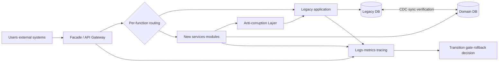
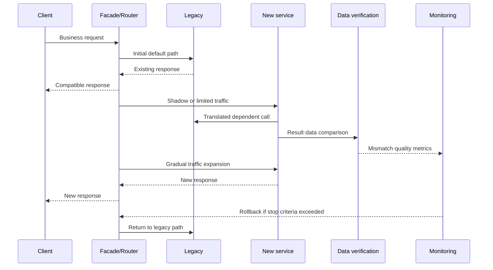

# Legacy Modernization Based on the Strangler Fig Pattern

## 1. Overview

> **Definition**: The Strangler Fig pattern is a modernization strategy that, instead of discarding and rewriting an existing legacy system all at once, places an intermediary layer in front of it, gradually migrates business functions in small units to a new system, and then progressively removes the legacy parts whose migration is complete.

In large-scale information systems, business rules, data, batches, external integrations, and operating procedures have accumulated over long periods, so simply translating source code into a new language does not modernize them.
Currently working functions contain undocumented rules and exceptions, multiple departments share the same database and interfaces, and even the manual actions taken when failures occur have become part of the business process.
Therefore, although a full rewrite looks attractive for applying new technology, it carries a high risk of missing hidden requirements or halting improvements to existing business during a long transition period.

The name Strangler Fig derives from the growth pattern of the strangler fig, which grows by enveloping its host tree.
In software, rather than killing the existing system immediately, new functionality starts at the edges of the existing system, and the scope of the new implementation widens each time a function is validated.
Users and external systems initially use the same interface, but the routing layer selectively sends requests to either the legacy or the new system.
Finally, once all business functions and data have been migrated and legacy dependencies removed, the intermediary layer and the legacy system are cleaned up together.

The essence of this pattern lies less in "the technique of building a new system" than in "the technique of making the unit of change small without disrupting business."
Each step must be independently deployed and observed, and must include a path to reverse a faulty migration.
It is also desirable to measure modernization progress not by lines of code but by migrated business capabilities, stability, user value, and reduction in legacy dependencies.

### 1.1 Background and Necessity

First, a legacy system is both a replacement target and the core operational foundation of the business.
Since the existing system cannot be stopped until the replacement system is complete, an approach of finalizing all requirements and switching over in bulk years later does not fit current business changes.
The incremental approach allows high-priority functions to be improved first while the existing system continues to provide service.

Second, it is difficult to fully understand the actual behavior of a legacy system.
Source code and design documents alone make it hard to discover special values in operational data, informal integrations with external agencies, and correction procedures performed by business staff.
By putting small functions into actual business flows, the team learns hidden rules during the transition and can revise subsequent migration plans.

Third, investment and results need to be verified incrementally.
A full rewrite invests large costs up front and learns of success only at the end, whereas the Strangler Fig delivers working results at every step.
Thus executives can periodically assess changes in risk, cost, and user value and choose to continue, stop, or pivot.

### 1.2 Goals and Design Principles

The first goal of the Strangler Fig is zero- or low-downtime transition.
Because the internal implementation must change while preserving existing contracts and user experience, the external interface and internal service boundaries are separated.

The second goal is reversibility at the function level.
Routing must be revertible so that a failure in a new function does not spread to the whole service, and data changes must have recovery and reprocessing procedures.

The third goal is clarity of boundaries.
Migration units are determined based on business capability, data ownership, and transaction scope, and a translation boundary is placed so that the new system does not carry over legacy data structures and terminology as-is.

The fourth goal is the final removal of the legacy.
If the intermediary layer is left as permanent complexity, the system becomes a new monolith combining legacy and new systems.
Therefore, completion criteria, removal timing, owners, and budget are defined from the outset, and expiration conditions are assigned to temporary adapters and routing rules.

## 2. Structure and Key Components

The Strangler Fig pattern is not a structure that simply adds a single proxy.
It comprises a routing layer between clients and the system, services providing new functionality, a translation layer between legacy and new systems, a data synchronization and verification framework, and observability and transition control functions.

### 2.1 Facade or Routing Layer

The facade separates the touchpoint seen by existing clients from the location of the internal implementation.
Initially most requests are forwarded to the legacy, and only requests for functions whose migration is complete are sent to the new service.
This allows internal ownership of functions to move without clients changing the addresses they call.

Routing criteria are not limited to URLs alone.
Function, version, tenant, region, user group, traffic ratio, and feature flags can be combined, and high-risk changes begin with internal staff or a portion of traffic.
However, if routing rules become mixed with business rules, the facade becomes a new giant system, so the responsibilities of technical routing and business decisions must be separated.

The facade easily becomes a single point of failure and bottleneck.
It should scale horizontally as a stateless component, manage the versions of rule deployments and cache invalidation methods, and define a safe default path in case the facade itself fails.
Every routing decision should log the target version, rule version, and scope of user impact so that, in case of failure, one can reproduce which requests went to which system.

### 2.2 New Services and Feature Slices

It is better to cut migration units by business capability rather than by technical layer.
For example, in an order system, rather than moving screens, controllers, services, and tables all at once, define a user-understandable flow such as "change shipping address" or "view order status" as one slice.
A feature slice carries its input contract, output contract, data ownership, error handling, and operational metrics together.

There is no need to split every domain into microservices from the start.
The new implementation may be a modular monolith or independent services per function.
The important criterion is whether the boundaries of deployment and ownership are clear and do not obstruct the next migration unit.

### 2.3 Anti-corruption Layer

Legacy and new systems may use the same words yet differ in meaning and data format.
The legacy might store `고객등급=3` (customer grade = 3) while the new system uses an explicit enumeration `SILVER`, and a single legacy order status may be split into several states in the new system.
The anti-corruption layer translates these differences so that the legacy's data structures, error codes, and transaction practices do not contaminate the new system's model.

This layer goes beyond simple DTO mapping to include contract translation, unit and time-zone conversion, translation of error semantics, retries and timeouts, and idempotency handling.
Translation rules are managed as testable code and versioned contracts, and static checks verify whether legacy terms are used directly inside the new system.

### 2.4 Data Stores and Synchronization

Even if application functions are moved, if the data remains in the central legacy database, the system's coupling continues.
However, separating the database from the start sharply escalates synchronization and consistency problems, so read and write responsibilities are moved step by step.

In the initial stage the new service may read legacy tables, but the period during which new code depends directly on the legacy schema is limited.
In the next stage, domain data is replicated to a new store, and counts, totals, hashes, and business invariants between source and replicated data are verified.
Once verification is complete, the new store is designated as the system of record, and the legacy is provided only with the necessary compatibility data.

| Component | Primary responsibility | Key controls |
|---|---|---|
| Facade·gateway | Distributes requests to legacy and new systems | Rule versioning, failure bypass, access control |
| New feature slice | Executes migrated business capabilities | Contract testing, feature flags, independent deployment |
| Anti-corruption layer | Translates model·contract·error semantics | Mapping versions, translation tests, idempotency |
| Synchronization pipeline | Delivers data between source and new store | CDC, reprocessing, ordering·duplication control |
| Observability layer | Measures transition results and operational risk | Distributed tracing, SLO, per-function comparison |
| Removal plan | Ends legacy dependencies | Confirm zero usage, retention·disposal approval |

The items in the table are not a list of independent products but form a single transition control plane.
For example, if routing has switched to the new service but data synchronization lag is not measured, users may receive stale query results.
Conversely, even if data is separated first, if the facade's transition rules are not ready, results from the new store cannot be exposed to actual business.
Therefore the readiness of routing, translation, data, and observability must be assessed together for each function.

## 3. Incremental Transition Procedure

### 3.1 Goals and Current-State Diagnosis

Before modernizing, define not "we will change the technology" but which business outcomes are to be improved.
Set priorities among response time, release cycle, failure recovery time, regulatory compliance, operating cost, and scalability, and secure quantifiable baselines.

Do not estimate the legacy's call relationships and data flows by static analysis alone; supplement it with actual logs, traces, batch histories, and interviews with owners.
Assessing per-function usage, revenue and regulatory impact, change difficulty, coupling, and data sensitivity together makes it possible to prioritize migration candidates.

### 3.2 Selecting Boundaries and the First Slice

The first migration target should be a function with high learning value and limited failure scope rather than the most complex function.
Choose a function with clear business value, observable call boundaries, and explainable data ownership.
Areas with high failure costs, such as atomic transactions in core payments, are addressed after sufficient guardrails are in place.

"One screen" is an insufficient criterion when selecting a function.
It must be confirmed whether input validation, authorization, data changes, asynchronous events, notifications, audit logs, and batch follow-up processing are all included in one business capability.
If the boundary is wrong, one function repeatedly calls both systems, ultimately creating distributed transactions more complex than before.

### 3.3 Introducing the Facade and Contracts

Install the facade between clients and the legacy, but initially forward all requests to the legacy to verify that behavior does not change.
This step is not a function migration but the step of building the foundation for observability and control.
Request/response schemas, authentication principals, latency, error rates, and retry counts are compared with the baseline.

Next, define the new service's contract.
A contract includes not merely a list of JSON fields but also field meaning, mandatoriness, units, sorting/paging, error codes, idempotency, and personal data masking rules.
Consumer-driven contract tests and compatibility checks ensure that one side's deployment does not break the other side's calls.

### 3.4 Function Implementation and Parallel Verification

The new function uses the necessary legacy data and services through adapters but does not copy the legacy's internal calls as-is.
Once implementation is complete, shadow traffic or read comparison is used to compare new results with legacy results before exposing them to users.
Comparison must not be judged by exact string match alone; it must distinguish whether results are equivalent from a business standpoint and whether differences are acceptable rounding or ordering differences.

Write functions are riskier than reads.
Initially, have the new service perform only validation and calculation while the legacy handles the actual write, or use dual writes while handling duplication and order inversion.
Because the success criterion for dual writes means both systems have recorded the data, consistency debt accumulates unless compensating tasks and operations queues for partial failures are designed.

### 3.5 Traffic Transition and Stabilization

Transition is not a single switch but a gradual expansion.
It can expand in the order of internal users, test tenants, small traffic, specific regions, and full traffic, with observation periods between stages.
Each stage has stop criteria for acceptable error rate, latency, business success rate, and data mismatch rate.

Feature flags help with rapid transition and rollback, but flags that never expire complicate code and operational paths.
Manage flag owners, expiration dates, default values, emergency release authority, and change audit logs, and always remove flags after the transition is complete.

### 3.6 Legacy Removal and Post-Verification

Just because the new system operates normally does not mean legacy tables and code are deleted immediately.
Confirm whether call volume has been zero for a certain period, whether no batches, external integrations, or admin tools remain, and whether audit and retention obligations are satisfied.
Before deletion, verify backup recovery and rollback capability, and distinguish, with legal and privacy officers, the data to be retained from the data to be discarded.

Even after removal, confirm that users and the operations team understand the metrics of the new path.
Completion of modernization means not the moment of code deletion but the state in which owners, operating procedures, incident response, and security controls have been transferred to the new system.

## 4. Data Modernization and Consistency Design

### 4.1 Risks of a Shared Database

When multiple services directly read and write the same tables, the table structure becomes a de facto public API.
If the new system modifies legacy tables, other batches and reports are affected, and it becomes hard to trace which service changed a value.
Therefore, during migration, table access is progressively wrapped in service APIs or events, and a list of direct accessors and a retirement schedule are managed.

Even when a shared database cannot be separated immediately, owners for reads and writes can be designated.
If only one system handles writes for a specific domain and other systems access it through events or read models, the causes of conflict can be narrowed.
At this point, the freshness target for data and whether temporary inconsistency is acceptable from a business standpoint must be specified.

### 4.2 CDC and Event-Based Synchronization

Change Data Capture (CDC) reads database logs or change events and delivers them to a new store.
It can make loss monitoring and reprocessing easier than scattering synchronization logic across application code, but propagation of deletions, schema changes, transaction ordering, and sensitive information must be controlled together.

In event-based synchronization, the meaning and schema of events are version-controlled.
Consumers must be able to apply an event only once even if duplicates are received, and order-sensitive business must have per-key ordering and a policy for handling late events.
Infinitely retrying failed events amplifies failures, so a quarantine queue and operator reprocessing procedure are provided.

### 4.3 Dual Reads and Dual Writes

Dual reads are useful for comparing the results of two systems but increase user request latency and load.
Comparison requests are performed asynchronously or sampled, and results containing personal data are masked or hashed so that originals are not left in comparison logs.

Dual writes help verify data consistency but are not distributed transactions.
If one side's write succeeds and the other fails, compensating events, reprocessing queues, operator confirmation, and recovery scenarios based on the source system are needed.
Where possible, a structure that maintains a single source and updates derived stores via events makes the boundary of responsibility clear.

| Data stage | Read path | Write path | Rollback difficulty | Purpose |
|---|---|---|---|---|
| Initial observation | Legacy | Legacy | Low | Baseline·understand call relationships |
| Shadow verification | Legacy+new comparison | Legacy | Low~medium | Verify results·performance |
| Limited transition | New first, legacy on failure | Single source or controlled dual write | Medium | Learn from real traffic |
| Domain ownership transfer | New | New | Medium~high | Confirm new system as system of record |
| Legacy removal | New | New | High | End dependencies and reduce cost |

Defining rollback at each stage merely as "reverting to the previous routing" is insufficient.
It must also be decided whether changes already recorded in the new store must be returned to the legacy, whether it is safe to reprocess requests that appeared successful to users, and whether events will not be published twice.
In particular, after ownership of source data has been transferred, forward recovery is often safer than rollback, so reversibility and recovery objectives are distinguished for each stage.

## 5. Comparison with Existing Transition Strategies

A full rewrite (Big Bang) completes the new system and switches over all at once.
It can be easy to manage when the structure is simple, the transition deadline is short, and the legacy has few external dependencies.
However, during long development it is hard to confirm user feedback through actual operation, and at the final cutover hidden differences and data problems are encountered all at once.

Parallel Run runs the old and new systems together for a certain period and compares results.
It is useful when verifying results for identical inputs matters, such as risky calculations or regulatory reports, but the cost of feeding inputs to both systems and reconciling results is high.
The Strangler Fig can use parallel running in part, but rather than running in parallel after completing the entire system, it applies it on a small scope per function.

Lift and Shift moves only the infrastructure without significantly changing the existing structure.
It can reduce operational disruption and infrastructure aging risk, but application coupling and deployment bottlenecks may remain.
In contrast, the Strangler Fig can pursue infrastructure migration together with redesign of application and data boundaries, but temporary structures and operational complexity increase.

| Category | Full rewrite | Lift and Shift | Strangler Fig |
|---|---|---|---|
| Transition unit | Entire system | Infrastructure·deployment unit | Business function·domain unit |
| Initial value | Occurs late | Right after infrastructure migration | Occurs upon completion of each slice |
| Business disruption risk | High | Medium | Relatively low |
| Temporary complexity | Large during development | Relatively low | High due to facade·synchronization |
| Learning hidden requirements | Concentrated late | Limited | Learned at every stage |
| Data design change | Pursued all at once | Almost none | Pursued incrementally |
| Success conditions | Full completion·bulk verification | Stabilization after migration | Boundaries·observability·removal plan |

In this comparison the Strangler Fig is not always superior.
When a small, independent system must be replaced quickly or the original system must be discarded immediately due to regulation, gradual coexistence may actually be disadvantageous.
Conversely, in environments like large-scale business systems where disruption costs are high and requirements keep changing, the rationale for accepting initial temporary costs grows.

## 6. Application Case: Incremental Transition of an Order and Delivery Platform

The following is not the actual track record of a specific company but an illustrative scenario for writing a Professional Engineer exam answer.
Assume an order and delivery platform uses an old monolithic application and a single relational database, and must quickly support a new mobile channel and region-specific delivery rules.

In the first stage, the team installs the facade and observes order inquiry traffic.
Order creation remains in the legacy, and only inquiry requests are forwarded in shadow mode to a new inquiry service to compare status, amount, and shipping address masking results.
At this point, before moving any function, the legacy's actual response time distribution and error types are established as a baseline.

In the second stage, a read model for order inquiry is built in the new store.
Changes to the legacy order table are delivered via CDC, and the last event time and version per order are recorded.
If new inquiry results are delayed or inconsistent, they are not exposed to users, the legacy path is maintained, and mismatched records are sent to an operations queue.

In the third stage, the shipping address change function is migrated.
Address normalization, authorization verification, and deliverable-region determination are performed by the new service, and order status changes invoke the legacy's single write path through an explicit contract.
By preventing the new system from directly modifying the legacy's internal tables, a boundary is created that allows write ownership of the order domain to be moved later.

In the fourth stage, order creation traffic is gradually transitioned for new regions.
To prevent duplicate orders, the client request key and business key are used together as the idempotency key, so that router retries do not create the same order twice.
Correlation IDs for order creation results, payment approval, inventory deduction, and delivery events are propagated across all segments.

In the fifth stage, fault injection and recovery drills are performed.
CDC lag, new store failure, router rule errors, legacy call timeouts, and event duplication are made into scenarios to measure actual rollback time and data recovery time.
If the measured results meet the targets, the region and traffic scope are expanded; if not, the feature flag is reverted and the causes are addressed.

Finally, confirm that usage of the legacy order inquiry table and related batches is zero, archive audit and retention data separately, and then retire the domain tables.
Remove the order-related code remaining in the legacy application and the facade rules, avoiding a fake completion state that "routes to the new service but internally calls the legacy."

## 7. Risk Factors and Control Measures

### 7.1 Permanence of Temporary Structures

The facade and anti-corruption layer enable migration, but without a removal schedule they become permanent translation costs and points of failure.
All temporary components are tagged with owner, creation date, dependent functions, removal conditions, and expiration date.
In quarterly architecture reviews, actual traffic and code references are checked, and removal work is managed with the same priority as regular feature development.

### 7.2 Data Inconsistency and Rollback Failure

If the new system returns a success response but data synchronization fails, users may see different results after reconnecting.
Designate a single data owner, handle event ordering, duplication, and delay, and audit consistency metrics and reprocessing results.
Document, per domain, up to what point routing can be reverted and what forward corrections will be made afterward.

### 7.3 Performance Bottlenecks and Failure Propagation

If the facade inspects and translates every request, latency accumulates, and comparison requests calling both legacy and new systems double the load.
Apply per-path timeouts, circuit breakers, bulkheads, and asynchronous comparison, and confirm maximum concurrent requests and peak load through capacity tests at each transition stage.
Observability is designed around percentile latency and business failure rates rather than averages.

### 7.4 Breaks in Security and Privacy Controls

If the legacy's authentication, authorization, masking, and audit logs are missed while moving functions to the new service, the function may work but the control level drops.
Review the new service's data classification, least privilege, secrets management, encryption, and access logs at the design stage, and test whether authorization decisions in legacy and new systems have the same meaning.
Sensitive values such as resident registration numbers and payment information are not left in plaintext in shadow traffic logs.

### 7.5 Misalignment of Organization and Responsibility

Function migration changes inter-team ownership and business processes.
If only the development team carries out modernization and operations, security, data, and business stakeholders join late, bottlenecks arise in incident response and change approval after the transition is complete.
Organize the decision-making authority of the product owner, domain owner, platform team, data steward, and security/audit officers in a RACI, and set common success metrics.

## 8. Advanced: Modernization Portfolio and Measurement Framework

If the Strangler Fig is managed only as a single project schedule, it is easy to focus on increasing the number of migrated functions.
From a Professional Engineer's perspective, the portfolio of modernization targets should be evaluated along the axes of value, risk, coupling, regulation, and change frequency, and each domain's target architecture should be linked to the transition order.

Function priority is not simply in order of difficulty.
Functions with high customer value and frequent changes offer large learning effects for the new system, but if coupling is excessively high they may be unsuitable as first candidates.
Conversely, functions that are highly independent but low in value can be used as practice targets to reduce risk, so learning and value are balanced across the entire portfolio.

Operational metrics are organized in four layers.
The first is technical metrics: availability, error rate, latency, and throughput.
The second is data metrics: synchronization lag, mismatch count, duplicate events, and reprocessing success rate.
The third is business metrics: order success rate, settlement accuracy, business processing time, and user churn.
The fourth is transition metrics: legacy call ratio, new function ratio, number of temporary adapters, and number of tables/batches removed.

These metrics are gathered on a single dashboard but must use denominators with the same meaning.
For example, success cannot be judged solely because the new system's error rate is low; one must also look at the proportion of requests the router sent to the new system that were diverted to legacy retries, and the final business success rate.
Stop criteria for transition stages are agreed in advance, and when exceeded, automatic or approval-based rollback is executed.

Architecture Decision Records (ADR) capture why this function was chosen first, which data ownership and consistency model was adopted, and when the facade will be removed.
These records let the team reconfirm the intent and trade-offs of the transition when the team changes or an operational failure occurs.
In addition, common principles and prohibition rules are reflected in code checks and design reviews so that new services do not recreate the same coupling as the legacy.

## 9. Considerations and Implications

### 9.1 Business-Boundary-First Design

Cutting by technical layer or team organization keeps data ownership and transactions entangled.
Boundaries should be set based on business capability and reasons for change, and an owner and success metrics should be assigned to each boundary.

### 9.2 Distinguishing Reversibility from Forward Recovery

Assuming every change can be restored underestimates the reality after data migration.
Routing rollback, code rollback, data rollback, and business compensation are different means, so the feasible scope of each should be tested per stage, and forward correction procedures prepared where rollback is impossible.

### 9.3 No Incremental Transition Without Observability

Increasing traffic based solely on developers' judgment that the new system works well can miss users' actual errors and data delays.
Distributed tracing, structured logs, per-function SLOs, data consistency verification, and business KPIs must be prepared before the transition.

### 9.4 Lifecycle Management of Temporary Components

Facades, adapters, dual writes, and synchronization pipelines can become technical debt, so they are registered like regular assets and their expiration dates and removal conditions are managed.
Include legacy code deletion and routing rule removal in the modernization completion review to distinguish "a new system was added" from "the legacy was replaced."

### 9.5 Ensuring Equivalence of Security and Privacy

When functions move to the new system, the control levels of authentication, authorization, encryption, masking, and auditing must not decrease.
Compare the policies of both systems, block exposure of sensitive data in test data and shadow logs, and reflect data retention and disposal obligations in the transition plan.

### 9.6 Simultaneous Change in Organization and Operating Model

If only the new architecture is introduced while the team's deployment authority, incident response, and product decision-making structures remain unchanged, the root causes of the legacy can recur.
Design domain-centric ownership, automated deployment and testing, and operational feedback loops together so that modernization becomes a sustainable way of working rather than a one-off project.

### 9.7 Judging Unsuitable Situations

If there is no touchpoint to intercept requests, no time to allow coexistence of legacy and new systems, or the system is small and independent, full replacement may be more reasonable.
Do not select the pattern as a trendy architecture; decide by comparing transition period, data risk, disruption cost, and the feasibility of final removal.

## References

- Martin Fowler, "Strangler Fig": https://martinfowler.com/bliki/StranglerFigApplication.html
- Microsoft Azure Architecture Center, "Strangler Fig pattern": https://learn.microsoft.com/en-us/azure/architecture/patterns/strangler-fig
- AWS Prescriptive Guidance, "Strangler Fig pattern": https://docs.aws.amazon.com/prescriptive-guidance/latest/modernization-strangler-fig-pattern/introduction.html

---

> **In one line**: The Strangler Fig pattern is a modernization strategy that gradually replaces a legacy system without business disruption through a facade, feature slices, data verification, and reversible transitions, and in the end removes even the temporary structures.
