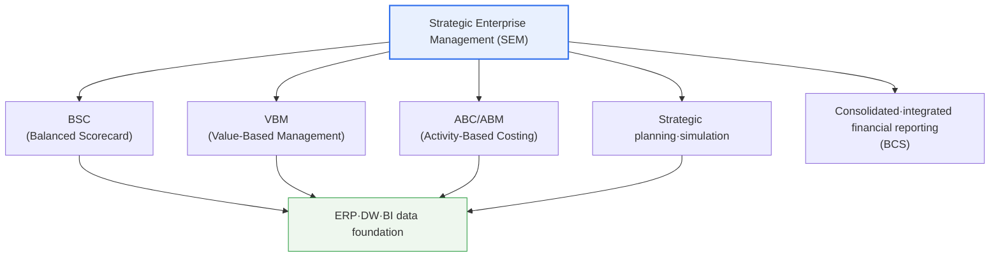
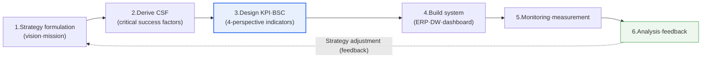

# Strategic Enterprise Management (SEM)

## 1. Overview

### A. Definition
> SEM is a management technique—and the system that implements it—that **integrates and supports the entire process from strategy formulation through execution, performance measurement, and feedback via information systems**, systematically managing the achievement of strategic goals. Its essence is translating abstract strategy into actionable indicators (KPIs) and concrete activities, and tracking and feeding back their progress with data.

The fundamental background to SEM's emergence was the long-standing management problem that '**good strategies repeatedly fail at the execution stage**.' No matter how excellent a strategy executives devise, if it is not connected to concrete field activities and performance measurement, it ends up as a slogan in a frame on the conference room wall. Indeed, much management research points out that a substantial part of strategy failure stems not from flaws in the strategy itself but from 'failure of execution.' As Kaplan and Norton observed, in many organizations the majority of members do not properly understand their company's strategy, budgeting and incentive systems operate separately from strategy, and even executives do not spend enough time reviewing the status of strategy execution.

SEM was devised precisely to bridge this '**strategy-execution gap**.' As ERP adoption spread in the late 1990s, vast amounts of operational data accumulated within enterprises, and the need grew to reinterpret this data from a strategic perspective and link it to executive decision-making. The term was popularized when SAP released a product suite called 'SEM,' but conceptually its core is the integration of strategic management techniques such as BSC, VBM, and ABC into information systems. In other words, SEM is closer to a management paradigm of "managing strategy with data" than to a specific product.

### B. Background and Necessity
The more complex and rapidly changing the business environment, the slower the response of after-the-fact management relying on executives' intuition and year-end financial reports. In an environment where markets, competition, and regulation change in real time, the capability to continuously track strategy execution and, as soon as a gap between targets and actuals is detected, analyze the causes and adjust strategy determines competitiveness. SEM provides the **infrastructure for data-driven strategy execution and feedback**.

In particular, the recognition that lagging indicators such as financial statements alone cannot predict or drive a company's future performance underpins the need for SEM. This quarter's revenue is merely the 'result' of customer satisfaction, process quality, and investment in employee capability over several past quarters. SEM helps manage the activities that cause financial performance before it deteriorates by measuring such leading indicators in a balanced way. This is what distinguishes SEM from a simple financial management system or BI tool.

## 2. Components

SEM integrates multiple strategic management techniques into information systems, with each technique responsible for a different aspect of strategic management. The conceptual diagram below shows the core techniques that constitute SEM and their relationships.

The **BSC (Balanced Scorecard)** is the central axis of SEM. It measures strategy in a balanced way from four perspectives—financial, customer, internal process, and learning & growth—preventing fixation on short-term financial performance alone. For example, the financial-perspective goal of 'revenue growth' is causally linked to leading factors such as 'customer satisfaction' in the customer perspective, 'on-time delivery rate' in the process perspective, and 'employee proficiency' in the learning & growth perspective. The BSC visualizes the goals of these four perspectives as a **Strategy Map**, showing at a glance how lower-level activities lead to final financial performance.

**VBM (Value-Based Management)** is a technique that makes maximizing enterprise value the criterion for every decision. Its representative metric, **EVA (Economic Value Added)**, is calculated by subtracting the cost of capital on invested capital from net operating profit after tax, reflecting the view that even if there is an accounting profit, failing to exceed the cost of capital effectively destroys value. For example, even if a business unit earns 10 billion won in net operating profit after tax, subtracting a capital cost of 12 billion won—obtained by applying a cost-of-capital rate (WACC) of 12% to invested capital of 100 billion won—yields an EVA of −2 billion won. In other words, it is in the black on an accounting basis, but from the perspective of the shareholders providing capital, it has destroyed 2 billion won of value. VBM thus optimizes resource allocation by distinguishing, per business unit and project, where genuine value is created and where capital is consumed.

**ABC/ABM (Activity-Based Costing/Management)** traces costs by 'activity' rather than by product or department. Traditional costing allocates overhead by a single basis such as revenue or headcount, distorting actual costs, whereas ABC allocates the resources consumed by each activity causally, revealing which products, customers, and channels actually make money and where costs leak.

For example, a customer with large revenue who demands frequent small orders, returns, and special deliveries may look like a premium customer under traditional costing, but may actually be a loss-making customer when activity costs are allocated via ABC. ABM (Activity-Based Management) uses such analysis to eliminate or improve non-value-added activities and rebalance the portfolio of low-profitability products and customers. In this way, ABC/ABM becomes the foundation supplying accurate cost information to VBM's value judgments and BSC's process perspective.

**Strategic Planning & Simulation (BPS, Business Planning & Simulation)** formulates and validates plans on a scenario basis. Through 'What-if' analysis, it predicts the financial consequences of strategy by varying assumptions such as exchange rates, raw material prices, and demand fluctuations, and continuously updates plans via rolling forecasts. Unlike the traditional annual budget, which once finalized is rigidly maintained even as the environment changes, BPS periodically updates forecasts to reduce the gap between plan and execution. The fact that these four techniques are not independent but interlock on a single data foundation demonstrates SEM's integrative character.

| Component | Domain | Representative metrics·outputs |
|---|---|---|
| **BSC** | Balanced 4-perspective performance measurement, strategy visualization | KPI, strategy map |
| **VBM** | Enterprise-value-centered decision-making | EVA, ROIC, MVA |
| **ABC/ABM** | Activity-level cost analysis·improvement | Activity cost, cost driver |
| **Strategic simulation (BPS)** | Scenario planning·forecasting | What-if, rolling forecast |

## 3. Implementation Approach and Procedure

The key to building SEM is translating the abstract vision into measurable indicators by cascading down step by step, and creating a closed loop that connects those indicators to actual data for automatic tracking and feedback. Below is a conceptual diagram of that procedure.

First, in the **strategy formulation** stage, the vision, mission, and mid- to long-term strategic goals are defined. At this point, strategy must be expressed not as a declarative slogan but as a concrete logic (strategy map) of "to whom, what value, delivered how, to produce what financial performance," so that it can be converted into indicators in later stages.

Next, the **Critical Success Factors (CSF)** decisive for achieving each strategic goal are derived. For example, if the goal is 'strengthening customer loyalty,' factors such as 'prompt after-sales response' and 'personalized service' become CSFs. The CSFs are then converted into **KPIs (Key Performance Indicators)** that measure them quantitatively and placed in the four BSC perspectives. In this process, too many KPIs blur focus, and imposing uncontrollable indicators on owners invites resistance, so a design that concentrates on a few core indicators and clarifies accountability is important.

In the **system build** stage, dashboards and reporting frameworks are created that automatically calculate KPIs by linking to data sources such as ERP and data warehouses (DW). This automation determines SEM's success or failure. If owners must aggregate indicator values monthly in manual spreadsheets, SEM soon degenerates into a formal reporting procedure, and the reliability and timeliness of the data collapse. Finally, a cycle is established that **monitors and measures** performance, **analyzes** the gap against targets, and **feeds back** the results into the next strategy formulation.

Here it is important to distinguish the nature of feedback. Adjusting activities by looking at the gap between target and actual is **single-loop learning** within a fixed strategy. However, poor performance may be caused not by execution but by the strategy's premises themselves being wrong. For example, if the assumption that 'raising customer satisfaction increases revenue' is not supported by data, rather than working harder on activities, the causal hypothesis of the strategy map itself must be revised. Supporting such **double-loop learning**, which questions the premises of strategy, is what distinguishes SEM from a simple performance measurement tool. A well-designed SEM provides a venue for organizational learning in which regular strategy review meetings verify, based on KPI data, "whether our strategic hypotheses are still valid," and update the strategy itself when necessary.

| Procedure | Key content | Output |
|---|---|---|
| **1. Strategy formulation** | Define vision·mission·strategic goals | Strategy map |
| **2. Derive CSF** | Identify critical success factors per goal | CSF list |
| **3. Design KPI·BSC** | 4-perspective indicators·targets·initiatives | Scorecard |
| **4. Build system** | ERP·DW integration, dashboards | SEM system |
| **5~6. Monitoring·feedback** | Performance measurement·analysis, strategy adjustment | Performance report |

## 4. Comparison with Similar Concepts and Application Cases

SEM is often confused with ERP, BI, and EPM (Enterprise Performance Management). If **ERP** is a system that 'processes operational transactions' such as orders, production, and accounting, SEM is the upper layer that 'interprets and manages' that operational data from a strategic perspective. **BI** is an analysis tool for querying and visualizing data and serves as a means of implementing SEM, but BI itself does not embed strategic management methodologies such as BSC and strategy maps. In today's commercial market, a concept essentially identical to SEM is called **EPM/CPM (Corporate Performance Management)**, which has evolved into an integrated platform covering planning and budgeting (FP&A), consolidated closing, and performance management.

The practical implications of the difference between the two approaches are clear. An organization equipped only with ERP and BI has plenty of data but struggles to answer the question, "So is our strategy being executed well?" SEM makes this question answerable by adding the methodology that links data to strategic goals.

| Category | Primary purpose | Time perspective | Embedded methodology |
|---|---|---|---|
| **ERP** | Operational transaction processing (orders·production·accounting) | Present (real-time processing) | Business processes |
| **BI** | Data querying·visualization·analysis | Past·present | None (tool) |
| **SEM/EPM** | Strategy execution·performance management·planning | Past~future (forecasting·feedback) | BSC·VBM·ABC·planning |

As the table shows, the three systems are not substitutes but hierarchical complements. ERP creates reliable operational data, BI processes and visualizes it, and SEM/EPM adds strategic methodology to connect it to decision-making. Therefore SEM adoption is most effective when layered on top of mature ERP and BI foundations.

As a concrete case, a U.S. oil company introduced by Kaplan and Norton (Mobil's North American Marketing & Refining division) is well known for having leapt from the industry's lowest to highest profitability within several years of adopting the BSC. The key lay in realigning the entire organization's activities by linking the customer segment wanting not 'fuel itself' but 'add-on services such as convenience stores and fast payment' into a causal chain across the financial-customer-process-learning perspectives. The skeleton of that causal chain was the top-level financial goal of 'improving return on capital employed (ROCE)' cascading down to 'target customer satisfaction' and 'strengthening dealer relationships' in the customer perspective, then to 'safety·quality' and 'new product development' in the process perspective, and finally to 'employee capability and strategic awareness' in the learning & growth perspective.

In Korea as well, many large corporations and public institutions have adopted BSC-based performance management, accumulating cases in which strategic goals are cascaded down to business-unit and individual KPIs and linked with incentive systems. Public institutions in particular have extensively used BSC-type performance indicators in conjunction with the Ministry of Economy and Finance's management evaluation system. However, mechanically linking KPIs only to incentive pay can induce indicator manipulation and short-termism, so a design that balances this with learning and improvement purposes is cited as a success factor. A common observation across many cases is that the decisive difference between successful and failed organizations is not the sophistication of the system but whether executives actually used SEM data in regular strategy dialogues.

## 5. Advanced — Latest Trends and Direction of Evolution

First, SEM is shifting its center of gravity from 'measuring' past performance to 'predicting' the future. With advances in data and AI technology, going beyond simple KPI dashboards, **predictive/prescriptive analytics** that forecast demand, revenue, and risk and propose optimal scenarios are being integrated into SEM. Combined with rolling forecasts, this approach overcomes the rigidity of once-a-year budgeting and enables 'continuous planning' that constantly responds to environmental change.

Second, the **integration of ESG and sustainability metrics** is prominent. Whereas traditional SEM was finance-centric, it is now expanding toward incorporating non-financial indicators such as carbon emissions, diversity, and governance into the BSC and managing them together with enterprise value. As measurement and reporting of ESG data become regulatory requirements due to the EU's CSRD and strengthened disclosure obligations domestically and abroad, SEM/EPM platforms are trending toward serving as the infrastructure for ESG performance management.

Third, the **transition to cloud EPM** is accelerating. SEM, formerly on-premises-centric, is moving to SaaS-type EPM (e.g., cloud-based planning and consolidation solutions), supporting shorter implementation periods and real-time collaborative planning. From a Professional Engineer's perspective, rather than tool selection, it is necessary to emphasize that phased adoption matched to the organization's strategic management maturity and data governance level is the key to success.

Fourth, **integration beyond departmental silos (xP&A)** is emphasized. In the past, financial planning, sales planning, workforce planning, and supply chain planning were formulated by different departments with separate tools, frequently causing mismatched assumptions. Recent Extended Planning & Analysis connects them in a single data model so that changes in the sales plan are immediately reflected in workforce, financial, and supply chain plans. This is an attempt to realize the 'enterprise-wide alignment' SEM has pursued from the planning stage onward, and together with predictive analytics and ESG integration, it shows the next direction of evolution for SEM/EPM.

## 6. Considerations and Implications

1. **Alignment of strategy and execution is SEM's core value.** Strategy is actually executed in the field only when upper-level organizational strategy is consistently cascaded down to the KPIs of lower departments and individuals. If alignment breaks, each department falls into the 'trap of sub-optimization,' optimizing only local indicators, so it is important to clarify causal relationships among indicators through the strategy map.

2. **Data integration and governance are prerequisites for real-time performance management.** Without automatic integration with ERP, DW, and BI, SEM degenerates into manual reporting. Furthermore, the organization's trust in indicators is secured only when backed by data governance that manages consistency of indicator definitions, data quality, and ownership.

3. **Focus on a few right indicators and guard against their dysfunction.** Too many KPIs blur focus, and measuring only what is easy to measure or mechanically linking indicators to incentive pay induces manipulation and short-termism. A design is needed that selects indicators based on controllability and strategic importance and balances them with qualitative judgment.

4. **Adoption is a matter of Change Management, not technology.** For SEM, sustained executive involvement, strategy communication, and establishment of a performance dialogue culture determine success more than system construction. If top management does not actually use SEM data in regular strategy review meetings, the system is soon neglected.

5. **Strategically prepare for AI·ESG integration and cloud transition.** Integrate predictive/prescriptive analytics and ESG non-financial indicators into SEM in phases, and consider the transition to cloud EPM according to organizational maturity, while prioritizing internalization of strategic management capability so that tool adoption does not become an end in itself.

## References
- R. Kaplan & D. Norton, "The Balanced Scorecard": https://hbr.org/1992/01/the-balanced-scorecard-measures-that-drive-performance-2
- R. Kaplan & D. Norton, introduction to the "The Strategy-Focused Organization" concept (HBR): https://hbr.org/2000/09/having-trouble-with-your-strategy-then-map-it

---

> **In one line**: SEM is a management technique that aligns strategy and execution and manages performance in an integrated way through the cycle of *strategy formulation → concretization via CSF·KPI·BSC → building ERP·DW-linked systems → monitoring·feedback*; centered on BSC·VBM·ABC/ABM, it is evolving together with data governance and change management toward AI forecasting, ESG integration, and cloud EPM.
