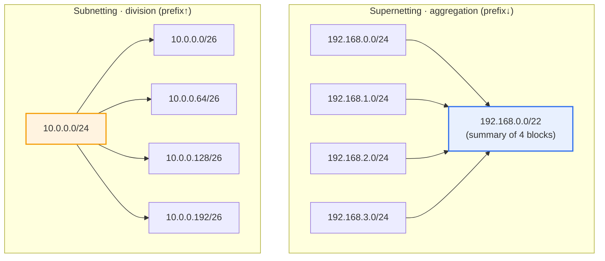
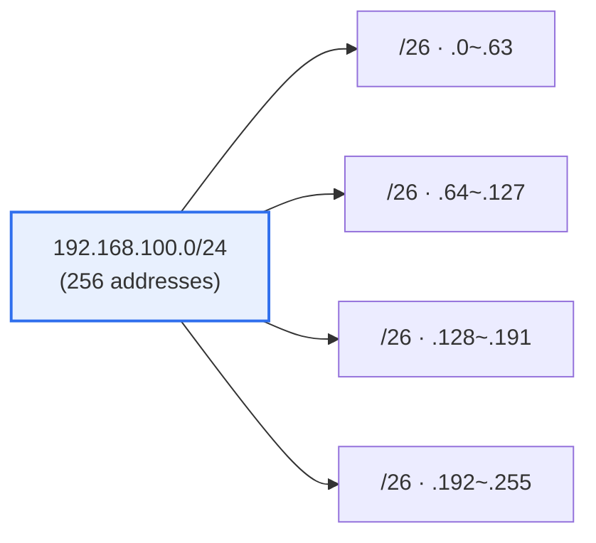

# Network Subnetting and Supernetting

## 1. Overview

### A. Definition
> **Subnetting** is a technique that **divides one large network into multiple smaller subnets**, and **Supernetting** is a technique that **combines multiple small networks into one larger network (route summarization)**. Both are complementary technologies for efficiently allocating and managing finite IPv4 address resources and reducing the routing burden.

IP addresses were originally allocated only in class (A/B/C) units. Because classful allocation fixed address boundaries in 8-bit units, the gap between actual required size and allocation unit was very large. For example, an organization needing 300 hosts found a single Class C (/24), which holds only 254, insufficient and had to receive an entire Class B (/16), which holds over 65,000, resulting in more than 60,000 addresses lying idle. Conversely, giving a Class C to a small network of 10 hosts wastes 244. As such waste accumulated in the early 1990s, IPv4 address exhaustion became a realistic threat, and at the same time the routing tables of Internet backbone routers exploded (routing table explosion), pushing router memory and route computation burdens to their limits.

The fundamental reason subnetting is needed is thus '**to prevent IP address waste and keep broadcast domains at an appropriate size**.' If hundreds to thousands of hosts are left on one large flat network, broadcast traffic such as ARP, DHCP, and routing advertisements propagates to every node, eating into bandwidth and CPU, and a single failure or security incident can spread across the whole network. Subnetting borrows some of the bits used for hosts as network bits to cut the range to the required size, isolating broadcast domains and partitioning the network by department, purpose, and security level. It is a design act that simultaneously improves performance, security, and manageability.

Conversely, supernetting is a technique that bundles several adjacent network blocks into a single shorter prefix to reduce routing table entries (route aggregation), and its generalization is **CIDR (Classless Inter-Domain Routing, RFC 1518/1519, currently RFC 4632)**. CIDR abolished class boundaries and allowed prefix lengths to be specified arbitrarily, so that addresses are allocated only as needed and upstream providers can summarize and advertise their downstream customers' routes as one. Subnetting and supernetting ultimately apply a single principle—'variable-length prefixes'—in the directions of division and aggregation respectively, and are key technologies that extended the life of IPv4 by more than 20 years.

### B. Characteristics
The common characteristics of subnetting and supernetting are, first, **bit-level flexibility**. Network/host boundaries can be set in 1-bit units beyond class boundaries (8 bits), allowing precise matching to the required scale. Second, **hierarchy**. Recursive division—dividing an upper block into lower ones and then dividing those again—is possible, so organizational structure or geographic hierarchy can be reflected directly in the addressing scheme. Third, **bidirectionality**. Because the same principle is applied in both directions—division (subnetting) and aggregation (supernetting)—a hierarchical address design that divides finely inside the organization and bundles broadly on the backbone is naturally realized.

### C. Necessity
In summary, subnetting and supernetting simultaneously satisfy three requirements: (1) **address efficiency** (minimizing waste through allocation matched to required scale), (2) **performance and security** (shrinking broadcast domains and isolating networks), and (3) **routing scalability** (restraining backbone tables through route summarization). These three requirements arise at different layers—inside the organization (subnetting) and on the Internet backbone (supernetting)—but are all solved by the same mechanism of 'adjusting prefixes at the bit level.'

## 2. Comparison of the Principles of Subnetting and Supernetting

The essence of subnetting is **extending the network portion**. Moving some host bits to the network side lengthens the prefix (lengthens the mask), increasing the number of representable subnets while decreasing the number of hosts per subnet. Conversely, supernetting **shortens the network portion**, keeping only the common upper bits of several contiguous blocks and shortening the prefix to represent them as a single route. The two techniques differ only in whether the prefix is lengthened or shortened; both stand on the CIDR idea of 'liberating the boundary from 8-bit classes to arbitrary bits.'

| Category | Subnetting | Supernetting |
|---|---|---|
| **Direction** | Large network → small networks (division) | Small networks → large network (aggregation) |
| **Bit manipulation** | Borrows host bits for network | Returns network bits to host |
| **Mask (prefix)** | Longer (prefix↑) | Shorter (prefix↓) |
| **Main purpose** | Address efficiency·broadcast domain reduction·network isolation | Routing table summarization (CIDR)·fewer route advertisements |
| **Where applied** | Internal organizational network design | Provider·backbone routing |
| **Typical example** | VLSM departmental division | ISP aggregation of customer ranges |

Subnetting and supernetting go in opposite directions because the prefix boundary moves in opposite directions. In subnetting, the mask's 1-bits extend to the right (encroaching on hosts); in supernetting, they retreat to the left (returning to network). In practice, the two interlock hierarchically: an organization receives a CIDR block (e.g., /20) from an upstream provider and subnets it internally into smaller pieces (/24, /26, etc.), and the provider in turn supernets multiple customer blocks to advertise to the backbone.

## 3. Subnetting Exercise: 192.168.100.0/24 → Equal Division into 4

Subnet calculation takes as its starting point either 'how many pieces to divide into' or 'how many hosts each piece needs.' Here, equal division into 4 is used as an example. The core principle is to **round the required number of subnets up to a power of 2 and borrow that exponent's number of host bits**. If 4 are needed, 4 = 2², so borrow 2 bits; if 5–8 are needed, 2³ = 8, so borrow 3 bits. The more bits borrowed, the longer the prefix and the subnet size halves each time.

The **division procedure** step by step is as follows.
1. Four subnets are needed. Since 4 = 2², **borrow 2 bits from the host bits** for use as network bits.
2. The prefix becomes /24 + 2 = **/26**.
3. The subnet mask is /26, i.e., the first 26 bits are 1. The last octet is `11000000` = **192**, so the mask is **255.255.255.192**.
4. Each subnet's size (block) is 2^(32−26) = **64 addresses**. This 64 is called the 'block size,' and subnet boundaries fall on multiples of the block size such as 0, 64, 128, and 192.

| Subnet | Network address | Usable range | Broadcast |
|---|---|---|---|
| 1 | 192.168.100.0/26 | .1 ~ .62 | .63 |
| 2 | 192.168.100.64/26 | .65 ~ .126 | .127 |
| 3 | 192.168.100.128/26 | .129 ~ .190 | .191 |
| 4 | 192.168.100.192/26 | .193 ~ .254 | .255 |

Of the 64 addresses in each subnet, the first address (network address) and last address (broadcast address) cannot be used for hosts, so **assignable IPs = 64 − 2 = 62**. The network address is an identifier pointing to 'this subnet itself' and the broadcast address is for transmission to everyone in the subnet, so neither can be assigned to an individual host—this is why 2 addresses are deducted from every subnet like a 'tax.' The finer the subnets, the more this 2-address overhead repeats, creating a trade-off in which excessive subdivision actually lowers address efficiency.

> **Result**: Subnet mask = **255.255.255.192 (/26)**, **assignable IPs per subnet = 62**

### A. Reverse Calculation: Based on Required Hosts
In practice, it is more common to start from 'how many hosts one subnet needs' rather than 'how many pieces to divide into.' In this case, the **required host bits** are found first. The principle is to find the minimum host bits h satisfying '2^(host bits) − 2 ≥ required hosts.' For example, if one subnet needs 100 hosts, 2^6 − 2 = 62 is insufficient and 2^7 − 2 = 126 is needed, so h = 7 and the prefix is 32 − 7 = **/25**. Conversely, if 30 hosts are needed, 2^5 − 2 = 30 fits exactly, so h = 5, /27.

Thus the subnet-count criterion (borrowing network bits) and the host-count criterion (securing host bits) are two sides of the same coin. Since the 32 bits are shared between the network portion and the host portion, deciding one automatically determines the other. Whichever criterion an exam or design question uses, reducing it to the single relation of 'powers of 2 and prefix length' reduces mistakes. Once the block size (2^h) is known, network boundaries, broadcast, and usable range follow immediately.

## 4. Minimizing Waste with VLSM (Case)

Equal division is easy to calculate, but actual departmental sizes vary, so cutting equally actually creates waste. The solution is **VLSM (Variable Length Subnet Mask)**. VLSM cuts one block with different prefixes, assigning large pieces to large departments and small pieces to small departments. The rule is to '**place those with the largest host demand first**'; taking out large pieces first keeps address boundaries from misaligning.

For example, suppose a single 192.168.100.0/24 is used to create networks for (A) 60 hosts, (B) 28 hosts, (C) 12 hosts, and (D) an inter-router link (2 hosts). Assign 60 hosts a **/26 (64)**, which holds 62; 28 hosts a **/27 (32)**, which holds 30; 12 hosts a **/28 (16)**, which holds 14; and the point-to-point link a **/30 (4)**, which holds 2. Choosing for each requirement the minimum block satisfying '2^n − 2 ≥ required hosts' and placing them contiguously as A=.0/26 (.0~.63), B=.64/27 (.64~.95), C=.96/28 (.96~.111), D=.112/30 (.112~.115), they fit within one /24 without overlapping, and the remaining range (.116~.255) is preserved for future expansion. With equal division, each department would have received 62 addresses alike, wasting dozens in small networks. In this way VLSM maximizes address efficiency by allocating 'only as much as needed,' and it is a basic principle of enterprise network design today.

For VLSM to work, the routing protocol must convey subnet mask information as well. Classful protocols such as early RIPv1 did not advertise masks and thus could not distinguish different prefixes; therefore supporting VLSM and CIDR requires classless protocols that advertise prefix length, such as RIPv2, OSPF, EIGRP, and BGP. Since virtually all modern routing protocols today are classless, VLSM has become standard design practice.

Using /30 (2 hosts) for point-to-point links is also a representative practical convention. A WAN link connecting router to router needs only the 2 addresses at either end, so /30 fits exactly, and in IPv6 or recent designs **/31 (RFC 3021, using both addresses as hosts with no broadcast)**, which has no waste at all, is sometimes used for point-to-point. Such fine adjustments accumulate into address savings across thousands of links in large-scale provider networks.

## 5. Advanced: CIDR, Route Summarization, and Succession to IPv6

The practical essence of supernetting is **route summarization**. If an ISP has allocated four contiguous blocks from 203.0.0.0/24 to 203.0.3.0/24 to customers, rather than advertising them as four to the backbone, it summarizes and advertises them as a single **203.0.0.0/22**, keeping only the common upper 22 bits. This reduces the route entries every router worldwide must maintain to a quarter, and even if a lower block fails, the summary route remains stable, improving routing stability (suppressing route flapping). Even after CIDR's introduction, the BGP global routing table has kept growing, exceeding 900,000 routes in the 2020s; had it remained classful, router hardware would have been unable to cope long ago. In other words, CIDR and supernetting are regarded as foundational technologies that 'enabled the Internet to grow to its current scale.'

A key practical constraint is that for route summarization to be possible, the lower blocks must be **contiguous and aligned**. For example, if only 203.0.0.0/24 and 203.0.3.0/24 exist and the intervening .1 and .2 have been allocated to another organization, summarizing them into one /22 would encompass others' ranges, so summarization is not valid. Hence an addressing plan policy that, from the initial allocation, anticipates 'later summarization' and allocates contiguously on power-of-2 boundaries determines routing efficiency. This is why IP address management (IPAM) is a design activity rather than mere record-keeping.

Address exhaustion itself is fundamentally solved by **IPv6 (128-bit address space)**, but the concepts of subnetting and prefixes are inherited and strengthened in IPv6. IPv6 generally assigns a fixed 64 bits to the interface ID and standardizes the prefix hierarchy by assigning /48 to sites and /64 to individual subnets. Classes have disappeared, but the idea of 'partitioning networks by prefix length' has taken even deeper root. Recently, specifying CIDR blocks when designing a VPC (Virtual Private Cloud) in cloud environments and dividing them into subnets has become a daily task for network engineers, and in hybrid networks connecting on-premises and cloud, IP address planning (IPAM, IP Address Management) to avoid overlapping address ranges has emerged as an essential capability.

## 6. Considerations and Implications

1. **Minimize waste with VLSM while guarding against over-division.** Differentiated allocation matched to departmental demand maximizes address efficiency, but dividing too finely repeatedly consumes 2 addresses (network and broadcast) per subnet and increases routing and management complexity. Appropriate division that also considers headroom for future expansion (growth rate) is the key.
2. **Secure routing scalability through CIDR and route summarization.** Since summarization is possible only when address allocation is designed to be geographically and organizationally contiguous, establishing a 'summarization-friendly' allocation policy at the initial IP address planning stage determines the backbone routing burden. Discontiguous allocation makes summarization impossible and causes route explosion.
3. **Link with the IPv6 transition roadmap.** Subnetting knowledge is not limited to IPv4 but carries over to IPv6 prefix design. During the transition period running dual-stack and transition technologies in parallel, IPAM tools and governance that manage IPv4 subnetting and IPv6 prefix plans in an integrated way are required.
4. **Design from a security and segmentation perspective is important.** Beyond mere address saving, subnetting is the foundation for broadcast domain isolation and firewall/ACL boundary setting. In the trend toward zero trust and microsegmentation, subnets serve as the minimum unit for applying security policy, so design that keeps network separation by purpose and trust level in mind is needed.
5. **Aim for combination with automation and IaC.** In cloud and large-scale data centers, the modern operational standard is to manage subnet and CIDR allocation automatically—not manually—with Infrastructure as Code (IaC) such as Terraform and IPAM, preventing range collisions and waste in advance and tracking change history.

## References
- RFC 4632, Classless Inter-domain Routing (CIDR): The Internet Address Assignment and Aggregation Plan — https://datatracker.ietf.org/doc/html/rfc4632
- RFC 1878, Variable Length Subnet Table For IPv4 — https://datatracker.ietf.org/doc/html/rfc1878
- RFC 3021, Using 31-Bit Prefixes on IPv4 Point-to-Point Links — https://datatracker.ietf.org/doc/html/rfc3021

---

> **In one line**: Subnetting divides a network by borrowing host bits (prefix↑), while supernetting (CIDR) conversely aggregates and summarizes by reducing network bits (prefix↓); dividing 192.168.100.0/24 equally into 4 borrows 2 bits to give *mask 255.255.255.192 (/26), 62 assignable IPs per subnet*, and VLSM, CIDR, and IPv6 prefixes together achieve address efficiency and routing scalability.
