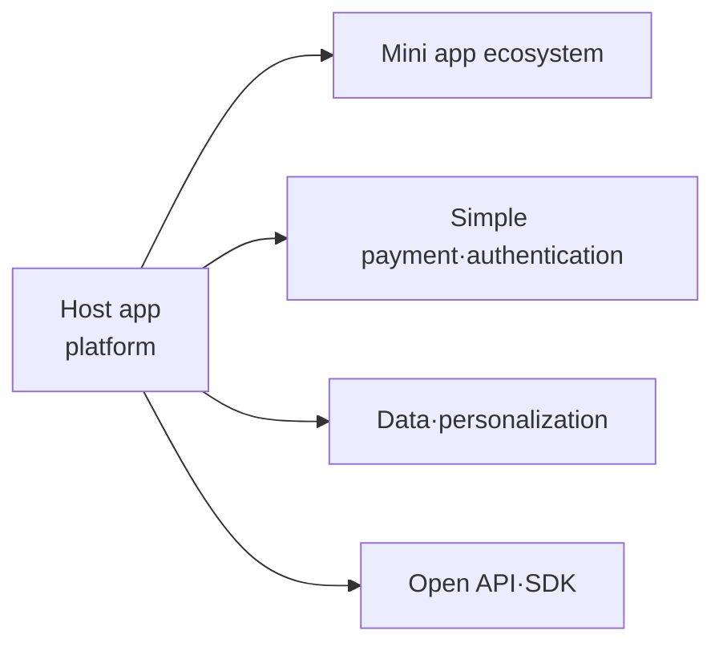

# Super App

## 1. Overview

### A. Definition
> A **platform-type application** that **integrates diverse services such as messaging, payments, finance, shopping, mobility, and reservations** within a single app, where external services join in the form of **Mini Apps** to form a single ecosystem.

The core of a super app is not the sum of individual features but a structure in which **multiple services share common infrastructure—payments, authentication, and data**. Users log in once and register a payment method once, then handle most of daily life without leaving the app, while participating services reuse the traffic and payment/authentication infrastructure already secured. In other words, a super app does not build every service itself but **operates like a platform (operating system)**, layering a third-party ecosystem on top.

### B. Background and Necessity
In the early smartphone era, a separate app was installed for each service, but as apps proliferated, **app fatigue** from repeated installation, login, and payment grew. For businesses, the soaring user acquisition cost for new apps was a problem. Super apps bring services into an app already used daily by hundreds of millions, **lowering acquisition costs** and achieving **Lock-in** that binds users to the ecosystem. A representative background is the explosive growth of WeChat and Alipay in markets like China that skipped credit card and web infrastructure and went straight to mobile.

## 2. Key Components of a Super App

The elements supporting a super app interlock to form a single platform. At the center is the **host app**, which provides the runtime that executes mini apps and a common UI, effectively serving as an operating system on top of an app. On top of it, **simple payment and integrated authentication (SSO)** act as the glue that removes friction from every service, connecting seamlessly without re-login or re-payment regardless of which mini app is used. Data gathered from multiple services is combined into an **integrated profile** that becomes the source for personalized recommendations and marketing, and **open APIs/SDKs** lower barriers to entry so external services can join easily, growing the ecosystem. Among these four elements, payment and authentication infrastructure is particularly important, because third parties join with confidence only when it is robust.

| Element | Description | Role |
|---|---|---|
| **Host (platform) app** | Provides mini app runtime·common UI | Operating system on top of an app |
| **Mini apps** | Participating services that run without installation | Content of the ecosystem |
| **Simple payment·authentication** | Integrated wallet·SSO identity verification | Friction removal (glue) |
| **Data·personalization** | Recommendations·marketing based on integrated profile | Engagement·monetization |
| **Open API/SDK** | Supports third-party onboarding·integration | Ecosystem expansion |

## 3. Super App vs Multi-App (Comparison)

The difference between super apps and multi-apps stems not from the simple number of apps but from a strategic difference of **integration versus specialization**. A multi-app strategy separates apps by service so each app focuses on its own domain (specialization) and evolves independently, but users must move between apps, repeat login and payment each time, and data is dispersed. In contrast, a super app integrates everything into a single account, wallet, and profile, creating a **seamless experience** and strong lock-in, but in exchange the architecture becomes complex and concentrating services in one app increases **single point of failure (SPOF)** and regulatory risk. In other words, the convenience and data synergy of integration are traded off against the independence and resilience of distribution.

| Category | Super app | Multi-app | Reason for the difference |
|---|---|---|---|
| **Structure** | Single app + mini apps | Many individual apps per function | Integration vs specialization strategy |
| **User experience** | Seamless integrated UX | App switching·re-login | Whether common authentication·payment is shared |
| **Account·payment** | Integrated (SSO·integrated wallet) | Distributed per service | Infrastructure-sharing structure |
| **Data** | Integrated profile | Distributed | Source of personalization·monetization |
| **Risk** | Strong lock-in but concentrated SPOF·regulation | Resilience↑, synergy↓ | Trade-off of concentration vs distribution |
| **Examples** | WeChat, Grab, Toss, Kakao | Individual apps per service | |

## 4. Mini Apps

Mini apps are **lightweight services that run instantly on top of a super app without installation**, filling the actual content of the super app ecosystem. Users can use them right when needed without downloading from an app store and logging in, and they take up almost no storage. For participating companies, the super app's traffic, payments, and authentication can be reused as-is, greatly reducing initial entry costs. Implementations use standard web (HTML/JS) or a platform-specific framework like WeChat Mini Programs; platform-specific frameworks are advantageous for performance and security control but involve the trade-off of correspondingly greater lock-in to that platform.

## 5. Cases, Outlook, and Issues

| Category | Content |
|---|---|
| **Cases** | WeChat (China's national app), Grab·Gojek (Southeast Asian mobility+finance), Toss·Kakao·Naver (Korea) |
| **Outlook** | Convergence of commerce·fintech·mobility, deeper conversational personalization through combination with AI agents |
| **Issues** | **Monopoly·platform regulation**, concentration of personal data·privacy, mini app **security review·quality**, single point of failure (SPOF) |

The cases show that super apps grew by tapping unmet infrastructure in each market. WeChat used payments in China, where credit cards were weak, and Grab and Gojek used mobility in Southeast Asia, where public transportation was lacking, as springboards to expand into finance and commerce. In Korea, Toss built on remittance and Kakao on messaging, each adding financial and lifestyle services. Looking ahead, super apps appear likely to evolve toward AI agents using the super app's integrated data and mini apps as tools to perform tasks on behalf of users. However, the more services and data are concentrated in one place, the greater the monopoly regulation and personal data risks become, so managing these determines success or failure.

## 6. Considerations and Implications (Professional Engineer's Perspective)
- **Two sides of data·payment integration**: Integration produces a powerful ecosystem and personalization, but at the same time creates regulatory targets in the form of personal data concentration and monopoly. Balance must be struck through data minimization and purpose limitation.
- **Mini app governance**: As third-party mini apps increase, the risk of malicious or low-quality services slipping in grows, so platform-level security governance such as review, sandbox isolation, and permission control is essential.
- **Resilience design**: Service concentration creates SPOFs, so the design must use redundancy and fault isolation to keep a failure in one mini app from spreading to the whole.
- **Regulatory compliance is competitiveness**: Amid strengthening regulation of platform monopoly and self-preferencing, proactively securing openness and fairness is key to sustainability.

---

> **In one line**: A super app bundles multiple services into one platform with *host app + mini app ecosystem + integrated payment, authentication, and data*, creating a seamless experience and lock-in, but as the price of that integration, managing **monopoly, personal data concentration, mini app security, and SPOF** determines success or failure.
