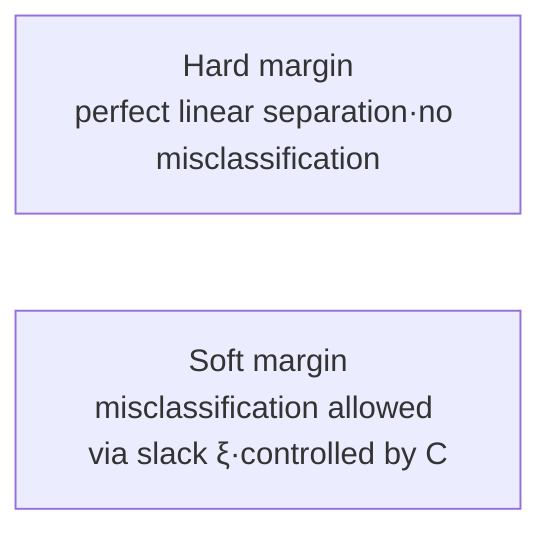

# Margin Classification Methods of Linear SVM (Hard/Soft Margin)

## 1. Overview

### A. Definition
> A **Support Vector Machine (SVM)** is a supervised classification model that, among the countless decision boundaries (hyperplanes) separating two classes, selects the hyperplane that **maximizes the Margin—the distance between the boundary and the nearest data points (support vectors)**.

There are infinitely many boundaries that "just separate" the data, as with a perceptron, but the question is which of them will generalize best to new data. SVM's insight is that "**the farther the boundary is from both classes (= the wider the margin), the more stable it is, since slight variations in data will not cause misclassification**." In other words, margin maximization has a principled basis for reducing the upper bound on generalization error (Structural Risk Minimization, SRM).

### B. Background and Necessity
Real-world data commonly contains measurement noise and overlap between classes, and the risk of overfitting is especially high in **high-dimensional, small-sample** situations where the number of features exceeds the number of samples (gene and text classification, etc.). SVM, which makes the margin an explicit objective function, determines the decision boundary using only a small number of boundary points called support vectors, and thus delivers robust classification performance in such environments. However, because the ideal situation of perfect separation and the real-world situation with noise cannot be handled the same way, margin classification splits into two branches: **hard margin** and **soft margin**.

### C. Key Concepts
| Concept | Description | Why it matters |
|---|---|---|
| **Hyperplane** | Decision boundary defined by $w^\top x + b = 0$ | Reference plane for classification |
| **Margin** | Distance between the hyperplane and the nearest data ($2/\lVert w\rVert$) | Wider → better generalization |
| **Support vectors** | The few data points lying on the margin boundary that determine the hyperplane | Only these points affect the solution |

Since the margin width is $2/\lVert w\rVert$, maximizing the margin becomes a convex quadratic programming (QP) problem of **minimizing** $\lVert w\rVert$ (or $\tfrac12\lVert w\rVert^2$). Data points that are not support vectors do not change the solution no matter how many there are, which is why SVM is insensitive to a few outliers yet sensitive to data near the boundary.

## 2. Two Types of Margin Classification

The difference between the two methods comes from "**how strictly the constraints are enforced**." Hard margin never violates the constraint that every point must lie outside the margin, while soft margin allows the constraint to be violated but imposes a cost (penalty).

### A. Hard Margin
> The maximum-margin hyperplane that **perfectly linearly separates all data** without a single misclassification or margin violation.

Hard margin minimizes $\tfrac12\lVert w\rVert^2$ under the strong constraint $y_i(w^\top x_i + b) \ge 1$ for every point $i$. The problem is that this constraint is satisfied **only when the data are actually linearly separable**, and if even one noisy point or outlier falls on the opposite side, **no solution exists at all**. Even if the data are separable, a single outlier near the boundary can severely distort the entire margin, so it is rarely used on real data.

| Item | Content |
|---|---|
| **Condition** | Linearly separable (no noise·overlap) |
| **Goal** | $\min \tfrac12\lVert w\rVert^2$ s.t. all points outside the margin |
| **Limitations** | Very sensitive to outliers·noise, no solution if non-separable |

### B. Soft Margin
> Maximizes the margin while allowing each data point to violate the margin or be misclassified to a degree via **slack variables $\xi_i \ge 0$**, controlling this by imposing a **penalty $C$** on their sum.

Soft margin changes the objective function to $\min \tfrac12\lVert w\rVert^2 + C\sum_i \xi_i$ and relaxes the constraint to $y_i(w^\top x_i+b) \ge 1-\xi_i$. In other words, it weighs two conflicting goals—a "**wide margin**" and "**few misclassifications**"—using $C$. Thanks to this, a solution always exists even for noisy or non-separable data, and robustness to outliers is achieved.

| Item | Content |
|---|---|
| **Condition** | Applicable to noisy·overlapping data (real data) |
| **Goal** | Maximize margin + minimize misclassification penalty ($C\sum\xi_i$) |
| **Parameter $C$** | Large → strongly suppresses misclassification (margin↓·overfitting↑); small → margin↑·generalization↑ (risk of underfitting) |

$C$ is the handle on the bias-variance scale. When $C$ is very large, it approaches the hard margin and variance increases as it tries to fit even outliers; when $C$ is small, it overlooks some misclassifications, widening the margin and increasing bias. For example, on data where two classes overlap slightly, setting $C$ as large as 100 makes the boundary wiggly as it forcibly tries to separate a few overlapping points, whereas around $C=1$ those points are absorbed by slack, yielding a smooth boundary.

## 3. Comparison

| Category | Hard margin | Soft margin |
|---|---|---|
| **Misclassification** | Not allowed ($\xi=0$) | Allowed ($\xi \ge 0$) |
| **Noise tolerance** | Weak (solution collapses with outliers) | Strong (absorbed by slack) |
| **Existence of solution** | Only if linearly separable | Always exists |
| **Application** | Theoretical·perfectly separable data | Real data (general) |

The fundamental reason for the difference is whether constraint violations are allowed. Because hard margin can never violate constraints, the entire solution depends on the position of a single data point; soft margin converts violations into costs and absorbs them, so the influence of a few outliers can be contained via $C$.

## 4. Considerations and Implications
- **Soft margin is the practical default**: Since noise-free data hardly exists, use soft margin and tune $C$ via cross-validation to balance bias and variance.
- **Kernel trick for nonlinear problems**: When linear separation is impossible, mapping data into a higher dimension with RBF or polynomial kernels allows a boundary that is nonlinear in the original space to be handled as a linear hyperplane in the higher dimension. The margin concept is retained even then.
- **Trade-off of strengths and limitations**: It is robust in high-dimensional, small-sample settings and has a unique solution (convex optimization), but when the number of samples exceeds several hundred thousand, QP training cost ($O(n^2)\sim O(n^3)$) grows, and SGD or tree-based models may be more practical.
- **Extensions**: If probabilistic outputs are needed, use Platt scaling; for multi-class classification, extend with One-vs-Rest/One-vs-One.

---

> **In one line**: Linear SVM *maximizes the margin ($2/\lVert w\rVert$)* to the support vectors and is divided into *hard margin (no misclassification allowed; solution collapses with outliers)* and *soft margin (misclassification allowed via slack $\xi$, bias-variance controlled by $C$)*; in practice, where noise is common, soft margin is the default and is used together with the kernel trick.
