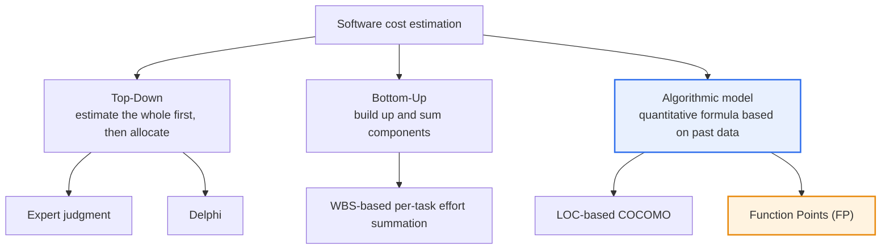
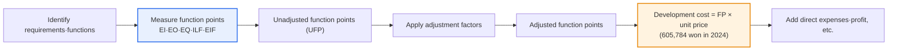

# Software Cost Estimation Methods

## 1. Overview

### A. Definition
> **Software Cost Estimation** is the activity of **predicting the effort (Man-Month), duration, and cost required for development before development begins**, serving as the quantitative basis for project planning, budgeting, and scheduling as well as procurement and contracting.

The reason cost estimation is both difficult and important lies in the essential contradiction that '**one must guess in advance the value of something invisible**.' Software has no physical substance, and its size and complexity are hard to know precisely until it is complete. Yet the budget and schedule must be fixed before kickoff, and once set, the budget binds the project for its entire duration. If the estimate is overly optimistic, the budget and deadline are exceeded, putting the project in crisis and leading to overtime, degraded quality, and disputes; if overly conservative, the bidder loses out in the competition for contracts. Because of this dilemma, estimation should be understood not as simple calculation but as **a decision-making act that manages risk under uncertainty**.

Several estimation methods have developed to mitigate these difficulties. They broadly divide into **Top-Down**, which relies on human experience and intuition — expert judgment and Delphi; **Bottom-Up**, which breaks components down finely and builds them up — WBS-based summation; and **Algorithmic (mathematical) models**, which use regression formulas and coefficients built from past project data — LOC-based COCOMO and function-based Function Points (FP). The three approaches each have different trade-offs in **accuracy, objectivity, and the point in time at which estimation is possible**. Top-down gives a quick answer even at the very earliest stage but is subjective; bottom-up is precise but requires the design to be somewhat settled and risks omissions; model-based is quantitative and verifiable, but its results depend on the prediction accuracy of the inputs (LOC, functional size). Since no method is perfect, it is wise to **use several methods in parallel for cross-validation (triangulation)** and interpret their deviations as risk signals.

### B. Background and Necessity
As large software projects in the 1960s–70s repeatedly exceeded budgets and deadlines and the 'software crisis' emerged, the need grew for **objective, repeatable estimation techniques** to replace rule-of-thumb quotes. Inaccurate estimation is the root cause of budget overruns, schedule delays, quality degradation, and stakeholder disputes, and in public informatization projects in particular, the appropriateness of the budget and the transparency of procurement become key issues in audits and IT supervision. As a result, a function-point-based standard pricing framework became established in Korea, and quantitative models such as COCOMO and Function Points (IFPUG/ISO) internationally.

### C. Properties a Good Estimate Should Have
A good cost estimate should have, first, **objectivity** (similar results regardless of who does it); second, **traceability** (documentation of estimation bases and assumptions); third, **timeliness** (providing an answer at the point a decision is needed); and fourth, **progressive refinement** (reflecting the 'cone of uncertainty,' narrowing error as stages progress). On the premise that uncertainty reaching ±100% at the start narrows as design and implementation proceed, estimation must be **repeatedly re-estimated**, not done once.

## 2. Classification of Cost Estimation Methods — Overall Structure

Cost estimation techniques are divided into top-down, bottom-up, and algorithmic models according to the direction and basis of information, and in practice they are combined complementarily.

**Top-down** first estimates the overall project size empirically and then allocates it to lower-level tasks. It can quickly produce a rough estimate even at the very earliest stage when requirements are vague, making it useful in business feasibility reviews or the proposal stage. However, it is heavily biased by individual experience and cannot catch omissions of detailed tasks. To reduce this bias, the **Delphi technique**, which converges the anonymous opinions of multiple experts over several rounds, is used.

**Bottom-up**, conversely, finely decomposes the project using a Work Breakdown Structure (WBS) and then estimates and sums the effort of each task. Its detailed basis is clear and precision is high, but it can be applied only once the design is somewhat settled, and it easily omits 'invisible' overheads such as integration and management. Hence it is customary to adjust the bottom-up total by adding a certain percentage for integration and risk contingency.

**Algorithmic models** convert size (LOC or FP) into effort and cost using regression formulas and coefficients derived from past projects. Being objective with verifiable bases, they have become the standard for large-scale and public projects, but they carry the 'garbage in, garbage out' risk that if the input prediction is wrong, the entire result is off.

| Method | Principle | Advantages | Disadvantages | When applied |
|---|---|---|---|---|
| **Expert judgment** | Intuition of experienced people | Fast·simple·low cost | Subjective·weak basis | Very early |
| **Delphi** | Converging anonymous opinions of multiple experts | Mitigates individual bias | Takes time·cost | Early |
| **Bottom-up (WBS)** | Summation of per-task effort | Precise·clear basis | Requires settled design·risk of omission | After design |
| **LOC/COCOMO** | Effort from expected code size·cost drivers | Quantitative·validated | Depends on LOC prediction·language-dependent | Design stage |
| **Function Points (FP)** | Measures user functional size | Language-independent·early application | Requires measurement expertise | Requirements stage |

## 3. Key Quantitative Model in Detail — COCOMO

**COCOMO (Constructive Cost Model)** is a representative LOC-based algorithmic model proposed by Barry Boehm in 1981 that calculates effort based on expected code size (KLOC) and project characteristics. The basic idea is that "**effort is a nonlinear function of size**," formalizing the empirical rule that as size grows, effort increases faster than size (exponent greater than 1) because of communication and integration costs. The basic form is roughly `Effort = a × (KLOC)^b`, where coefficients a and b vary by project type.

COCOMO classifies projects into three modes: **Organic** — small scale, familiar domain; **Semi-detached** — medium scale, mixed experience; and **Embedded** — large scale, strict constraints (real-time, hardware coupling). Even at the same size, the Embedded mode has a larger exponent b than Organic, requiring much more effort. This reflects that the 'diseconomy of scale' works differently depending on project nature—an insight that cannot be captured by simple man-month multiplication.

The refined **Intermediate and Detailed COCOMO** adjust this further by multiplying by **cost drivers** such as required product reliability, database size, team capability, and development tool maturity. For example, aviation and medical software requiring very high reliability has a larger effort multiplier due to verification burden. The successor model **COCOMO II (2000)** reflects modern development approaches such as reuse, object orientation, commercial off-the-shelf components (COTS), and spiral development, allowing different inputs per stage from the early prototyping stage (application points) to later stages (FP, LOC). COCOMO's fundamental limitations remain that **LOC is hard to predict accurately at project start**, and that it is dependent on language and development approach.

## 4. Korean Standard — Function Points (FP) and SW Project Pricing

**Function Points (FP)** measure size not by code but by **functionality from the user's perspective**. Functions provided to users are identified as five types — External Input (EI), External Output (EO), External Inquiry (EQ), Internal Logical File (ILF), and External Interface File (EIF) — and weights are assigned according to each function's complexity and summed. The decisive advantage of FP is that it is **independent of development language, technology, and platform**. Whether the same function is built in Java or Python, the amount of functionality provided to users is the same, so it largely avoids the language dependence and early-prediction difficulties that LOC-based approaches suffer. It can also be applied from an early stage when requirements are organized, making it suitable as a basis for procurement and contracting.

For this reason, Korean public informatization projects **adopt the function point method as the standard pricing method**. The **"SW Project Pricing Guide"**, revised and published annually by the Korea Software Industry Association (KOSA), stipulates that development cost be calculated as "**Function Points × unit price per Function Point**." Looking at actual figures, the unit price per FP was adjusted from 553,114 won in 2020 to **605,784 won in the May 2024 revision, a 9.5% increase**, reflecting post-COVID-19 inflation and rising labor costs of SW engineers. The 2024 revision also requires that license costs, algorithm tuning, and data collection, preprocessing, training, and validation in AI adoption projects be calculated separately as **specialized work costs using the input-effort method**, beginning to reflect new project forms of the generative AI era in the pricing framework.

The practical implications of this standardization are significant. Because the ordering agency and the contractor measure size by the same rules, **budget objectivity and procurement transparency** are secured, and the basis for pricing can be verified during IT audits and supervision. On the other hand, FP measurement requires specialized personnel, and it is hard to fully reflect non-functional requirements (performance, security) or technical difficulty in size, so it is supplemented by running the input-effort method in parallel. [[sw-sizing-methods]] [[sw-operation-cost]]

## 5. Comparison and Practical Application — The Logic of Method Selection

The differences among the three methods ultimately stem from '**when, and on what basis, an answer can be produced**.' When there is almost no information, as at the proposal or feasibility stage, precise bottom-up estimation is impossible, so a rough estimate is produced with expert judgment or Delphi; once requirements are organized, size is fixed with function points; and once the design is concrete, it is precisely verified with WBS-based bottom-up estimation. In actual large projects, the standard practice is to **switch among these three by stage and re-estimate**.

As a concrete example, if 3,000 FP were estimated at the requirements stage for a public agency's next-generation system (hypothetical), multiplying by the unit price yields a draft development cost of about 1.8 billion won. If a subsequent bottom-up re-estimation by WBS after design completion yields 2.2 billion won, the 400 million won difference (about 22%) should be read as a **risk signal** indicating omitted requirements or underestimated non-functional requirements. In this way, the deviation between methods itself becomes information for risk management. As another example, for embedded software where real-time control is central, the COCOMO Embedded coefficients should be applied to recognize much larger effort than Organic; ignoring this easily leads to a loss-making project after a low-price bid.

## 6. Advanced — Evolution of Estimation in the Agile and AI Era

If traditional estimation is predictive, 'getting the whole right at once before kickoff,' **Agile** fundamentally reverses this. In Agile, the whole is not precisely estimated in advance; instead, the backlog is estimated in **story points** representing relative size, and each sprint's actual throughput, **velocity**, is measured to continuously re-forecast the remaining schedule. In other words, it replaces 'one big prediction' with 'many short, measurement-based corrections,' which has the advantage of quickly narrowing the cone of uncertainty in highly uncertain projects. However, it is unsuitable for cross-organization comparison or fixed-price contracts, so it is used complementarily with the function point framework of public procurement.

Recently, **data- and AI-based estimation** is emerging. Attempts are under way to train machine-learning regression models on the size, effort, and defect data of past completed projects to predict the effort of similar projects, or to analyze requirements specifications with natural language processing to automate function point measurement. Productivity gains from generative AI (automatic code generation) are shaking the very premises of existing LOC- and effort-based estimation, so the estimation framework also needs redefinition, as with the new AI specialized work cost in the 2024 pricing guide mentioned above. Since this is a recurring subject in recent exams together with the related topics of software sizing ([[sw-sizing-methods]]) and operation-stage pricing ([[sw-operation-cost]]), it is effective to connect them in an answer along the flow of "limitations of traditional models → complemented by Agile and AI."

## 7. Considerations and Implications

1. **Using several methods in parallel with cross-validation increases accuracy.** Since a single method has its own inherent biases and errors, top-down, bottom-up, and model-based methods should be applied together and their results compared, and large deviations between methods should not be ignored but interpreted as early signals of omitted requirements or risks. The assumptions and bases used in estimation must be documented to ensure traceability.
2. **Estimation is not a one-time event but an iterative process.** According to the cone of uncertainty, the large uncertainty at project start narrows as stages progress, so risk-based management is needed that re-estimates at each milestone and secures contingency in proportion to size and risk.
3. **In the Korean public sector, function points are the standard, and institutional changes must be tracked.** Since the SW Project Pricing Guide revises unit prices and items annually (e.g., 2024 FP unit price of 605,784 won, new AI specialized work cost), the latest guide must be used as the basis to preserve pricing appropriateness and procurement transparency.
4. **Do not forget to reflect non-functional requirements and technical difficulty.** Because FP and LOC center on functional size, they cannot fully capture non-functional requirements such as performance, security, and availability, or the difficulty of adopting new technologies, so they should be supplemented with the input-effort method and cost-driver adjustments, and trade-offs managed explicitly.
5. **Outlook: AI becomes both the object and the tool of estimation.** As generative AI changes development productivity, the premises of the existing size-effort relationship are shaken, while AI-based automatic estimation and analogy-based estimation are raising accuracy. From a Professional Engineer's perspective, an evolutionary view is required that is grounded in the principles of traditional models but extends and links them with Agile, data, and AI.

## References
- Korea Software Industry Association (KOSA), "2024 Software Project Pricing Guide" (2024.05.13): https://www.sw.or.kr
- "Software Function Point (FP) unit price 605,784 won, raised 9.5%" (Byline Network, 2024.05): https://byline.network/2024/05/13-363/
- "KOSA publishes revised SW project pricing… AI project pricing framework also reflected" (Digital Today): https://www.digitaltoday.co.kr/news/articleView.html?idxno=517431
- COCOMO (Constructive Cost Model) overview: https://en.wikipedia.org/wiki/COCOMO
- Function point overview: https://en.wikipedia.org/wiki/Function_point

---

> **In one line**: SW cost estimation is a risk-management decision that *predicts effort, duration, and cost before kickoff*; top-down (expert·Delphi), bottom-up (WBS), and algorithmic models (COCOMO·Function Points) trade off accuracy, objectivity, and timing; the Korean public sector uses the function point standard (605,784 won per FP in 2024); and the keys are parallel use and cross-validation of multiple methods and evolution toward Agile- and AI-based estimation.
