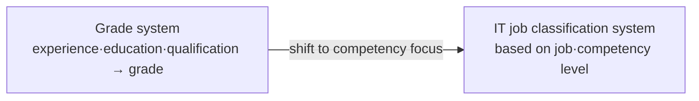

# Classification of Software Engineers (Grade System → IT Job Classification System)

## 1. Overview

### A. Definition and Background
> The **engineer grade system** is a workforce classification scheme that scored experience, education, and qualifications to divide engineers into junior, intermediate, senior, and expert grades, while the **IT job classification system** is a competency-centered scheme that classifies personnel based on the **job performed and actual competency level**.

In the past, the SW industry calculated labor costs (wage rates) based on the engineer grade system. Because the grade was the rate, calculation was simple, but there was a fundamental problem of **seniority-based evaluation**, in which "how many years one has worked" substituted for "what one does and how well." The characteristic of SW occupations—large differences in skill even among those with the same experience—was not reflected at all. Accordingly, in 2012 the government abolished the regulations related to the SW engineer reporting system (grade system) and promoted the transition to a job- and competency-centered IT job classification system.

### B. Necessity
The necessity of the IT job classification system comes from **fair compensation for expertise**. If a highly competent developer is rated lower than someone merely ahead in years of experience, top talent leaves the industry, and procurement pricing diverges from actual value. Job- and competency-based classification corrects such distortions to improve treatment, and helps ordering organizations clearly specify required competencies and price rationally. Furthermore, it presents individuals with a **Career Path**, forming the foundation for raising the expertise of the industry as a whole.

## 2. Concepts and Characteristics of the Grade System and the IT Job Classification System

The grade system looks at **the history (input) of the deployed personnel**. Because grades are assigned using objective data—experience, education, and certifications—calculation is easy and controversy is low, but grades are fixed regardless of the quality of actual output. In contrast, the IT job classification system looks at **the job performed and the competency level required for that job**. For example, like international competency frameworks such as SFIA (Skills Framework for the Information Age), it defines required competencies and proficiency levels per job and evaluates personnel by the level attained. The essential difference is the shift in perspective from "how long" to "how well, and doing what."

| Category | Engineer grade system | IT job classification system |
|---|---|---|
| **Criteria** | Experience·education·qualification → grade (junior·intermediate·senior·expert) | Classification by **job·competency level** |
| **Perspective** | Grade of deployed personnel (seniority) | Job performed·expertise |
| **Pricing** | Wage rate per grade | Rate based on job·competency |
| **Advantages** | Simple·objective calculation | Reflects expertise·encourages career development |
| **Disadvantages** | Seniority-based·competency not reflected | Poor adoption in the field·lack of criteria |

## 3. Problems with the Current IT Job Classification System

The core problem is that although the system has changed, the field still remains in grade-system practices. The biggest cause is the **gap in pricing criteria**. The grade system had a clear number—wage rates per grade—but the job system has not sufficiently established standard rates or criteria to replace it, so ordering organizations still require grades such as "intermediate or above" in contracts. In addition, the lack of a certification system to objectively measure competency makes it hard to prove that "this person has the competency for the job," and understanding and acceptance by ordering organizations and companies are low.

| Problem | Content |
|---|---|
| **Not established in the field** | Procurement·contracts still require grades |
| **Confusion over pricing criteria** | Absence/ambiguity of job-based wage rates·calculation criteria |
| **Difficulty assessing competency** | Lack of objective competency measurement·verification system |
| **Lack of awareness** | Low understanding·acceptance by ordering organizations·companies |

## 4. Directions for Improvement

Since the root of the problem is "the gap between the system and the field," improvements must also be **practical measures that close the gap**. First, clearly establish job-based pricing and wage criteria so that ordering organizations can specify requirements by job instead of grade, and prepare a standard competency framework and certification (linked with the career management system) to make competency provable. Raise awareness through procurement guides and training, and it is effective for public procurement to apply the job system first to lead the market. However, since abrupt transition causes confusion, a soft-landing strategy of mapping grades to jobs, **running both in parallel, and then transitioning in phases** is realistic.

| Improvement direction | Content |
|---|---|
| **Institutional reform** | Clarify job-based pricing·wage criteria |
| **Competency certification** | Standard competency framework·certification (linked with career management system) |
| **Raising awareness** | Procurement guides·training, leading application in the public sector |
| **Phased transition** | Grade-job mapping → parallel operation → transition |

## 5. Considerations and Implications
- **Closing the gap between system and field is key**: Even the best classification scheme becomes a dead letter if not backed by pricing and procurement practices. Clarifying pricing criteria is the top priority.
- **Shift to a competency-centered culture**: When a culture of being evaluated on skill rather than seniority takes root, both the treatment of SW engineers and industry competitiveness rise together.
- **Legal and institutional linkage**: Effectiveness is secured only when it is consistently linked with the Software Promotion Act, the SW Project Pricing Guide, and the public SW procurement system.
- **International alignment**: Establishing criteria compatible with international competency frameworks such as SFIA also makes it possible to respond to global workforce mobility and evaluation.

---

> **In one line**: SW engineer classification has shifted from the *experience-based grade system* to the *job- and competency-based IT job classification system*, but poor adoption in the field and confusion over pricing criteria are problems, so clarifying job-based pricing criteria, competency certification, raising awareness, and phased transition are the key directions for improvement.
