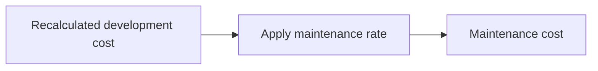
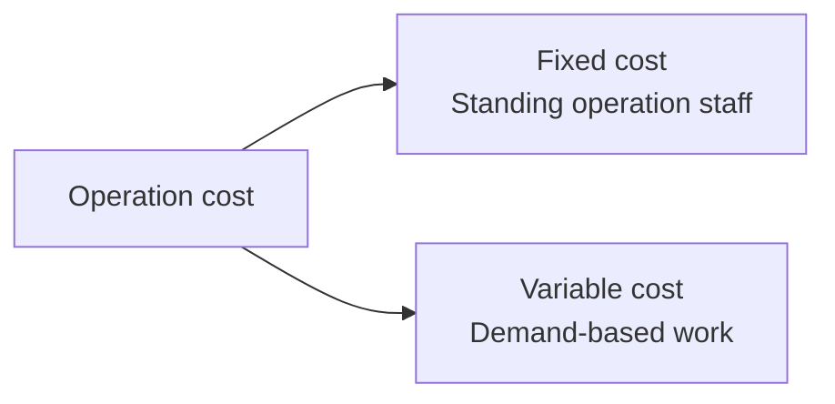

# Software Operation-Phase Cost Estimation (SW Project Cost Estimation Guide 2023)

## 1. Overview

### A. Definition
> A method of **estimating the cost of the SW operation phase (maintenance and operation) on objective criteria** under the "Software Project Cost Estimation Guide (2023 revision)," providing a rational basis for procurement and contracting.

Most of a software system's total cost of ownership arises during the operation and maintenance period rather than development. Yet operation costs have often been set on weak grounds, such as "customarily X% of the development cost," which has led to low-price bidding and quality degradation, or conversely to overestimation. The cost estimation guide reduces this arbitrariness by standardizing cost calculation **on measurable indicators such as functional size (function points), labor input, and SLA**.

### B. Distinguishing Maintenance from Operation
The guide divides the operation phase into two activities of different nature. **Maintenance** is the activity of fixing defects in delivered application SW and making small functional improvements and repairs, and its burden is generally **proportional to the size of the SW (function points)**. In contrast, **SW operation** is the activity of continuous monitoring, incident response, and configuration management to keep the system running stably, and its burden depends more on **staffing and service level (SLA)** than on size. Because their natures differ, their estimation formulas must also differ—this is the reason for the distinction.

## 2. Rate-Based Maintenance Cost for Application SW

Maintenance cost is obtained by **multiplying the recalculated development cost by a maintenance rate (%)**. The key here is the "recalculated development cost," which is the functional size of the SW already in operation recomputed on current criteria (function points and unit prices). On the premise that maintenance burden is proportional to SW size, size is converted into development cost and multiplied by the rate. The rate is typically based on around 10–15% and is adjusted by reflecting correction factors such as service level, difficulty, and incident response time. For example, if the recalculated development cost is KRW 1 billion and the rate is 12%, the annual maintenance cost comes to about KRW 120 million. Because this method relies on an objective indicator—size—it has the advantage of being **simple and less prone to disputes**.

| Item | Description |
|---|---|
| Formula | Maintenance cost = Development cost (recalculated) × Maintenance rate (%) |
| Rate | Reflects service level and difficulty correction factors (typically around 10–15%) |
| Premise | Maintenance burden is proportional to SW size (function points) |
| Characteristics | Size-based, simple and objective, little room for disputes |

## 3. Labor-Input-Based Estimation for SW Operation

It is more rational to estimate operation cost not by size but by **how many people are actually deployed and for how long**. Activities such as continuous monitoring and incident response require a fixed staff on duty regardless of whether the SW is large or small. Thus the formula takes the form `Operation cost = Labor input (M/M) × Labor unit price + Expenses & profit`. Labor input is estimated based on the scale of the operation target, workload, and SLA (availability and response-time targets). For instance, a system requiring 24-hour monitoring is staffed with shift work in mind, so even at the same size, higher SLA means more labor input. In this way, the labor-input method **directly reflects the labor-intensive nature of operation**.

| Item | Description |
|---|---|
| Formula | Operation cost = Labor input (M/M) × Labor unit price + Expenses & profit |
| Labor input estimation | Based on operation workload, SLA, and target scale |
| Premise | Operation burden is proportional to staffing rather than size |
| Characteristics | Based on actual input, suited to continuous operations |

## 4. Fixed/Variable Cost Estimation

Operation work by nature mixes "parts that are always needed" with "parts that arise only on request." Lumping them together under one method causes a mismatch between actual needs and cost. Therefore, **fixed costs** (monthly flat-fee nature) such as continuous monitoring and basic upkeep are estimated separately from **variable costs** that rise and fall with requests and workload, such as functional improvements and incident handling. This split guarantees predictable baseline costs stably while settling variable elements according to actual occurrence, making it **fair to both the client and the contractor**. In practice, a hybrid approach is commonly used, with fixed costs as the backbone and variable costs layered on top.

| Category | Description | Nature |
|---|---|---|
| Fixed cost | Standing operation staff and basic upkeep costs | Monthly flat fee, predictable |
| Variable cost | Costs linked to requests/workload such as improvements and incidents | Settled on actuals |
| Application | Hybrid of fixed + variable depending on service characteristics | Fairness and flexibility |

## 5. Considerations and Implications
- **Choose the method that fits the nature of the work**: Rate-based pricing suits maintenance with clear size proportionality, labor input suits labor-intensive operation, and a fixed + variable hybrid suits work with large demand fluctuations. Forcing a single universal formula causes distortion toward under- or over-pricing.
- **Quantification based on SLA and workload**: Cost grounds must be specified with measurable indicators such as SLA and workload to break the vicious cycle of low-price bidding and quality degradation.
- **Realistic pricing for public SW**: The purpose of the guide is to make pricing realistic, thereby raising both workforce treatment and SW quality, which is directly tied to the sustainability of the industry ecosystem.
- **Limitations and negotiation**: Rates and correction factors still leave room for negotiation, so SLA, deliverables, and staffing plans should be specified in the contract at procurement to reduce interpretation disputes.

---

> **In one line**: The key to SW operation-phase cost is to estimate *maintenance, which is proportional to size, by the rate method (development cost × rate)* and *operation, which is proportional to staffing, by labor input (M/M × unit price)*, while splitting standing costs into fixed costs and workload-linked costs into variable costs—**quantifying each according to its nature**.
