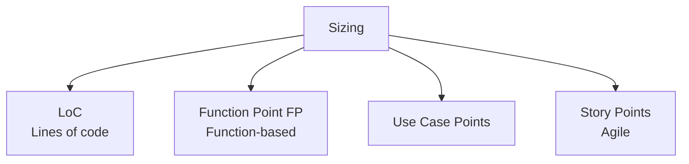

# Software Sizing Methods and Improvement Measures for Public SW

## 1. Overview

### A. Definition
> A method of **quantitatively estimating the size of software** to be developed, serving as the starting point for estimating development cost, labor input (M/M), and schedule.

Sizing is the task of converting "how big a piece of software we are building" into a number. Only once size is determined can productivity (effort per unit size) be multiplied to derive effort, cost, and schedule, so sizing is the **top-level reference point** of every SW estimate. Methods differ depending on what is taken as the unit of size, and each has distinct trade-offs in measurement timing, accuracy, and objectivity.

### B. Background and Necessity
In the past, SW prices were estimated on an input basis such as headcount and duration, which provided weak grounds and led to **scope disputes** between clients and contractors and to quality degradation after **low-price bidding**. Because software has no physical substance, it is hard to objectively agree on "how much it is worth," so a standardized output-based size measure became necessary. The public sector in particular requires transparency and fairness in budget execution, so it adopted language- and technology-independent, standardized estimation methods as the basis for pricing.

## 2. Types and Characteristics of Sizing Methods

The four methods broadly split into **"code-based (LoC)" and "function-based (FP, UCP, SP)."** LoC counts the lines of finished source code, so it is intuitive, but the line count for the same function varies greatly by language and developer style, and it can only be counted accurately after development ends, making it **unsuitable for early estimates**. Conversely, function points (FP) use "functions delivered to the user" as the unit, so they can be estimated at the requirements analysis stage regardless of implementation language, and since they are established as international standards (ISO/IEC 20926, etc.), their **objectivity and reproducibility** are high. Use case points leverage the complexity of UML use cases and suit object-oriented projects, while story points are a relative sizing method used by agile teams—useful within a team but hard to use for cross-team comparison.

| Method | Unit of size | Advantages | Disadvantages |
|---|---|---|---|
| **LoC (Lines of code)** | Number of source lines | Simple, intuitive | Language/style dependent, hard to estimate early |
| **Function Point (FP)** | User functions | Language independent, international standard, early estimation possible | Requires expertise and effort to measure |
| **Use Case Points** | Use case complexity | Suited to object-oriented/UML projects | Dependent on use case writing quality |
| **Story Points** | Relative size | Useful for iterative agile estimation | Team dependent, hard to compare across teams |

Because of these characteristics, **public SW projects adopt function points (FP)** as the standard for cost estimation.

## 3. Function Point (FP) Estimation

FP quantifies the functions software provides to users by dividing them into **data functions** and **transaction functions**. Data functions are logical data groups that the system maintains or references, and transaction functions are processing units performed by users. Weights are assigned according to each function's complexity (low/average/high) and summed.

| Step | Description |
|---|---|
| **Function identification** | Data functions (Internal Logical File ILF, External Interface File EIF) and transaction functions (External Input EI, External Output EO, External Inquiry EQ) |
| **Complexity weighting** | Assign weights by function complexity (low, average, high) |
| **Adjustment and aggregation** | Compute total FP using the simplified method (applying average complexity) or the detailed method (estimating individual complexity) |

In practice, accuracy is raised step by step: at early stages before requirements are finalized, a quick estimate is made with the **simplified method** applying average complexity, and after the design is detailed, it is refined with the **detailed method** reflecting individual complexity. For example, a project estimated at 100 FP is multiplied by the unit price from the SW project cost criteria to derive the development cost.

## 4. Practical Improvement Measures for Public SW Sizing

Most sizing problems in public SW projects stem from the structural contradiction of "fixing the price at a point when early requirements are still unclear." The improvement measures below aim to ease this contradiction.

| Problem | Cause | Improvement measure |
|---|---|---|
| **Inaccurate estimation with unclear requirements** | Requirements not finalized at kickoff | **Phased re-estimation** after analysis is complete (finalize after requirements are detailed) |
| **Scope changes not reflected** | Requirements increase after contract | Scope change review committee, re-estimation of cost for changes |
| **Low-price bidding** | Lowest-price competition | Fair pricing, cost-based floor, SW impact assessment |
| **FP measurement burden** | Measurement requires expertise and time | Automation tools, standards and training, specialist workforce development |

The key is not to nail down size all at once but to institutionalize **post-analysis re-estimation (phased finalization)** and **scope change management**. Only if the price can be re-estimated as requirements grow can low-price bidding and unreasonable scope additions (velvet) be prevented.

## 5. Considerations and Implications
From a Professional Engineer's perspective, SW sizing should be seen not as a mere estimation technique but as an **institutional mechanism that guarantees trust between client and contractor**. First, objective function-point-based estimation must be combined with scope change management to secure both accuracy and fairness of estimation. Second, linking with the SW project cost estimation guide and the SW Promotion Act to guarantee fair pricing protects the health of the industry ecosystem. Third, as project types that are hard to capture with traditional FP—such as agile, cloud (SaaS subscription), and maintenance projects—increase, **diversifying and supplementing estimation methods** to reflect story points, service size, and the like is a future task.

---

> **In one line**: SW sizing divides into *LoC, function points (FP), use case points, and story points*, with the public sector using language-independent, standardized FP as the benchmark; phased re-estimation after requirements are detailed, reflection of scope changes, and securing fair pricing are the key improvement directions for public SW estimation.
