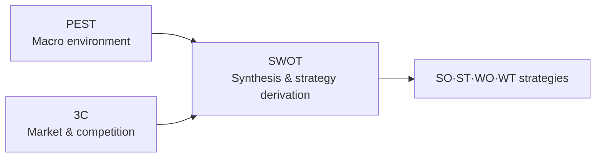

# Business Environment Analysis: SWOT · 3C · PEST

## 1. Overview

### A. Definition
> Representative analysis frameworks for **systematically diagnosing the internal and external business environment** surrounding an organization before formulating business or IT strategy, each covering a different perspective—macro environment, market competition, and synthesis.

The three techniques are not competitors; they differ in **analytical scope**. PEST addresses the uncontrollable macro environment, 3C addresses the specific market and competitive landscape within it, and SWOT combines the preceding analyses with internal capabilities to synthesize strategy. Therefore, rather than using just one, **linking them in the order PEST→3C→SWOT** makes the logical grounding of the analysis solid.

### B. Background and Necessity
Strategy cannot be built solely on "what we are good at (internal)"; one must read **our position amid external changes** such as markets, regulation, and technology. Strategies relying only on intuition and experience easily fail by missing environmental change, so a structured checklist covering external, market, and internal factors without omission became necessary. These frameworks are used as standard tools for Information Strategy Planning (ISP) and business feasibility analysis because they prevent analytical omissions and provide a **common language for discussion** among stakeholders.

## 2. Overview Comparison of the Three Techniques

If PEST surveys the broad environment affecting the entire industry, 3C looks into the specific market where we compete within that industry, and SWOT adds internal diagnosis (strengths and weaknesses) to this external information (opportunities and threats) to condense it into actionable strategy. In other words, the first two techniques produce the inputs for SWOT.

| Technique | Perspective | Components | Output |
|---|---|---|---|
| **PEST** | Macro external environment | Political, Economic, Social, Technological | Sources of opportunities/threats |
| **3C** | Market and competitive landscape | Customer, Competitor, Company | Key Success Factors (KSF), differentiation |
| **SWOT** | Internal + external synthesis | Strengths, Weaknesses (internal), Opportunities, Threats (external) | SO·ST·WO·WT strategies |

## 3. PEST Analysis

PEST surveys **macro-environmental changes** the organization cannot control along four axes—Political, Economical, Social, and Technological—and is used to set long-term, strategic direction. It is especially effective in industries with large regulatory and technological change, when entering new markets, or when drawing up mid- to long-term plans. The method is to derive changes for each of the four factors, evaluate whether each change is an opportunity or threat to the business, and compose several combinations into scenarios. For example, an electric vehicle company would read tightening carbon regulations (P) as an opportunity and a surge in battery raw material prices (E) as a threat, and branch its response scenarios accordingly.

| Factor | Examples |
|---|---|
| **P (Political)** | Regulation and policy, taxation, political stability |
| **E (Economic)** | Business cycle, interest rates, exchange rates, income levels |
| **S (Social)** | Demographics, lifestyle, values |
| **T (Technological)** | New technologies, patents, digital transformation |

## 4. 3C Analysis

3C focuses on formulating **market entry and competitive strategy**, cross-analyzing three axes—Customer, Competitor, and Company—to derive **Key Success Factors (KSF)** and differentiation strategy. First, customer needs and segmentation are identified, then competitors' strengths and weaknesses are analyzed, and finally the company's capabilities are compared against both. Differentiation ultimately means finding the point where "customers want it, competitors cannot provide it, and we can." For example, if a delivery platform applies 3C, facing customers who want fast delivery (C) and competitors engaged in fee competition (C), it can establish "ultra-fast delivery" as a differentiator using its own (C) logistics capabilities.

## 5. SWOT Analysis

SWOT is the stage of **synthesizing and deriving strategy** by placing the external factors (Opportunities O, Threats T) organized through PEST, 3C, etc., and internal factors (Strengths S, Weaknesses W) into a single matrix. Therefore, SWOT is effective not as the start of analysis but when performed after the preceding analyses are complete. The key is not simply filling in the four cells but **crossing** internal and external factors to extract concrete strategies.

| Category | Opportunities (O) | Threats (T) |
|---|---|---|
| **Strengths (S)** | **SO**: Use strengths to exploit opportunities (offense, expansion) | **ST**: Use strengths to avoid threats |
| **Weaknesses (W)** | **WO**: Overcome weaknesses to exploit opportunities | **WT**: Minimize weaknesses and threats (defense, withdrawal) |

For example, when a strong brand (S) meets emerging-market growth (O), an aggressive entry (SO) is derived; when a shortage of technical staff (W) meets rapidly changing technology (T), a defensive strategy (WT) that reduces risk through outsourcing or partnerships is derived.

## 6. Considerations and Implications
From a Professional Engineer's perspective, the value of these frameworks lies not in individual use but in **linked use**. Proceeding in the order PEST (macro)→3C (market)→SWOT (synthesis), the results of external and market analysis directly become the **grounds** for deriving SWOT's O/T and S/W, securing the logical consistency of strategy. This flow is used as standard in the environmental analysis stage of ISP and business feasibility analysis. However, since all three techniques are **qualitative analyses** subject to the analyst's subjectivity, bias should be reduced by supplementing them with market data, expert review, and quantitative indicators. Also, because the environment keeps changing, it is desirable to update the analysis periodically rather than ending with a single analysis.

---

> **In one line**: Diagnose the external environment and market with PEST (macro environment) and 3C (Customer, Competitor, Company), then synthesize internal and external factors with SWOT to derive SO·ST·WO·WT strategies; linked use in the order PEST→3C→SWOT and supplementation with quantitative data are the keys to effective environmental analysis.
