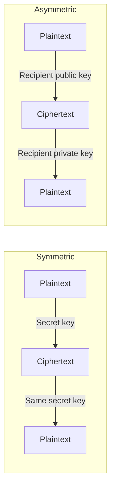

# Symmetric and Asymmetric Encryption

## 1. Overview

### A. Definition
> **Symmetric encryption** uses the **same secret key** for encryption and decryption, while **asymmetric encryption (public-key cryptography)** uses a mathematically paired **public/private key pair**, such that data encrypted with one key can only be decrypted with the other.

The fundamental difference between the two lies in "whether the key is shared or split." Symmetric cryptography requires the sender and receiver to **share the same secret in advance**, so it is fast but leaves the problem of delivering that secret securely. Asymmetric cryptography **splits the key into a public one and a secret one**, distributing the public key to anyone while only the owner keeps the private key. Thanks to this asymmetry, secure communication and identity proof become possible without prior sharing.

### B. Background and Necessity
Early ciphers were all symmetric, and as participants increased, **key distribution** became a challenge. For n people to communicate with one another, n(n-1)/2 secret keys are needed, and how to securely distribute these keys itself required yet another secure channel. In 1976, Diffie-Hellman proposed the concept of public keys and broke this circular problem, after which RSA was implemented as a practical algorithm. However, public-key operations are hundreds to thousands of times slower than symmetric ones, making them unsuitable for large data. So in practice, a hybrid structure is used—**exchanging keys asymmetrically and encrypting the body symmetrically**—to take only the advantages of both.

## 2. Comparison of Operation

In the symmetric scheme, a single secret key is used as-is on both the encryption and decryption sides, so computation is simple and fast. Block ciphers like AES are even supported by hardware acceleration (AES-NI), processing several GB per second. In contrast, asymmetric schemes rely for security on **mathematically hard problems** such as exponentiation of large integers and the difficulty of prime factorization (RSA) or the elliptic curve discrete logarithm (ECC), so computational cost is high. In exchange, publishing the public key does not allow the private key to be derived, eliminating the need to pre-share keys.

| Category | Symmetric encryption | Asymmetric encryption |
|---|---|---|
| **Key** | Same secret key | Public/private key pair |
| **Speed** | Fast | Slow (hundreds to thousands of times) |
| **Key distribution** | Difficult (prior sharing required) | Easy (public key distribution) |
| **Number of keys** | n(n-1)/2 | 2n |
| **Algorithms** | AES, SEED, ARIA, DES | RSA, ECC, ElGamal |
| **Use** | Bulk data encryption | Key exchange, digital signatures |

The difference in number of keys illustrates the core trade-off well. When 100 people communicate, symmetric requires managing about 4,950 keys, whereas asymmetric needs only 200—one pair each. In other words, **the more participants and the more open the environment without prior relationships, the more advantageous asymmetric encryption is**.

## 3. Security Services Provided

The choice of cryptographic method depends on which security services are needed. **Confidentiality** is provided by both symmetric and asymmetric, but for performance reasons, in practice the body is encrypted symmetrically and only the session key is protected asymmetrically. **Authentication and non-repudiation** are the unique strengths of asymmetric cryptography. When a sender **signs with their private key**, anyone can verify it with their public key, and since only the owner holds the private key, "they signed it" cannot be denied. **Integrity** is guaranteed by signing the hash of the original, so that if it is tampered with in transit, the hash differs and verification fails.

| Service | Realization |
|---|---|
| **Confidentiality** | Symmetric (body) + asymmetric (session key protection) |
| **Authentication and non-repudiation** | Private-key digital signature → public-key verification |
| **Integrity** | Hash (SHA-256) + signature |

## 4. Hybrid Scheme (Digital Envelope)

The representative design in which the two methods fill each other's limitations is the **digital envelope**. The sender generates a random **session key (symmetric)** to quickly encrypt the large body, and encrypts only that session key with the **recipient's public key (asymmetric)**, sending them together. The recipient recovers the session key with their private key and then decrypts the body. This way, slow asymmetric operations are used only on the small session key and fast symmetric operations on the large body, solving both performance and key distribution at once. The TLS handshake and S/MIME email encryption both follow this structure. For example, when connecting via HTTPS, the browser securely agrees on a symmetric session key using the public key in the server certificate, and then the actual web traffic is exchanged encrypted with AES.

## 5. Considerations and Implications
- **Key management equals security level**: Even with a strong algorithm, a leaked key renders it meaningless. Keys should be protected with an **HSM (Hardware Security Module)**, and the lifecycle of generation, distribution, destruction, and renewal must be controlled.
- **Maintain safe key lengths**: In preparation for increasing computing power, adopt AES-256, RSA-2048 or higher, or **ECC (e.g., 256bit ≈ RSA 3072bit)**, which achieves equivalent strength with shorter keys.
- **Prepare for transition to post-quantum cryptography (PQC)**: Shor's algorithm on quantum computers can break RSA and ECC, so a **PQC transition roadmap** based on NIST standards (CRYSTALS family) should be prepared proactively.
- **Requirements-driven design**: Combine symmetric, asymmetric, and hybrid schemes by considering performance, regulation, and interoperability together, and for domestic systems also consider requirements to use Korean algorithms such as SEED and ARIA.

---

> **In one line**: Symmetric encryption is *fast with the same secret key but makes key distribution difficult*, and asymmetric encryption is *advantageous for key distribution and digital signatures with public/private keys but slow*; in practice, they are combined in a hybrid—like the digital envelope—that protects the session key asymmetrically and encrypts the body symmetrically.
