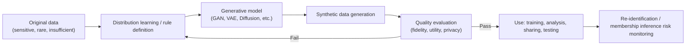
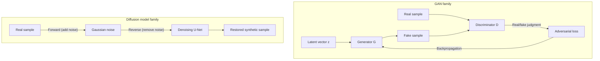

# Synthetic Data

## 1. Overview

> **Definition**: Synthetic data is **artificially generated data** that is not raw data collected directly from the real world, but instead learns or mimics—via rules or simulation—the **statistical distributions, correlations, and structural characteristics** of the original. It is designed to have utility similar to the original for analysis and training purposes without referring to any individual real-world entity.

The rise of synthetic data stems from the **fundamental tension between data utilization and privacy protection**. In the AI and data industry, the quantity and quality of training data directly determine model performance, yet high-quality data is hard to use freely because of regulations such as the Personal Information Protection Act and GDPR, trade secrets, and collection costs. De-identification measures (pseudonymization and anonymization) struggle to balance re-identification risk against information loss, and there is a dilemma in which the more data is removed, the more sharply utility drops. Synthetic data sidesteps this dilemma with an approach not of "transforming the original" but of "creating new data statistically resembling the original."

In addition, the **depletion of high-quality real data** is also pushing synthetic data forward. The high-quality text and images that can be collected from the internet are finite, and concern is growing that large models are rapidly exhausting them. Web-crawled data also carries risks of copyright and licensing disputes, so the strategic value of synthetic data—whose generation conditions can be controlled to produce desired quality and topics—rises relatively.

Another background factor is the **data imbalance and scarcity problem**. Events that occur extremely rarely in reality—such as fraudulent transactions, manufacturing defects, and rare diseases—lack training data, so models cannot learn them properly. In autonomous driving, actually collecting extreme situations (corner cases) such as a child suddenly running into the road is nearly impossible. Synthetic data is used for data augmentation and edge-case reinforcement by **deliberately generating such rare scenarios in bulk**. Gartner has projected that by around 2030 a substantial portion of the data used to train AI models will be replaced by synthetic data, and in practice the use of synthetic corpora is rapidly increasing in large language model (LLM) training as well.

The main characteristics of synthetic data are: ① it maintains **statistical similarity** with the original while individual records do not correspond 1:1 with real people; ② it can be **scaled and generated indefinitely** as needed; ③ labels can be assigned at generation time, **reducing annotation cost**; and ④ generation conditions can be adjusted to **control the distribution (controllable generation)**.

These characteristics make synthetic data not mere "fake data" but a **strategic means for data assetization and distribution**. Since the value of original data can be shared externally without directly moving or sharing it, it aligns with the safe data utilization pursued by data economy policies such as Korea's three data laws and MyData. However, as discussed later, the perception that "because it is synthetic, it is unconditionally not personal information" is dangerous, and it must be understood on the premise that its legal and technical status varies depending on generation quality and re-identification risk.

## 2. Overall Structure and Generation Types of Synthetic Data

A synthetic data generation pipeline consists of a stage that learns or defines the distribution of the original data, a stage that samples from that distribution to generate data, and a stage that evaluates the utility, privacy, and fidelity of the output. The conceptual diagram below shows the overall flow.

Unpacking the generation pipeline as a procedure: First, in the **requirements definition** stage, the goals are fixed—what to create (which columns, labels, scenarios), why (testing, training, sharing), and at what level of privacy and fidelity. Second, in **original data analysis and preprocessing**, missing values, outliers, and column types (categorical/continuous/time series) are identified, and sensitive fields are flagged. Third, in **generation method and model selection**, a technique matching the data type and goals is chosen and (if needed) combined with differential privacy. Fourth, in **generation and post-processing**, constraints are enforced (e.g., integrity rules such as age 0–120 and totals matching). Fifth, in **evaluation and verification**, fidelity, utility, and privacy are measured, and if targets are not met, the process returns to earlier stages. Sixth, in **deployment and monitoring**, dataset versions and lineage are recorded and re-identification risk is continuously observed. It is important that this procedure is not one-off but a cyclical structure that repeats according to evaluation results.

Synthetic data broadly divides into three branches by generation method. The first is **rule- and statistics-based generation**, which creates data using rules defined by domain experts, probability distributions (normal, Poisson, etc.), or the marginal distributions and correlation matrix of the original. It is simple to implement and explainable, but struggles to capture complex nonlinear relationships between variables. The second is **simulation- and agent-based generation**, which builds virtual environments with physics engines, game engines, or digital twins to create sensor and video data. It is particularly useful in autonomous driving and robotics. The third is **deep generative model-based**, in which GANs, VAEs, diffusion models, and transformers (LLMs) learn the joint distribution of the original and realistically generate even high-dimensional and unstructured data.

The table below compares the characteristics of the three branches. However, the table is merely an organizing aid; when and why each method is advantageous is explained in the following paragraphs.

| Method | Representative techniques | Strengths | Weaknesses | Suitable data |
|------|-----------|------|------|-------------|
| Rules/statistics | Distribution sampling, copulas | Explainable, low cost | Limited in expressing complex relationships | Structured (tables) |
| Simulation | Physics engines, digital twins | Automatic labels, edge cases | Gap from reality (domain gap) | Video, sensors |
| Deep generative | GAN, VAE, Diffusion, LLM | High fidelity, unstructured data | Training difficulty, mode collapse | Images, text, time series |

Rule- and statistics-based methods are suited to early test data involving almost no personal information or dummy data for software development. For example, when creating 100 million virtual transaction records for performance load testing of a financial system, loosely following the actual customer distribution suffices, so the statistical approach is economical. In contrast, training a fraud detection model requires reproducing even subtle correlations between normal and anomalous transactions, so deep generative methods are needed.

The reason simulation-based methods are advantageous is that **labels are known precisely at generation time**. Pedestrians and vehicles rendered in a virtual environment already have position, distance, speed, and occlusion information known at the pixel level, so the annotation cost of humans manually drawing bounding boxes effectively converges to zero. Having humans label 1 million real road images takes enormous cost and time, but simulation automatically generates the same scale. Thus the choice of generation method is a function of three axes—"data type (structured/unstructured)" and "required fidelity, label accuracy, and cost"—and in practice multiple methods are combined rather than insisting on only one.

## 3. Deep Generative Model-Based Synthesis Architecture

The core of deep-learning-based synthetic data is a generative model that approximates the probability distribution of the original data. The detailed architecture diagram below contrasts the generation principles of the representative GAN family and diffusion model family.

The three families differ fundamentally in their generation principles, and these differences create their strengths and weaknesses. GANs obtain sharp samples through competition with the discriminator but train unstably; VAEs are stable thanks to a probabilistic latent space but produce blurry output; diffusion models deliver top quality through multi-step denoising but generate slowly. None is universal, so selection should weigh required quality against generation cost and speed.

**GAN (Generative Adversarial Network)** trains a Generator and a Discriminator in competition with each other. The generator creates fake data from a latent vector, and the discriminator tries to distinguish whether it is real or fake. As the two neural networks adversarially converge to an equilibrium (Nash equilibrium), the generator increasingly produces data hard to distinguish from the original. For structured tabular data, CTGAN (Conditional Tabular GAN) is widely used, being specialized to handle mixed categorical/continuous columns and imbalanced distributions. However, GANs train unstably and carry the risk of **mode collapse**, repeatedly generating only certain patterns, making hyperparameter tuning tricky.

Taking CTGAN as an example, continuous columns such as sales and age often form multi-modal distributions, so simple normalization distorts their representation. CTGAN represents values per column as a mixture of several normal distributions (mode-specific normalization) and introduces conditional sampling (conditional vector) so that rare categories are not dropped from training, mitigating imbalance. The practical lesson is that such domain-specific design is necessary to secure utility for real tabular data, and using a generic GAN as-is greatly degrades performance.

**VAE (Variational Autoencoder)** encodes data into a low-dimensional latent space, then samples from that latent distribution and reconstructs (decodes) it. Training is more stable than GANs and the latent space is continuous, so interpolation is natural, but outputs tend to be somewhat blurry. Nevertheless, thanks to its stability and the interpretability of its latent space, it is still widely used for learning baseline distributions in anomaly detection and as a basis for conditional generation.

**Diffusion Model** learns to gradually add noise to the original until it becomes complete noise (forward process), then remove it step by step in reverse to restore data (reverse process). It currently shows top-level fidelity and diversity in image synthesis and has become the foundation of text-to-image generation such as Stable Diffusion. Recently, research applying diffusion models to tabular data as well (TabDDPM, etc.) is active.

**LLM-based synthesis** leverages the ability of transformer language models to generate sentences, code, and dialogue. In particular, to distill LLMs into smaller models, using high-quality instruction-response pairs created by a powerful teacher model as synthetic training data is becoming standard. However, phenomena have been reported in which the original model's biases are transferred as-is, or the distribution collapses when training repeatedly only on synthetic data—**model collapse**—so managing the mixing ratio of real and synthetic data has become important.

Which generative model to choose depends on data characteristics and constraints. For structured tables, techniques specialized to handle column heterogeneity and imbalance such as CTGAN and TabDDPM are advantageous; for images, diffusion models; for time series, recurrent and transformer families that preserve temporal dependencies; and for text, LLMs. Also, in regulated industries where privacy guarantees are mandatory, variants combined with differential privacy (DP-CTGAN, etc.) are considered first even at somewhat lower performance. In other words, the key is to choose not "the most realistic model" but "the model that fits the purpose and constraints," and this judgment is the very design decision a Professional Engineer should present.

## 4. Quality Evaluation: The Triangular Balance of Fidelity, Utility, and Privacy

The value of synthetic data is evaluated along three axes, which often conflict. Fidelity is further divided into univariate (distribution of each column) and multivariate (correlations and conditional relationships between columns). If only univariate distributions match while multivariate structure breaks, data is produced in which individual columns look plausible but column combinations are unrealistic, misleading models. **Fidelity** is how well synthetic data reproduces the statistical characteristics of the original, measured by per-column distribution comparison (KS statistic), correlation structure similarity, and the degree to which a discriminator model cannot distinguish original from synthetic (distinguishability). **Utility** is how well a model trained on synthetic data performs in real tasks, typically measured with the TSTR (Train on Synthetic, Test on Real) method—performance when training on synthetic data and validating on real data. The closer TSTR performance is to training on real data (TRTR), the more the synthetic data is judged usable as a substitute in practice. **Privacy** is the risk of leaking individual information of the original from the synthetic data, evaluated with membership inference attacks (inferring whether a specific record was used in training) or proximity attacks (whether synthetic records are too close to original records).

The key here is that **the three axes are in a trade-off relationship**. Pushing fidelity to the extreme amounts to nearly copying the original, collapsing privacy. Conversely, adding a lot of noise for privacy lowers utility. Therefore, in practice, **Differential Privacy** is combined with generative model training (e.g., DP-SGD) to provide a mathematical guarantee that "the generated result is statistically almost indistinguishable whether or not any one individual's data is included," and the balance point is quantitatively tuned with the privacy budget (ε). The smaller ε is, the stronger the privacy but the lower the utility.

A particular pitfall to watch for is that **average utility metrics mask the collapse of minority groups**. Even when overall accuracy or distribution similarity looks good, subgroups with a small share of the data can be underrepresented during synthesis, causing model performance for those groups to plummet. Therefore, utility evaluation must be checked not only with overall metrics but broken down by subgroup. Also, rather than judging synthetic data "pass/fail" with a single summary score, the practical principle is to manage it with a dashboard showing all three axes simultaneously and to set thresholds suited to business objectives on each axis.

DCR (Distance to Closest Record), frequently used in privacy evaluation, measures how far each synthetic record is from its nearest original record. If this distance is close to 0, it has effectively copied the original, which is a warning sign. However, blindly increasing distance harms utility, so a more refined approach is to compare with the distance distribution to a holdout (samples from the original not used in training) and judge relatively whether it is "unusually close only to the training originals."

The table below organizes the three evaluation axes and representative metrics. The practical principle is not to view each metric in isolation but to manage all three axes together in a dashboard.

| Evaluation axis | Question | Representative metrics/methods |
|---------|------|----------------|
| Fidelity | Is it statistically similar to the original? | Distribution KS test, correlation similarity, indistinguishability |
| Utility | Is it useful for real tasks? | TSTR, downstream model performance |
| Privacy | Does the original leak? | Membership inference attack success rate, DCR (distance to closest record) |

## 5. Industry Application Cases and Comparison

Synthetic data is already being proven in many industries. The reasons for choosing synthetic data differ slightly in each case. Finance takes **privacy and sharing constraints** as its primary motivation, healthcare **access restrictions and scarcity**, and autonomous driving and manufacturing **securing edge cases and labeling cost**. These differences split the generation method (structured deep learning vs. simulation) and validation focus (privacy vs. domain consistency).

In **finance**, since transaction data combined with personal information is hard to share with external fintechs and research institutions, synthetic transaction data statistically equivalent to the original is created and used for joint development of fraud detection models or regulatory sandbox testing. For example, credit card fraud accounts for only about 0.1–0.2% of all transactions, showing extreme imbalance, and augmenting anomalous transactions synthetically can meaningfully raise minority-class recall.

In **healthcare**, patient electronic medical records (EMR) are among the most sensitive data, so research access is limited. Generating synthetic EMRs enables algorithm development and validation without exposing real patients. However, minority cases such as rare diseases can become excessively similar to specific real patients during synthesis, so proximity checks and clinical validity verification must be performed in parallel. In particular, medical data has physiological constraints between test values (e.g., certain value combinations are clinically impossible), so matching statistical similarity alone is not enough; post-hoc validation based on domain rules is essential.

In **autonomous driving and manufacturing**, simulation-based synthesis is the mainstay. Driving videos and labels combining various weather, lighting, and pedestrian behaviors are automatically generated with game engines, training models in bulk on dangerous situations difficult to secure through real-road collection. The crux here is reducing the **domain gap**—the statistical difference between virtual and real—with domain adaptation techniques. In manufacturing too, cases are increasing in which defect images with extremely low defect rates of a few hundred ppm are augmented synthetically to improve the defect detection performance of vision inspection models, and combined with digital twins, even equipment failure scenarios can be generated virtually.

Cases in the **text/LLM** area are also rapidly increasing. Data such as call center consultation logs, where personal information and sensitive utterances are mixed, is hard to use for training as-is, so synthetic dialogues preserving utterance intent, emotion, and scenarios are generated to train consultation bots and summarization models. Also, by synthesizing scarce instruction-response data in specific domains (legal, medical) with a larger model and distilling a small model, domain-specific performance can be secured without collecting real data. In this case, however, validation filters must be in place so that factual errors (hallucinations) do not creep into the training data.

Comparing synthetic data with existing de-identification measures makes the difference clear. Pseudonymization and anonymization transform identifiers while keeping the original records, so **a 1:1 correspondence with the original remains** and re-identification risk persists, and information is lost as deletion and categorization proceed. In contrast, synthetic data generates new records, so there is no 1:1 correspondence with the original at all, removing the starting point for re-identification. However, this does not mean "synthetic is unconditionally safe." An overfitted generative model can effectively memorize and copy the original, so the practical implication is that synthetic data also requires privacy risk assessment. In short, de-identification is a "subtracting" approach and synthesis is a "re-creating" approach, and each manages residual risk differently.

## 6. Advanced: Latest Trends and Changes in Standards and Regulation

The institutional and technical environment surrounding synthetic data is rapidly taking shape. On the regulatory side, the **EU AI Act** explicitly mentions synthetic data in the context of bias mitigation and data governance, providing grounds for its use, and in the United States and elsewhere it is drawing attention as a privacy-enhancing technology. In Korea as well, discussions on guidelines for using pseudonymized information and synthetic data continue, centered on the Personal Information Protection Commission and related agencies, and the legal status of synthetic data (criteria for determining whether it is personal information) is expected to be a key issue going forward. At present, a cautious approach—"synthetic data does not automatically become non-personal information; it is judged based on re-identification risk assessment results"—is common, so definitive statements should be avoided.

Along with this, discussion on **labeling and tracing the provenance of synthetic data** is also emerging. As demands for watermarking and provenance for generative AI content strengthen, recording whether data is synthetic and its generation lineage in metadata—so that synthetic data being trained on and circulated is not mistaken for real data—is becoming a condition for trustworthiness. This naturally meshes with data lineage and data catalog management.

In terms of technology trends: first, **differential-privacy-combined generation** (DP-GAN, PATE-GAN, etc.) is becoming the standard approach for mathematically guaranteeing privacy. Second, the trend of **extending diffusion models to structured data** to replace GANs is strengthening. Third, along with the **surge in the share of synthetic data** in LLM training, real-data anchoring and curation to prevent the aforementioned model collapse has become an important research topic. Fourth, **open-source evaluation frameworks** (e.g., the SDMetrics family) and benchmarks for consistently evaluating the quality and privacy of synthetic data are spreading, and the practical bottleneck is shifting from "generation" to "validation." Likely exam directions include ① comparison of synthetic data and de-identification measures, ② the fidelity–utility–privacy trade-off and combination with differential privacy, and ③ designing application scenarios for specific industries (finance, healthcare, autonomous driving).

## 7. Considerations and Implications

- **Continuous verification of residual privacy risk**: One must not conclude it is safe merely because it is synthetic. A governance framework is needed that regularly checks whether the generative model overfits or memorizes using membership inference and proximity metrics, and explicitly manages the differential privacy budget (ε). A quality gate is needed so that synthetic data failing privacy verification is not distributed or shared.

- **Preventing the transfer and amplification of bias**: Synthetic data learns the original's biases (gender, race, regional skew) as-is, and underproducing minority groups can actually amplify bias. Therefore, a strategy is required that controls generation conditions to reinforce minority-group representation and monitors the fairness metrics of downstream models together.

- **Aligning the utility–privacy balance with business goals**: Which axis to prioritize depends on the business and regulatory context. An effective approach is to define goals first—prioritizing privacy for externally shared or public datasets, and utility for internal model performance improvement—and then back-calculate ε and fidelity targets.

- **Internalizing quality evaluation and validation (related technologies)**: The bottleneck of synthetic data is not generation but trustworthy validation. Versions, lineage, and evaluation results of synthetic datasets should be tracked in connection with MLOps, data observability, and model registries, and managed as reproducible pipelines.

- **Managing domain gap and real-world consistency**: In simulation-based synthesis, the virtual–real distribution difference determines performance. The gap should be reduced with domain adaptation and small amounts of mixed real data (hybrid), and a procedure of always validating with real data (TSTR) before real-environment deployment should be standardized.

- **Enforcing integrity and business rules**: Even if statistically plausible, synthetic data can violate domain constraints (referential integrity, totals matching, physical/physiological limits). A rule validator should be placed in the post-generation processing stage to filter out violating records so they can be trusted downstream, and it is desirable to operate this in connection with data quality management and data contracts.

- **Clarifying governance and accountability**: The basis for generating synthetic data (original source, scope of consent), purpose of use, and distribution targets should be documented, and internal criteria and approval procedures should be in place for determining whether it is personal information based on re-identification risk assessment results. The complacent premise that "synthetic means outside regulation" may come back as legal risk.

- **Outlook**: With tightening data regulation overlapping with the depletion of high-quality data, synthetic data appears set to move from an option to essential infrastructure. However, the misconception that "synthetic means regulation-free" and the risk of model collapse remain, so a hybrid data strategy that strategically blends real and synthetic data and continuously validates it will be a key task from the Professional Engineer's perspective.

## References

- Gartner, "Maverick Research: Forget About Your Real Data — Synthetic Data Is the Future of AI" — https://www.gartner.com/en/documents/4002912
- NIST, Differential Privacy materials — https://www.nist.gov/blogs/cybersecurity-insights/differential-privacy-future-work-and-open-challenges
- EU AI Act official portal — https://artificial-intelligence-act.eu/
- SDV (Synthetic Data Vault) / SDMetrics project — https://docs.sdv.dev/

---

> **In one line**: Synthetic data is artificially generated data that mimics the statistical characteristics of the original, enabling privacy protection, data augmentation, and reinforcement of rare scenarios; it is the core of a hybrid data strategy in which the fidelity–utility–privacy trade-off must be managed through differential privacy and continuous validation.
