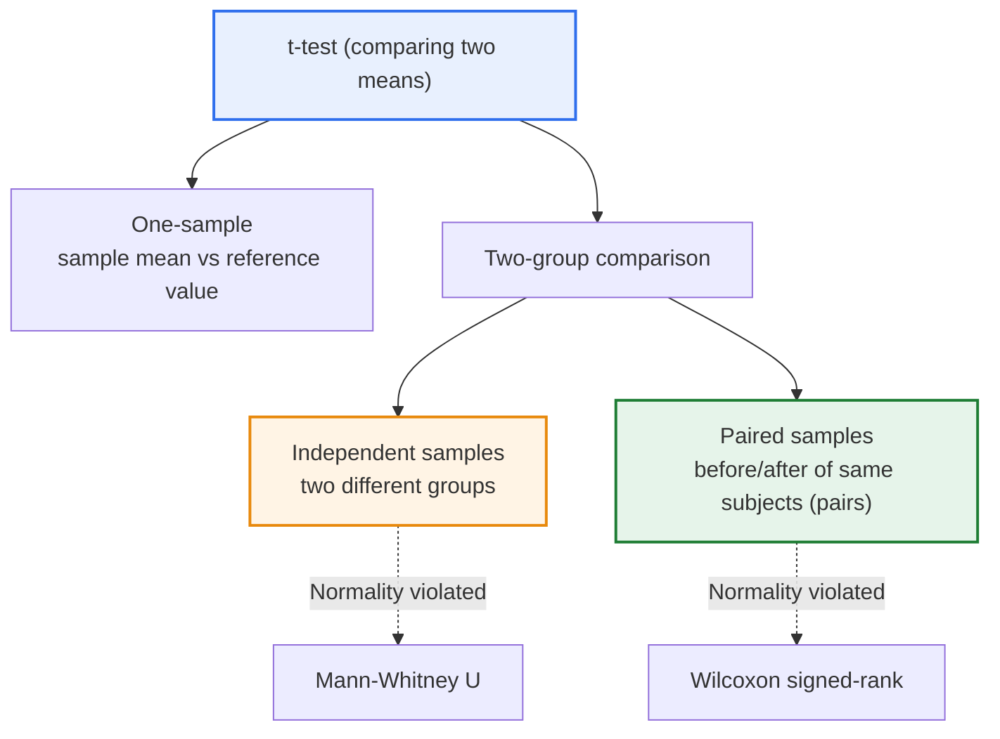
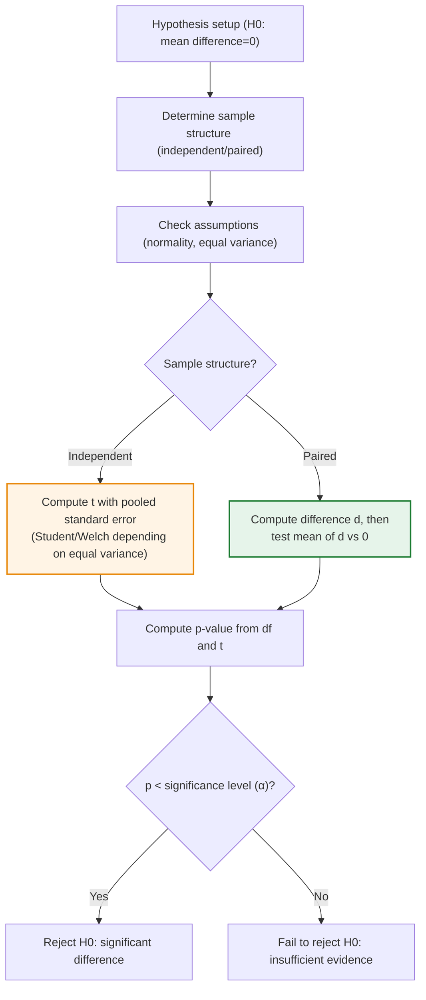

# Comparing the Independent Samples t-test and the Paired Samples t-test

## 1. Overview

### A. Definition

> The **t-test** is a parametric test that uses the t-distribution to determine whether the difference in means between two groups is due to chance in sampling or is a statistically significant real difference. Among these, the **independent samples t-test** compares the means of two unrelated groups, while the **paired samples t-test** compares the difference between two paired values from the same subjects, such as before and after.

The decisive criterion separating the two tests is "**whether the two samples are independent of each other or paired (matched)**." For example, if comparing the grades of students in Class A and Class B, the two groups consist of different people and are mutually unrelated, so they are **independent samples**. In contrast, if a particular training is given to the same students and their grades before and after training are compared, each data point is paired along the axis of "the same person," so they are **paired samples**. On the surface both appear to "compare two means," but the data generation structures are fundamentally different.

This structural difference matters because in paired samples, **individual differences (between-subject variation)** such as each person's baseline ability or constitution **can be canceled out via the difference value (d)**. In independent samples, individual differences—"people who were originally good and people who were not are mixed together"—remain as noise (error), blurring the effect of the treatment. But in paired samples, only the same person's before-after difference is examined, so the person's original score is eliminated and only the "amount of change" remains. Removing the noise of individual differences reveals the pure effect of the treatment (e.g., training) more clearly and consequently **raises statistical power (the probability of detecting a real effect as significant when it exists)**. Later we examine concretely how this difference appears in the formula for the test statistic.

### B. Necessity and Background

Simply comparing the means of two groups and concluding "the mean rose by 3 points, so the training was effective" is risky. A sample is a portion drawn from a population, so its mean varies by chance every time it is drawn. That is, the observed 3-point difference may be due to a real effect, but it may just be that "this sample happened to come out that way." To distinguish the two, the t-test divides the observed difference by the standard error of that difference, **quantifying as a t statistic the degree to which the difference exceeds the range of chance**, and converts it into a probability (p-value) for judgment.

Here, the way the "standard error of the difference" is calculated differs depending on whether the samples are independent or paired, so **only by choosing the test that fits the sample structure does the interpretation of the p-value become valid**. Using the wrong test either wastes power (applying an independent samples test to paired data) or presupposes assumptions that do not hold, leading to wrong conclusions. The t-test itself is a classical method devised to test means using the t-distribution instead of the normal distribution even with small samples, and it is widely used in practical situations where sample sizes are small and the population variance is hard to know (quality control, clinical trials, social surveys).

## 2. Structure Distinguishing the Two Tests

The t-test branches in several ways depending on the number of comparison targets and the sample structure. The structure diagram below shows at a glance where independent and paired samples sit within the overall t-test landscape, and which non-parametric alternatives follow when assumptions break down.

As this figure shows, independent and paired samples both fall under "two-group comparison" but branch at the point where the sample structure diverges. Also, each test is replaced by a corresponding non-parametric (rank-based) test when the normality assumption does not hold, and it is worth remembering that these replacement paths pair up with each other (independent ↔ Mann-Whitney U, paired ↔ Wilcoxon signed-rank). Comparing three or more groups goes beyond the t-test framework and extends to analysis of variance (ANOVA), which is covered later in the considerations.

## 3. Test Statistic Calculation and Decision Procedure

How the two tests actually differ is most clearly revealed in how the test statistic t is calculated. The procedure diagram below shows the flow from data input to conclusion (whether to reject the null hypothesis), including the point where the independent and paired paths diverge. If the earlier structure diagram showed "which tests exist," this procedure diagram shows "in what order a single analysis is performed."

**A) Test statistic of the independent samples t-test.** For independent samples, t is obtained by dividing the difference in the two group means (x̄₁ − x̄₂) by the standard error combining the variation of both groups. Here the standard error is computed from each group's sample variance and sample size; if the two groups' variances can be assumed equal, the Student t-test using pooled variance is used, and if the variances differ, the Welch t-test is used. That is, in independent samples the "individual differences" of both groups are all reflected in the denominator (error), so the larger the individual differences, the smaller t becomes and the harder it is to detect significance. In practice, because the equal-variance assumption is often precarious, many recommend the Welch test as the default.

**B) Test statistic of the paired samples t-test.** Paired samples take a fundamentally different approach. First, the difference for each pair dᵢ = (after − before) is computed, and then it is tested whether the mean of these differences d̄ is 0. As a result, the test effectively reduces to a one-sample t-test on "a single sample of differences." In this process, each individual's absolute level (original ability) is eliminated by subtraction and only the amount of change remains, so the major noise source of individual differences is removed from the denominator. This is exactly why, for an effect of the same size, paired samples have a smaller standard error, a larger t value, and higher power. However, the required assumption changes from "normality and equal variance of the two groups" to a single one: "normality of the differences d."

**C) Common decision procedure.** Both tests share the procedure: ① hypothesis setup (null hypothesis H₀: mean difference = 0, alternative hypothesis H₁: mean difference ≠ 0) → ② check sample structure and assumptions → ③ compute the t statistic and degrees of freedom → ④ obtain the p-value from t and compare it with the significance level (α, usually 0.05). If the p-value is less than α, the null hypothesis is rejected on the view that "the probability of a difference this large appearing by chance is very low," and a significant difference is judged to exist; otherwise, the conclusion is "there is insufficient evidence of a difference." Note here that being not significant is not "proof that there is no difference."

**D) Using effect size and confidence intervals together.** A point to emphasize in practical answers is that conclusions should not be drawn from p-values alone. With very large samples, even trivial differences come out significant, and with small samples, real effects may come out non-significant. Therefore, it is desirable to present the effect size (e.g., Cohen's d), which indicates the "magnitude" of the difference, together with the confidence interval of the mean difference (95% CI), interpreting "statistical significance" and "practical importance" separately.

## 4. Comparison and Application Cases

The differences between the two tests are summarized in the table below. However, the table is only a summary; as explained earlier, the key point is that the difference stems from the data structure—"whether individual differences are left as error or eliminated via difference values."

| Category | Independent samples t-test | Paired samples t-test |
|---|---|---|
| **Sample structure** | Two mutually independent groups | Two paired values (same subjects) |
| **Test target** | Difference between two group means | Whether the mean of differences (d) is 0 |
| **Handling of individual differences** | Included as-is in error | Canceled out (eliminated) via differences |
| **Key assumptions** | Normality + equal variance (or Welch) | Normality of differences d |
| **Power** | Relatively low | Relatively high due to canceling individual differences |
| **Non-parametric alternative** | Mann-Whitney U | Wilcoxon signed-rank |
| **Typical examples** | Male/female salary, A/B group performance | Weight before/after diet, before/after training |

**Case 1 — New drug clinical trial.** Administering a new drug and a placebo to different patient groups and comparing the degree of blood pressure reduction is independent samples. In contrast, measuring and comparing the same patients' blood pressure before and after dosing is paired samples. The latter removes differences in baseline blood pressure and constitution across patients, so drug efficacy can be detected more sensitively even with a small sample of, say, 30 people. However, in a paired design, the "effect of naturally decreasing over time" can mix with drug efficacy, so design supplementation such as a separate control group is needed.

**Case 2 — A/B testing.** Showing an existing screen (A) and a new screen (B) to different visitor groups on a website and comparing purchase conversion rates is an independent samples structure, because visitors cannot be paired. In situations where subjects cannot be measured repeatedly, the independent samples test is the natural choice, and in this case securing a sufficient sample size to offset individual-difference noise is the key to securing power.

**Case 3 — Measuring training effectiveness.** Having the same 40 trainees take a pre-test, then take a post-test again after training and testing the score change, is paired samples. The difference between students with originally high and low scores is eliminated and only "each person's improvement" is evaluated, so the pure effect of training is clearly revealed. However, the "learning effect (practice effect)" whereby the experience of taking the pre-test itself raises post-test scores can intervene, and if not controlled, there is a risk of overestimating the training effect.

Looking at this third case with numbers makes the difference between the two tests clearer. Suppose the mean of 40 students rose 5 points from 70 before to 75 after. If each student's improvement is fairly uniform around 5 points (e.g., +3 to +7), the standard deviation of the differences d is small, so the paired test's t value is large and it easily becomes significant. But if the same data is treated as independent samples as if before and after were two different groups, the variation in individual students' ability (e.g., 40–95 points) enters the denominator's error as-is, enlarging the standard error and shrinking the t value, so the 5-point effect that actually exists may be judged non-significant. The fact that with the same data and same mean difference, the conclusion can flip depending on how the sample structure is viewed starkly shows why choosing the test that fits the sample structure matters.

## 5. Advanced — Handling Assumption Violations and Extensions

To use t-tests properly in practice, one must understand assumption checking and choosing alternatives, together with extension to multiple groups and factors.

**A) Assumption violations and non-parametric alternatives.** The t-test is a parametric test that presupposes normality (and, for independent samples, equal variance). If the sample is small and the data deviates substantially from normality (e.g., severe skewness, outliers), the normality assumption breaks down and the p-value is distorted. In this case, it is replaced with a rank-based non-parametric test: independent samples switch to the Mann-Whitney U test and paired samples to the Wilcoxon signed-rank test. Normality is somewhat relaxed with large samples thanks to the central limit theorem, but with small samples it is safer to check in advance with the Shapiro-Wilk test or a Q-Q plot. Equal variance is checked with the Levene test and the like, but since one can simply use the Welch test instead of Student when it is violated, there is a trend in practice to use Welch as the default.

**B) The multiple comparison problem and extension to ANOVA.** When comparing three or more groups, repeating the t-test for each pair of groups inflates the probability of at least one result coming out significant by chance (Type I error), which accumulates as the number of comparisons grows. For example, testing several pairs at a significance level of 0.05 makes the overall Type I error rate far exceed 0.05. So three or more groups are tested at once with analysis of variance (ANOVA), and only if significant are post-hoc tests (Tukey HSD, etc.) or multiple comparison corrections (Bonferroni, etc.) applied. When a paired structure repeats, it extends to repeated measures ANOVA. In other words, it is important to understand that the t-test is a special case of two-group comparison, on a continuum whose higher general forms are ANOVA and regression analysis.

**C) Position in the data analysis and machine learning context.** Today, the t-test remains a basic tool in A/B testing, model performance comparison (the paired t-test is often used to test the difference in cross-validation performance between two models), and experimental design. However, in large-scale, multivariate data environments, methods such as regression, mixed-effects models, and the bootstrap are used together rather than a single t-test, with the t-test serving as the starting point and providing intuition for interpreting results.

**D) Common errors and practical cautions.** First, the error of confusing one-tailed and two-tailed tests. Using a one-tailed test without prior grounds for direction artificially inflates significance, so two-tailed tests should be the default unless there is a special reason. Second, the error of missing a paired structure. Treating before-after data from the same subjects as two independent columns and applying an independent samples test loses the advantage of the paired design—canceling individual differences—and lowers power. Third, neglecting outliers. Since the t-test is based on means and variances, a few extreme values can greatly shake the result, so the distribution should be visualized in advance and the cause of outliers confirmed. Such checks contribute directly to securing the reproducibility and reliability of test results.

## 6. Expected Exam Directions and Answer Composition Strategy

In the Professional Engineer exam, the t-test topic may appear as a short-answer question on "the difference between the two tests and selection criteria," or as an essay question of the form "given an experimental/data analysis scenario, select and justify the appropriate test." An effective answer flow is to ① first present the definitions of the two tests and the difference in sample structure, ② explain in principle how that difference appears in the test statistic (inclusion of individual differences in error vs. elimination via differences), ③ secure depth by mentioning assumptions, non-parametric alternatives, and effect size, and ④ close with the link that three or more groups extend to ANOVA. Explaining in sentences "why paired samples have higher power," rather than merely listing tables, creates distinction.

Also, as data-driven decision-making, quality management, and AI model validation have recently been emphasized, a perspective is required that views statistical testing not as an "analysis tool" but as "a means of securing the validity of decision grounds." Therefore, rather than stopping at a mechanical listing of test procedures, an answer that connects sampling design appropriateness, assumption checking, and practical interpretation of results (effect size, uncertainty) to describe "why statistical rigor leads to trustworthy conclusions" achieves Professional Engineer-level completeness.

## 7. Considerations and Implications

1. **Sample structure must be determined first at the experimental design stage.** Since the test follows the structure in which the data was produced, whether independent or paired should be decided at design time, not by choosing a test after all data is collected. Misjudging the structure and applying an independent samples test to paired data throws away the advantage of canceling individual differences, while the opposite misapplication is the error of assuming a pairing relationship that does not exist.

2. **Where possible, a paired (repeated measures) design is advantageous in terms of power.** Repeatedly measuring the same subjects controls individual differences, achieving high power even with fewer samples, which brings large advantages in cost and ethics. However, biases such as learning effects, order effects, and natural changes over time can intervene, so they must be controlled through order randomization and control groups for results to be valid.

3. **Always keep assumption checks and non-parametric alternatives in mind.** Passing over normality and equal-variance assumptions only formally makes p-values lose credibility. With small samples and non-normal data, replacing with non-parametric tests such as Mann-Whitney U and Wilcoxon signed-rank, and using the Welch test when equal variance is doubtful—choosing methods suited to data characteristics—determines the validity of conclusions.

4. **Avoid interpreting p-values alone; view them together with effect size and confidence intervals.** Since significance can be over- or underestimated depending on sample size, statistical significance (p-value) and practical importance (effect size, confidence interval) must be reported separately. From a Professional Engineer's and practitioner's perspective, an attitude is required that goes beyond the "significant/not" dichotomy, presenting the magnitude and uncertainty of the difference together and linking them to decision-making.

5. **Understand the extension path to multiple groups and factors.** In comparisons of three or more groups, repeating t-tests causes accumulated Type I error, so extend to ANOVA; in repeated-measures and multi-factor structures, generalize to repeated measures ANOVA, regression, and mixed models. A perspective is needed that positions the t-test not as an isolated technique but as the basic unit of the statistical hypothesis testing framework.

---

> **In one line**: The independent samples t-test tests *the mean difference between two different groups*, while the paired samples t-test tests *whether the mean of paired differences (d) from the same subjects is 0*; since paired samples cancel individual differences via differences and thus have higher power, the sample structure should be fixed at the experimental design stage and the test chosen considering assumptions and effect size together.
