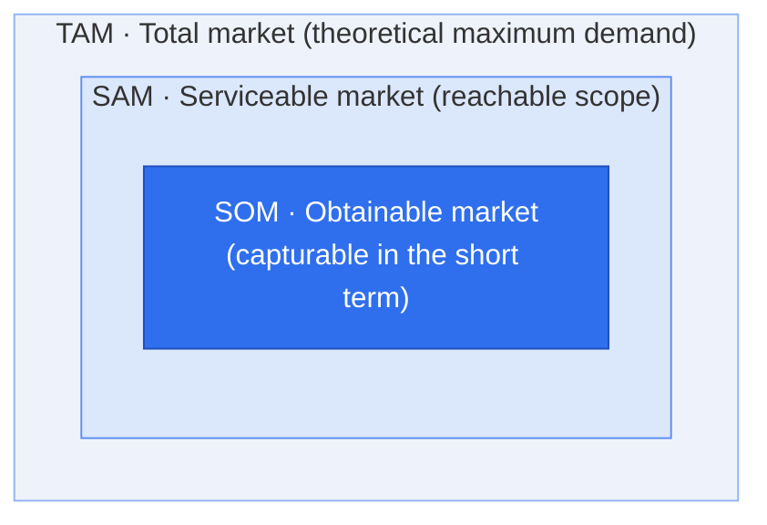

# TAM-SAM-SOM — A Market Sizing Framework

## 1. Overview

### A. Definition
> A framework that estimates the **market size of a new business or product by progressively narrowing it through three concentric layers** (TAM → SAM → SOM), quantifying everything from theoretical total demand to the market the company can actually capture, thereby presenting both business feasibility and targets.

The core idea of TAM-SAM-SOM is to **connect in a single logical flow** the appeal of "the market is big" with the realism of "how much we can actually capture." Presenting only a large total market makes it look infeasible, while presenting only a small target makes it look like it lacks growth potential. The structure of narrowing through three layers builds a logical bridge between the two, explaining step by step through which assumptions and constraints the total market shrinks to an attainable target.

### B. Background and Necessity
In investment reviews (IR) or business plans, founders must prove two things at once. One is whether this market is **big enough to invest in**, and the other is how much of it we can **realistically capture**. Since the statement "the total market is worth trillions" alone cannot prove feasibility, a method of narrowing to a well-grounded target through stepwise reduction is needed. This framework provides a quantitative basis for resource allocation, entry strategy, and revenue target setting, and is widely used in particular as a tool for investors to verify founders' market understanding and the rationality of their assumptions.

## 2. Layer Structure (Concentric Diagram)



> Inclusion relationship: **TAM ⊇ SAM ⊇ SOM**

It is no accident that the three layers are drawn as concentric circles (inclusion relationships). Each stage narrows inward by **applying realistic constraints one at a time** to the outer market. Applying business model, region, and channel constraints to TAM yields SAM, and applying competition, company capability, and time constraints to that yields SOM. In other words, moving inward shifts from "possibility" to "reality," and this narrowing process itself reveals the business's strategic choices.

### Market Size Share (Example)

```chart
{
  "type": "doughnut",
  "data": {
    "labels": ["SOM · Obtainable market", "SAM · Serviceable market (excl. SOM)", "TAM · Total (excl. SAM)"],
    "datasets": [{
      "data": [5, 25, 70],
      "backgroundColor": ["#2f6fed", "#7aa5f3", "#d7e3fb"],
      "borderColor": "#ffffff",
      "borderWidth": 2
    }]
  },
  "options": {
    "plugins": {
      "legend": { "position": "bottom" },
      "title": { "display": true, "text": "Share of SAM · SOM relative to TAM (unit: %)" }
    }
  }
}
```

## 3. Definition of Each Layer

Each layer asks a different question. **TAM** asks for the theoretical maximum—"What if everyone with this problem bought our product category?"; **SAM** asks about reachability—"What scope can we actually serve with our business model, region, and segment?"; and **SOM** asks about obtainability—"Given competition and our capabilities, what share can we actually capture within 1–3 years?" For example, if building a SaaS for SMEs, the entire domestic cloud market is TAM, SaaS targeting SMEs within it is SAM, and the revenue corresponding to a 5% target market share within 3 years is SOM.

| Layer | Name | Definition | Example (perspective) |
|---|---|---|---|
| **TAM** | Total Addressable Market<br>(total market) | **Total demand theoretically reachable** by the product/service. The maximum market ignoring competition and constraints | "Size of the entire domestic cloud market" |
| **SAM** | Serviceable Addressable Market<br>(serviceable market) | The portion of TAM **actually serviceable with the company's business model, region, segment, and channels** | "Domestic SaaS market for SMEs" |
| **SOM** | Serviceable Obtainable Market<br>(obtainable market) | The share of SAM **actually capturable within a short period (1–3 years)**. Reflects competition, capabilities, and marketing | "Revenue from a 5% target share within 3 years" |

## 4. Market Sizing Methods

The choice of sizing method depends on **the available data and the maturity of the market**. **Top-down** works down from research firms' industry statistics by multiplying segment ratios, so it is fast, but it inherits others' assumptions as-is and is prone to **overestimation**. **Bottom-up** builds up from ground-level units such as number of customers × unit price (ARPU) × purchase frequency, so securing data is cumbersome but it is far more persuasive. **Value theory** estimates, for innovative products with no market yet, based on the value customers perceive and their willingness to pay (WTP), but it is highly subjective. Thus in practice, the highest reliability comes from setting the upper bound of TAM with Top-down and building SAM and SOM with Bottom-up, **cross-validating** the two results. If the results of the two methods diverge greatly, it is a signal that there is an error somewhere in the assumptions.

| Method | Description | Characteristics |
|---|---|---|
| **Top-down** | Narrow down from industry statistics/research (total market) by segment ratios | Fast but risk of **overestimation**, dependent on source data |
| **Bottom-up** | Estimate by **accumulating unit data** such as number of customers × unit price (ARPU) × purchase frequency | Realistic and highly persuasive, burden of securing data |
| **Value theory** | Estimate based on **value perceived by customers and willingness to pay (WTP)** | Suited to new markets and innovative products, subjectivity exists |

> In practice, setting **TAM with Top-down** and cross-validating **SAM and SOM with Bottom-up** yields high reliability.

## 5. Considerations and Implications (Professional Engineer's Perspective)

The most common failures when using this framework in practice are **mixing criteria across layers** and **optimistically inflating SOM**. If revenue and user counts are used differently at each layer, the concentric logic breaks, so units of measurement and periods must be unified; and SOM gains credibility only when it soberly reflects competitive intensity, company capabilities, and GTM (Go-to-Market) strategy. Also, since markets are not static, the growth rate (CAGR) should be presented together to supplement a dynamic perspective, and all assumptions and sources should be documented to secure verifiability.

1. **Consistent criteria** — Unify measurement units (revenue, volume, etc.) and periods across layers
2. **Realism of SOM** — Guard against overestimation by reflecting competitive intensity, company capabilities, and GTM strategy
3. **Explicit grounds and assumptions** — Document sources and assumptions to secure verifiability
4. **Dynamic perspective** — Present market growth rate (CAGR) along with static figures
5. **Stage-appropriate use** — Focus on TAM attractiveness in early IR and on SOM attainability in the execution stage
6. **Linking techniques** — Strengthen consistency by linking with Bottom-up demand forecasting and the customer segments of the Business Model Canvas

---

> **In one line**: A framework that estimates market size by narrowing it *total (TAM) → serviceable (SAM) → obtainable (SOM)* while applying constraints one at a time, a tool that cross-validates Top-down and Bottom-up to quantitatively present **an attractive market + a realistic target** at the same time.
