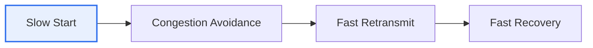

# TCP Congestion Control

## 1. Overview

### A. Definition
> A TCP mechanism that **mitigates congestion by adjusting the sending rate when congestion (packet overload) occurs in the network**. Unlike flow control, which matches the receiver's processing speed, it deals with the load on the network as a whole.

The fundamental reason congestion control is needed is **"preventing congestion collapse."** If multiple senders ignore network conditions and pour out data indiscriminately, the queues of intermediate routers overflow and packets are dropped. Senders then retransmit the lost packets, and these retransmissions further aggravate congestion in a vicious cycle, eventually causing a collapse in which network throughput converges to zero. To prevent this, TCP makes a clever assumption. In wired networks where wireless errors are rare, it **interprets packet loss as a signal of congestion**, and when loss is detected, it reduces its own transmission volume. In other words, individual endpoints (TCP) cooperatively regulate their rates to protect the network as a shared resource.

### B. Necessity
The internet is a resource shared by countless endpoints, so if each insists on its own rate, the whole collapses. Congestion control is the key mechanism by which endpoints autonomously cooperate to keep the network stable.

## 2. Components of the Congestion Control Mechanism

Congestion control operates with four elements. **Slow start** rapidly grows the congestion window (cwnd) exponentially from 1 (1→2→4→8) at the start of a connection to probe available bandwidth, stopping when it reaches the threshold (ssthresh). **Congestion avoidance** increases the window linearly by 1 after the threshold, cautiously increasing bandwidth. **Fast retransmit** immediately retransmits the lost packet when 3 duplicate ACKs arrive, without waiting for a timeout. **Fast recovery** returns to the congestion avoidance state after retransmission rather than going back to slow start, preventing a sharp drop in rate.

| Component | Description |
|---|---|
| **Slow start** | cwnd exponential increase (1→2→4…), up to ssthresh |
| **Congestion avoidance** | Linear increase (by 1) after the threshold |
| **Fast retransmit** | Immediate retransmission on 3 duplicate ACKs |
| **Fast recovery** | Return to congestion avoidance after retransmission |

## 3. Detecting Congestion

TCP detects congestion through two signals. A **timeout (RTO)** indicates severe loss with no response for a long time, signifying strong congestion, so the window is greatly reduced (reset to 1). **Three duplicate ACKs** indicate a mild situation where only some packets are lost, handled with fast retransmit and recovery. Recently, **ECN (Explicit Congestion Notification)**, in which routers signal congestion in advance with bits before loss occurs, is also used.

| Signal | Meaning |
|---|---|
| **Timeout (RTO)** | Severe loss → cwnd reset |
| **3 duplicate ACKs** | Mild loss → fast retransmit and recovery |
| **ECN** | Router notifies congestion before loss |

## 4. Congestion Control and the Congestion Window (cwnd)

The key variable, the **congestion window (cwnd)**, represents the amount of data that can be sent without yet being acknowledged—that is, the transmission rate. The actual transmission volume is determined by the **smaller** of the congestion window and the receive window (rwnd) (since both must be satisfied). When congestion is detected, the threshold (ssthresh) is lowered to half the current cwnd, cwnd is reduced, and then it is gradually increased again. This sawtooth pattern of repeatedly "increasing, then decreasing on loss" is characteristic of TCP congestion control.

| Algorithm | Characteristics |
|---|---|
| **Tahoe** | Returns to slow start on loss |
| **Reno** | Introduced fast recovery |
| **CUBIC** | Optimized for high bandwidth and high latency (Linux default) |
| **BBR** | Based on bandwidth and RTT estimation (Google) |

## 5. Considerations and Implications

1. **It is evolving from loss-based to model-based.** Traditional Reno and CUBIC use loss as a congestion signal, but Google's BBR directly estimates bandwidth and delay to find the optimal rate even without loss.
2. **Choosing an algorithm that fits network characteristics** is important. The low-latency, high-bandwidth environment of a data center and the high-loss environment of wireless and satellite links have different optimal algorithms, so tuning to the environment is needed.
3. **It is developing toward responding before loss with active congestion signals (ECN).** Rather than signaling by dropping packets, receiving advance notification and adjusting preemptively can reduce retransmissions and lower latency.

---

> **In one line**: TCP congestion control adjusts the congestion window (cwnd) in a sawtooth pattern via *slow start, congestion avoidance, fast retransmit, and fast recovery*, detects congestion through timeouts and duplicate ACKs to reduce transmission volume and prevent congestion collapse, and is evolving with BBR and ECN.
