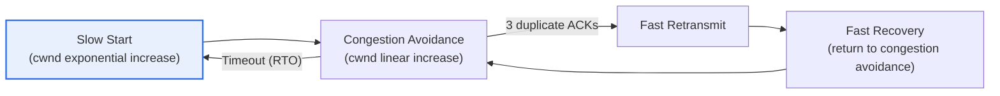
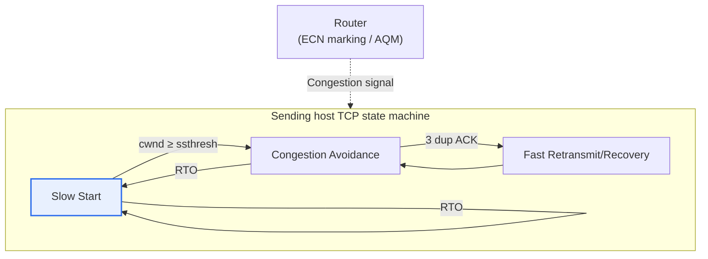

# TCP Congestion Control

## 1. Overview

### A. Definition
> TCP's end-to-end control mechanism that **self-adjusts the sending rate (congestion window) to relieve and avoid congestion when congestion (packet overload) occurs inside the network**. If flow control, which matches the processing speed of the receiver's buffer, is about 'protecting the receiver,' congestion control aims at 'protecting shared network resources' such as routers and links.

The fundamental reason congestion control is needed is '**preventing Congestion Collapse**.' When multiple senders pour out data while ignoring network conditions, the output queues of intermediate routers overflow and packets are dropped (tail drop). The senders then retransmit the lost packets, and this retransmission again grows the queues, causing a vicious cycle that invites more loss. Eventually a collapse occurs in which the link is full of retransmission traffic while effective throughput (goodput) converges to zero. In fact, in 1986, in the early Internet, a congestion collapse was observed in which throughput momentarily dropped by a factor of hundreds; prompted by this, Van Jacobson introduced the slow start and congestion avoidance algorithms, which is the starting point of today's TCP congestion control.

To solve this problem, TCP makes one clever assumption. In wired networks where wireless errors are rare, it **interprets packet loss as a signal of congestion**, and voluntarily reduces the amount it sends when loss is detected. That is, it follows the 'end-to-end principle' of keeping the network core (routers) simple and placing intelligence (control logic) at the ends (the hosts' TCP). By having individual endpoints cooperatively adjust their rates, the enormous shared resource of the Internet is kept stable without central control.

### B. Need and Distinction from Flow Control
The Internet is a resource shared simultaneously by countless endpoints, so if each insists only on its own rate, the whole collapses. Congestion control is the key mechanism by which endpoints autonomously cooperate to share bandwidth fairly and protect the network from collapse. Here, distinguishing it from flow control is important. Flow control is a 1:1 problem adjusted via the receive window (rwnd) 'so that a fast sender does not overwhelm a slow receiver,' while congestion control is a many-to-many problem adjusted via the congestion window (cwnd) 'so that many senders do not overwhelm the shared network.' The actual amount sent is determined by the **smaller** of the two windows, protecting both the receiver and the network at the same time.

The two concepts are often confused, but their protected objects and signal sources are fundamentally different. The flow control signal is an 'explicit' value, rwnd, which the receiver sends containing its buffer headroom, whereas the congestion control signal is not announced by the network and must be inferred from 'implicit' clues such as loss and delay. Because of this difference, flow control is relatively deterministic, while congestion control has a probabilistic character whose performance varies greatly with the accuracy of inference.

| Category | Flow Control | Congestion Control |
|---|---|---|
| **Protected object** | Receiver buffer (1:1) | Shared network resources (many-to-many) |
| **Control variable** | Receive window (rwnd) | Congestion window (cwnd) |
| **Signal** | Explicit notification from receiver | Implicit inference from loss, delay, ECN |
| **Actual amount sent** | `min(cwnd, rwnd)` satisfies both constraints simultaneously | |

## 2. Components of the Congestion Control Mechanism

Congestion control in traditional TCP (the Reno family) operates with four elements meshing like a state machine. Each element coordinates, step by step, the conflicting demands of 'how aggressively to probe bandwidth' and 'how far to back off on loss.'

**Slow Start** begins when the connection knows nothing about available bandwidth. It starts cwnd at 1 MSS and doubles it every RTT (1→2→4→8…), growing exponentially to probe bandwidth quickly. Although named 'slow start,' its growth rate is actually exponential and very aggressive; 'slow' means 'starting carefully from 1.' Exponential growth stops when it reaches the threshold (ssthresh) and transitions to congestion avoidance.

**Congestion Avoidance** assumes the bandwidth limit is already near and increases cwnd linearly by 1 MSS every RTT. The philosophy of this phase is 'AIMD (Additive Increase, Multiplicative Decrease)': normally it probes bandwidth by adding a little at a time, and on loss it cuts sharply by half. This asymmetry of 'increase slowly, decrease quickly' is the theoretical basis that creates fairness and stability among multiple flows.

**Fast Retransmit** immediately retransmits the packet in question when three duplicate ACKs with the same sequence number arrive, without waiting for the retransmission timer (RTO) to expire. Three duplicate ACKs signal that 'later packets have arrived but one is missing,' so recovery can be fast without waiting for an expensive timeout.

**Fast Recovery**, right after fast retransmit, does not reset to slow start (cwnd=1); instead it lowers ssthresh to half its current value and returns to congestion avoidance from that point. It prevents excessive slowdown from starting over from scratch despite a minor loss, maintaining throughput in partial-loss situations.

| Component | Behavior | cwnd Change |
|---|---|---|
| **Slow Start** | Initial bandwidth probing | Exponential increase (×2 per RTT), up to ssthresh |
| **Congestion Avoidance** | Careful bandwidth increase (AIMD) | Linear increase (+1 MSS per RTT) |
| **Fast Retransmit** | Immediate retransmission on 3 duplicate ACKs | (Retransmission trigger) |
| **Fast Recovery** | Return to congestion avoidance after retransmission | ssthresh=cwnd/2, then resume from that point |

## 3. Signals for Detecting Congestion

The window through which TCP 'sees' congestion is not explicit measurement but indirect signals. Since it cannot look directly inside routers, TCP infers network conditions from the pattern of ACK arrivals. The accuracy of this inference determines the quality of congestion control.

A **timeout (RTO)** is a situation in which no ACK arrives at all within a certain time, meaning many consecutive packets have disappeared. This is interpreted as a signal of severe congestion (or path disconnection), and TCP halves ssthresh, resets cwnd to 1, and restarts from slow start. It is the most forceful back-off response.

**Three duplicate ACKs** indicate a minor situation in which only some packets were lost. Since later packets arrived, TCP judges that the network is not completely blocked and responds gently via fast retransmit and fast recovery, cutting cwnd only in half. TCP's sophistication lies in varying the strength of back-off depending on the type of signal, even for the same 'loss.'

**ECN (Explicit Congestion Notification)** is a method in which a router sets a bit in the IP header before loss occurs to announce in advance that 'congestion is imminent.' Because it signals congestion by notification instead of dropping packets, it can reduce retransmissions and delay, and its use is expanding in modern data center and mobile networks.

| Signal | Meaning | Response (cwnd) |
|---|---|---|
| **Timeout (RTO)** | Multiple packet loss, severe congestion | cwnd=1, restart slow start |
| **3 duplicate ACKs** | Single packet loss, minor | Fast retransmit/recovery (halve cwnd) |
| **ECN marking** | Router's advance notice before loss | Preemptive slowdown without loss |

## 4. Congestion Window (cwnd), Sawtooth Behavior, and the Evolution of Algorithms

The key state variable, the **congestion window (cwnd)**, represents the amount of data that can be sent into the network without yet being acknowledged by ACKs — in effect, the instantaneous sending rate. As mentioned, the actual amount that can be sent is determined by `min(cwnd, rwnd)`. When congestion is detected, ssthresh is lowered to half the current cwnd, cwnd is reduced, and then gradually increased again. The **sawtooth waveform** traced by repeating 'linear increase → halve on loss → increase again' is the iconic characteristic of traditional TCP congestion control. Since the average height of the sawtooth equals average throughput, the more frequent the losses (the more often the sawtooth is cut), the lower the throughput.

This loss-based sawtooth model reveals its limits on 'long fat pipes' with large bandwidth and long delay. For example, on an intercontinental high-speed link, once a loss halves cwnd, recovering the original window through linear increase takes hundreds of RTTs (several seconds or more), so the link cannot be filled. Algorithms have evolved to solve this problem.

**Tahoe** is the original form, unconditionally returning to slow start on loss. **Reno** introduced fast recovery to soften the sharp drop on partial loss. **CUBIC**, today's Linux default, grows the window as a cubic function of time, recovering quickly to near the previous point after halving but probing cautiously near it, greatly increasing utilization in high-bandwidth, high-latency environments. **BBR (Bottleneck Bandwidth and RTT)**, developed by Google, changes the approach altogether: instead of waiting for loss, it directly estimates bottleneck bandwidth and minimum RTT to compute the optimal sending rate. It is especially effective in wireless and bufferbloat environments, where loss is easily mistaken for a congestion signal, and has been applied to large-scale services such as YouTube.

| Algorithm | Core Idea | Characteristics / Application |
|---|---|---|
| **Tahoe** | Return to slow start on loss | Original form, slow recovery |
| **Reno** | Introduces fast retransmit and fast recovery | Improved handling of partial loss |
| **CUBIC** | Cubic-function-based window growth | Optimal for high bandwidth/latency (Linux default) |
| **BBR** | Direct estimation of bandwidth and RTT (model-based) | Strong in wireless and bufferbloat (Google) |

## 5. Advanced Topic: Congestion Control in the Data Center and Mobile Era

Traditional loss-based control is disadvantageous for latency in that it 'waits until the buffer fills and packets are dropped.' When routers have excessively large buffers, loss does not occur but queuing delay grows — the **bufferbloat** phenomenon — degrading the responsiveness of real-time services such as video conferencing and gaming. For this reason, the recent trend is moving toward 'responding in advance with delay signals, before loss occurs.'

The first axis is **combining Active Queue Management (AQM) with ECN**. When a router, using algorithms such as CoDel or PIE, sees signs of its queue growing, it sets the ECN bit instead of dropping packets, asking the sender to slow down in advance. The refinement dedicated to data centers is **DCTCP**, which finely reduces the window in proportion to the ratio of ECN markings, achieving both ultra-low latency and high utilization.

The second axis is **the spread of model-based control**. The approach typified by BBR directly estimates the physical characteristics of the link (bandwidth, RTT) instead of using loss as a signal, reducing the problem of mistaking non-congestive losses on wireless links for congestion and slowing down unnecessarily. Third, there is also a trend of the transport layer itself evolving. **QUIC** (the basis of HTTP/3) implements congestion control in user space on top of UDP, enabling algorithms such as CUBIC and BBR to be experimented with and deployed quickly without replacing the kernel, and reduces initial latency by integrating connection setup, encryption and congestion control. This shows that congestion control has entered an era in which it is no longer confined to kernel TCP but evolves flexibly at the application layer.

## 6. Considerations and Implications

1. **Paradigm shift from loss-based to model- and delay-based.** Reno and CUBIC use loss as a congestion signal, but this leads to misjudgment in wireless and high-bandwidth environments. Since approaches like BBR and DCTCP that directly use bandwidth, delay and ECN achieve both ultra-low latency and high utilization, the insight to select an appropriate signal model for each environment is important.

2. **Algorithm tuning matched to network characteristics.** The optimal algorithm differs for the low-latency, high-bandwidth data center, high-latency, high-loss satellite/mobile links, and the general Internet. In Linux, CUBIC, BBR and others can be selected via `net.ipv4.tcp_congestion_control`, so tuning should be based on measurements according to the service's traffic characteristics (long, large transfers vs. short request/response).

3. **Handling bufferbloat and the latency–throughput trade-off.** Pursuing only throughput with large buffers worsens latency. The balance between real-time responsiveness and bandwidth utilization must be designed by applying AQM (CoDel/PIE) together with ECN to induce slowdown before loss. Especially in video conferencing and cloud gaming services, latency is quality.

4. **Fairness and the problem of mixed algorithms.** When different congestion control algorithms share the same bottleneck, they can divide bandwidth unfairly (e.g., an aggressive algorithm encroaching on the bandwidth of a conservative one). When operating large-scale infrastructure, standardization and validation must take into account even the unfairness and instability that algorithm mixing can create.

5. **Flexibility of the transport layer and future outlook.** Moving congestion control into user space, as in QUIC/HTTP/3, allows rapid improvement and experimentation without being bound by kernel release cycles. Learning-based (reinforcement learning) congestion control and control that adapts to application requirements (latency-sensitive/throughput-sensitive) are expected to spread, so from a Professional Engineer's perspective, one needs to view it not as 'fixed TCP' but as 'an evolving transport layer.'

## References
- RFC 5681 — TCP Congestion Control (https://www.rfc-editor.org/rfc/rfc5681)
- RFC 8312 — CUBIC for Fast and Long-Distance Networks (https://www.rfc-editor.org/rfc/rfc8312)
- Cardwell et al., "BBR: Congestion-Based Congestion Control", ACM Queue (https://queue.acm.org/detail.cfm?id=3022184)
- RFC 3168 — The Addition of Explicit Congestion Notification (ECN) to IP (https://www.rfc-editor.org/rfc/rfc3168)

---

> **In one line**: TCP congestion control adjusts the congestion window (cwnd) in an AIMD sawtooth via *slow start, congestion avoidance, fast retransmit and fast recovery*, detects congestion through timeouts, duplicate ACKs and ECN to prevent congestion collapse, and is evolving from loss-based (Reno, CUBIC) to model- and delay-based (BBR, DCTCP) approaches and QUIC.
