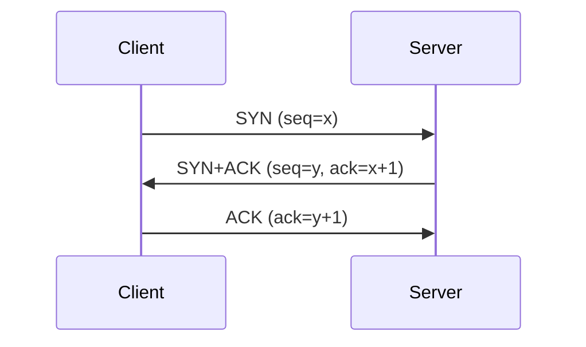
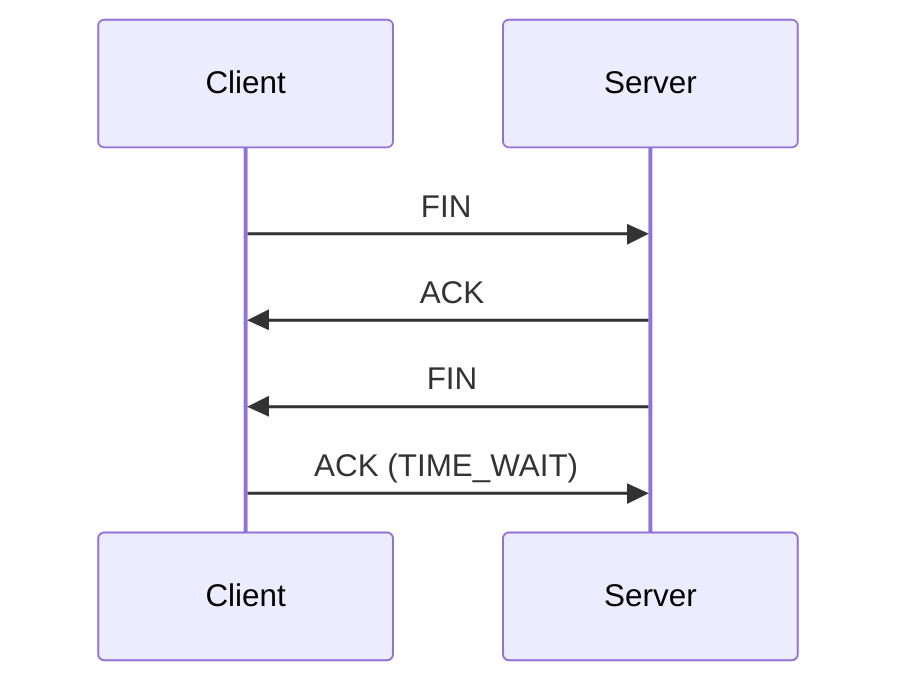

# TCP 3-way Handshake and 4-way Handshake

## 1. Overview

### A. Definition
> **TCP** is a connection-oriented, reliable transport protocol that uses a **3-way** handshake for connection **establishment** and a **4-way** handshake for connection **termination**, reliably managing bidirectional communication.

The fundamental reason TCP uses handshakes is that it must build a **reliable bidirectional stream** on top of an unreliable network where IP guarantees neither ordering nor delivery. Only when both sides confirm to each other "I'm ready, and I'll count starting from this number" before sending data do subsequent reordering, duplicate removal, and retransmission become possible. In other words, the handshake is not a greeting but **the initial contract of reliability**.

### B. Purpose
The connection establishment process has two goals. First, it confirms the send/receive readiness of each direction. Not only the client→server direction but also the server→client direction must be open, so SYNs from both sides are required. Second, it **exchanges and synchronizes the Initial Sequence Number (ISN)** of each direction. Sequence numbers become the basis for ordering and retransmission of every subsequent byte, and starting from an unpredictable value prevents packets from old connections from mixing in or being forged.

## 2. Connection Establishment — 3-way Handshake

The key point is why establishment takes **exactly 3 steps**. Opening each direction requires a "SYN (announcing my starting number)" and an "ACK (confirmation)" for it, so originally four messages would be needed. However, the server can **combine the ACK confirming the client's SYN and its own SYN into one packet (SYN+ACK)**, reducing it to 3 steps. ① The client announces its initial sequence x with SYN, ② the server confirms x (ack=x+1) while sending its own sequence y along with it, and ③ when the client confirms y (ack=y+1), the sequences of both directions are agreed and the connection is established (ESTABLISHED). Two steps are insufficient because there is no confirmation for the server's direction, and four steps are unnecessary.

| Step | Description | State |
|---|---|---|
| 1. SYN | Client connection request (initial sequence x) | SYN_SENT |
| 2. SYN+ACK | Server accepts + its own sequence (y), confirms x | SYN_RECEIVED |
| 3. ACK | Client confirms y → connection established | ESTABLISHED |

## 3. Connection Termination — 4-way Handshake

The reason termination is a 4-way process—one step more than establishment—is that a TCP connection consists of **two independent streams, one per direction**. Even if one side says "I'm done sending (FIN)," the other side may still have data left to send. So the other side first only acknowledges the FIN (ACK), **finishes sending its remaining data**, and then separately sends its own FIN when done (this half-closed state is called CLOSE_WAIT/half-close). The confirmation and termination signals that were combined as SYN+ACK during establishment are **separated** into ACK and FIN during termination because of the time gap of "sending remaining data," adding one step. The active closer that sends the final ACK does not close immediately but waits briefly in the TIME_WAIT state.

| Step | Description |
|---|---|
| 1. FIN | Active closer requests termination |
| 2. ACK | Receiver acknowledges (can still send remaining data, half-close) |
| 3. FIN | Receiver also requests termination after finishing transmission |
| 4. ACK | Active closer acknowledges → TIME_WAIT → closed |

## 4. Related Concepts and Security

As convenient as the handshake is, it also creates vulnerabilities. **TIME_WAIT** after termination looks wasteful, but it exists to prevent delayed old packets in the network from wrongly mixing into a newly opened connection on the same port and to accept the peer's retransmission if the final ACK is lost; it is typically maintained for 2MSL. **SYN Flooding** is a DoS in which an attacker sends only masses of SYNs without sending the final ACK, exhausting the server's half-open connection queue (backlog). The countermeasure, **SYN cookies**, is a technique in which the server does not store connection state in the queue but cryptographically encodes it within the sequence number, then restores the state from that value when a genuine ACK arrives.

| Concept | Description |
|---|---|
| TIME_WAIT | Prevents mixing of delayed packets, prepares for final ACK retransmission (2MSL) |
| SYN Flooding | DoS that exhausts the backlog with incomplete connections |
| SYN cookies | Defends without a queue by encoding state in the sequence number |
| Sequence number (ISN) | Basis for ordering and retransmission, unpredictable to prevent forgery |

## 5. Considerations and Implications
- **The price of reliability is latency**: The 3-way handshake consumes at least 1 RTT before data transmission. On the web, with many short requests, this initial cost determines perceived performance.
- **Evolution to QUIC**: QUIC, the foundation of HTTP/3, combines transport connection and TLS negotiation over UDP and supports 0-RTT, greatly reducing handshake latency. It inherits TCP's reliability concepts while improving establishment cost.
- **Operational perspective**: On large-scale servers, TIME_WAIT sockets can occupy and exhaust ports, so they must be managed through connection reuse (keep-alive) and kernel parameter tuning.

---

> **In one line**: TCP is a reliable protocol that *establishes connections by synchronizing sequences with a 3-way SYN→SYN+ACK→ACK* and, because of per-direction half-close, *terminates with a 4-way FIN→ACK→FIN→ACK*, supplementing stability and security with TIME_WAIT and SYN cookies, while QUIC improves its latency.
