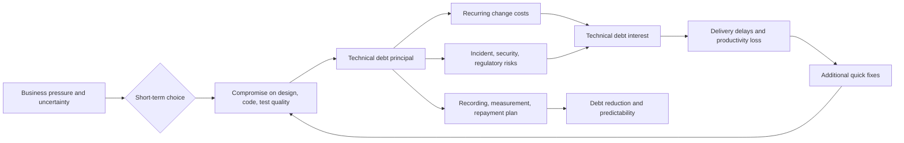
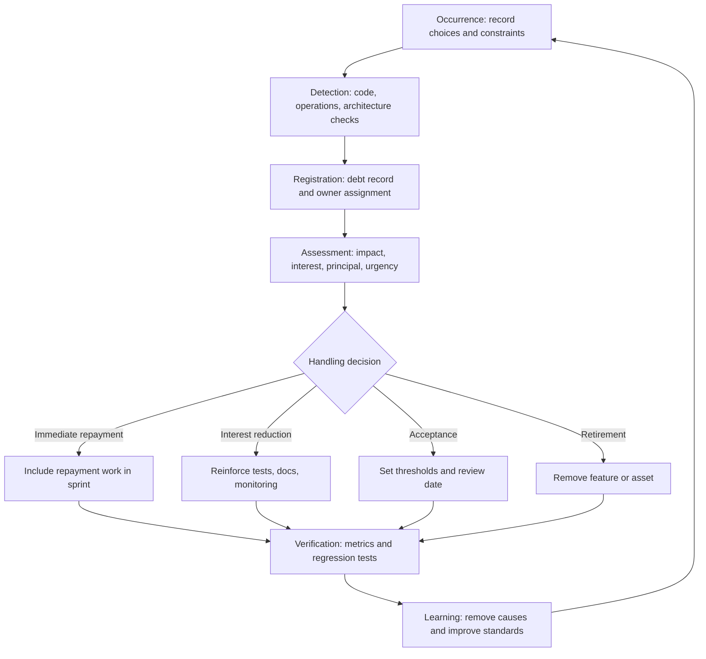

# Technical Debt Management and Repayment Strategy

## 1. Overview

### A. Definition

> Technical debt is the accumulation of change costs and risks that must be borne additionally in the future as a result of partially sacrificing the quality of design, code, testing, and operations for short-term delivery, cost, or market response.

Technical debt does not simply mean that code is dirty or old.
Whether a quick choice was made intentionally or quality was overlooked inadvertently, if a current choice raises future change costs, it becomes debt.
Just as financial debt has principal and interest, technical debt has a principal—the work being deferred now—and interest—the delays, incidents, and cognitive load that recur as a result.
Therefore, technical debt is not a list of defects to be eliminated but a portfolio to be managed while considering business goals and risks together.

The existence of technical debt does not mean that development was poor.
Releasing minimal functionality first in an unvalidated market, or restoring service with a temporary workaround during an outage, can be reasonable debt.
The problem arises when debt is not recorded, no repayment time is set, and no one observes how large the interest grows.
At that point, debt erodes the team's productivity and makes the delivery of new features unpredictable.

### B. Background and Necessity

First, because of market uncertainty, it is difficult to complete all quality requirements before release.
Early products need to confirm customer reactions quickly, so generalized architecture or complete automation may be deferred.
This choice accelerates learning in exchange for creating future expansion costs.
Making debt visible allows the benefit of rapid learning and the future repayment cost to be compared within the same decision.

Second, the surrounding conditions of a system change over time.
When operating systems, libraries, cloud APIs, security requirements, and organizational structures change, a design that was appropriate in the past may no longer fit current constraints.
Therefore, technical debt is not fixed only to old code but must be re-evaluated along with environmental changes.

Third, debt has a cumulative effect.
A single temporary fix may look small by itself, but when the same rule is replicated across multiple services and databases, the number of change points increases.
As change points increase, test scope and deployment risk grow, and manual approvals and meetings to reduce risk increase.
Ultimately, a vicious cycle arises in which the time available for feature development shrinks.

Fourth, responsibility for technical debt does not lie solely with particular developers.
Requirement uncertainty, delivery pressure, budget, decision-making structure, and operational authority can all be causes of debt.
Managers should build a culture of choosing reasonable debt and repaying it transparently, rather than evaluations that induce people to hide debt.

### C. Management Goals

The first goal of technical debt management is not to reduce debt to zero but to keep risk at an acceptable level.
Modernizing all code can make repayment costs exceed product value, while conversely leaving all debt unattended makes the system unable to keep up with business change.
Therefore, for each debt item, one must be able to explain its cause, scope of impact, interest, repayment cost, and repayment timing.

The second goal is to lower the interest on debt.
Even if repayment cannot be done immediately, the growth of additional costs can be slowed with measures such as documentation, test reinforcement, monitoring, and fixing boundaries.
The third goal is to control the inflow of new debt.
Through the definition of done, code reviews, automated tests, and architecture decision records, debt must not be created without being recorded.

## 2. Structure and Causes of Technical Debt

### A. Economic Structure of Debt

Technical debt can be explained as a relationship between principal and interest, as follows.
Principal is the one-time amount of work needed to return the current state to a normal quality level.
Interest is the analysis, testing, operation, and change cost incurred additionally every time because of the debt.

Even if the principal is small, a large interest makes it high priority.
For example, the absence of tests in a frequently changed payment module requires manual verification at every release, so its interest is high.
In contrast, an old library in a rarely changed internal batch job may have low business impact and interest even if its principal is large.
Thus, evaluating debt solely by the aesthetics of code leads to misjudging actual risk and priority.

The economics of debt can also be viewed from a present-value perspective.
If the repayment cost is R, the interest per period is I_t, and the discount rate is d, the simplified total cost can be thought of as R plus the sum of the present values of the interest in each period.
Precise financial calculation is not the goal, but it provides a framework for comparing whether costs rise as repayment is deferred and whether it is worth investing now.
However, since technical debt interest also includes hard-to-quantify losses such as incident probability or declining customer trust, numbers should not be used as if they were excessively precise facts.

### B. Causes

Intentional debt is chosen for business learning and speed.
Examples include using a single-tenant structure first in an MVP, or confirming market reaction through manual operations before validation.
This choice is reasonable only when repayment conditions and exit criteria are documented.
If there is only the phrase "we'll fix it later" without when and on what signal it will be fixed, even intentional debt turns into neglected debt.

Debt from ignorance arises when the team does not know the problem or does not know how to solve it.
Typical examples are duplicating domain rules in code or setting transaction boundaries incorrectly.
Education, mentoring, design reviews, and adoption of standard patterns are preventive measures, but for debt that has already arisen, the cause must be uncovered through recording and experimentation.

Debt from pressure arises when quality activities are cut due to external constraints such as schedule, budget, staffing, and incident response.
Even if developers value quality, testing and refactoring can be pushed back when operational incidents must be handled first.
Since this type cannot be solved by individual effort alone, quality capacity must be secured in plans, and exit conditions for temporary measures must be agreed with product and operations owners.

Obsolescence debt arises from changes in dependent technologies and the operating environment.
End-of-support runtimes, vulnerable cryptographic libraries, and batch jobs that are no longer observed raise risk even without functional defects.
Obsolescence debt should be discovered early through regular asset inventories and checks of vulnerabilities, support periods, and compatibility.

### C. Main Types of Debt

Debt types are a classification not for finding who is responsible but for choosing repayment methods.
Code debt appears inside the implementation, such as duplication, complex conditions, and low cohesion.
Design debt arises when module boundaries, dependency directions, and data ownership are set incorrectly, enlarging the scope of impact of feature changes.

Test debt is a state in which insufficient automated verification means even small changes require manual regression verification.
Documentation debt is a state in which operating procedures and design decisions are not recorded, relying on the memory of specific staff.
Infrastructure debt exists in the execution environment, such as manual deployment, old images, single points of failure, and insufficient capacity planning.
Data debt makes analysis and service changes difficult because standards, quality, lineage, and retention policies are incomplete.

| Type | Observed symptoms | Main interest | Typical repayment means |
|---|---|---|---|
| Code debt | Duplication, long functions, complex conditions | Increased modification time, defect inflow | Refactoring, static analysis |
| Design debt | Circular dependencies, unclear boundaries | Wider impact scope, reduced parallel development | Module boundary redesign, ADR |
| Test debt | Low automation, unstable tests | Manual verification, deployment delays | Characterization tests, regression automation |
| Documentation debt | Lack of up-to-date runbooks and decision records | Onboarding delays, incident response delays | Documentation updates, knowledge sharing |
| Infrastructure debt | Manual deployment, single points of failure | Recovery failure, operational risk | IaC, redundancy, automation |
| Data debt | Duplicates, missing values, no lineage | Analysis errors, reprocessing costs | Standardization, quality rules, catalog |

The types in the table are not independent of one another.
For example, unclear data ownership causes design debt and data debt to grow simultaneously, and test debt makes it difficult to repay code debt safely.
Therefore, even if backlogs are managed separately by type, they must be connected into a single value stream in impact analysis.

## 3. Identification, Measurement, and Prioritization

### A. Identification Methods

Debt identification can start with collecting individual developers' impressions, but ultimately reproducible evidence is needed.
Duplication, complexity, and vulnerable dependencies are found through code search and static analysis, and verification costs are confirmed through test results and deployment metrics.
In operations, recurring incidents, manual work, false alarms, and bottlenecks in recovery steps are recorded.

In architecture workshops, change scenarios are posed as questions.
If multiple teams give different answers to a question like "Which services and tables must be modified to add a new payment method?", there is likely debt in boundaries and documentation.
When drawing data flows and permission flows, if it is hard to identify owners or temporary transformations repeat, that is evidence of data debt.

A debt record should include at least the following information.
Record the location and symptom of discovery, background of occurrence, affected users and services, interest symptoms, estimated principal, risk level, repayment conditions, owner, and review date.
If only "refactoring needed" is written in the ticket title, the context required for decision-making disappears, so the costs the debt generates and the consequences of not addressing it must be written together.

### B. Measurement Metrics

Measuring principal starts with effort estimation.
Story points, developer-days, and number of changed files can be used, but the metric itself must not become the goal.
Rather than simply comparing numbers across teams, it is safer to observe before-and-after repayment trends within the same team.

For measuring interest, change lead time, deployment failure rate, recovery time, defect recurrence rate, manual operation time, and code review waiting time can be used.
Since these metrics are not determined by technical debt alone, they must be interpreted together with deployment frequency, team size, and product stage.
For example, even if the deployment failure rate is high, failing to separate whether the cause is test debt or external API instability leads to the wrong repayment work.

| Measurement perspective | Example metrics | Cautions in interpretation |
|---|---|---|
| Changeability | Lead time, number of files affected by changes | Consider feature size and team structure together |
| Stability | Change failure rate, MTTR, recurring incidents | Separate incident causes from detection quality |
| Verifiability | Automated test ratio, flaky ratio | Look at verification power of critical paths rather than numbers |
| Security | Vulnerable dependencies, patch delay days | Combine severity with exposure likelihood |
| Operability | Manual work time, false alarm rate | Check automation potential of repetitive tasks |
| Understandability | Onboarding time, ADR freshness | Look at actual use rather than mere existence of documents |

Quantitative metrics and qualitative judgment must be used together.
Security patch delays can be high priority because of regulatory and breach risks even if the effort is small.
Conversely, a stable algorithm with high complexity but almost no changes may have weak reason for immediate repayment.

### C. Prioritization Criteria

Priority is determined based on business impact, likelihood, interest growth rate, repayment cost, and feasibility.
A simple risk score can be made by multiplying impact by likelihood and weighting it by the interest growth rate.
This score is an auxiliary means to aid conversation between teams, and the calculated result must not replace judgments related to security, law, and safety.

The first targets to consider for immediate repayment are debts that directly threaten safety, security, or legal compliance.
The second are debts that raise lead time and incident rates in frequently changed core flows.
The third are debts with small repayment costs that can be reduced quickly through automation.
For debts that are rarely used, isolated, and have small interest, retirement or maintaining the status quo may be more reasonable.

## 4. Management Lifecycle and Repayment Methods

### A. Management Lifecycle

At the occurrence stage, choices are not hidden.
If a temporary implementation is chosen, why it is needed, under what conditions it will be replaced, and what risks are being accepted are recorded in an ADR or issue.
This record is not for assigning blame later but a mechanism for not forgetting repayment candidates.

The detection stage runs regular inspections and event-driven inspections together.
Quarterly architecture reviews alone can miss debt created during deployment, so debt is also re-evaluated after incident retrospectives, completion of large features, and dependency changes.
Each discovered item must have a single owner and a next review date.

The assessment stage distinguishes four decisions: repayment, interest reduction, acceptance, and retirement.
Repayment removes the principal, while interest reduction lowers the rate at which risk grows through tests, observability, and documentation without changing the structure immediately.
Acceptance is a decision to maintain it for a period knowing the risks and costs, and retirement is a decision to eliminate the debt itself by removing unused features and infrastructure.

### B. Repayment Methods

A full rewrite replaces the existing system all at once.
It is attractive when structural flaws are too deep or the technology has reached end of life, but the risk of losing requirements and hidden operational rules is high.
Customer value may stall during the rewrite and two systems may have to run in parallel, so it is best not chosen without clear boundaries and stepwise verification.

Incremental refactoring improves the structure by repeating small changes and regression tests.
Fixing external contracts first and then changing the internal implementation can lower customer impact.
Although the immediate effect may seem small, this method has the advantage of dividing risk into deployable units and reflecting learning in the next step.

The strangler fig pattern creates a boundary in front of existing functionality, moves features one by one to a new implementation, and then removes the old parts.
Routing, data synchronization, and consistency verification are key, and if the migration period drags on, dual-operation debt of two systems arises, so exit criteria must be managed.

Automation-based repayment converts manual deployment, manual data verification, and repetitive environment configuration into code and pipelines.
Automation reduces human error while making the system state reproducible.
However, an automated incorrect procedure can spread errors quickly, so approval steps, rollback, and audit logs must be designed together.

### C. Embedding into the Development Flow

If debt repayment is left only to separate "cleanup weeks," it is the first thing to disappear when business schedules slip.
Debt must be registered as formal items in the product backlog, and an approach of partially repaying related debt along with feature changes should be applied.
For example, including reinforcement of contract tests for the payment module in a story that adds a payment method makes the context and effect of repayment clear.

The definition of done includes quality conditions such as critical path tests, operational documentation updates, added observability, and security patches.
Code review should be not just a time to check style but a design review checkpoint to catch debt inflow.
In CI, static analysis, dependency checks, tests, and build reproducibility are automatically verified, and when thresholds are exceeded, exception approvals and expiration dates are recorded.

## 5. Comparison and Cases

### A. Comparing Technical Debt and Defects

A defect is a difference between required behavior and actual behavior, a problem that gives current users incorrect results.
Technical debt can be a state that raises future change costs and risks even if current behavior satisfies requirements.
Therefore, fixing all defects does not automatically eliminate debt, and debt does not necessarily manifest immediately as defects.

| Category | Defect | Technical debt |
|---|---|---|
| Criterion | Violation of currently required behavior | Future change/operation costs and risks |
| Symptoms | Incorrect results, outages, functional failures | Delays, repetitive work, difficulty scaling |
| Handling | Fix and regression verification | Repayment, interest reduction, acceptance, retirement |
| Priority | Centered on user impact and urgency | Synthesis of impact, interest, principal, strategic fit |
| Example | Order amount calculated incorrectly | Order rules duplicated across multiple services |

This distinction is needed not to divide the organizations responsible for tickets but to change the response strategy.
After restoring the current incident first, if the structural cause that makes the incident recur is technical debt, it must be linked to a separate repayment item.

### B. Hypothetical Case: Incremental Repayment of an Order System

The following is a hypothetical case to explain the principles.
Assume an online ordering service implemented ordering, inventory, and payment in a single application and shared database to speed up release.
Initially, deployment was simple and feature verification was fast, but as three teams made changes simultaneously, deployment waits and regression testing increased.

The team measured change failure rate, mean time to recovery, and manual regression time for four weeks.
It was revealed that manual regression took 12 hours per release and that payment changes required even the inventory module's tests.
Instead of a full rewrite, the team first added API contract tests, moved core ordering rules into a domain module, and separated the boundaries of inventory lookup and payment approval.

In the first step, the input/output contracts of external APIs were fixed.
In the second step, the existing database was used as-is, but the tables directly accessed by the new module were restricted.
In the third step, only part of the traffic was sent to the new path, and the scope was widened after comparing error rates and latency.
Finally, unused old paths and temporary transformation code were removed, and the repayment results were recorded in an ADR.

The key to this case is not the technical term "split into microservices."
It is that change boundaries were verified first, risk was reduced in small units, and repayment effects were confirmed with metrics.
If data ownership and deployment responsibility had remained unclear even after the split, only a new debt—a distributed system—would have been added.

### C. Decision-Making Example

| Option | Short-term effect | Long-term risk | Suitable conditions |
|---|---|---|---|
| Keep as-is | Stable cost and schedule | Interest may increase | Low change frequency and impact |
| Partial refactoring | Splits risk and cost | Gradual effect | Tests and boundaries can be secured |
| Full rewrite | Changes structure quickly | Loss of requirements/operational knowledge | End of life and a clear transition plan |
| Feature retirement | Immediate reduction in operating costs | Some customer value lost | Low usage and alternative paths exist |

The choice in the table depends more on the business's time horizon and risk tolerance than on the system's technical excellence.
For a core payment path in operation, stable incremental improvement may take priority, while an experimental internal tool may tolerate short-lived debt.

## 6. Advanced: Technical Debt in Modern Development and Operations

In cloud and DevOps environments, as deployment speed has increased, so has the creation and spread of debt.
When container images grow old, IaC modules are duplicated, or pipeline exceptions accumulate, infrastructure debt accumulates in the same way as code.
Therefore, not only application repositories but also pipelines, cloud accounts, dashboards, and runbooks should be included in the scope of debt management.

AI systems change data, models, prompts, evaluation sets, and inference infrastructure together.
Without lineage of training data or fixed evaluation criteria, data and model debt arises that makes results harder to compare the more the model is improved.
Linking model versions, data snapshots, evaluation metrics, and approval records is the starting point of repayment.
When applying generative AI, retrieval grounding, safety filters, cost, latency, and human review procedures should also be included in debt records.

Architecture debt is effectively handled through quality attribute scenarios.
Specifying stimulus, environment, response, and measurement criteria—such as "process 99 percent of order requests within 2 seconds at peak time"—allows design choices and the impact of debt to be verified.
Rather than simply writing "scalability is poor," defining which responses deteriorate under which loads connects repayment work with verification methods.

At the organizational level, debt is managed like a product portfolio.
Per-service debt ledgers, risk grades, repayment budgets, exception approvals, and expiration dates are operated and shared with executives quarterly.
However, using the total number of debts or tickets as a performance indicator can cause teams to mass-produce small items, so it should be viewed in connection with change lead time, stability, and repayment effect.

## 7. Considerations and Implications

### A. Balancing Business Value and Quality

Technical debt repayment is not an activity to push through the technical team's preferences but an investment in the product's sustainable value creation.
Repayment requests should be presented together with business language such as customer impact, delivery improvement, risk reduction, and operating cost savings.
In areas where market validation comes first, limited debt is allowed, and whether to repay is re-decided after learning results come in.

### B. Transparency of Repayment Priorities

If the debt list is managed privately, priorities are swayed by how loud individual voices are.
Cause, impact, interest, cost, and owner should be recorded with a common template, and product, development, security, and operations should evaluate together.
For security, safety, and legal items, rather than competing with regular feature schedules, separate minimum standards and an exception approval system are established.

### C. Preventing Excessive Refactoring

If refactoring itself becomes the goal, it can unnecessarily shake a stable system.
Before repayment, check change frequency, testability, operational impact, and replaceability, and define which metrics should improve after repayment.
Large-scale structural changes whose effects are not measured can become another form of debt, so stepwise experiments and rollback plans are put in place.

### D. Automation and Guardrails

CI/CD and policy automation reduce the inflow of debt, but if the meaning of thresholds is not understood, they become a perfunctory passing procedure.
Static analysis warnings are linked to severity and owners, and exceptions are given expiration dates.
Even when automation failures block deployment, an emergency change path and post-hoc verification are prepared to secure both safety and response speed.

### E. Integrated Management of Operations, Security, and Data

Even if only application code is refactored, actual risk does not decrease if old permissions, vulnerable images, and low-quality data remain.
Service, data, infrastructure, and security dependencies are linked to debt records, and operations and data owners participate in change impact analysis.
For regulated data in particular, compliance with retention, access, and deletion policies must precede repayment.

### F. Organizational Learning and Recurrence Prevention

If only repayment completion is recorded, the same debt recurs in other teams.
In retrospectives, confirm why the debt was created, which decisions and incentives influenced it, and what standards, training, and platform support are needed.
Improvement results must be reflected in the definition of done, templates, developer platforms, and architecture principles to lower the rate of debt inflow.

## 8. Conclusion

Technical debt is the result of a choice lying between fast execution and future change costs.
Reasonable debt validates business hypotheses and delivers learning to the market, but unrecorded debt lowers the team's speed and reliability while hiding its interest.
From a Professional Engineer's perspective, debt should not be reduced to a code quality problem but managed as an enterprise-wide risk encompassing architecture, data, security, infrastructure, and organizational decision-making.

The execution sequence should proceed through discovery and recording, assessment of impact, interest, and principal, choice of repayment or interest reduction, automated verification, and metric-based learning.
Boundary fixing and incremental transition should take priority over full rewrites, but clear investment and exit conditions should be set for end-of-life, regulatory, and safety risks.
Ultimately, a good organization is not one without debt, but one that consciously chooses debt, discloses its costs, and continuously repays it.

## References

- Martin Fowler, "Technical Debt" — https://martinfowler.com/bliki/TechnicalDebt.html
- Ward Cunningham, "The WyCash Portfolio Management System" — https://wiki.c2.com/?WardCunningham

---

> **In one line**: Technical debt is not a stigma to be eliminated but a subject of sustainability management in which principal, interest, and risk are measured and repayment conditions are operated.
