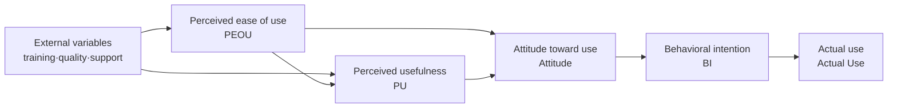

# Technology Acceptance Model (TAM)

## 1. Overview

### A. Definition
> A theoretical model proposed by Davis (1989) that **explains and predicts the behavior by which users accept and actually use a new information technology**. It specializes the Theory of Reasoned Action (TRA) from psychology to the information technology context, and takes two beliefs — **Perceived Usefulness (PU)** and **Perceived Ease of Use (PEOU)** — as its core variables.

TAM's insight is that acceptance is determined not by "the actual performance of the technology" but by "**how users perceive that technology**". Even an outstanding system will be shunned if users "feel" it is not useful or hard to use. The theoretical contribution of this model is that it explains the success or failure of technology adoption not through the technology itself but through a psychological variable: **the user's perception**.

### B. Background and Need
In the 1980s, although enterprises made large-scale investments in information systems, **acceptance failures** — in which frontline users shunned the systems and the investments came to nothing — were frequent. A theory was needed to explain and predict why expensive systems went unused, and TAM drew wide attention by explaining this concisely with two measurable variables. In practice, it is highly needed because it provides a basis for **diagnosing factors that hinder acceptance** before adopting new technology or informatization projects, and for establishing response strategies such as training, UX improvement, and change management.

## 2. Key Components

There are two points worth noting in this causal path. First, the arrow showing that **ease of use (PEOU) influences usefulness (PU)**. The easier a system is to use, the more fully users exploit its functions and achieve results, so they come to perceive it as useful. Second, external variables influence attitude and behavior **only through** the two beliefs — that is, training or system quality does not increase use by itself; it becomes effective only when it changes users' perceptions (PU·PEOU).

- **External Variables**: Factors that can be intervened on, such as education and training, system quality, social influence, and organizational support; they are the **levers** that affect the two perception variables.
- **Perceived Usefulness (PU)**: The belief that "using this technology will improve my job performance". Known as the most powerful variable determining acceptance.
- **Perceived Ease of Use (PEOU)**: The belief that "I can use this technology easily without much effort". It affects attitude directly while also raising PU.
- **Attitude toward use (Attitude)**: An overall positive or negative evaluation of using the technology.
- **Behavioral Intention (BI)**: The intention to actually use it; the antecedent variable that best predicts actual use.
- **Actual Use**: The final usage behavior; the dependent variable of the model.

| Component | Description | Role |
|---|---|---|
| **External variables** | Training·quality·social influence | Antecedents of perception |
| **Perceived usefulness (PU)** | Belief in performance improvement | Strongest predictor |
| **Perceived ease of use (PEOU)** | Belief in easy use | Affects PU·attitude |
| **Attitude toward use** | Positive/negative evaluation | Forms intention |
| **Behavioral intention (BI)** | Intention to use | Predicts use |
| **Actual use** | Final behavior | Dependent variable |

## 3. Extended Models

The basic TAM is parsimonious but could not explain the social and organizational background of "why people perceive something as useful". Extended models emerged to address this. **TAM2** (Venkatesh & Davis, 2000) added social and cognitive factors such as **subjective norm (expectations of others), image, job relevance, and output quality** as antecedents of PU. **UTAUT** (2003) integrated various prior acceptance theories and presented four key determinants — **performance expectancy, effort expectancy, social influence, and facilitating conditions** — along with moderating variables such as gender and age, greatly increasing explanatory power.

| Model | Added·integrated elements | Significance |
|---|---|---|
| **TAM2** | Subjective norm·image·job relevance, etc. | Identifies social causes of PU |
| **UTAUT** | Performance expectancy·effort expectancy·social influence·facilitating conditions + moderators | Theory integration, higher explanatory power |

## 4. Application Cases and Limitations

For example, when a hospital introduces Electronic Medical Records (EMR), if medical staff's **PEOU is low** (data entry is cumbersome), usage intention drops no matter how good the system is. If a pre-deployment TAM survey diagnoses PEOU as the bottleneck, remedies such as screen simplification, shortcut keys, and on-site training can be prescribed. In this way, TAM becomes a practical tool for **predicting acceptance before adoption and reflecting it in design and training**.

However, its limitations are also clear. TAM relies on users' subjective responses (surveys), so results vary by situation and culture, and because it focuses on "perception" rather than actual usage outcomes, its explanatory power weakens in mandatory-use environments (compulsory systems). It is therefore desirable to supplement quantitative surveys with qualitative interviews.

## 5. Considerations and Implications
- **User-centered approach**: Since **users' perception of usefulness and ease of use** determines adoption success more than the technology's own excellence, UX and frontline participation must be built into the design from the planning stage.
- **Linkage with change management**: TAM diagnosis results feed into the training, communication, and incentive strategies of **Change Management**, and are used to minimize resistance.
- **Trade-offs·outlook**: Simplifying functions to raise ease of use may reduce usefulness for expert users, so balance is needed. In recent strategies for embedding new technologies such as **AI, cloud, and digital transformation** in organizations, TAM/UTAUT is still widely used as a theoretical basis for measuring and predicting acceptance.

---

> **In one line**: TAM is a model explaining that two beliefs — *perceived usefulness (PU) and perceived ease of use (PEOU)* — lead to actual technology use via attitude and behavioral intention; external variables work only through perception, and it has been extended into TAM2 and UTAUT to serve as the basis for new-technology acceptance strategies.
