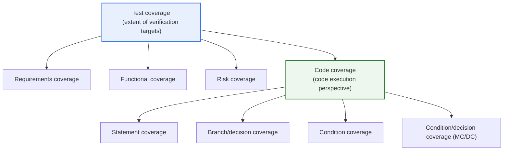
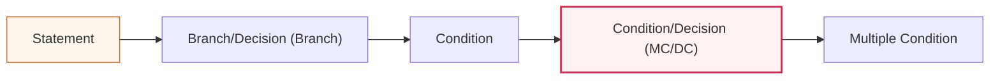

# Test Coverage and Code Coverage

## 1. Overview

### A. Definition
> **Test Coverage** is a broad measure indicating **how comprehensively** the planned and executed tests have covered the verification targets (requirements, functions, risks), while **Code Coverage** is a measure that quantitatively determines **how much of the source code's statements, branches, conditions, etc. were actually executed** when the tests were run. Code coverage is a sub-metric corresponding to the "code execution perspective" among the several perspectives that test coverage encompasses.

The key question distinguishing the two concepts is "**against what criterion is sufficiency measured?**". Test coverage is a broad perspective that asks "how much of what must be tested — requirements, functions, user scenarios, risks — has been addressed", encompassing requirements coverage, functional coverage, configuration coverage, and so on. Code coverage, on the other hand, focuses on the source code among those targets and is a quantitative metric automatically instrumented by tools, asking "was each line, branch, and condition actually executed during testing?". In other words, if test coverage deals with the "breadth of verification", code coverage shows the "depth of execution" in numbers.

The reason code coverage matters is clear. **Code that was never executed is code that was never tested**, so the possibility of defects hiding in it cannot be ruled out. Coverage measurement reveals "which code was never executed", visualizing the blind spots of testing. In this sense, code coverage functions as a "**necessary condition**" for confirming that tests have secured a minimum verification scope.

Crucially, however, **100% code coverage does not guarantee quality (correctness).** Two things must be distinguished here — "the code being executed" and "the result of that execution being verified (asserted)" are entirely different matters. A test that merely runs through code without assertions raises the coverage number but catches no defects. Code coverage must therefore be used in its precise position as "a necessary, not sufficient, condition"; becoming fixated on the number can instead create false confidence in quality.

### B. Background and Need
As software grew larger and the risk of regression became constant, it became necessary to answer the question "are our tests sufficient?" with **objective figures** rather than intuition. Even when developers intuitively feel they have "tested reasonably well", it is common for exception-handling paths or particular branches to remain never executed. Coverage instrumentation tools automatically expose such unverified areas, quantifying test completeness and providing the basis for quality gates. Especially as CI/CD became widespread, measuring coverage on every commit to continuously manage regressions and blind spots became standard practice.

### C. Relationship Between the Two Concepts
In summary, code coverage is a subset of test coverage. No matter how high code coverage is, test coverage may be low if the requirements themselves were not derived into test cases; conversely, even with faithful requirements mapping, if those tests do not touch particular branches of the code, holes remain in code coverage.

This relationship matters in practice because the two metrics compensate for each other's blind spots. Requirements coverage catches "whether functions that should have been implemented were omitted (omission defects)", while code coverage catches "whether the implemented code was actually verified (implementation defects)". Neither alone achieves complete verification, so both metrics must be managed together in a complementary manner to secure both the breadth and depth of verification.

## 2. Overall Structure — Categories of Test Coverage

The structure diagram above shows that under the broad umbrella of test coverage, code coverage sits alongside requirements, functional, and risk coverage, and code coverage is further subdivided into statement → branch → condition → MC/DC. The reason "coverage" in practice usually refers to code coverage is that only this metric is measured automatically and quantitatively by tools. Requirements and functional coverage are managed by people mapping requirements to test cases in a Requirements Traceability Matrix (RTM), whereas code coverage differs in nature in that instrumentation tools collect execution information automatically.

## 3. Types of Code Coverage (Levels of Rigor)

Code coverage is divided into several levels depending on what in the code was executed and how finely. The further down, the more precise the required tests and the broader the range of detectable defects.

### A. Statement Coverage
Measures whether every executable statement has been executed at least once. It is the most basic and easiest-to-understand metric, but its limitations are clear. For example, in the code `if (a) x = 1;`, testing only the case where `a` is true yields 100% statement coverage, yet the behavior when `a` is false (i.e., when the branch is not taken) is not verified at all. In other words, statement coverage only guarantees "it was executed" and can miss the other path of a branch.

### B. Branch/Decision Coverage
Measures whether both the true and false outcomes of every branch point have each been executed at least once. In the previous example, both the case where `a` is true and where it is false must be tested to reach 100%, so it also covers the "branch-not-taken path" that statement coverage misses. In general application development, statement and branch coverage are often adopted as practical targets, because the balance point between cost and defect-detection effectiveness generally lies at this level.

### C. Condition Coverage
Examines whether the true and false values of **each individual condition** making up a decision have all been exercised. For instance, in `if (a && b)`, each of `a` and `b` must take both true and false. However, condition coverage alone has a pitfall. One can satisfy the true and false of every individual condition while still missing one of the true/false outcomes of the overall decision, so it does not always satisfy branch coverage. For this reason, a higher criterion that considers conditions and decisions together becomes necessary in practice.

### D. MC/DC (Modified Condition/Decision Coverage)
MC/DC (Modified Condition/Decision Coverage) is a powerful criterion requiring that it be demonstrated for each condition that "**each condition independently affects the outcome of the decision**". That is, for each condition, a test pair must be secured in which changing only that one condition changes the overall decision outcome. The practical advantage of MC/DC is that, unlike multiple condition coverage which tests all condition combinations (2ⁿ), ideally **only n+1 tests for n conditions** suffice to demonstrate each condition's independent effect, avoiding combinatorial explosion.

MC/DC is especially important because safety-critical standards explicitly require it. DO-178C, the certification standard for airborne software, requires MC/DC-level structural coverage for software of the highest safety level (Level A, DAL A), and the functional safety standard IEC 61508 also recommends or highly recommends MC/DC at high SIL levels. However, since MC/DC is practically impossible to measure manually, it is common to derive and instrument the minimal test pairs using dedicated tools such as VectorCAST and LDRA.

| Type | What is measured | Rigor | Typical application |
|---|---|---|---|
| **Statement** | Every statement executed at least once | Low | Minimum criterion for general development |
| **Branch/Decision (Branch)** | Both true and false of branches executed | Medium | Recommended for general applications |
| **Condition** | True/false of individual conditions executed | Medium-high | Verification of compound conditions |
| **MC/DC** | Independent effect of each condition demonstrated | High | Safety-critical such as avionics·medical (DO-178C DAL A) |

## 4. Comparison and Practical Application Cases

### A. Test Coverage vs Code Coverage
The table below summarizes the differences between the two concepts, but the key lies not in the table itself but in **why the differences arise**. Test coverage starts from a planning and design perspective of "what should be verified (requirements)", whereas code coverage starts from an execution and instrumentation perspective of "did the written code actually run". Thus, if a requirement was never even implemented in code, it is not captured by the code coverage metric at all (a missing function has no code to execute, so it is not a measurement target) — this is the typical blind spot arising from blind faith in code coverage alone.

| Category | Test coverage | Code coverage |
|---|---|---|
| **Target** | Requirements·functions·risks | Execution of source code |
| **Perspective** | What was verified (breadth) | How much code was executed (quantitative) |
| **Measurement method** | Requirement·function mapping (RTM), manual | Automatic measurement via instrumentation tools |
| **Relationship** | Parent (encompassing) | Child (code execution perspective) |
| **Limitations** | Hard to quantify | Execution ≠ correctness verification, does not capture missing functions |

### B. Pitfalls Seen Through a Concrete Case
An example makes this clear. Suppose a payment module has the condition `if (amount > 0 && balance >= amount)`. If the tests cover only one "successful payment" case, statement coverage may reach 100%, but the `balance < amount` (insufficient balance) branch is not executed, so branch coverage stops at 50%. Even if there is actually a defect in the insufficient-balance handling logic, one is reassured merely by the figure of 100% statement coverage. Conversely, cases of weak assertions are also common — if a function is merely called without verifying (asserting) its return value, coverage is filled but the test passes even when the result is wrong. To compensate for this "false reassurance", the practice of combining **Mutation Testing** has recently been increasing. By intentionally altering the code (mutants) and measuring whether the tests catch (kill) those alterations, it evaluates the tests' "defect-detection capability" itself rather than the coverage number.

### C. Risk-Based Target Setting
Therefore, coverage targets must be set **in proportion to risk**, not as a uniform number. General in-house applications often adopt 70–80% statement/branch coverage as a practical target, while domains with high error costs such as financial transactions combine higher criteria with boundary-value testing. Safety-critical systems such as avionics, medical, and automotive (ISO 26262) require rigorous structural coverage such as MC/DC by regulation. In other words, there is no correct answer to "what percentage is enough"; the magnitude of loss a defect would cause determines the target level.

Furthermore, forcing the target to 100% can backfire. Trying to forcibly cover hard-to-reach exception handling and defensive code leads tests to become excessively coupled to implementation details, hindering refactoring and increasing maintenance costs. In practice, differentiated targets are set by code area — "high for core business logic, low for simple delegation and configuration code" — and the interpretive ability to judge whether a low-coverage area is a high-risk area or one of low testing value matters more.

## 5. Advanced — Industry Trends and Expected Exam Directions

Today, code coverage is deeply integrated into CI/CD pipelines as a quality gate. Tools such as JaCoCo (Java), Istanbul/nyc (JavaScript), Coverage.py (Python), and gcov·llvm-cov (C/C++) measure coverage on every build, and it has become standard to block merges when coverage falls below a configured threshold or to warn about "changes that decrease coverage". In particular, "diff/patch coverage", which applies coverage criteria only to new or changed code, has spread, establishing a realistic approach that incrementally assures the quality of incoming code rather than forcibly raising the entire legacy codebase.

There is also a clear trend toward raising the "quality" of coverage. Mutation testing, mentioned above, is representative, and in the safety-critical domain, structural coverage support is being strengthened in open-source toolchains as well — for example, masking-based MC/DC instrumentation was added to GCC 14. This shows that the center of gravity in practice is shifting from "filling coverage numbers" to "**quantifying meaningful verification**".

In addition, approaches that go beyond static coverage instrumentation to measure actual execution paths in production are spreading. By identifying which code is actually executed frequently based on production traffic, test resources can be allocated first to paths with high usage frequency and risk. In other words, coverage is expanding beyond a development-stage verification metric, combining with operational observability to guide "what should be verified more" with data.

As expected exam directions (from a Professional Engineer's perspective), essay questions are likely to ask for ① distinguishing the concepts and relationship of test coverage and code coverage, ② definitions of code coverage types (statement, branch, condition, MC/DC), differences in rigor, and example-based explanation, ③ why MC/DC is required by safety-critical standards (DO-178C) and the efficiency of n+1 tests, and ④ the limitations of coverage and strategies to compensate such as mutation testing, boundary-value analysis, and quality gates. In the answer, an effective structure centers on the proposition "high coverage ≠ high quality" and emphasizes combining coverage as a necessary condition with meaningful verification.

## 6. Considerations and Implications (Professional Engineer's Perspective)

1. **High coverage does not guarantee quality — distinguish execution from verification.** Code being executed differs from its results being asserted as correct. Do not become fixated on coverage figures; secure meaningful assertions, boundary values, and exception scenario verification together. Evaluating the tests' defect-detection capability itself through mutation testing is also an effective complement.
2. **Set target levels in proportion to risk.** Forcing the same coverage criterion on all systems is inefficient. A risk-based approach is reasonable: statement/branch for general applications, higher for finance, and rigorous criteria required by regulation such as MC/DC for safety-critical systems such as avionics, medical, and automotive.
3. **Integrate into CI/CD quality gates for continuous management.** Measure coverage automatically on every commit and use it as a quality gate, and in particular apply diff coverage to changes to progressively control regressions and blind spots. It is effective only when internalized into the pipeline, not as a one-off measurement.
4. **Coverage is a necessary condition, not the goal — beware of measurement distortion.** The moment coverage becomes an organizational KPI, Goodhart's law (when a measure becomes a target, it ceases to be a good measure) can take effect, with formal tests lacking assertions filling only the numbers. Metrics should be used as tools for diagnosing test completeness, while managing the quality of verification together to prevent distortion.

## References
- LDRA, "DO-178C & Structural Coverage Analysis" — https://ldra.com/ldra-blog/do-178c-structural-coverage-analysis/
- Wikipedia, "Modified condition/decision coverage (MC/DC)" — https://en.wikipedia.org/wiki/Modified_condition/decision_coverage
- "Modified Condition/Decision Coverage in the GNU Compiler Collection" (GCC 14) — https://arxiv.org/pdf/2501.02133

---

> **In one line**: Test coverage measures *how much of the requirements·functions·risks were verified (breadth)* and code coverage measures *how much code was executed (statement·branch·condition·MC/DC, depth)*, in a parent-child relationship; even 100% code coverage does not guarantee quality because execution ≠ correctness verification — so targets must be set on a risk basis together with meaningful assertions and mutation testing, and managed continuously through CI quality gates.
