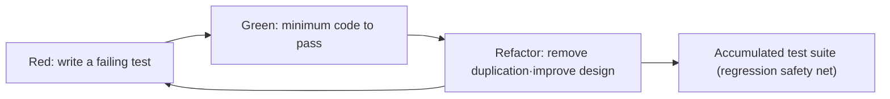
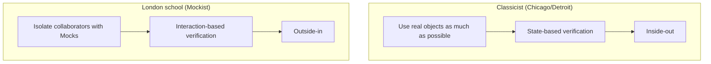

# Test-Driven Development (TDD)

## 1. Overview

> Test-Driven Development (TDD) is an evolutionary design and development technique in which, before writing production code, the behavior that code must satisfy is first described as a failing automated test, the minimum code needed to pass that test is implemented, and then refactoring to remove duplication and design smells is repeated.

Traditional development follows the order "design → implementation → testing". In this order, testing is pushed to the last stage of development, so it becomes the first activity to be skipped under schedule pressure, and defects are discovered late in the integration and acceptance stages. That the cost of fixing a defect increases exponentially the later it is discovered is a long-standing rule of thumb in software engineering, and it is directly tied to the fundamental problem TDD seeks to solve.

TDD reverses this order and restructures it as "test → implementation → refactoring". Here, a test functions not merely as a means of verification but as **an executable specification that first defines how code that does not yet exist will be used**. Developers first declare "what to build" in test code and develop the implementation only in the direction that satisfies that declaration. TDD's output therefore has dual value: it simultaneously secures working code and a regression test suite that documents that code.

TDD was established by Kent Beck as a core practice of Extreme Programming (XP), and later, as agile and DevOps cultures spread, it combined with Continuous Integration (CI) to become a standard practice for securing modern software quality. What matters is that TDD is not "an activity of writing many tests" but **a design-driving activity**. Code that is hard to test is usually code with high coupling and low cohesion, so the very constraint of writing tests first acts as design pressure enforcing loose coupling and high cohesion.

### 1.1 Background and Need

First, because of **the cost of late defect discovery**. If a defect found at the requirements stage costs 1, the cost of fixing the same defect found in operation reaches tens to hundreds of times that — a trend shared by many empirical studies. In TDD, tests exist at the very moment code is written, so the point of defect discovery is pulled forward as far as possible to development time (shift-left).

Second, because of **fear of regression**. In a codebase without a test safety net, even small changes can produce unexpected side effects, so developers avoid refactoring and improvement, leading to accumulation of technical debt. The dense test suite TDD leaves behind provides confidence that "changes will not break existing behavior", enabling continuous improvement.

Third, because of **specification ambiguity and over-engineering**. In the process of translating requirements into code, developers often design features that are not yet needed (violating YAGNI). TDD forces developers to "write only the minimum code needed to pass the currently failing test", suppressing over-engineering and fixing actual requirements in a verifiable form at the code level.

Fourth, because of **the need for living documentation**. Separately written design documents become outdated and lose trust the moment the code changes, but tests are executed on every build and prove by passing that they are up to date. Well-written test names and scenarios act as documentation that always accurately explains "how this component responds to which inputs", greatly lowering the cost of understanding code during onboarding of new staff and maintenance.

## 2. The Core Cycle of TDD — Red-Green-Refactor

The heart of TDD is a three-step micro-cycle repeated in very short periods. One cycle is usually kept within a few minutes, and this short feedback loop is the key mechanism that lowers developers' cognitive load and corrects deviations early.

**A. Red (failure) phase** — First write a test that verifies behavior not yet implemented. This test must naturally fail, and confirming the failure is itself important. If you move on without seeing it fail, you cannot be sure the test actually verifies anything. The Red phase makes the developer first decide "what to build and with what interface" from the user's (caller's) perspective. For instance, when building a shopping cart total feature, one first fixes, in API form, what value `cart.total()` should return for which inputs. A state in which the test does not even compile is also regarded as a form of "failure".

**B. Green (passing) phase** — Write the **simplest, most minimal code** needed to pass the failing test just written. The goal of this phase is not "elegant code" but "working code". Even a fake implementation (fake it) returning a constant or hard-coding is allowed. What matters is recovering the green bar (all pass) as quickly as possible and standing on a stable foundation. Kent Beck explains this with the view "make it pass first, and wash away the sins later".

**C. Refactor (improvement) phase** — In the safe state where all tests pass, remove duplication in the code, improve names, and refine the structure. In this phase, externally observable behavior must never change; only the internal structure is tidied up. The key is to run tests frequently even during refactoring to maintain the green state. If Red-Green is the phase that adds functionality, Refactor is the phase that secures design quality, and the rhythm of the two is the essence of TDD.

To support these three phases, developers choose among three progression strategies depending on the situation. Obvious implementation writes the answer directly when it is self-evident; fake it returns a constant and then generalizes incrementally; and triangulation forces the direction of generalization through two or more different example tests. For example, for an addition function, `add(2,3)=5` alone can be passed with `return 5`, but adding `add(4,1)=5` and `add(2,2)=4` leaves no choice but to converge on real addition logic.

### 2.1 Cycle Rhythm and Step-Size Control

The key to TDD mastery is the sense of adjusting the "step size" handled in one cycle to the situation. For familiar, self-evident logic, choose a large step with obvious implementation to move through cycles quickly; in uncertain areas or where failures repeat, split the step finely with fake it and triangulation, making only one decision at a time. When failures occur two or three times in a row, the standard practice is to treat it as a sign that the step is too large and return to a smaller test. Without this discipline of dynamically adjusting step size, TDD becomes mere formality and regresses into debugging hell.

In addition, each cycle must end in a committable green state. This allows returning to the last stable point at any time, providing psychological safety, and becomes the technical prerequisite for frequent integration in trunk-based development.

Meanwhile, habitually skipping the refactoring phase means performing only half of TDD. Repeating only Red-Green accumulates passing code but also design debt, eventually resulting in a codebase that is hard to change. Conversely, attempting to refactor without securing a green state mixes behavioral and structural changes, making root-cause tracing impossible. Therefore, observing the separation principle "change structure only when green, add behavior only when red" is the essence of TDD discipline.

## 3. Conditions for Good Unit Tests and Test Doubles

For the tests TDD leaves behind to be trusted, individual tests must meet certain quality criteria. These are commonly summarized as the **FIRST principles**: tests should be Fast (run quickly so they can be run often), Independent/Isolated (not depend on other tests or execution order), Repeatable (produce the same result in any environment), Self-validating (judged automatically as pass/fail rather than by human eyes), and Timely (written at the right time, just before the production code). When these principles collapse, tests instead become debt that eats away at development speed.

Individual tests are commonly structured with the **AAA pattern** (Arrange-Act-Assert). Arrange sets up inputs and collaborating objects, Act invokes the behavior under test, and Assert checks the expected result. Ideally, each test is kept small so that it verifies only one logical concern.

Real systems have external dependencies such as databases, external APIs, time, and files. Using them as-is makes tests slow and unstable, so **Test Doubles** that replace them are used. The following table distinguishes the main test doubles, while bearing in mind that these distinctions often blur in practice.

| Type | Role | Verification focus | Example |
|------|------|-----------|------|
| Dummy | Unused object that merely fills a slot | None | Filling constructor parameters |
| Stub | Returns predetermined responses | State | Fake API returning a fixed exchange rate |
| Spy | Records the fact of calls·arguments | Interaction | Recording whether an email was sent |
| Mock | Pre-specifies and verifies expected calls | Interaction (behavior) | Verifying "payment called once" |
| Fake | Simplified real implementation | State | In-memory DB, in-memory repository |

Here, the choice between state verification and interaction verification is not merely a matter of tools but of design philosophy. Overusing Mocks couples tests to implementation details (which methods were called how many times), producing **fragile tests** that break from internal refactoring alone even though behavior is identical. It is therefore desirable to prefer state verification wherever possible and use interaction verification only when verifying side effects or protocols is essential.

Practical guidelines for choosing test doubles can be summarized as follows. First, pure logic that computes values is most robustly verified with real objects without doubles. Second, collaborators that are needed only for their responses and are not the verification target are replaced with Stubs. Third, interactions are verified with Spies or Mocks only when the side effect itself is a requirement, such as "was the email actually sent". Fourth, stateful dependencies such as databases or repositories can be replaced with in-memory Fakes to gain both the robustness of state verification and execution speed. Fixing these criteria as a team standard reduces the problem of inconsistent test quality caused by each developer using doubles differently.

## 4. Two Schools of TDD — Classicist and London

TDD is not a single practice; it splits into two branches in how it handles collaborating objects, and understanding this difference allows choosing the approach suited to a project's nature.

**The Classicist (Chicago school)** is close to Kent Beck's original form. It uses real collaborating objects as much as possible, replaces only slow or non-deterministic dependencies with Fakes, and verifies the final state. Because this approach verifies the results of multiple collaborating objects together, it is robust to refactoring, but it is hard to narrow down the point of failure, and the design tends to emerge after the fact.

**The London school (Mockist)** thoroughly isolates the object under test from its collaborators with Mocks and verifies the message flow (interactions) between objects. It fits well with the "outside-in" approach of starting from high-level acceptance tests and moving inward while discovering needed collaborators as Mocks, which is advantageous for deriving the interfaces of not-yet-existing objects first from a design perspective. However, there is a high risk of tests becoming coupled to implementation through Mock overuse.

In practice, rather than choosing one exclusively, a mixed strategy is common: the core of domain logic is handled with classicist state verification, and boundaries with external systems (adapters) with London-style interaction verification. For instance, payment domain calculation logic is verified with real value objects, while the integration with an external payment gateway (PG) is verified with Mocks for "was the correct request sent exactly once".

## 5. Comparing TDD with Similar Techniques — BDD·ATDD

TDD is a unit-level technique from the developer's perspective, and it is most effective when combined with higher-level techniques that deal with stakeholders' requirements. The following comparison should be understood not as a simple distinction of terms but as a difference in "who verifies, in what language, at what level".

| Category | TDD | BDD | ATDD |
|------|-----|-----|------|
| Focus | Internal behavior of code | System behavior·scenarios | Satisfying acceptance criteria |
| Main author | Developer | Developer+planner+QA | Customer+developer+QA |
| Expression | Unit test code | Given-When-Then | Acceptance criteria examples |
| Level | Unit (micro) | Feature·scenario | Requirement (feature) |
| Representative tools | xUnit family | Cucumber, SpecFlow | FitNesse, Robot |

BDD (Behavior-Driven Development) describes behavior with scenarios close to natural language that the business can understand (Given-When-Then), to overcome the limitation that TDD's term "test" makes people focus only on verification. In other words, it is accurate to view BDD not as a replacement for TDD but as an extension that adds the higher purpose of requirements discovery and forming a ubiquitous language. ATDD (Acceptance Test-Driven Development) agrees on acceptance conditions as executable examples together with the customer before development starts, fundamentally reducing misunderstanding of requirements.

In practical application, a **double-loop structure** is widely used in which outer ATDD/BDD scenarios set the direction of "what to build", and within them developers implement the details through TDD cycles. This is a realistic combination that secures both requirements alignment and code quality at the same time.

## 6. Application Case — Payment Fee Calculation Module

As a concrete example, assume the situation of developing an e-commerce platform's payment fee calculation module with TDD. The requirement is "charge 2.5% of the payment amount as a fee, with a minimum fee of KRW 100, and apply 2.0% as a promotion for payments of KRW 100,000 or more". The developer first writes the simplest case, `fee(10000) == 250`, as a failing test (Red). Then it is passed with `return amount * 0.025` (Green), and since there is nothing to refactor, the developer moves on to the next case.

Next, adding `fee(1000) == 100`, which verifies the minimum fee rule (2.5% of 1000 is KRW 25, so it must be raised to KRW 100), makes the existing implementation fail (Red). After adding a branch applying the floor to pass it (Green), the magic numbers 100 and 0.025 are extracted as constants and the conditional is tidied (Refactor). Finally, adding `fee(100000) == 2000` (2.0% of KRW 100,000) and the boundary value `fee(99999)` via triangulation naturally derives the promotional rate branch. In this process, the boundary values (exactly KRW 100,000 and just below it), the floor-applied range, and the rate transition point are all fixed as tests, so even if the rate policy changes later, it can be modified safely on top of the regression safety net.

The key point this case shows is that TDD **explicitly exposes the boundary conditions of requirements before the code**. In the traditional approach, ambiguities such as "is it 2.5% or 2.0% at exactly KRW 100,000?" are discovered only in the QA stage after implementation, but TDD makes developers confront this ambiguity themselves and settle it as a specification the moment they write the test. This is why the return on TDD investment is especially large in areas such as real finance and payment domains, where errors in boundary conditions lead directly to monetary losses.

## 7. Advanced — CI/CD Integration, Legacy Application, and Recent Trends

The value of TDD is multiplied when combined with continuous integration and deployment pipelines. Unit tests left by developers run automatically on every commit at the first gate of the CI pipeline (commit stage), failing the build as soon as a defect is integrated and narrowing down responsibility. This becomes the technical foundation supporting DevOps "fast feedback" and trunk-based development. In fact, higher deployment frequency and lower change failure rate — characteristics of high-performing organizations emphasized by DORA research — are hard to achieve without reliable automated tests.

**Application to legacy code** is the hardest point in the field. Since TDD cannot be applied immediately to code with no tests at all, as in the approach presented by Michael Feathers, one first builds a safety net with **characterization tests** that pin down current behavior as-is, then introduces "seams" that break dependencies to progressively convert to a testable structure. In other words, legacy requires a reverse strategy of first capturing "current behavior" rather than "correct behavior".

Three recent trends stand out. First, as generative AI coding tools spread and automatic test-code generation becomes easy, paradoxically, the TDD mindset in which humans define "what to verify" as a specification is becoming more important, because tests function as the oracle that judges the correctness of AI-generated code. Second, to compensate for the limits of simple line coverage, mutation testing, which verifies whether tests actually catch defects, and property-based testing, which verifies invariants instead of examples, are used alongside as means of quantitatively reinforcing the quality of TDD suites. Third, contract testing is spreading as a practice for fixing inter-service boundaries in a TDD manner in microservice environments.

In particular, combination with generative AI is evolving in a direction that redefines TDD's role. A collaborative loop forms in which humans define requirements as failing tests, AI proposes implementations that pass them, and humans again add boundary conditions and exception scenarios as tests to verify and correct the AI's output. In this structure, the test suite operates as an "executable contract" that limits the AI's degrees of freedom, immediately blocking the AI from deviating from requirements or damaging existing behavior. In other words, the more automation takes over code production, the more the ability to write specifications defining correct behavior shifts to become the developer's core competence, and TDD becomes the most practical means of leaving that specification as code.

## 8. Considerations and Implications

First, **TDD is not a panacea, and its targets must be selected.** Its return on investment is high in the core of domains with high logic complexity and high regression risk. On the other hand, it can be a burden in exploratory prototyping, UI pixel layout, and early spike stages where requirements change rapidly, so organizations must establish a clear strategy for the scope of TDD application.

Second, one must recognize **the duality of tests being both an asset and a liability**. Fragile tests coupled to implementation details hinder refactoring and increase maintenance costs. Therefore, disciplines such as prioritizing state verification, verification centered on public behavior, and restraining excessive Mocks must be institutionalized as coding standards and code-review criteria for sustainability.

Third, **beware of the trap of coverage figures.** High line coverage does not mean high defect-detection power. Tests with weak assertions only execute and do not verify. The mature approach from a Professional Engineer's perspective is to use coverage only as an auxiliary metric for finding unverified areas, and to manage test effectiveness together with defect-detection metrics such as mutation score.

Fourth, **a shift in perspective on culture, competence, and trade-offs is needed.** TDD is an investment that somewhat slows initial code-writing speed in exchange for increasing mid- to long-term maintainability and change safety. If management and the team do not share this trade-off, it is the first thing discarded under schedule pressure. Institutional support such as knowledge diffusion through pair and mob programming, enforcement through CI gates, and formal recognition of refactoring time must accompany it.

Fifth, **test execution speed and maintaining feedback** are conditions for sustainability. As the suite grows and execution time increases, developers become reluctant to run it often, and TDD's short feedback loop collapses. Therefore, operational strategies must be combined: layering fast unit tests and slow integration/E2E tests according to the test pyramid principle, and keeping commit-stage feedback within a few minutes through parallel execution, change-impact-based selective execution, and test isolation.

Sixth, in terms of **the outlook for integration with related technologies**, TDD shows its true value when organically combined with refactoring, continuous integration, domain-driven design, microservice contract testing, and generative-AI-based development. Going forward, in collaborative models where AI generates draft code and tests and humans define and review specifications and boundary conditions, TDD's "specification-first" thinking is expected to be re-examined as the central axis of quality gates.

## References

- Kent Beck, "Test-Driven Development: By Example", Addison-Wesley
- Michael Feathers, "Working Effectively with Legacy Code", Prentice Hall
- Martin Fowler, "Mocks Aren't Stubs", https://martinfowler.com/articles/mocksArentStubs.html
- Steve Freeman & Nat Pryce, "Growing Object-Oriented Software, Guided by Tests"
- DORA, "Accelerate State of DevOps Report", https://dora.dev

---

> **In one line**: TDD is an evolutionary development technique that repeats a short cycle of writing a failing test first (Red), passing it with a minimal implementation (Green), and then improving the structure (Refactor), simultaneously securing a verifiable specification, loosely coupled design, and a regression safety net.
