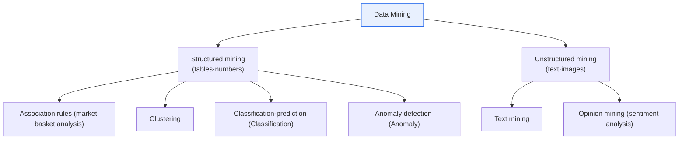
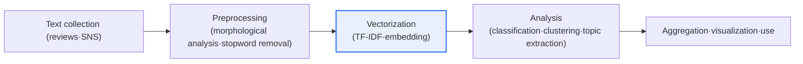

# Data Mining — Differences from Statistics, Structured/Unstructured, Opinion and Text Mining

## 1. Overview

### A. Definition

> **Data Mining** is a technique that **automatically or semi-automatically discovers** patterns, rules, correlations, and knowledge hidden in large volumes of data by combining statistics, machine learning, and database technologies. Among its applications, **Text Mining** extracts information, topics, and relationships from unstructured text, and **Opinion Mining (sentiment analysis)** is a sub-field of text mining that determines the polarity (positive/negative/neutral) and intensity of the emotions and opinions contained in text.

To properly understand data mining, one must start from the question "**how is it different from statistics?**". Traditional statistics is a **deductive, confirmatory** approach in which the analyst first establishes a hypothesis, draws a sample, and tests the significance of that hypothesis. For example, the proposition "did this promotion significantly raise sales?" is judged with a t-test. Data mining, by contrast, is an **inductive, exploratory** approach that lets the vast data itself speak, without an explicitly given hypothesis, to **find patterns that were not known in advance**. It unearths from the data "what hidden factors move together with sales?". This difference is not a matter of mere preference; it is a methodological evolution that arose because, in a big data environment where data scale has moved beyond samples toward near-complete populations and the number of variables has grown to hundreds or thousands, establishing and testing hypotheses one by one became practically impossible.

Three forces lie behind data mining becoming established as a separate academic and practical domain. The first is **the explosion of data**. As POS, web logs, sensors, and social media pour out data every moment, it has become impossible for people to scan it by eye to find rules. The second is **falling storage and computation costs**. As distributed storage (HDFS, object storage) and parallel computation (Spark, etc.) became mainstream, algorithms that repeatedly traverse complete data could be run at realistic cost. The third is the demand for **data-driven decision-making**. As organizational cultures that seek to judge based on data rather than experience and intuition spread, not only structured transaction data but also unstructured text such as reviews, complaints, and social media were drawn into analysis. If the data is structured (tables, numbers), association rules, clustering, classification, and regression are used; if unstructured (text, images, audio), specialized techniques such as text and opinion mining are needed.

### B. Differences Between Data Mining and Statistics

Statistics and data mining are not opposed; they **complement each other, differing only in purpose and data environment**. Statistics is strong at inferring populations from samples and quantifying uncertainty (confidence intervals, p-values), while data mining is strong at finding patterns in large data without prior assumptions and building predictive models. In practice, they are combined by unearthing candidate patterns with data mining and then confirming with statistical tests that those patterns are not due to chance. The fundamental reason for the difference lies in **the epistemic starting point**: "is a hypothesis set first (statistics), or is the data allowed to speak first (mining)?".

| Category | Statistics | Data mining |
|---|---|---|
| **Approach** | Deductive·confirmatory (hypothesis testing) | Inductive·exploratory (pattern discovery) |
| **Data** | Sample-centered, small to medium scale | Large·complete data, high-dimensional |
| **Purpose** | Confirm statistical significance of a hypothesis | Discover unknown patterns·rules·predictive models |
| **Assumptions** | Distribution·model assumptions (normality, etc.) | Minimal assumptions, data-driven |
| **Interpretation of results** | Causality·significance-centered | Correlation·predictive power-centered |

Each row of this table should be read together with "why". Statistics sets distributional assumptions because a mathematical basis is needed to infer a population from a sample; data mining minimizes assumptions because, with near-complete data, the structure inherent in the data itself is more trustworthy than inference. Also, statistics focuses on causality and significance while mining focuses on correlation and predictive power because mining's purpose often lies in predicting "what will happen next" rather than explaining "why it is so".

## 2. Overall Structure and Key Techniques of Data Mining

Data mining is not a single algorithm but **a collection of technique families** branching by purpose. Broadly, depending on what one wants to know, it divides into association (things that occur together), clustering (grouping similar things), classification/prediction (getting the right answer), and anomaly detection (things deviating from normal). The structure diagram below shows the major branches of data mining, and the subsequent detail diagram shows the structured/unstructured processing flow.

**Association Rules** quantify co-occurrence rules between items — such as "customers who buy beer also buy diapers" — using support, confidence, and lift. They serve as the basis for product recommendation, shelf placement, and cross-selling. For example, if a rule has 5% support, 60% confidence, and 2.5 lift, it is interpreted in practical terms as "the two products are sold together 2.5 times more often than by chance" and used in planning bundled products.

**CRISP-DM (Cross-Industry Standard Process for Data Mining)** is widely used as the standard procedure for tying these techniques together in real projects. It is a methodology that iteratively cycles through six phases: ① business understanding → ② data understanding → ③ data preparation → ④ modeling → ⑤ evaluation → ⑥ deployment. The key point this procedure emphasizes is that "what comes before and after matters more than the algorithm". If it is unclear what must be solved (business understanding) and how the results will be used (deployment), even the most sophisticated model is abandoned by the business. In fact, the field's rule of thumb is that more than half of the effort in a data mining project goes not into modeling but into data preparation (cleansing, integration, transformation), and in text mining the share of preprocessing is even larger.

Another point to note is determining whether discovered patterns are **actionable**. Obvious or uncontrollable patterns such as "umbrellas sell well on rainy days" have low value even if statistically strong. Conversely, profitable niche rules are valuable in practice even with low support. Therefore, the performance of data mining is ultimately evaluated not only by algorithmic accuracy but by whether its results connect to decision-making and execution.

**Clustering** is unsupervised learning that groups similar entities without ground-truth labels, widely used for customer segmentation (distinguishing high-value and churn-risk customers based on RFM). Clustering is exploratory in that "we don't know in advance how many groups there are", and it becomes the starting point for differentiating marketing strategies by group. **Classification·Regression** is supervised learning with past correct answers, used for churn prediction, default prediction, spam detection, etc., with performance evaluated by accuracy, precision, and recall. **Anomaly Detection** finds observations deviating greatly from normal patterns and is used for card fraud, equipment failure, and intrusion detection.

### Structured vs Unstructured Data Mining

The fundamental difference between structured and unstructured is "**is it in a form a computer can compute on directly?**". Structured data is already organized into rows and columns of numbers and categories, so preprocessing is relatively light; unstructured text, being human language, becomes numbers only after heavy transformation — morphological analysis, stopword removal, vectorization (embedding) — and loss or distortion of meaning can occur in this process. Hence, success in unstructured mining depends on "how well meaning is preserved as numbers".

| Category | Structured data mining | Unstructured data mining |
|---|---|---|
| **Target** | Tables·numbers (transactions·logs) | Text·images·audio |
| **Techniques** | Association rules·clustering·classification·regression | Text·opinion mining, NLP |
| **Preprocessing** | Cleansing·missing/outlier handling·normalization | Morphological analysis·stopword removal·vectorization (embedding) |
| **Difficulty** | Relatively low | High (requires understanding meaning·context) |
| **Evaluation** | Clear, e.g. accuracy·RMSE | Ambiguous ground truth, relies on human labeling |

## 3. Text Mining and Opinion Mining

### A. Text Mining Processing Flow

Text mining is a series of processes that converts piles of unstructured documents into a structure a computer can handle and extracts keywords, topics, relationships, and summaries from it. The key lies in "vectorization that turns language into numbers". Initially, TF-IDF or Bag-of-Words, which count word occurrence frequency, were used, but these had the limitation of discarding word order and context. Later, distributed representations such as Word2Vec captured semantic similarity between words as vector distance, and recently, contextual embeddings of the BERT and GPT families assign different vectors to the same word depending on its position in a sentence, distinguishing even whether "bank" is a riverside or a financial institution.

In the preprocessing stage, Korean is trickier than English. In English, words are relatively well separated by spaces, but Korean is an agglutinative language with attached particles and endings, so a morphological analyzer (e.g., Mecab, Okt) must extract stems — like "meogeotda (ate) → meok/da (eat)" — to gather expressions of the same meaning into one. If the quality of this stage is low, all subsequent analysis is shaken, so building domain dictionaries (neologisms, technical terms) is the key in practice.

### B. Opinion Mining Procedure

Opinion mining (sentiment analysis) determines the orientation and intensity of people's opinions from reviews, social media, complaints, and so on. The procedure is ① collecting target text → ② preprocessing (morphological analysis, stopword removal) → ③ classifying positive/negative/neutral with a sentiment lexicon or machine learning/deep learning → ④ aggregating and visualizing opinions. Approaches divide broadly into two. The **lexicon-based** approach sums sentence scores using a dictionary assigning sentiment scores such as "good=+2, bad=-2"; it is transparent to interpret but weak with neologisms and domain expressions. The **machine learning/deep learning-based** approach trains models on human-labeled data to reflect context, but it has the trade-off of requiring high-quality training data and having opaque decision rationale.

| Category | Text mining | Opinion mining |
|---|---|---|
| **Purpose** | Extract information·topics from text | Analyze emotions·opinions·attitudes in text |
| **Output** | Keywords·topics·summaries·document classification | Positive/negative/neutral, sentiment score·intensity |
| **Relationship** | Parent (encompassing) technique | Application (child) of text mining |
| **Use** | Document classification·search·summarization·topic modeling | Product reputation·public opinion·brand monitoring |
| **Difficulties** | Vectorization·polysemy handling | Irony·context·domain polarity reversal |

In other words, opinion mining is an application of text mining, differentiated by going beyond simply extracting information to reading even the "attitude (emotion)" within it. Recently, going beyond looking only at the polarity of the whole sentence, ABSA (Aspect-Based Sentiment Analysis), which analyzes **sentiment by aspect** — as in "the screen is good but the battery is not great" — has gained attention as a substantive basis for product improvement.

## 4. Industry Application Cases

Concrete cases allow one to gauge effectiveness. First, in **e-commerce**, hundreds of thousands of product reviews are analyzed with opinion mining to filter out early the products where negative keywords such as "delivery delay" and "packaging damage" surge, feeding into logistics improvement. Second, in **finance and telecommunications**, call-center consultation logs are text-mined to cluster the topics of recurring complaints, and customers with negative sentiment at high risk of churn are selected as targets for proactive retention campaigns. Third, in the **public and policy** sector, public opinion in SNS and news comments is monitored in real time to track positive/negative trends regarding policies and detect crisis issues early. What these cases have in common is that they pull up from unstructured text the "reasons" that were invisible from structured indicators (sales, churn rate) alone.

These analyses carry weight in practice thanks to **combination with structured indicators**. For example, if a telecom's churn rate for a particular plan rose by 3%p in a month, structured data tells "how much" customers churned but not "why". Opinion mining of the consultation and review text of that customer group then surfaces negative topics such as "complaints about contract termination penalties" or "speed degradation", which connect directly to execution such as plan restructuring and network investment. This cycle — "change revealed by structured data → cause revealed by unstructured data → execution" — is the archetype of the substantive value data mining gives an organization. Conversely, a lesson from practice is that if text analysis results cannot be linked to structured performance indicators, they remain merely interesting word clouds and do not lead to decisions.

## 5. Advanced — The Transformation of Text and Opinion Mining by Generative AI·LLMs

What has most changed the landscape of text and opinion mining recently is **Large Language Models (LLMs)**. In the past, sentiment analysis required collecting separate labeled data for each domain and training a new model, but LLMs, based on pretrained language understanding, perform sentiment classification, summarization, and topic extraction at a considerable level with just few-shot examples and prompts. This greatly lowers initial build cost and time. LLMs also handle relatively well the context-dependent expressions — such as irony, sarcasm, and double negation — at which traditional lexicon-based methods were weak, and can handle multiple languages with a single model, lowering the barrier to global public opinion analysis.

However, adopting LLMs entails practical considerations: the black-box nature with opaque decision rationale, hallucination that plausibly generates content contrary to facts, and the cost, latency, and data-leakage risk of processing large volumes of text via APIs. So in actual practice, hybrid configurations are increasing — keeping sensitive data in-house and fine-tuning lightweight models, or using LLMs only for first-pass classification and correcting the final judgment with rules and human review. From a Professional Engineer's perspective, this comes down not to "adopting the latest technology unconditionally" but to designing **a balance point among accuracy, cost, security, and explainability**.

## 6. Considerations and Implications

1. **Preprocessing quality of unstructured data determines success.** Since the quality of morphological analysis, stopword removal, and vectorization determines all subsequent analysis results, priority investment should go into dictionaries reflecting language and domain characteristics and into pipeline standardization.
2. **Context, irony, and domain polarity reversal are the greatest challenges.** Just as the same "michyeotda (crazy)" can be praise or criticism, polarity flips by domain, so accuracy should be raised with context-understanding deep learning/LLMs and aspect-based (ABSA) analysis, while a system correcting misclassifications through human review is needed.
3. **Combining structured data, unstructured data, and statistics creates value.** Patterns unearthed by mining must be verified statistically, and the "reasons" revealed by text must be linked to structured indicators (sales, churn) to become actionable insights. A design that does not rely on a single technique is key.
4. **Data ethics, privacy, and bias must be embedded in the design.** Review and SNS text mixes personal information and social bias, so if collection consent, de-identification, and bias mitigation are not reflected in the pipeline, they come back as legal and reputational risks.
5. **Acknowledge the difficulty of evaluation and establish a continuous improvement system.** Since ground truth in text analysis is ambiguous, operation from an MLOps perspective premised on periodic sample review, re-labeling, and model retraining is more important than a one-off build.

## References

- Bing Liu, "Sentiment Analysis and Opinion Mining", Morgan & Claypool (introduction): https://www.cs.uic.edu/~liub/FBS/sentiment-analysis.html
- scikit-learn, Working with Text Data (TF-IDF·classification): https://scikit-learn.org/stable/tutorial/text_analytics/working_with_text_data.html
- Google, Word2Vec / embeddings overview: https://developers.google.com/machine-learning/crash-course/embeddings

---

> **In one line**: Data mining is an exploratory technique that, *unlike hypothesis-testing statistics, discovers patterns in large volumes of data*, divided into structured (association·clustering·classification) and unstructured (text·opinion mining); opinion mining is an application of text mining that reads even the attitude (emotion) of text, and thanks to LLMs its accuracy, multilingual capability, and real-time capability are improving greatly.
