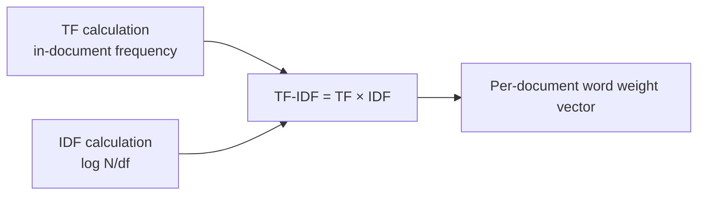

# TF-IDF (Term Frequency – Inverse Document Frequency)

## 1. Overview

### A. Definition
> A weighting technique that quantifies **how well a word represents a particular document** within a document collection (corpus). The more frequently a word appears in one document (**TF**) and the more rarely it appears across all documents (**IDF**), the higher the weight it receives.

### B. Background and Need
The simplest way to represent a document as a vector is to count word occurrence frequencies as-is (Bag-of-Words). However, in this approach, **stopwords such as "eun/neun/i/ga" (Korean particles) or "the/of/and" appear abundantly in every document, so frequency alone distorts the picture by making these common words look as if they represent the document**. TF-IDF solves this problem with the intuition that "**common words have no discriminative power**". Words that appear across all documents are useless for distinguishing a particular document, so IDF discounts their weight, while words concentrated in a specific document are given more weight, thereby revealing the **characteristic words (keywords)** of a document. Being simple and fast yet clearly interpretable, it became a long-standing standard for search engine ranking, document classification, and keyword extraction.

## 2. Formula and Meaning of Each Term

TF-IDF is defined as the product of two factors, and each term adjusts a word's importance from a different direction.

| Item | Definition | Intuitive meaning |
|---|---|---|
| **TF(t,d)** | Occurrence frequency (or normalized frequency) of word t in document d | How often it is used in this document → local importance |
| **IDF(t)** | **log( N / df(t) )**, N=total number of documents, df=number of documents containing t | How rare it is across the whole corpus → discriminative power |
| **TF-IDF** | **TF(t,d) × IDF(t)** | Local frequency × global rarity |

> There are two reasons for applying a logarithm to IDF. First, it gently dampens N/df, which becomes excessively large when there are many documents, balancing it against TF. Second, as a word becomes more common (df↑) the value decreases smoothly, and if it appears in all documents (df=N), log 1 = 0, so **the weight of non-discriminative words is naturally eliminated to 0**.

Variants applying log scaling to TF (1+log TF) or document length normalization are also common. Because it is hard to say that a word appearing 3 times is exactly three times as important as one appearing once, these variants reflect the diminishing marginal utility of frequency.

## 3. Calculation Process (Example)

The calculation is a simple flow of computing TF and IDF separately and multiplying them. Consider a case where the total number of documents N=3, and the word "AI" appears in 2 of the 3 documents (df=2).

- IDF(AI) = log(3/2) = log(1.5) ≈ **0.176** (using the log value given in the problem as-is)
- "AI" appears 3 times in document 1 (TF=3) → TF-IDF = 3 × 0.176 ≈ **0.528**

If a word appears in all three documents, df=3 and IDF=log(3/3)=log 1=0, so TF-IDF is 0 no matter how large TF is. This is where the principle "**common words are not characteristic words**" is implemented in the formula. By representing each document as a vector of per-word TF-IDF values, one can compute similarity between documents (cosine similarity) or query-document matching scores.

## 4. Characteristics and Limitations

The strength of TF-IDF is that computation is lightweight and people can interpret the results. Fundamentally, however, **it treats words only as independent symbols, so it does not understand meaning.**

| Category | Content | Reason |
|---|---|---|
| **Strengths** | Simple·fast, easy to interpret, effective keyword extraction | Based on statistical frequency, so no training needed |
| **Limitation** | Does not reflect meaning·context·word order | Treats words only as atomic tokens |
| **Limitation** | Cannot handle synonyms·polysemy | Treats "car" and "automobile" as different words |
| **Limitation** | High-dimensional sparse vectors | As many dimensions as vocabulary size, mostly 0 |
| **Alternative** | Embeddings such as Word2Vec·BERT | Learn context·meaning as dense vectors |

For example, "bank" in "bank deposit" and "river bank" has completely different meanings, but TF-IDF treats them as the same word and cannot distinguish context. To solve these meaning and context problems, **embeddings (Word2Vec, BERT)** that learn words as dense vectors emerged.

## 5. Considerations and Implications
- **Preprocessing determines quality**: The quality of tokenization, stopword removal, stemming, and normalization determines TF-IDF results. Korean in particular requires morphological analysis first to handle particles and endings.
- **Still a valid foundational technology**: Although meaning-based embeddings have advanced, **BM25**, the evolved form of TF-IDF, reflects document length normalization and frequency saturation and is still used today as a strong baseline for search ranking.
- **Combination with RAG hybrid search**: Modern RAG pipelines combine vector (embedding) search, which captures meaning, and BM25/TF-IDF search, which excels at exact keyword matching, in a **hybrid** manner, raising retrieval accuracy by having each compensate for the other's weaknesses.

---

> **In one line**: TF-IDF computes word importance as *TF (in-document frequency) × IDF (log N/df)*, giving high weights to characteristic words that appear often in a specific document but rarely overall; it has the advantage of automatically eliminating common words but cannot reflect meaning or context, so it has evolved into embeddings and BM25 and is used together with them in RAG hybrid search.
