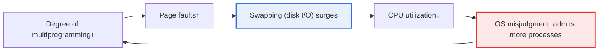
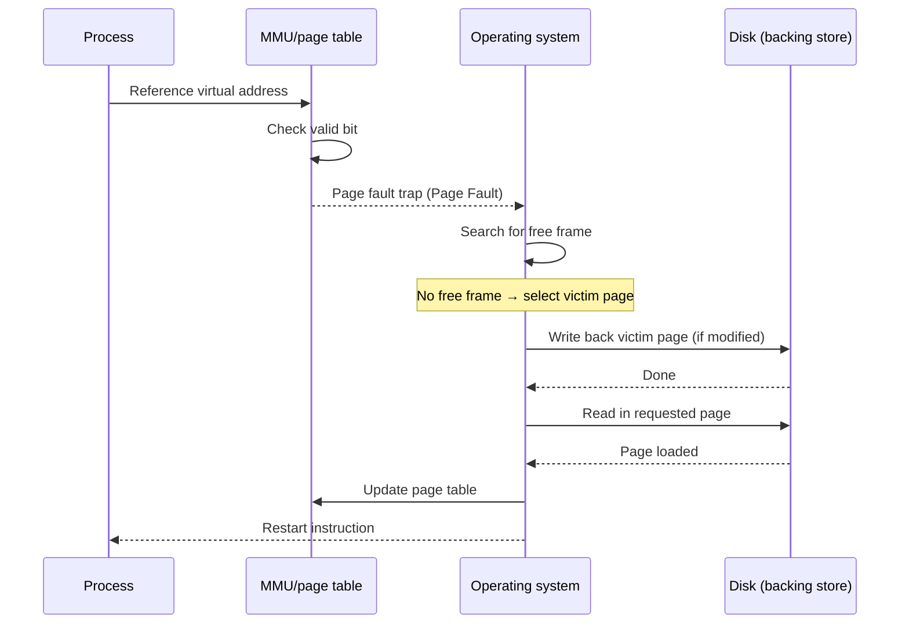

# Thrashing

## 1. Overview

### A. Definition
> **Thrashing** is a phenomenon in a virtual memory system in which **page faults occur excessively, so the CPU spends more time on page replacement (swapping) than on actual computation, and system throughput collapses sharply**. Its hallmark is CPU utilization plunging vertically the moment the degree of multiprogramming exceeds a critical point.

The essence of thrashing is that "**the system does no work and only keeps swapping pages**". Virtual memory is a technique that loads only the pages needed for execution through demand paging, rather than loading an entire program into physical memory. Thanks to this, programs larger than physical memory can run, and multiple processes can run simultaneously. However, this technique rests on the locality-of-reference assumption that "needed pages will already be in memory", and the moment this assumption breaks down, the system collapses into thrashing.

The root of the problem is that **the total amount of physical memory (frames) is finite, yet there are too many processes trying to run**. When each process cannot secure even the minimal set of pages needed for its work, an endless cycle of "stealing pages back and forth" occurs: page B is evicted (page-out) to load page A, soon B is needed again so C is evicted to load B, and meanwhile A is needed again. The CPU cannot actually execute instructions and merely waits for disk I/O to complete. In fact, the cost of handling a single page fault is on the order of milliseconds (about 5–10ms for HDD, and tens to hundreds of microseconds even for SSD), tens of thousands of times slower than CPU instruction execution in nanoseconds. This is why the effective access time explodes when the fault rate rises even slightly.

On top of this, **the operating system's misjudgment completes the vicious cycle**. When thrashing begins, CPU utilization hits bottom, and the medium-term scheduler (scheduling policy) interprets this as "the CPU is idle" and raises the degree of multiprogramming further. As additional processes are admitted, competition for frames intensifies, page faults surge further, and CPU utilization drops further. This feedback loop is the key that makes thrashing not a mere performance degradation but a "self-reinforcing collapse". Therefore, thrashing can be fundamentally escaped not by adding resources but by **controlling the degree of multiprogramming**.

### B. Characteristics of Thrashing
Thrashing has several characteristics that distinguish it from simple overload. First, **nonlinear collapse**. As load gradually increases, performance does not decline gently but drops like a cliff the moment the critical point is passed. Second, it shows the paradoxical indicator of **low CPU utilization and high disk activity appearing simultaneously**. On the surface the CPU is idle, yet the system is paralyzed. Third, **self-aggravation**. Without intervention, it cannot recover by itself and gets worse.

## 2. Principle and Mechanism of Occurrence

### A. Relationship Between Degree of Multiprogramming and CPU Utilization

The diagram above represents the vicious cycle of thrashing. The key is the red node at the end, i.e., **the step where the operating system misinterprets low CPU utilization and adds more load**. Without this feedback, thrashing would remain a temporary performance degradation, but with the OS's misjudgment involved, the collapse accelerates.

Plotting the degree of multiprogramming on the x-axis and CPU utilization on the y-axis, the curve divides into three regions. In the initial region, adding processes keeps the CPU busy rather than idle, so utilization rises. In the second region, near the critical point, utilization reaches its peak. This point is the equilibrium at which physical memory can barely hold the working sets of all processes. In the third region, admitting more processes shrinks each process's frames below its working set, page faults explode, and CPU utilization falls vertically. Thrashing occurs precisely in this third region. In practice, controlling the degree of multiprogramming to target "just before the peak" becomes the goal of scheduling.

### B. Detailed Flow of Page Fault Handling

This sequence diagram shows how many steps are involved in handling a single page fault. It is especially important that **when there is no free frame**, two disk I/Os can occur: selecting a victim page and writing it to disk (write-back), then reading in the requested page. In the thrashing state, almost all page faults take this "no free frame" path, so a single fault triggers two disk accesses, doubling the bottleneck. The reason an optimization exists that preferentially victimizes unmodified (clean) pages is to save one write-back.

Quantifying with Effective Access Time (EAT) makes the severity clear. With a memory access of 100ns and page fault handling of 8ms (=8,000,000ns), for a fault rate p, EAT ≈ (1-p)×100 + p×8,000,000. Even at a fault rate of just 0.1% (p=0.001), EAT is about 8,100ns, 80 times slower than normal. In the thrashing region, the fault rate reaches several percent, so the system effectively comes to a standstill.

### C. Working Set and Locality
The theoretical foundation for understanding and controlling thrashing is **locality of reference** and the **working set**. A program does not reference its entire address space evenly at any given moment; at a particular time, references concentrate on a subset of pages. These are temporal locality (data just used will soon be used again) and spatial locality (adjacent addresses are used together). Program execution can be viewed as a series of "phase transitions" in which these locality sets shift over time.

The working set is a concept that quantifies this idea, defined as **the set of distinct pages referenced during the most recent Δ (working-set window) time**. The insight of the working set model proposed by Denning is that "guaranteeing each process frames equal to its working set size drastically reduces page faults". Conversely, if frames fall short of the working set, faults repeat even when the phase is stable. The moment the sum of working sets across the system exceeds the number of physical frames is precisely the critical point of thrashing, and at that point the OS must swap out one process to lower the sum.

### D. Impact of Page Replacement Policy
The frequency of thrashing is also intertwined with the page replacement algorithm. Global replacement resolves one process's fault by taking frames from other processes, so one process's runaway behavior easily spreads to the whole system and causes thrashing. Local replacement, on the other hand, has each process replace only within its own allocated frames, preventing contagion, but if the allocation falls short of the working set from the start, that process thrashes alone internally. In addition, the FIFO algorithm can exhibit **Belady's Anomaly**, in which faults actually increase when frames are added, so the LRU family, being stack algorithms, is safer from a thrashing perspective.

## 3. Comparison of Solutions

Countermeasures for thrashing broadly divide into "guaranteeing the working set", "directly monitoring and adjusting the fault rate", "lowering the load itself", and "adding resources". The table below summarizes them, and why each technique is effective and what limitations it has are then explained in prose.

| Solution | Principle | Limitations·cost |
|---|---|---|
| **Working set model** | Allocate frames equal to the size of the page set a process needs | Overhead of estimating window Δ·measuring working set |
| **PFF (Page-Fault Frequency)** | Dynamically adjust frames with upper/lower bounds on page fault rate | Threshold setting is workload-dependent |
| **Controlling degree of multiprogramming** | Swap out (suspend) some processes when threshold is exceeded | Reduced responsiveness of swapped-out processes |
| **Adding physical memory** | Resolves fundamental frame shortage | Cost, address space·power limits |
| **Improving locality** | Design code·data structures with high locality of reference | Requires application redesign |

The **working set model** is the most fundamental approach. The OS estimates each process's working set size and guarantees that many frames, but if the sum of all processes' working sets exceeds the total frames, it suspends one process entirely (swap-out). This way, the surviving processes secure sufficient frames and faults drop sharply. However, it is hard to set the working-set window Δ accurately, and the cost of updating the working set on every reference is high, so actual implementations use an approximation that periodically samples reference bits.

The **PFF (Page-Fault Frequency) technique** is a practical detour that monitors only the resulting indicator — the fault rate — instead of measuring the working set directly. When a process's fault rate exceeds the upper bound, it is taken as a signal that "frames are insufficient" and more frames are given; when it falls below the lower bound, frames are deemed "surplus" and reclaimed. Because it uses feedback control to keep the fault rate within a band, implementation is simple and response is fast. However, the optimal upper/lower thresholds vary by workload, and setting them wrong leads to oscillation or sluggish response.

**Controlling the degree of multiprogramming** is the direct approach of lowering the overload that directly causes thrashing. When the medium-term scheduler detects thrashing, it swaps out and temporarily suspends processes with low priority or large working sets, and swaps them back in once the system stabilizes. The immediate effect is large, but since the response time of suspended processes grows, caution is needed for interactive workloads.

**Adding physical memory** is the surest way to eliminate the root cause of frame shortage, but it has cost and physical limits, and it is not a fundamental solution when the workload immediately consumes the added memory (e.g., analytics jobs whose data size grows in proportion to memory). Finally, **improving locality** is an application-level measure; a classic example is that simply changing loops to traverse a two-dimensional array in row-major storage order reduces faults by dozens of times.

## 4. Comparison with Similar Phenomena

Thrashing reappears at multiple layers with similar names and mechanisms. Distinguishing them speeds up diagnosis.

| Category | Layer of occurrence | Cause | Symptoms |
|---|---|---|---|
| **Page thrashing** | Virtual memory (frames) | Frames < sum of working sets | Swapping storm, sharp drop in CPU utilization |
| **Cache thrashing** | CPU cache lines | Conflict misses·false sharing | Surge in cache miss rate, IPC degradation |
| **TLB thrashing** | Address translation cache (TLB) | Working set > number of TLB entries | Explosion of TLB misses, increased page walks |

Though the three phenomena occur at different layers, they share the same principle: "the working set that must fit in a small, fast store exceeds its capacity, so replacement repeats endlessly". For example, on multicore systems, **false sharing** — in which different cores alternately write adjacent variables on the same cache line — is a representative case of cache thrashing, and performance recovers greatly when padding is inserted between variables to separate the lines. In this way, thrashing is not a problem unique to a particular technique but a universal pattern that appears anywhere the structure of "finite fast storage + an exceeding working set" exists.

## 5. Advanced — Thrashing and Responses in Modern Environments

It is easy to mistakenly think traditional page thrashing has become rare today as physical memory has grown, but in reality it has changed form and is still common. **Memory over-commit in container and virtualization environments** is representative. In Kubernetes, when a pod's memory `limit` is set low or the entire node becomes over-committed, the Linux kernel's reclaim path keeps evicting pages, `kswapd` occupies the CPU, and eventually the OOM Killer forcibly terminates processes. To catch this situation early, modern Linux provides the **PSI (Pressure Stall Information)** metric; high `some` and `full` ratios in `/proc/pressure/memory` mean that tasks are stalled waiting for memory reclaim, effectively a quantitative signal of thrashing.

**Changes in swap policy** are also noteworthy. `zram` and `zswap` store pages destined for swap in compressed form in memory instead of on disk, replacing slow disk I/O with compression/decompression costs and thus reducing the perceived pain of thrashing. However, this only alleviates symptoms; if the working set still overflows after compression, collapse eventually occurs, so it is not a fundamental solution. Also, systems with **their own buffer management**, such as databases and the JVM, strongly dislike swapping, so tuning that disables swap (close to `swappiness=0`) or pins large memory regions is commonly applied. Conversely, disabling swap entirely eliminates headroom, creating the trade-off that even a small excess leads straight to OOM.

On a macro level, **the expansion of the memory hierarchy** is changing the landscape of thrashing. CXL (Compute Express Link)-based memory pooling and tiering places remote memory as a tier slower than local memory, creating a new thrashing spectrum in which "disk swap" is softened into "remote memory access". In this environment, rather than a binary "thrashing or not", tiering policies that manage the access ratio per tier determine performance.

## 6. Considerations and Implications

From a Professional Engineer's perspective, thrashing should be understood not as a single technology but, more broadly, as a system design principle of "how to control resource contention".

1. **Redefining observation metrics — do not look only at CPU utilization.** During thrashing, CPU utilization actually appears low, so judging by utilization alone leads the OS or operators to the fatal misjudgment of adding more load. A multi-metric monitoring system that observes **page fault rate, swap in/out volume, PSI memory pressure, and disk wait queues** together is essential. If the observation targets are wrong, the very direction of intervention is reversed.
2. **A dual strategy of working-set guarantee and load control.** The fundamental measure is to guarantee each process frames equal to its working set, and if the load is so large that this is impossible, the degree of multiprogramming must be lowered. "Adding resources" and "reducing load" are not substitutes but two levers to choose between depending on the situation, and thrashing is usually fundamentally resolved only by the latter.
3. **Explicit design of trade-offs.** Disabling swap brings OOM risk instead of thrashing, memory over-commit brings collapse risk in exchange for density, and zram brings I/O savings at the cost of CPU. Since no choice is free, trade-offs must be deliberately designed according to workload characteristics (interactive vs batch, memory elasticity).
4. **Recognizing universality across layers.** Thrashing is not a problem unique to virtual memory; it recurs wherever "finite resources + excess demand" exist, such as caches, TLBs, connection pools, and thread pools. By generalizing and understanding this structure, problems such as connection pool exhaustion or thread context-switching storms can be diagnosed and solved with the same frame (working set vs capacity).
5. **Linkage with cloud cost and SLAs.** In autoscaling environments, thrashing leads to a chain of response latency surge → request backlog → health check failure → instance replacement, harming cost and availability simultaneously. Setting memory-based scaling thresholds and `limit`/`request` values based on measured working sets is a key task from an SRE perspective.

## References
- Silberschatz, Galvin, Gagne, *Operating System Concepts* — chapters on Thrashing, Working-Set Model, PFF
- P. J. Denning, "The Working Set Model for Program Behavior" (1968)
- Linux Kernel Documentation — Pressure Stall Information (PSI): https://docs.kernel.org/accounting/psi.html
- Kubernetes Documentation — Node-pressure Eviction: https://kubernetes.io/docs/concepts/scheduling-eviction/node-pressure-eviction/

---

> **In one line**: Thrashing is *a self-reinforcing phenomenon in which excessive multiprogramming causes page faults to explode so that the CPU only repeats swapping and throughput collapses*; it is countered with working-set guarantees, PFF, and control of the degree of multiprogramming, while avoiding the misjudgment of looking only at CPU utilization and also managing modern-environment indicators such as container over-commit and PSI.
