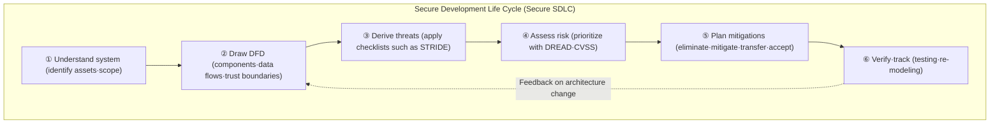
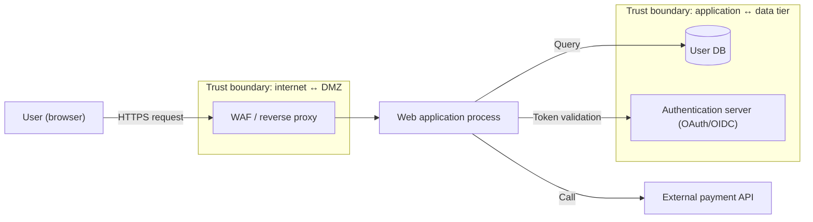

# Threat Modeling

## 1. Overview

> **Threat Modeling** is a security activity that structurally analyzes a system's architecture and data flows to **identify, classify, and evaluate in advance, at the design stage,** potential threats and the attack surface, and derives mitigations according to risk level.

Traditional security was a **reactive** approach in which defects were found through penetration testing or vulnerability scanning after the system was fully built. However, the cost of fixing defects found in an already-deployed system is far greater than the cost of catching them at the design stage. The classic study by the IBM System Science Institute and various security literature citing it hold that if the cost of removing a defect at the requirements/design stage is 1, the cost of fixing the same defect in operation reaches roughly **tens of times to 100 times**. The exact multiplier varies by organization and study, but the direction that "the further left you shift (Shift-Left), the more costs drop" is consistent. Threat modeling is the representative practice of this proactive perspective, an activity that systematically answers "what to protect, from what, and how" early in development.

The background for needing threat modeling can be summarized in three points. First, **the explosion of system complexity**. As microservices (MSA), cloud, API integrations, and third-party SaaS become intertwined, the attack surface has widened exponentially, and it is hard to enumerate threats exhaustively by the intuition of those in charge alone. Second, **regulatory and compliance requirements**. The Personal Information Protection Act, ISMS-P, PCI-DSS, and the SSDF (NIST SP 800-218) under the U.S. Executive Order (EO 14028) require security to be embedded in the Software Development Life Cycle (SDLC), and threat modeling is recognized as a core artifact of it. Third, **the transition to DevSecOps**. In an environment where deployment cycles reach dozens of times a day, automating and continuously applying security requires threat analysis at design time to be incorporated as the first gate of the pipeline.

The characteristics of threat modeling are that (1) it is **a thinking procedure and methodology**, not a specific tool, (2) it aims not for perfect security but for **risk-based prioritization**, and (3) it is not a one-off document but a **living document** updated with every architecture change.

## 2. The Four Key Questions and Overall Process of Threat Modeling

The essence of threat modeling as organized by Adam Shostack is condensed into four questions: "① What are we building?", "② What can go wrong?", "③ What are we going to do about it?", and "④ Did we do a good job?". These four questions correspond respectively to asset/structure identification, threat derivation, response planning, and verification, and even organizations introducing threat modeling for the first time will not lose their way if they use this frame as the skeleton.

The concept diagram below shows the overall structure of where threat modeling sits within the SDLC and how each phase is connected.

The overall process is sequential, but it is important that it is an **iterative** structure that returns from the final verification phase to the Data Flow Diagram (DFD) phase. When new features are added or infrastructure changes, trust boundaries shift, so the threat model must be updated. Neglecting this causes "model drift", in which the model and the actual system diverge, destroying the reliability of the analysis.

### A. System Understanding and Asset Identification

The first step is to clarify the assets to be protected and the scope of analysis. Assets include customer personal information (PII), authentication credentials, payment information, trade secrets, and system availability itself. The **sensitivity and business impact** of assets must be described together to establish the criteria for subsequent risk assessment. For instance, in an e-commerce system, "card number·CVC" is a top-tier asset; since exposure leads to PCI-DSS violations and direct monetary damage, it becomes the highest-priority protection target. If the scope is made too broad at this stage, the analysis diverges, so it is practically effective to approach it by cutting it into units of a single service or bounded context.

### B. Data Flow Diagram (DFD) and Trust Boundaries

To derive threats systematically, the system must be represented as a diagram. The most widely used notation is the **Data Flow Diagram (DFD)**, composed of four elements: External Entity (users, external systems), Process (computing actor), Data Store, and Data Flow. The key is to overlay **trust boundaries** on it. A trust boundary represents a point where the level of trust changes — for example, between the internet and the DMZ, or between the application and the database — and the points where data crosses these boundaries are precisely where threats concentrate.

Below is a detailed architecture diagram that represents a web application as a DFD and maps where STRIDE threats occur.

Drawing trust boundaries explicitly structures threat derivation in ways such as "at the point where user input passes into the application, focus on Tampering and command injection; at the DB access point, focus on Information Disclosure". In other words, the DFD is not a mere picture but serves as an **exploration map** for enumerating threats exhaustively (MECE).

A practical point to note when drawing a DFD is **the choice of abstraction level**. A hierarchical approach is recommended: start from a context diagram (Level 0) representing the entire system as one process, and decompose into sub-processes (Level 1, 2) only the parts that need analysis. Drawing in excessive detail from the start makes maintenance hard, while being too abstract misses threats. Detailing first the flows through which high-sensitivity assets pass and the flows that cross trust boundaries is highly cost-effective.

### C. STRIDE — Threat Classification Scheme

STRIDE is a threat taxonomy established by Microsoft; it is an acronym of six threat categories. It is systematic in that each category corresponds exactly to **a situation in which a basic security property (CIA, etc.) is violated**. The table below summarizes it, and why each item corresponds as it does is described afterward.

| Threat | Violated security property | Representative case | Key mitigations |
|---|---|---|---|
| **S**poofing | Authentication | Logging in by impersonating another's account | Strong authentication·MFA·mutual TLS |
| **T**ampering | Integrity | Manipulating transmitted data·parameters | Hashes·digital signatures·input validation |
| **R**epudiation | Non-repudiation | Denying a transaction occurred | Audit logs·timestamps·signatures |
| **I**nformation Disclosure | Confidentiality | Leak of sensitive info·SQLi | Encryption·access control·least privilege |
| **D**enial of Service | Availability | DDoS·resource exhaustion | Rate limiting·autoscaling·CDN |
| **E**levation of Privilege | Authorization | Seizing admin rights from a regular user | Privilege separation·RBAC·sandbox |

Spoofing is the threat of faking identity, occurring when authentication mechanisms are weak. Examples include stealing session tokens or exploiting predictable session IDs, mitigated by multi-factor authentication (MFA) and secure token management. Tampering breaks data integrity; HTTP parameter manipulation and man-in-the-middle attacks are representative, defended with digital signatures, Message Authentication Codes (MAC), and server-side re-validation. Repudiation is the threat of an actor denying their own actions; tamper-proof audit logs and timestamps are essential countermeasures.

Information Disclosure is a breach of confidentiality caused by SQL injection, excessively revealing error messages, and unencrypted communication. Encryption at rest and in transit and the principle of least privilege are key. Denial of Service is a threat targeting availability, including resource-exhaustion attacks such as application-layer DDoS or regular expression explosion (ReDoS), mitigated with rate limiting, reverse proxies, and autoscaling. Elevation of Privilege is bypassing authorization controls to obtain higher privileges, caused by missing permission checks (IDOR), insecure deserialization, etc., and prevented with Role-Based Access Control (RBAC) and server-side authorization verification. In this way, STRIDE forces one to check "how each of the six threats can be realized at this element", helping derive threats comprehensively without depending on the analyst's experience.

## 3. Risk Assessment and Methodology Comparison

Not all derived threats can be treated with equal weight. Since resources are finite, **prioritization by risk level** is essential, and the representative qualitative technique is **DREAD**. DREAD scores five factors — Damage, Reproducibility, Exploitability, Affected Users, and Discoverability — each from 0 to 10, and computes an average risk score. For example, if a SQL injection threat scores Damage 9, Reproducibility 8, Exploitability 7, Affected Users 9, and Discoverability 6, the average is 7.8, a "High" rating, making it a top-priority action item. However, DREAD is criticized for its highly subjective scoring, so the recent trend is to use it alongside **CVSS (Common Vulnerability Scoring System)**, the standard for the severity of vulnerabilities themselves, or the organization's risk matrix (likelihood × impact).

There are several threat modeling methodologies besides STRIDE, chosen according to perspective.

| Methodology | Perspective·focus | Characteristics | Suitable situation |
|---|---|---|---|
| **STRIDE** | System·developer-centered | Comprehensive threat categories, easy to learn | Standard for general SW·design stage |
| **PASTA** | Business·risk-centered | 7 stages, sophisticated attack simulation | When risk-based decisions are needed |
| **Attack Tree** | Attacker·goal-centered | Decomposes attack paths with the goal as root | In-depth analysis of specific assets |
| **LINDDUN** | Privacy-centered | 7 categories of privacy threats | GDPR·privacy impact assessment |
| **VAST** | Scalability·automation-centered | Applied in agile·large organizations | Enterprise-wide DevOps rollout |

A common mistake in choosing a methodology is assuming that "the most sophisticated methodology is always right". In reality, the organization's security maturity, team size, and deployment cycle drive the choice. If a team introducing threat modeling for the first time immediately applies all seven PASTA stages, the burden is large and adoption easily fails. Therefore, gradual expansion — building the habit with STRIDE and then layering a precise methodology only on high-risk assets — is realistic, and this is directly tied to the trade-off considerations discussed later.

If STRIDE broadly scans "what can go wrong" from a system perspective, **PASTA (Process for Attack Simulation and Threat Analysis)** is a seven-stage risk-centered methodology that starts from business objectives and simulates threats as real attack scenarios, with strengths in persuading executives and deciding investment priorities. **Attack Tree** places one attack goal, such as "seize administrator privileges", at the root node and decomposes the sub-paths achieving it with AND/OR, useful when digging deep into a specific high-risk asset. **LINDDUN** is the privacy version of STRIDE (Linkability, Identifiability, Non-repudiation, Detectability, Disclosure of information, Unawareness, Non-compliance), used in combination with Privacy Impact Assessment (PIA). In practice, rather than using just one, a **mixed strategy** of broadly scanning with STRIDE and layering Attack Tree/PASTA on high-risk parts is common.

## 4. Mitigations and Practical Application Cases

Responses to threats follow the general principles of risk management. That is, the decision is made considering cost-effectiveness among four options: (1) Eliminate the threat itself (e.g., removing unnecessary features and ports), (2) Mitigate the risk with controls (e.g., input validation, encryption), (3) Transfer it to a third party (e.g., delegating payment to a PCI-DSS-certified payment gateway, cyber insurance), and (4) Accept the residual risk (with documented rationale). The key here is the risk-management mindset that **the goal is not to reduce all threats to zero but to lower them to a tolerable level (Risk Appetite)**.

As a concrete case, suppose a fintech service performed threat modeling while designing a money transfer API. If, in the "client → transfer process" flow on the DFD, Tampering (manipulating the amount parameter) and Elevation of Privilege (transferring from another's account, IDOR) were derived, the response would be to add server-side amount re-validation, transaction signing, and authorization logic verifying that the account belongs to the requester. Also, in the "transfer process → audit store" flow, tamper-proof logs (e.g., append-only storage) and timestamps are reflected in the design to prevent Repudiation. This way, the situation of IDOR being found in penetration testing after development and requiring an emergency patch can be prevented in advance.

As another case, suppose one designs an IoT smart home gateway. In a structure where many low-spec sensors send data to the cloud via the gateway, firmware integrity is weak, so Tampering (malicious firmware injection) and Spoofing (registration of impersonating devices) are derived as key threats. In response, Secure Boot and per-device mutual certificates (mTLS) are reflected in the design, and per-device rate limiting is placed at the gateway to prevent DoS from masses of devices flooding requests simultaneously. In this way, the STRIDE categories emphasized in threat modeling differ by domain (web, fintech, IoT), and that difference stems from each domain's trust boundaries and asset characteristics.

From an industry application perspective, Microsoft has institutionalized threat modeling as a mandatory activity of the SDL (Security Development Lifecycle) and has distributed the free **Microsoft Threat Modeling Tool**, while in the open-source community, OWASP **Threat Dragon** and **pytm**, which manages threat models as code, are widely used. In particular, expressing threat models as code like pytm (Threat Modeling as Code) enables configuration management, review, and CI automation, integrating naturally into DevSecOps pipelines. In fact, large cloud and financial companies often require threat model artifacts as a pass condition for new service design reviews, thereby filtering out design flaws before they propagate to the code and operations stages.

## 5. Advanced — DevSecOps Automation and Recent Trends

The limitation of traditional threat modeling was **speed and scalability**. Because security experts performed manual analysis in workshop form, it could not keep pace with agile and DevOps environments deploying dozens of times a day. What emerged to overcome this is the **trend toward automation and lightweight approaches**.

First, **Threat Modeling as Code**. As with pytm or Threagile mentioned above, when the architecture is described declaratively (YAML, DSL), tools automatically generate threats and countermeasures, which are version-controlled with Git and executed in the CI pipeline. Since the threat model is updated together when the code changes, the "model drift" problem noted earlier is greatly alleviated.

Second, **standardization**. OWASP presents a common vocabulary and procedure for threat modeling, and the **Threat Model Manifesto** and related standardization discussions, such as OASIS's work on exchanging threat information in machine-readable form, are underway. Attempts to graft the tactics and techniques knowledge base of MITRE **ATT&CK** onto the threat derivation phase, concretizing abstract STRIDE categories into actual attack techniques, are also increasing.

Fourth, **DevSecOps pipeline integration**. The results of threat modeling do not end in themselves; they become effective when the derived mitigations are converted into check rules for static analysis (SAST), dynamic analysis (DAST), and dependency checking (SCA) and reflected in CI/CD. For example, encryption requirements responding to an "Information Disclosure" threat are linked to be automatically verified as SAST rules, and authorization checks responding to an "Elevation of Privilege" threat as integration test cases. This way, the last question of the threat model, "did we do a good job?", can be measured continuously through pipeline metrics.

Fifth, **grafting generative AI**. Recently, experimental approaches in which an LLM proposes a STRIDE-based threat list and draft mitigations when an architecture diagram or design document is input have been spreading. This is useful as an auxiliary means that greatly reduces drafting time, but it is emphasized that **expert review (Human-in-the-loop) must accompany it**, since the LLM may generate non-existent threats (hallucination) or omit contextually important threats. In other words, AI is positioning itself not as a replacement for threat modeling but as a tool that accelerates it. However, since the concrete maturity of such tool and AI use varies greatly by organization and time, effectiveness should be verified through pilots before adoption.

## 6. Considerations and Implications

From a Professional Engineer's perspective, the following should be considered for introducing and embedding threat modeling.

- **Shift-Left and SDLC embedding**: Threat modeling maximizes cost-effectiveness when placed at the design stage. It should be incorporated as a formal gate of requirements/design artifact review (Design Review), and its outputs should be used as the basis for security requirements, linked with requirements engineering and testing. If left only as a document for after-the-fact inspection, it becomes a formality with no effect.

- **Trade-off between cost/time and coverage**: Analyzing every component precisely would be ideal but hinders deployment speed. It is realistic to focus scope first on trust boundaries and high-sensitivity assets (Risk-based Prioritization) and expand incrementally each iteration. A hybrid strategy that applies a lightweight methodology (VAST) and a precise methodology (PASTA) differentially according to asset grade is effective.

- **Governance and organizational culture**: Threat modeling is not an activity of the security team alone but a collaborative activity involving architects, developers, and operators. It is sustainable only if R&R are clarified, reusable threat libraries and checklists are accumulated, and training and tools are provided so that developers can perform it themselves within a DevSecOps culture.

- **Maintenance as a living artifact**: When architecture, infrastructure, or regulations change, trust boundaries and threats change too. Model drift can be prevented only by managing threat models as code and linking them to CI so they are automatically re-evaluated whenever changes occur. In addition, the implementation status of mitigations should be traced (Traceability) in connection with vulnerability management and security test results, so that the final question "did we do a good job?" can be answered.

- **Integration with related technologies**: Threat modeling is not complete on its own. The full prevention-detection-response cycle is completed when it is interlinked with SBOM-based supply chain threats, redefinition of trust boundaries in Zero Trust Architecture, MITRE ATT&CK-based threat intelligence, and SIEM/XDR detection rules. Especially in cloud and MSA environments, combination with Continuous Threat Exposure Management (CTEM), which considers dynamically changing boundaries, is anticipated.

- **Quantitative effect measurement and proving ROI**: Because threat modeling prevents "incidents that did not happen", it has the limitation that its results are not readily visible. It is therefore important to quantify the effect with metrics such as the number of threats removed at the design stage, the reduction rate of newly found defects in penetration testing, and shortened defect fix time (MTTR), proving the investment value to executives and securing the continuity of the activity.

## References

- OWASP, "Threat Modeling Process", https://owasp.org/www-community/Threat_Modeling_Process
- Microsoft, "Threat Modeling — Security Development Lifecycle", https://learn.microsoft.com/en-us/security/engineering/threat-modeling-tool
- OWASP, "Threat Modeling Cheat Sheet", https://cheatsheetseries.owasp.org/cheatsheets/Threat_Modeling_Cheat_Sheet.html
- NIST, "SP 800-218 Secure Software Development Framework (SSDF)", https://csrc.nist.gov/pubs/sp/800/218/final

---

> **In one line**: Threat modeling is a Shift-Left security activity that structures the system with a DFD, comprehensively derives threats with STRIDE, and prioritizes them with DREAD·CVSS to proactively lower risk at the design stage, and it is evolving through DevSecOps automation and AI integration.
