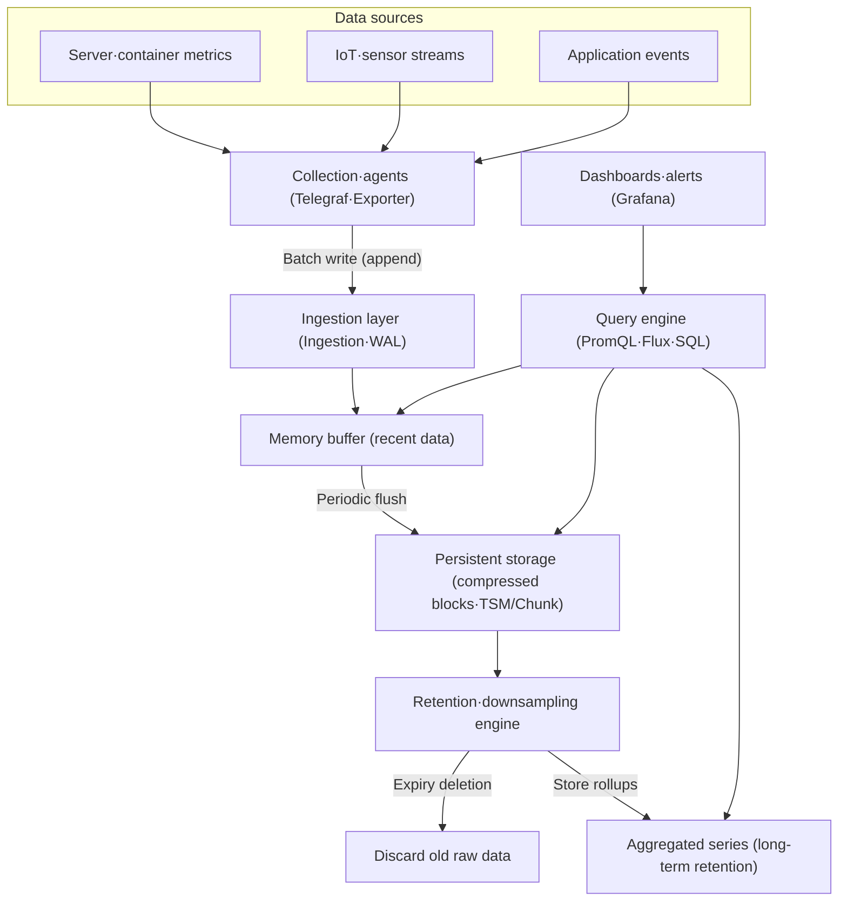
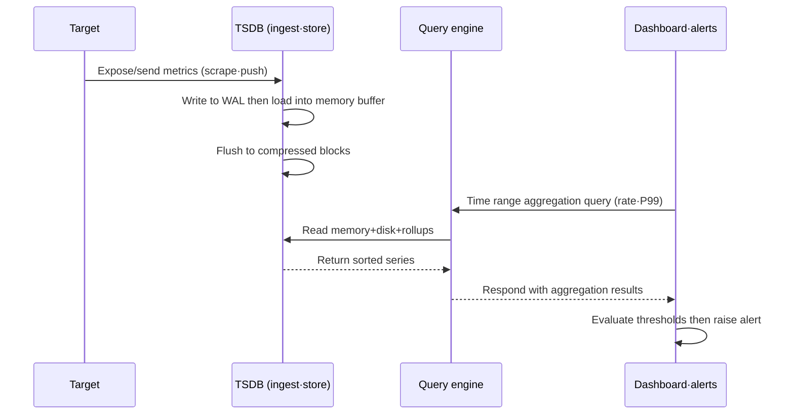

# Time Series Database (TSDB)

## 1. Overview

> A **Time Series Database (TSDB)** is a special-purpose database that treats time (timestamp) as a first-class axis and is optimized to ingest, compress, query, and retain at high speed the measurements (metrics) that accumulate continuously in time order. If a relational DB stores "what is true (current state)", a TSDB stores "what the value was and when (history of state changes)", and it specializes in large-volume append-only writes and time range aggregation.

Time series data is a sequence of values obtained by repeatedly measuring one observed target over time.
The CPU utilization of a server recorded every second, the values emitted thousands of times per second by a vibration sensor on smart factory equipment, stock trade prices, and the power consumption of a household smart meter are all time series.
They share the traits of being **facts that do not change once time has passed (immutable)**, being overwhelmingly **write-heavy**, and being queried mostly in the form of **time range aggregation** over "the last N minutes / a specific interval".

Putting such data as-is into a traditional relational DB (RDBMS) leads to mismatches in several places.
An RDBMS uses B-tree indexes and row-based storage on the premise of updates/deletes of arbitrary rows and complex joins, but time series has almost no updates and only a flood of inserts, so B-tree indexes keep splitting (page split) and write performance plummets.
In addition, when hundreds of thousands of points per second accumulate endlessly, storage capacity grows linearly, and general-purpose DBs lack time-axis-specific compression or automatic expiration (retention), increasing the operational burden.
A TSDB is a storage engine designed to close exactly this gap — **high-speed ingestion, extreme compression, time range queries, and lifecycle management**.

In an essay answer, rather than reducing a TSDB to simply "a DB for storing time data", it is desirable to develop it along three axes: (1) the **structural characteristics** of the time series data model (measurement, tags, timestamp), (2) the **storage engine technologies** of LSM-based append optimization and delta/columnar compression, and (3) **data lifecycle management** represented by downsampling and retention policies.

### A. Background and Need

First, **the explosion of Observability and IoT** is the decisive trigger.
As microservice architecture (MSA) spreads, hundreds of services each emit hundreds of metrics per second, and in industrial sites, tens of thousands of sensors pour out measurements simultaneously.
For example, if 100 containers each record 50 metrics every 10 seconds, about 43 million points are generated in a single day, a scale that easily exceeds the insert capacity of general-purpose DBs.

Second, **storage cost (TCO) pressure**.
Time series never stops accumulating, so if the raw data is kept as-is, storage costs increase indefinitely.
By exploiting the property that consecutive measurements change only slightly (e.g., CPU 60% → 61% → 60%), delta encoding and bit-packing can compress by 10x or more, so dedicated compression translates directly into cost savings.

Third, **skewed query patterns**.
Time series queries are overwhelmingly **per-time-bucket aggregations** such as "5-minute averages over the last 6 hours" or "the trend of P99 response time", rather than individual row lookups.
Processing such queries quickly requires a dedicated structure that physically sorts and splits (partitions) data along the time axis and uses pre-aggregated rollups.

## 2. Time Series Data Model and Overall Structure

The data model of most TSDBs consists of the combination **measurement/metric name + tag set (tags/labels) + field value (field) + timestamp**.
Here, one unique combination of tags defines one **series**.
For instance, `cpu_usage{host="web-01", region="seoul"}` and `cpu_usage{host="web-02", region="seoul"}` have the same name but different tags, so they are separate series, and each series is a sequence of (timestamp, value) pairs sorted by time.

The key concept for understanding this model is **cardinality**.
Cardinality is the total number of distinct series, roughly the product of the number of values each tag can take.
If `host` has 1,000 kinds, `region` 10 kinds, and `metric` 50 kinds, theoretically 500,000 series result.
When cardinality explodes, indexes eat up memory and queries slow down, so the first principle of design is not to use items whose kinds of values grow without bound, such as user IDs or request IDs, as tags.

In the structure above, data starts with agents scraping metrics from sources and sending them in batches to the ingestion layer.
Newly arrived data is first written to the WAL (Write-Ahead Log) to secure durability and then accumulated in the memory buffer; since recent data is queried more frequently, it is served directly from memory.
When the buffer reaches a certain size, it is flushed to disk as immutable blocks sorted and compressed in time order, and the retention engine expires and deletes old raw data while keeping what needs long-term retention as low-resolution rollups.
The query engine transparently spans memory, disk, and rollups to assemble results, and dashboards visualize these query results.

### A. Storage Engine: LSM and Time-Axis Compression

The secret of how a TSDB withstands high-speed inserts lies mostly in **LSM (Log-Structured Merge)-family structures**.
An RDBMS B-tree finds the insert position and updates pages, resulting in many random writes, whereas LSM first accumulates incoming writes sequentially in memory (memtable) and then writes them sequentially to disk as whole, sorted immutable files.
Sequential writes are tens of times faster than random writes and also favorable for SSD lifespan, enabling appends of hundreds of thousands to millions of points per second.
InfluxDB's TSM engine and Prometheus's block/chunk structure follow this principle.

Compression is the most dramatic advantage of a TSDB.
Since timestamps usually come at regular intervals (e.g., 10 seconds), **delta-of-delta** encoding turns most of them into values close to 0, expressible with a few bits, and for floating-point measurements, **Gorilla compression** is applied, which XORs each value with the previous one and strips leading and trailing zero bits.
According to the Gorilla paper published by Facebook, this technique reduced a single time series point to about 1.37 bytes on average, achieving over 10x compression compared to uncompressed.
In practice, when a raw 16-byte point (8B timestamp + 8B value) shrinks to 1–2 bytes, storage costs and disk I/O drop sharply together.

### B. Data Lifecycle: Retention Policy and Downsampling

For time series, it is natural to view "recent data in detail, older data coarsely".
Tracking an incident in real time requires 1-second resolution, but a 1-hour average is sufficient for looking at capacity trends from a year ago.
Exploiting this property, a TSDB uses **downsampling** to summarize old raw data into low-resolution rollups (e.g., 1 second → 1-minute average/max/min) and uses a **retention policy** to automatically expire raw data.

For example, setting a policy of "raw data for 7 days, 1-minute rollups for 90 days, 1-hour rollups for 2 years" secures both the precision of recent incident analysis and the economy of long-term trend analysis.
For instance, downsampling 1 point per second to a 1-minute average reduces data volume to 1/60, allowing even two years of long-term data to be kept at practical cost.
This is a core operational feature specialized for time series workloads that general-purpose DBs lack.

## 3. Major Product Types and Architecture Comparison

TSDBs broadly divide into three branches according to origin and design philosophy.
The representative ones are the dedicated engine type (InfluxDB), the monitoring-integrated type (Prometheus), and the relational extension type (TimescaleDB), each with different strengths and trade-offs.

InfluxDB is a dedicated engine designed from the ground up solely for time series, with its own storage format (TSM) and query language (Flux/InfluxQL), delivering high insert throughput and compression ratios.
On the other hand, its compatibility with the SQL ecosystem is weak, and high-availability features such as clustering being tied to commercial versions is a constraint.

Prometheus is the de facto standard for Kubernetes observability, a monitoring platform combining **pull-based collection**, the powerful query language PromQL, and alerting rules.
Since single-node local storage is the default, a remote storage layer such as Thanos or Cortex/Mimir must be added for long-term retention and horizontal scaling.

TimescaleDB operates as a PostgreSQL extension, providing automatic time-based partitioning (hypertables) and columnar compression internally while standard SQL, joins, and transactions can be used as-is.
Its greatest strength is the ability to reuse existing relational assets and personnel, while it concedes somewhat in extreme insert performance compared to pure dedicated engines.

| Category | InfluxDB (dedicated engine type) | Prometheus (monitoring type) | TimescaleDB (RDBMS extension type) |
|------|----------------------|------------------------|----------------------------|
| Foundation | Own TSM engine | Own blocks/chunks | PostgreSQL extension |
| Collection | Push (line protocol) | Pull (scraping) | SQL INSERT/COPY |
| Query | Flux·InfluxQL | PromQL | Standard SQL |
| Strengths | High compression·high insert | Cloud-native observability | SQL compatibility·joins |
| Limitations | Weak SQL ecosystem | Long-term storage configured separately | Concedes ultra-fast inserts |

However, the table above is only a starting point for selection; the actual decision depends on "the existing technology stack and team competence, required cardinality, and long-term retention requirements".
If Kubernetes observability is central, Prometheus is natural; if existing PostgreSQL operations staff are strong and SQL analysis must be done in parallel, TimescaleDB is advantageous in total cost; and if pure large-volume IoT ingestion is the goal, a dedicated engine prevails.

### A. Combining Query and Visualization

The value of time series is realized not in storage but in **query, visualization, and alerting**.
PromQL's `rate(http_requests_total[5m])` computes the per-second request increase rate over the last 5 minutes; like this, time-series-specific languages provide time windows, rates, and percentile (P95/P99) calculations as first-class operations.
Most sites complete the pipeline by visualizing these query results in dashboards such as Grafana and raising alerts when thresholds are exceeded.

## 4. Advanced: Recent Trends and Practical Application

The center of gravity of time series storage has recently been shifting toward **distributed object-storage-based architectures**.
Thanos, Grafana Mimir, VictoriaMetrics, and others process recent data quickly locally but move old compressed blocks down to object storage such as S3, achieving near-unlimited long-term retention and low cost.
This trend of separating compute and storage (disaggregation) allows the storage layer to scale independently and cheaply even when ingestion surges.

In addition, **integration of observability** is strengthening.
In the past, metrics (TSDB), logs, and traces were separate systems, but as OpenTelemetry unifies the collection standard for these three signals, the direction is evolving toward correlation analysis of time series metrics with logs and distributed traces.
For example, integrated observability — drilling down directly into traces from the moment a particular metric spikes — is becoming the standard.

As practical cases, large commerce and fintech companies in Korea and abroad load service metrics into TSDBs at per-second granularity, and SRE teams calculate SLOs/error budgets with this data.
In manufacturing, equipment sensor streams are stored in TSDBs to predict failures in advance (predictive maintenance) from subtle trends in vibration and temperature, and here the TSDB even serves as the feature source for real-time anomaly detection models.
Failure to manage cardinality is a typical cause of outages: if request IDs are put into tags and the number of series explodes into the millions, memory is exhausted, so the kinds of values must be limited at the tag design stage.

## 5. Considerations and Implications

From a Professional Engineer's perspective, TSDB adoption should be approached not as a storage replacement but as **a redesign of observability and data lifecycle strategy**, comprehensively considering the following.

- **Cardinality governance**: Tag (label) design determines performance and cost. Items whose kinds of values can grow indefinitely (user ID, session ID, full URL) should be separated into logs/traces rather than tags, and a governance system should be in place that calculates and monitors in advance the upper bound of tag combinations.

- **Accuracy-cost trade-off**: Raw resolution, retention period, and downsampling policy are a trade-off between analysis precision and storage cost. Tier the high-resolution intervals needed for incident analysis and the long-term rollups for trend analysis, and codify policies that satisfy both regulatory compliance (audit log retention requirements) and cost.

- **Understanding the limits of consistency and aggregation models**: Time series aggregation can have approximate or probabilistic characteristics (e.g., histogram-based percentiles are approximations). Determine the scope of application by distinguishing areas that need exact totals, such as financial settlement, from areas where trend observation suffices.

- **Integration with related technologies and architecture**: A TSDB is not complete on its own. It delivers value when combined with collection (Telegraf, OpenTelemetry), visualization and alerting (Grafana), long-term storage (S3, Thanos), and stream processing (Kafka). In particular, design together the integration of observability (logs, traces, metrics), SRE's SLO/error budget operations, and linkage with AI pipelines such as predictive maintenance and anomaly detection.

- **Outlook**: As compute-storage-separated cloud-native TSDBs and OpenTelemetry-based signal integration become standard, time series is being elevated beyond simple monitoring to a core data layer for real-time decision-making and prediction.

## References

- Facebook, "Gorilla: A Fast, Scalable, In-Memory Time Series Database", VLDB 2015 — https://www.vldb.org/pvldb/vol8/p1816-teller.pdf
- Prometheus Documentation, "Storage" — https://prometheus.io/docs/prometheus/latest/storage/
- InfluxData, "Time Series Database (TSDB) explained" — https://www.influxdata.com/time-series-database/
- Timescale Documentation, "Hypertables and compression" — https://docs.timescale.com/

---

> **In one line**: A time series database is a dedicated store that treats time as a first-class axis and optimizes append-only bulk ingestion, time-axis compression (delta/Gorilla), range aggregation, downsampling, and retention policies; it serves as the real-time data layer for observability, IoT, and predictive maintenance, and cardinality governance and the accuracy-cost trade-off are the key issues in its adoption.
