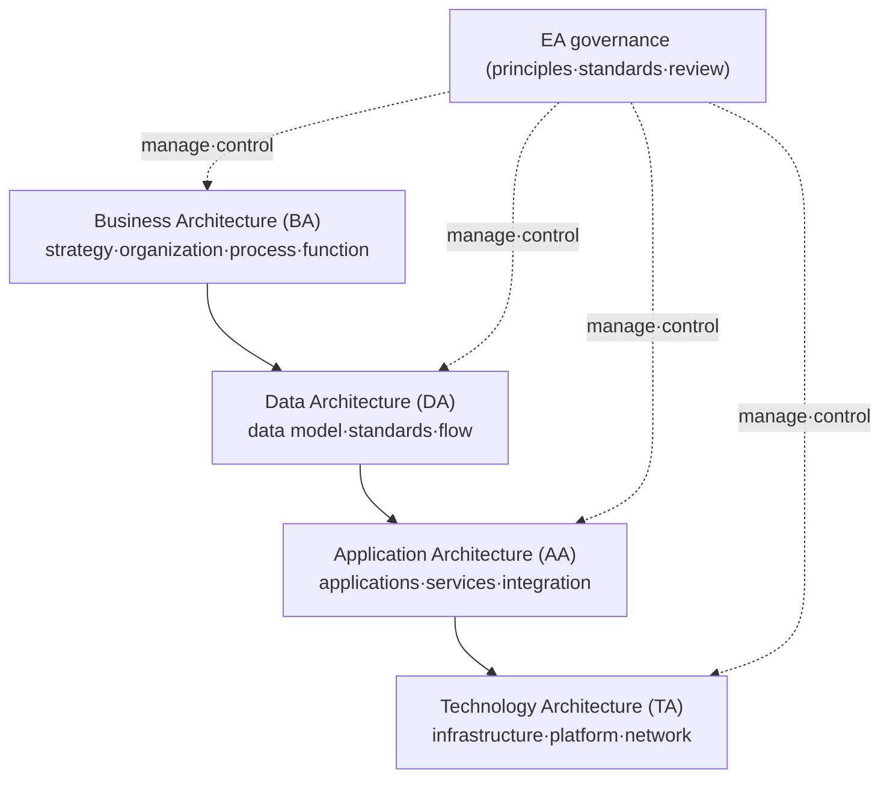
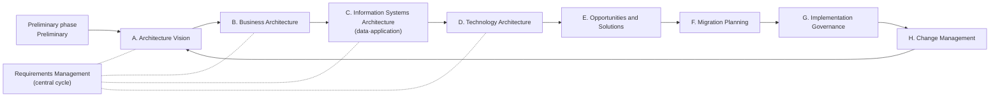

# TOGAF (The Open Group Architecture Framework) and Enterprise Architecture

## 1. Overview

### A. Definition

> **Enterprise Architecture (EA)** is a comprehensive design system that describes, from standardized viewpoints, the current (As-Is) and target (To-Be) structures of business, data, applications, and technology in order to align an organization's business strategy with its IT resources, and manages the transition path between them. **TOGAF** is an open EA framework established by The Open Group that holistically provides a methodology (ADM), reference models, and a governance system for developing and operating EA.

EA is not the blueprint of a single system but "a blueprint drawn by viewing the entire enterprise as one system". In an urban-planning analogy, it corresponds not to the drawings of individual buildings (individual information systems) but to the city master plan that defines roads, zoning, and water and sewage systems. Therefore, the core value of EA lies not in local optimization but in **eliminating redundancy, standardizing, and securing interoperability from an enterprise-wide perspective**.

TOGAF is the de facto industry-standard methodology for "how to build" such an EA. It is open and not tied to any specific vendor, and it is characterized by progressively evolving the architecture around ADM (Architecture Development Method), an iterative procedure.

### B. Background and Need

First, because of the **business-IT gap**. As systems ordered separately by each department accumulated, the same functions were implemented redundantly across multiple systems, and data definitions differed so that even enterprise-wide statistics did not match — the so-called "silo" phenomenon. A map for understanding what exists where across the enterprise became necessary, and this was the direct driver of EA's emergence.

Second, the **need for investment control and governance**. As IT investment grows, a basis is needed for judging "why is this system needed, and does it not duplicate existing assets?". By presenting the current asset inventory and target structure, EA provides the basis for judgment in new investment review (Portfolio Management). Korea, too, has mandated EA adoption (which the government calls Information Technology Architecture, ITA) for public institutions above a certain size under the Electronic Government Act.

Third, the **speed of responding to change**. As enterprise-wide changes such as digital transformation and cloud migration become frequent, a structural map that can quickly identify which business functions, data, and systems a change will affect (impact analysis) has become essential. The cross-layer traceability of EA meets this requirement.

## 2. EA Viewpoints and Framework Comparison

EA is typically composed of four architecture domains (BDAT). This is not merely a classification but forms a causal hierarchy: "what the business does → what data is needed → which applications handle that data → on which technology foundation they run". Requirements of an upper layer drive the design of lower layers, and when this chain is broken, "unused systems" and "unjustified data" appear.

**Business Architecture (BA)** defines the organization's strategy, goals, business functions, and processes. It is the starting point of EA and the layer that gives legitimacy to all other layers; without the purpose "to perform this business function", neither data nor applications have a reason to exist. **Data Architecture (DA)** specifies the logical and physical data models and enterprise data standards needed to support the business, eliminating data redundancy and definitional inconsistency. **Application Architecture (AA)** defines the application portfolio that processes data and its integration relationships, and serves as the basis for identifying systems with duplicated functions. **Technology Architecture (TA)** deals with the hardware, software, and network standards on which all of this runs.

There are several frameworks, each with a different emphasis. What matters in the comparison below is not "which is superior" but that they are **selected and blended according to the organization's maturity and purpose**.

| Framework | Characteristics | Strengths | Limitations |
|-----------|------|------|------|
| Zachman | Classifies artifacts in a 6×6 matrix (perspective×interrogative) | Exhaustive classification scheme, documentation view | No methodology (how) — lacks a procedure for building |
| TOGAF | Methodology centered on the iterative ADM procedure | Vendor-neutral, provides a practical development procedure | Artifact standards relatively flexible (ambiguous) |
| FEAF | Centered on U.S. federal government reference models | Reference models linked to performance·investment (PRM, etc.) | Public-sector specific, requires reinterpretation for private use |

If Zachman is a classification framework for "what to document", TOGAF provides the procedure for "how to build", so the two are complementary. In practice, a combined approach — structuring the artifact system with Zachman and operating the development procedure with TOGAF ADM — is common.

## 3. TOGAF ADM (Architecture Development Method)

The core of TOGAF is a cyclical development procedure called ADM. Rather than finishing in one pass like a waterfall, it places requirements management at the center and repeats each phase to progressively mature the architecture. This iterativeness is precisely the core requirement for modern EA, which must respond to frequent change.

In the **Preliminary phase**, the organization, principles, and governance system for performing EA are prepared. In **Phase A (Vision)**, scope and goals are agreed with stakeholders, and in **Phases B–D**, the As-Is and To-Be of each domain — business, data, application, and technology — are defined and the gap between them is analyzed. This gap analysis becomes the basis for deciding what to newly build or retire.

In **Phase E (Opportunities and Solutions)**, implementation candidates that close the gaps are derived, and in **Phase F (Migration Planning)**, they are arranged into a roadmap according to priority, cost, and risk. **Phase G (Implementation Governance)** controls whether actual implementation projects comply with architecture standards, and **Phase H (Change Management)** evaluates change requests arising during operation and cycles them back to Phase A. **Requirements management** sits at the center of the entire process, bidirectionally linked with every phase, meaning that requirements arising in any phase are immediately reflected and traced.

The assets that promote reuse here are the **ACF (Architecture Content Framework)** and the **Enterprise Continuum**. The latter defines a spectrum that becomes concrete from generic Foundation architectures through common industry architectures to organization-specific architectures, encouraging the reuse of already-proven reference architectures.

## 4. Application Cases and EA Maturity

As an example of real-world application, consider a financial institution operating about 30 core banking, information, and channel systems ordered separately by department, where customer information was stored differently in each system, making it impossible to build a unified customer view (Single View). By adopting EA to define enterprise data standards (customer identifiers, code systems) and identify functional redundancy in the application portfolio, it can reduce maintenance costs by consolidating redundant systems and suppress the recurrence of silos through standards-compliance review when developing new systems. What matters here is not the technology itself but that **effects persist only when standards and governance are combined**.

In the public sector as well, under the Electronic Government Act and the Technical Guidelines for Building and Operating Information Systems, a system has been operated to manage the status of information systems across ministries in an integrated way through government-wide EA (GEAP, etc.) and to pre-review redundant investments. However, a common lesson is that approaching EA only as the production of document artifacts easily results in "EA that is built but never used (shelf-ware)".

The effectiveness of EA is managed through maturity. It generally evolves through the stages of (1) Initial (individual artifacts exist) → (2) Managed (enterprise standards and repository established) → (3) Defined (EA integrated into the investment review process) → (4) Optimized (self-improvement through change management and performance measurement); only when maturity rises to level 3 or above and **EA artifacts are actually used in decision-making** does return on investment materialize.

## 5. Considerations and Implications

From a Professional Engineer's perspective, EA/TOGAF adoption must comprehensively consider the following.

- **Governance, not documents, is the goal**: The success of EA depends not on the completeness of its artifacts but on whether they are actually integrated into IT investment review and change management processes. Without an EA Repository and review process, EA becomes a dead letter. From the start of adoption, it must be designed with "use in decision-making", not "artifact production", as the goal.

- **Incremental adoption matched to maturity (trade-off)**: A big-bang approach attempting to complete all domains at once carries a high risk of failure. It is more realistic to leverage ADM's iterativeness to complete high-priority business areas thinly (thin-slice) first and then expand. The key is balancing completeness against execution speed.

- **Alignment with recent architectural trends**: Trends emphasizing distribution and autonomy, such as cloud, MSA, and data mesh, may conflict with EA's centralized standardization. Recently, EA is being reinterpreted not as top-down control but as **lightweight governance that presents only guardrails (principles and standards) while guaranteeing team autonomy**, and there is a tendency to keep architecture artifacts current through Architecture-as-Code and automated collection.

- **Shift toward business architecture and capabilities**: Recently, EA's center of gravity is moving beyond cataloging technology assets toward linking strategy and investment based on business capability maps. EA is being re-examined as a tool for translating digital transformation and AX strategies into execution roadmaps, and Professional Engineers need a perspective that positions EA as infrastructure for strategy execution.

- **Relationship with related topics**: EA is closely linked with IT governance (COBIT), IT investment analysis and IT-ROI, ISP/ISMP, and digital transformation. Explicitly stating these relationships when writing an answer demonstrates integrated understanding.

---

> **In one line**: EA is a system that draws an enterprise-wide IT blueprint across the business, data, application, and technology (BDAT) layers to eliminate redundancy and achieve alignment, and TOGAF is the open standard methodology that implements it through an iterative procedure (ADM) and governance; success depends on use in decision-making and integration with governance, not on documentation.
