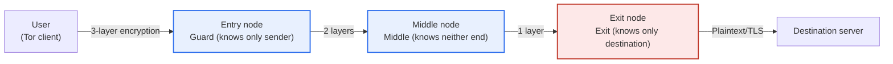

# Tor vs VPN Comparison

## 1. Overview

### A. Concept and Background of Tor

> **Tor (The Onion Router)** is an anonymous communication (anonymity) network that conceals the sender's identity and location (IP) by **encrypting the communication path in layers as it passes through multiple relay nodes (Onion Routing)**.

IP, the basic protocol of the internet, was originally designed without anonymity in mind. Every packet header contains the source IP and destination IP in plaintext, and intermediate routers, ISPs, and destination servers can directly observe "who connects to where". Even if content is encrypted with TLS (HTTPS), the **metadata (existence, counterpart, time, and volume of traffic)** of "who communicated with whom" is exposed as-is. The essence of the problem is that from this metadata alone, an individual's political leanings, health status, personal relationships, and sources can be substantially reconstructed. For journalists, human rights activists, whistleblowers, and citizens of censoring states, hiding "whom they contacted" is as much a matter of survival as "what they said".

Tor's core idea is "**wrapping in multiple layers so that no one knows the entire path**". Rather than concentrating trust in one place, it divides it finely among multiple mutually independent parties, so that no single node can know "who connects to where" in its entirety. Tor has its roots in onion routing research begun at the U.S. Naval Research Laboratory (NRL) in the 1990s for the purpose of protecting government communications; in the 2000s it was released as open source, and with the nonprofit Tor Project taking over maintenance and development, it grew into a public network of thousands of relays operated by volunteers worldwide. Paradoxically, the more numerous and diverse the users of an anonymity network, the better each individual hides in the crowd (**anonymity loves company**) — so the very fact that governments, activists, and ordinary people use the same network strengthens anonymity.

### B. Concept of VPN and the Difference in the Two Technologies' Goals

> **VPN (Virtual Private Network)** is a technology that creates an **encrypted tunnel** between the user and a VPN server, allowing the public network to be used safely like a private network and replacing the real IP with the server's IP.

Contrasting the goals of the two technologies at a glance:

- **Tor**: Distributed trust → maximizes anonymity, sacrifices performance and usability. Free, public network.
- **VPN**: Concentrated trust (provider) → secures connection and performance, no transparency regarding the provider. Usually paid, dedicated infrastructure.

The original purpose of VPN is not "anonymity" but "**secure connection and perimeter extension**". Typical uses are remote employees securely accessing the corporate network (remote access VPN), connecting headquarters and branches as a single private network (site-to-site VPN), and preventing eavesdropping on public Wi-Fi and bypassing geo-blocking. Here the user **trusts a single party**, the VPN provider. The problem is that this provider is in a position to see both the user's real IP and the connection target at the same time. In other words, VPN protects against "external eavesdroppers" but is defenseless against "the provider itself" (a "no-log policy" is a matter of contract and trust, not a structural guarantee). Tor and VPN are both privacy tools, but their trust models are fundamentally opposite: **Tor gains anonymity by distributing trust, while VPN gains performance and control in exchange for concentrating trust**.

## 2. How Onion Routing Works

A Tor client does not go directly to the destination; it receives a list of relays from directory servers and constructs a circuit usually consisting of three nodes: **Entry (Guard), Middle, and Exit**. When sending data, it **encrypts in three layers from outside to inside** with the keys of the exit, middle, and entry nodes. Each time a packet passes a node, that node peels off only its own layer (**decrypt one layer**), checks the next destination address, and forwards it — the name "onion" comes from this image of peeling an onion.

This structure creates anonymity **because the information each node knows is limited to "immediately before" and "immediately after"**. The entry node knows the sender's real IP but not the final destination (the inner layers are still encrypted). The exit node knows the destination but not who the sender is (the packet has already passed through several layers). The middle node knows only the relays before and after it and nothing about either end. Ultimately, the complete information of "who connects to where" does not exist at any single node, and breaking it would require collusion among multiple independently operated nodes. The Tor client replaces circuits roughly every 10 minutes, making long-term correlation tracking even harder.

What requires caution is **the segment from the exit node to the destination**. In this final segment, all of Tor's layered encryption has been removed, so if the user does not use **end-to-end encryption** such as HTTPS, a malicious exit node can snoop on or tamper with the content. In other words, Tor is a technology that hides "who", not one that automatically protects "what", and it must always be used together with HTTPS.

### A. Circuit Construction and Directory Authorities

For a Tor client to build a circuit, it must first know "which relays exist and are trustworthy". This role is handled by a small number of **Directory Authority** servers. They aggregate the status, bandwidth, and reliability of relays worldwide to produce an hourly signed **consensus document**, and clients download it to decide which nodes to put in a circuit. Thanks to this consensus structure, individual clients do not have to verify trustworthy nodes one by one, and it becomes difficult for malicious relays to take over circuits without limit.

Nodes are divided by role. The **Entry (Guard)** node is in the sensitive position of directly seeing the sender's real IP, so it is not changed randomly every time but fixed for a certain period (guard rotation) to lower the probability of accidentally landing on a malicious entry. The **Exit** node communicates directly with destinations, so it is easily exposed to abuse and legal liability controversies, and relatively few volunteers operate them. This role-specific risk asymmetry directly affects the performance and availability of the Tor network.

### B. The Reality of Performance and Usability

Tor is slow as an inevitable price of its anonymity design. Data physically passes through at least three nodes to reach its destination, and the computation of peeling off encryption layers at each hop is added. Because nodes are scattered around the world, geographic round-trip time (RTT) grows, and volunteer relays' bandwidths vary, creating bottlenecks. In particular, when exit nodes are scarce and traffic concentrates on a few nodes, overall perceived speed drops.

This performance characteristic also affects usability. Some websites require CAPTCHAs for connections from Tor exit IPs or block them outright to prevent abuse, and Tor is unsuitable for streaming and large transfers. So it is realistic to use Tor not as "all traffic through Tor all the time" but **selectively for activities that truly need anonymity**. Conversely, VPN, being single-hop with dedicated infrastructure, has low latency and is suitable for everyday continuous use — this performance gap itself is the practical factor that separates the uses of the two technologies.

### C. Onion Services (Dark Web)

Tor provides not only client anonymity but also **server anonymity**. **Onion Services (formerly hidden services)**, accessed via `.onion` addresses, do not expose the server's real IP; the client and server each build a Tor circuit and then meet at a rendezvous point to communicate. Thanks to this structure, news tip channels that are hard to censor or block (e.g., SecureDrop at major news organizations) and privacy services are operated, while the same anonymity is also abused for so-called "dark web" crime such as illegal marketplaces. Technology is neutral, and its benefits and harms come from the same root.

## 3. Tor vs VPN Comparison

A VPN wraps traffic in a single tunnel between the user and the server. Since it replaces the real IP with the server's IP and encrypts the transmission segment, it is effective for preventing public Wi-Fi eavesdropping, bypassing geo-restrictions, and accessing corporate networks, but the VPN server sees both ends (the real IP and the destination). Tor distributes this trust across three or more independent nodes so that no single place knows the whole. The table below compares the two technologies on several axes, but the essence to emphasize before the table is **whether trust is distributed**. In a VPN, the final line of defense for privacy is the trust of "can the provider be trusted", whereas in Tor the defense is the structure itself, in which "no one needs to be trusted". In exchange for that structure, however, Tor is slow due to multi-stage relaying and encryption.

| Category | Tor | VPN |
|---|---|---|
| **Primary purpose** | Anonymity (concealing identity·location) | Secure connection·IP/region bypass |
| **Path** | Multiple nodes (3+), distributed trust | Single VPN server |
| **Trust model** | Trustless (no node knows the whole) | Requires trust in provider (single point of trust) |
| **Encryption** | Layered (onion, one layer per node) | Tunnel encryption (client↔server) |
| **Speed·latency** | Slow (multi-stage relaying) | Relatively fast |
| **Cost/operation** | Free·volunteer relays | Usually paid·provider-operated |
| **Main uses** | Censorship circumvention·anonymous access·whistleblowing | Remote access·branch connection·region bypass |
| **Weaknesses** | Exit node eavesdropping, correlation attacks | Provider logs·legal demands·server compromise |

The key difference can be summarized as **the trade-off between trust model and performance**. A VPN is fast and easy to handle at the cost of trusting one provider, while Tor, in exchange for not needing to trust anyone, is slow from passing through multiple nodes and runs into blocks and CAPTCHAs on some sites. For example, a journalist who must protect sources in an environment where freedom of expression is suppressed chooses Tor, sacrificing speed because anonymity is absolute, while an employee accessing internal systems from café Wi-Fi chooses VPN because performance and stability matter.

The two technologies are not mutually exclusive and are sometimes combined. **Tor over VPN** (user → VPN → Tor) hides from the ISP the very fact of "using Tor" and prevents the real IP from reaching the entry node directly, while **VPN over Tor** (user → Tor → VPN → destination) prevents the exit node from seeing the destination and helps access specific services. However, both methods bring new trust assumptions and performance degradation, so stacking them blindly without clarifying the threat model can actually weaken anonymity.

### A. Representative Usage Scenarios

The choice between the two technologies ultimately comes down to "whom are you protecting what from". The scenarios frequently encountered in practice are summarized as follows.

- **Source protection·whistleblowing**: Since identity exposure means a threat to personal safety, anonymity is absolute. → Tor + onion-based tip channel (SecureDrop).
- **Access to information in censoring states**: State-level blocking and surveillance must be evaded. → Tor + bridges·pluggable transports to disguise entry.
- **Remote workers accessing the corporate network**: Identity may already be revealed; secure connection and performance matter. → Enterprise VPN.
- **Preventing public Wi-Fi eavesdropping·region bypass**: The goal is everyday privacy and convenience. → Commercial VPN.
- **Investigations·research requiring the highest level of identity concealment**: One wants to hide even the fact of entry. → Combinations such as Tor over VPN, but re-examine trust assumptions.

In this way, the simple question "is anonymity a matter of life, or are performance and connectivity the goal?" decides most choices.

## 4. Advanced — Limits of Anonymity and Threat Model

### A. Traffic Correlation Attacks

From a Professional Engineer's perspective, it is important that although Tor provides strong anonymity, it is not "**complete anonymity**". A representative threat is the **traffic correlation (end-to-end timing) attack**. A global passive adversary that can simultaneously observe the timing and packet-volume patterns of traffic entering the entry node and the patterns exiting the exit node can link the sender and the destination through statistical correlation, even without seeing the content.

Tor's threat model excludes such global observers from its defense scope from the outset — this is an explicit design limitation. That is, Tor does not promise to stop even "a nation-state-level adversary monitoring the world's internet backbone simultaneously". The **Guard node** policy of fixing the entry node for a long time is a realistic defense to reduce the probability of eventually landing on a malicious entry if a random entry were used each time, a compromise intended to mitigate this limitation.

### B. Application-Layer Leaks and Countermeasures

Moreover, actual identity exposure usually occurs not in the protocol but in **user behavior and the application layer**. Representative de-anonymization paths are as follows.

- **Real-name login**: Even when connecting via Tor, logging into a real-name account immediately links that session to a specific individual.
- **IP leaks**: Browser plugins, WebRTC, and non-Tor applications send the real IP around the tunnel.
- **External resource loading**: If documents or images fetch external resources using the real IP, location is revealed.
- **Browser fingerprinting**: Combinations of fonts, resolution, and extensions become a fingerprint identifying an individual.
- **Behavioral patterns**: Identity is inferred through correlation of incidental information such as connection times, writing style, and habits.

This is why the Tor Project recommends using **Tor Browser**, which unifies fingerprints and disables risky features.

When a censoring state blocks entry to Tor itself, this is countered with **bridges**, unpublished circumvention relays, and **pluggable transports (obfs4, Snowflake, etc.)**, which disguise traffic as ordinary HTTPS and the like. Recently, protocol improvements such as circuit congestion control are also underway to address Tor's long-standing performance limitations. In short, Tor's anonymity holds only when "network structure + correct client + disciplined use" are all in place.

## 5. Considerations and Implications

1. **Choose the tool that fits the threat model and purpose.** First define what must be protected (from whom, and what is being hidden). If complete anonymity and censorship circumvention are the goal, Tor is suitable; if enterprise remote access, secure communication, and region bypass are the goal, VPN is suitable; combine them when needed (Tor over VPN, etc.), but always review the new trust assumptions.

2. **End-to-end encryption (HTTPS) is not optional but essential.** Tor hides only "who" and does not automatically protect "what", so always use it with TLS to prevent exit node eavesdropping and tampering, and for sensitive services it is safer to confine the end-to-end path within Tor using onion services.

3. **There is no complete anonymity; usage discipline is key.** Anonymity can be broken by correlation attacks, application-layer information leaks, and user mistakes. Operational discipline such as using a dedicated browser, separating from real-name activities, and disabling risky features is as important as the technology.

4. **A social and legal balance regarding a double-edged sword is needed.** Anonymity has, from the same root, the benefits of press freedom, human rights protection, and censorship circumvention, and the harms of dark web and criminal abuse. Rather than banning the technology itself, balance should be struck through social consensus and procedural controls (such as investigations following due process) between legitimate privacy protection and crime response.

5. **There are also defensive implications from the enterprise/institutional perspective.** Organizations should control abuse through access control based on Tor exit node IP lists and anomalous traffic detection, while clearly defining policy boundaries so as not to indiscriminately block even legitimate use of privacy tools.

## References
- Tor Project official documentation (How Tor Works, Onion Services): https://support.torproject.org/
- Tor Project — Overview: https://2019.www.torproject.org/about/overview.html.en

---

> **In one line**: Tor is *a trustless anonymity network that conceals identity by distributing trust through multi-node onion routing*; unlike a VPN, which trusts a single server, it ensures no node knows the full path, but it has limits in speed and complete anonymity, so Tor and VPN are chosen or combined according to the purpose — anonymity (Tor) versus secure connection and performance (VPN) — and the threat model.
