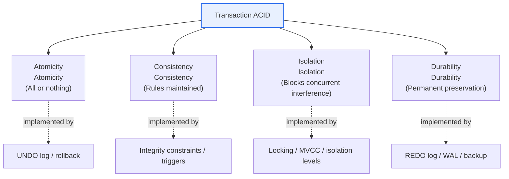
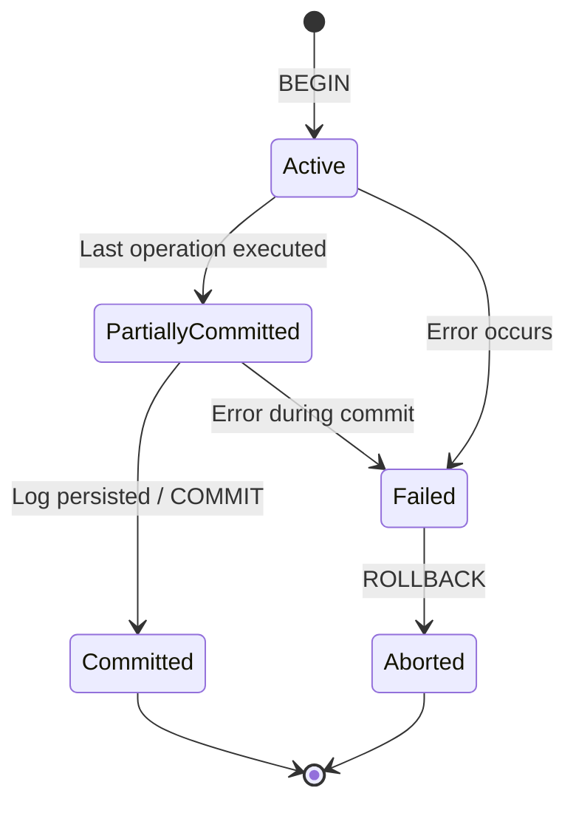

# Characteristics of Database Transactions (ACID)

## 1. Overview

### A. Definition
> A **transaction** is a single **logical unit of work** that changes the state of a database; it bundles multiple read and write operations and guarantees that they **either all succeed (Commit) or all fail (Rollback)**. The four properties that this reliability must possess are defined as **ACID (Atomicity, Consistency, Isolation, Durability)**.

The essence of a transaction lies in the principle of "**All or Nothing**." Take a bank transfer as an example: withdrawing 100,000 won from account A and depositing 100,000 won into account B are logically a single event, so they must succeed together or fail together. If the withdrawal is applied but the deposit is lost due to a system failure, 100,000 won vanishes from the world and the data falls into a contradictory state. A transaction treats such a bundle of operations as one unit and, if an error occurs midway, atomically reverts to the state at its start (rollback).

ACID decomposes "which properties make up this reliability" into four axes. Atomicity guarantees "indivisibility," consistency "no rule violations," isolation "concurrent execution looks like sequential execution," and durability "once confirmed, it does not disappear." Only when these four properties are upheld together can a database function as a trustworthy "system of record" even in an environment where many users and failures are always present. This is why ACID became the foundation of relational DBMSs in domains such as banking, securities, e-commerce, and airline reservations, where data accuracy equals trust and legal liability.

### B. Background and Necessity
Early file systems easily corrupted data when multiple users updated the same data simultaneously or when a power outage occurred during processing. If problems like lost updates, partial updates, and dirty reads are left unchecked, the integrity of accounting, inventory, and reservation data collapses. The concept that emerged to solve this fundamentally is the transaction, and the transaction processing theory established by Jim Gray in the 1970s–80s became the theoretical foundation of today's ACID.

The necessity can be summarized along two axes. The first is **concurrency**. In an environment where countless users read and write the same data at the same time, the correctness of results must be guaranteed as if each transaction were running alone. The second is **recovery**. Even amid failures that can occur at any time — power outages, disk errors, forced process termination — committed results must survive and uncommitted results must disappear without a trace. ACID is the contract for satisfying these two requirements, and the mechanisms that uphold it, such as locking, logging, and MVCC, form the core of the DBMS engine.

## 2. The Four ACID Properties

ACID is a set of four properties that guarantee transaction reliability from different perspectives. The structural diagram below shows which perspective each of the four properties covers under a single transaction concept.

### A. Atomicity
Atomicity means that the operations making up a transaction are treated as **a single chunk that cannot be divided further**. Either all operations are successfully applied (Commit), or if even one fails, all operations already executed are canceled as well (Rollback), returning to the state before the start. An intermediate state (e.g., withdrawal done but deposit not) is never left outside as a confirmed result.

Let's return to the account transfer to see what problems arise without atomicity. If the server goes down right after the withdrawal UPDATE succeeds, a system without atomicity is left with only the withdrawal applied, and the total assets no longer balance. Atomicity restores consistency by reverting the already-recorded withdrawal using the **UNDO log**. In this way, atomicity is responsible for "safe retreat on failure."

From an implementation standpoint, atomicity is mainly realized through **log-based rollback**. Before actually changing the data, the DBMS first records the before-image values in the UNDO log, and if the transaction fails, it applies this log in reverse order to restore the original state. Thus atomicity, like durability discussed later, depends directly on the quality of log management.

### B. Consistency
Consistency means that the database remains in a state that satisfies **predefined rules (integrity constraints)** both before and after a transaction executes. Rules include primary key and foreign key constraints, NOT NULL, CHECK constraints, and business rules such as "the sum of all account balances is identical before and after a transfer." A transaction moves data from one consistent state to another, and even if intermediate steps violate the rules, all rules must be satisfied at commit time.

A point to note here is that responsibility for consistency is **split between the DBMS and the application**. The DBMS enforces declared constraints and triggers, but domain rules such as "preservation of the transfer total" are upheld only when the application writes correct SQL. That is, even if atomicity, isolation, and durability are upheld, consistency can break if the developer introduces faulty logic. In this sense, consistency is less a pure engine function than a joint effort of "engine guarantees + correct design."

As a practical example, consider an inventory management system. An order transaction deducts the stock quantity, and if a CHECK(stock >= 0) constraint is set so stock cannot go negative, the DBMS blocks the rule violation and rejects the commit. Declaring constraints in the data layer like this provides a last line of defense even when the application has bugs.

### C. Isolation
Isolation guarantees that even when multiple transactions run concurrently, **each produces the same result as if it had run alone sequentially**. That is, intermediate results of a running transaction must not be visible to other transactions, and concurrent execution must not damage each other's correctness. Always enforcing full isolation (Serializability) greatly reduces concurrency, so in practice **isolation levels** are defined to trade off performance and correctness.

There are three representative anomalies that appear when isolation is incomplete. A **Dirty Read** reads another's uncommitted change; a **Non-repeatable Read** reads the same row twice but gets different values; a **Phantom Read** queries with the same condition but gets a different number of rows. ANSI SQL defines four isolation levels according to how far these anomalies are allowed.

| Isolation Level | Dirty Read | Non-repeatable Read | Phantom Read |
|---|---|---|---|
| **READ UNCOMMITTED** | Allowed | Allowed | Allowed |
| **READ COMMITTED** | Prevented | Allowed | Allowed |
| **REPEATABLE READ** | Prevented | Prevented | Allowed (prevented depending on implementation) |
| **SERIALIZABLE** | Prevented | Prevented | Prevented |

The higher the isolation level, the better the correctness, but lock scopes widen or retries increase, reducing concurrency and throughput. For example, bank settlement needs strong isolation close to SERIALIZABLE, whereas a product catalog that is mostly read is fine with READ COMMITTED. Implementation approaches also fall into two families. Traditional lock-based approaches prevent conflicts with read and write locks, while **MVCC (Multi-Version Concurrency Control)** maintains multiple versions (snapshots) of data and raises concurrency with the property that "reads do not block writes." Oracle, PostgreSQL, and MySQL InnoDB adopting MVCC to secure read performance are representative examples.

### D. Durability
Durability means that the **results of a successfully committed transaction are permanently preserved no matter what failure (power outage, crash) occurs afterward**. A user who receives a commit response must be able to trust that the result will not disappear. The core implementation technique of durability is **WAL (Write-Ahead Logging)**. Before writing data pages to disk, changes are first safely written to the REDO log, and the commit is confirmed only after the log has landed on disk.

Thanks to WAL, even if the server dies right after a commit, on restart the REDO log is re-applied (roll-forward) to restore committed changes, and incomplete transactions are removed with UNDO (roll-back) to restore consistency. This "log first" principle secures both performance and safety because sequentially writing the log is much faster than writing data pages at random locations to disk every time, while still leaving a basis for recovery.

However, durability has the limitation of depending on the reliability of the storage layer. If power is lost while the log is only in the OS buffer and has not been flushed to the actual disk, the commit can be lost; so in practice durability is reinforced with forced fsync, battery-backed caches, and multiple replicas (replication). The four properties and their implementation techniques are summarized in the table below.

| Property | What It Guarantees | Representative Implementation Techniques |
|---|---|---|
| **Atomicity** | All applied or nothing applied | Commit/rollback, UNDO log |
| **Consistency** | Rules and constraints maintained | Integrity constraints, triggers, correct app logic |
| **Isolation** | Blocks interference between concurrent transactions | Locking/MVCC, isolation levels |
| **Durability** | Committed results preserved permanently | REDO log/WAL, fsync, replication/backup |

## 3. Transaction State Transitions and Commit Protocols

A transaction passes through a defined lifecycle (states), and this state management is the practical implementation of atomicity and durability. The state diagram below shows the transitions a transaction goes through from start to completion or abort.

With BEGIN, a transaction enters the **Active** state and performs operations; after finishing the last operation, it moves to **Partially Committed**. At this point the changes may still be only in memory (buffers), and they are confirmed as **Committed** only once the REDO log has been safely written to disk. If an error occurs during execution, it enters the **Failed** state, restores the original via the UNDO log through ROLLBACK, and ends as **Aborted**. In that COMMIT permanently confirms results and ROLLBACK returns to the starting state, these state transitions themselves are the concrete execution procedure for atomicity (no exposure of intermediate states) and durability (commit after the log is persisted).

In a distributed environment, multiple nodes are involved, so a simple commit cannot preserve atomicity. Here **2PC (Two-Phase Commit)** is used. It is split into a prepare phase, in which the coordinator asks all participants "can you commit?", and a commit phase, in which it instructs "commit" if all agree; if even one node fails to prepare, the whole is rolled back. However, 2PC has the weaknesses of a blocking problem — participants wait indefinitely if the coordinator goes down — and high latency cost, so in large-scale distributed systems alternatives like Saga, described later, are preferred.

## 4. Extension to Distributed Environments — BASE, CAP, Saga

ACID, powerful on a single node, sees its cost skyrocket the moment data is distributed across multiple nodes. The **CAP theorem** explains the fundamental reason. A distributed system cannot fully satisfy Consistency, Availability, and Partition tolerance simultaneously, and in the reality where network partitions (P) are unavoidable, one must yield to some degree between C and A. Holding onto strong consistency (ACID) lowers availability during partitions, while prioritizing availability requires accepting temporary inconsistency.

The model adopted by the camp that chose availability and scalability in this trade-off is **BASE (Basically Available, Soft state, Eventually consistent)**. Rather than always being immediately consistent, BASE aims for **Eventual Consistency**. That is, values may differ between nodes briefly right after an update, but after some time all replicas converge to the same value. It suits data where momentary inconsistency is not fatal, such as "like" counts on large-scale social media or product view counts, and NoSQL systems like Cassandra and DynamoDB represent this model.

| Category | ACID | BASE |
|---|---|---|
| **Goal** | Strong consistency/correctness | Availability/scalability |
| **Consistency model** | Immediate consistency | Eventual consistency |
| **Typical use** | Finance, accounting, reservations | SNS, logs, recommendations, caches |
| **Representative technology** | RDBMS (2PC) | NoSQL, message-based systems |

In MSA (Microservices Architecture), each service has its own separate DB, so a single business operation spans multiple DBs and traditional transactions cannot be used. Here the **Saga pattern** becomes the alternative. A Saga splits a long business process into a chain of local transactions and, if it fails midway, executes **compensating transactions** that undo previously successful steps, emulating logical atomicity. For example, in an order → payment → shipping flow, if the shipping reservation fails, compensating operations — payment cancellation and order cancellation — are performed in reverse order. Sagas are implemented in two styles, choreography (event-based) and orchestration (central coordinator), and gain scalability without 2PC's blocking at the cost of "giving up immediate consistency" and "the burden of designing compensation logic."

## 5. Deep Dive — Recent Trends and Practical Application

For a while the trend of "abandoning ACID for scale" (the early NoSQL era) prevailed, but recently **NewSQL and distributed SQL, which seek to revive ACID even in distributed environments**, have risen strongly. Google Spanner uses atomic clocks (TrueTime) to provide strong consistency and external consistency at global scale, and CockroachDB, YugabyteDB, TiDB, and others implement this in the open-source world, aiming to catch two birds with one stone: "horizontal scaling + ACID." This shows that there is a strong demand to secure scalability without pushing the complex handling of eventual consistency onto developers.

Transaction processing in the relational camp itself has also evolved. Many DBMSs adopted MVCC by default to reduce read-write conflicts, and PostgreSQL provides the SERIALIZABLE level without locking through SSI (Serializable Snapshot Isolation). In addition, cloud-managed DBs (such as Aurora) separate the log into the storage layer to optimize WAL writing and replication, raising both durability and availability. In practice, knowing these characteristics and **choosing a consistency grade that fits the nature of the business** becomes a core design competency.

From the Professional Engineer (Information Management) perspective, exam points generally fall into three branches: ① accurately describing the definition and implementation techniques of each ACID property, ② presenting the correspondence between isolation levels and anomalies with tables and examples, and ③ extending the discussion of ACID's limits in distributed environments to CAP, BASE, 2PC, and Saga. In particular, answers that explain **the reasons for the trade-offs**, such as "why lower the isolation level?" or "why use Saga in MSA?", are what differentiate candidates.

## 6. Considerations and Implications

1. **The trade-off between isolation and performance is the heart of practice.** Raising the isolation level improves correctness but reduces concurrency and throughput due to locking and retries. Differentiated application by business characteristics is needed, e.g., READ COMMITTED for read-heavy work and REPEATABLE READ or higher for accuracy-critical work such as settlement and inventory.

2. **Consistency is a joint responsibility of the engine and the application.** Even if the DBMS enforces rules with constraints and triggers, domain rules (such as total preservation) are upheld only with correct SQL design. It is safe to declare constraints in the data layer as a last line of defense against application bugs.

3. **In distributed environments, relax and restructure ACID to fit the situation.** 2PC provides strong atomicity but incurs high blocking and latency costs, while BASE and Saga provide scalability at the cost of eventual consistency and the burden of compensation logic. Under CAP's constraints, one must decide whether to weight strong consistency or availability according to the importance of the data.

4. **Log-based recovery is the physical foundation of reliability.** Since atomicity and durability are implemented with UNDO/REDO logs (WAL), log management, checkpoint and backup strategies, and fsync and replication configuration determine the substance of data integrity. Because durability depends on storage-layer reliability, it must be reinforced with redundancy and replication.

5. **Re-examine "the coexistence of scalability and ACID" with NewSQL and distributed SQL.** The emergence of Spanner, CockroachDB, and others has shaken the premise that "you must abandon ACID to scale." When designing a new system, it is reasonable to first examine whether distributed SQL can deliver the required performance before accepting eventual consistency.

## References
- Wikipedia, "ACID" — https://en.wikipedia.org/wiki/ACID
- PostgreSQL Documentation, "Transaction Isolation" — https://www.postgresql.org/docs/current/transaction-iso.html
- microservices.io, "Pattern: Saga" — https://microservices.io/patterns/data/saga.html

---

> **In one line**: A transaction is a logical unit of work that *either fully succeeds or fully fails*; it guarantees reliability by implementing *Atomicity, Consistency, Isolation, and Durability (ACID)* through locking, MVCC, and logs (WAL), and in distributed, NoSQL, and MSA environments it adjusts trade-offs under CAP's constraints via BASE, 2PC, and Saga, while NewSQL has recently attempted to reconcile scalability with ACID.
