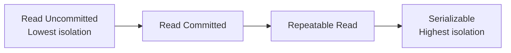

# Transaction Isolation Level

## 1. Overview

### A. Definition
> A level that specifies **to what extent concurrently running transactions are allowed to affect one another (degree of isolation)**. It is the practical implementation of ACID's **Isolation**, and a dial that adjusts the **trade-off** between concurrency and consistency.

Ideally, every transaction should be perfectly isolated as if running alone (Serializable), but doing so makes concurrent throughput plummet. So the standard (ANSI SQL), instead of perfect isolation, defined several levels that **gain concurrency at the cost of tolerating some anomalies**. Understanding isolation levels therefore means judging "which anomalies to allow and what performance to buy."

### B. Background and Necessity
Strengthening isolation raises consistency but increases lock contention and lowers concurrency; relaxing it raises concurrency but increases the risk of anomalies. That is, there is an inverse relationship: **isolation↑ = consistency↑, concurrency↓**. Forcing maximum isolation on every workload kills performance, while indiscriminate use of low isolation breaks data integrity. Therefore, it is necessary to **choose the appropriate level** according to the nature of the work — whether money changes hands so integrity is absolute, or whether it is a statistical query where slight inaccuracy is acceptable.

## 2. Anomalies by Isolation Level

Isolation levels form a staircase that **blocks the three representative anomalies one by one starting from the lowest level**. Going down, more anomalies are prevented, but concurrency decreases.

| Isolation Level | Dirty Read | Non-repeatable Read | Phantom Read |
|---|---|---|---|
| Read Uncommitted | Occurs | Occurs | Occurs |
| Read Committed | Prevented | Occurs | Occurs |
| Repeatable Read | Prevented | Prevented | Occurs (possible) |
| Serializable | Prevented | Prevented | Prevented |

## 3. Anomaly Examples

The three anomalies are distinguished by **"did you read unconfirmed data / did the value change when you read the same thing twice / did the row count change."** Examples make the principles clear.

A **Dirty Read** is reading a change that has not yet been committed. If A modifies a balance from 100 to 200 (uncommitted) and B queries it as 200, then when A rolls back, B has read a value that never existed. From Read Committed upward, only committed data is read, preventing this.

A **Non-repeatable Read** is when, within one transaction, **the same row** is read twice and the values differ. If A modifies and commits a row between B's first and second reads of it, B gets a different answer to the same query. Repeatable Read prevents this by maintaining a snapshot of the rows read during the transaction.

A **Phantom Read** is when the row count of a **range query** changes. If, between B's queries for "accounts with balance of 100 or more," A inserts and commits a new row that matches the condition, a row that did not exist appears. Because this concerns a range rather than individual rows, it is fully blocked only at Serializable (or with range locks/Next-key Locks).

| Level | Example |
|---|---|
| Read Uncommitted | A changes balance 100→200 uncommitted, B reads 200 → Dirty Read when A rolls back |
| Read Committed | A modifies and commits while B is reading → different value on re-read (Non-repeatable) |
| Repeatable Read | Same row stays consistent, but Phantom if a new row is inserted during a range query |
| Serializable | Full serialization, all anomalies prevented, lowest concurrency |

## 4. Concurrency Control Techniques

The performance of isolation levels varies greatly depending on **how they are implemented**. The traditional **lock-based** approach places shared/exclusive locks on reads and writes and guarantees serializability with two-phase locking (2PL), but reads block writes, causing heavy contention. To overcome this limitation, modern DBMSs use **MVCC (Multi-Version Concurrency Control)**.

| Technique | Description |
|---|---|
| Lock-based | Shared/exclusive locks, 2PL (two-phase locking) |
| MVCC | Minimizes read-write conflicts with snapshot versions (Oracle, PostgreSQL) |
| Snapshot Isolation | Ensures consistency by reading the snapshot as of transaction start |

MVCC matters because it does not overwrite data but **maintains multiple versions**, letting readers see the snapshot of their own point in time and writers create new versions, thereby achieving **"readers don't block writers."** As a result, high consistency and high concurrency can be obtained at the same time.

## 5. Considerations and Implications
A point to watch in practice is that **defaults and actual behavior differ across DBMSs**. The default for Oracle and PostgreSQL is Read Committed, while MySQL InnoDB uses Repeatable Read, and InnoDB in particular prevents much of Phantom even at Repeatable Read through Next-key Locks. Therefore, rather than trusting only the standard's theoretical table, one must verify the actual implementation of the engine in use. The selection strategy is clear. When integrity is absolute, as in financial payments, use Serializable (or explicit locks); for read- and statistics-heavy work, use a lower level to preserve concurrency. When isolation is lowered, compensating for integrity at the application level with **optimistic locking (version column validation)** and the like, balancing performance and consistency, is the judgment expected of a Professional Engineer.

---

> **In one line**: Moving from *Read Uncommitted → Committed → Repeatable Read → Serializable*, isolation levels successively block Dirty, Non-repeatable, and Phantom Reads at the expense of concurrency; they are implemented with locks and MVCC, and the level is chosen to match business integrity requirements to balance consistency and performance.
