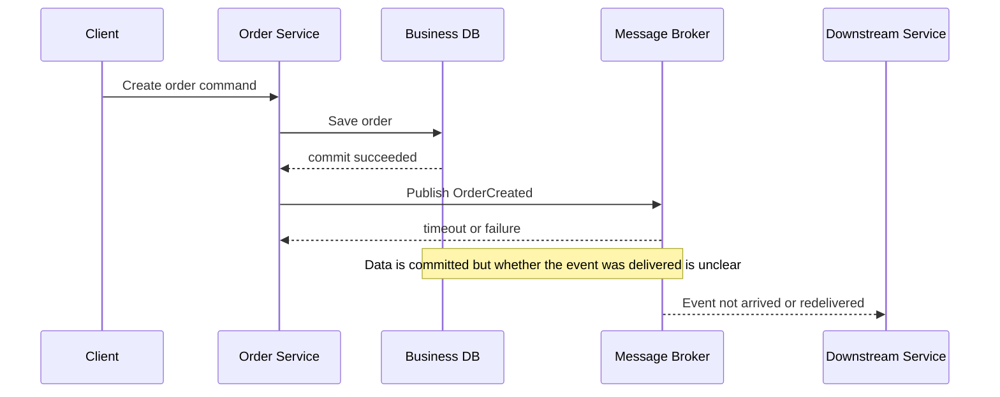
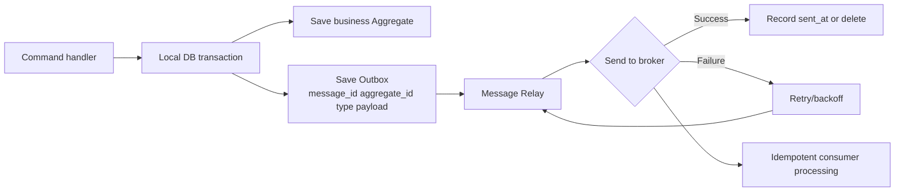
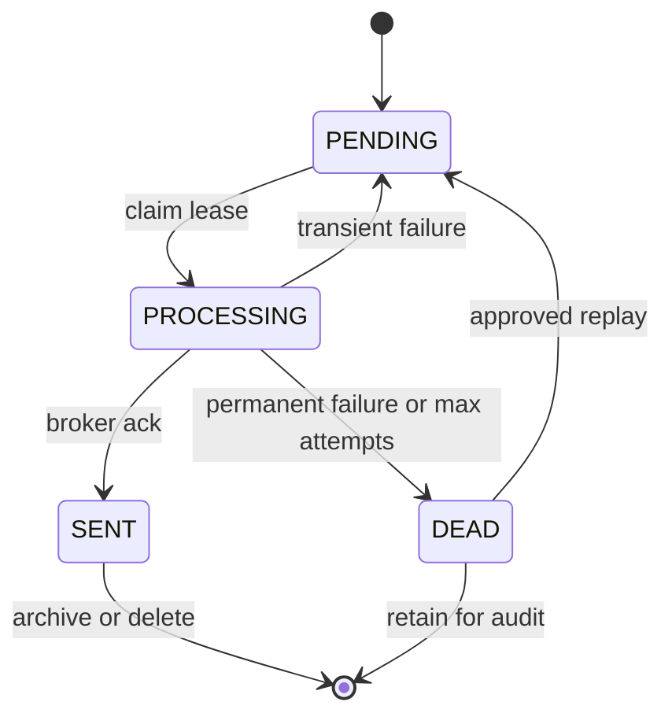

# Transactional Outbox Pattern

## 1. Overview

> The transactional outbox pattern is a distributed system design pattern in which business data changes and event/message publication are recorded in the same local database transaction, after which a separate message relay delivers the committed outbox entries to the broker.

In microservices, a single command usually produces two side effects.
First, it stores business state such as orders, payments, or inventory in its own database.
Second, it publishes an event to a message broker so that other services can perform follow-up work.
Since these two storage targets are different systems, calling them in sequence from application code results in a dual write.

If the process stops after the database commit succeeds, the data exists but the event may be lost.
Conversely, if the broker publish succeeds first and then the database transaction rolls back, consumers end up processing a business fact that does not exist.
A network timeout does not clearly tell the caller whether the broker actually received the message, so simple retries alone make it hard to solve duplication and loss at the same time.

Instead of sending messages directly to the broker, the transactional outbox stores them together in an outbox table or record in the database.
When the business table and the outbox are included in the same local transaction, a committed business change always leaves an event to be delivered, and a rolled-back business change leaves no event.
A message relay then reads the outbox and sends it to the broker, so the application request path can be decoupled from external broker failures.

This pattern is not a silver bullet that solves every distributed transaction.
It makes the recording of data and events atomic within a single service, but it does not atomically bind delivery to the broker through to consumer processing.
Therefore, at-least-once delivery, duplicate messages, ordering, consumer idempotency, reprocessing, and compensating work must be designed together.

In a Professional Engineer exam answer, rather than writing only the definition, it is important to connect four axes: the failure points of dual write, the atomic recording of the outbox, relay retransmission, and consumer idempotency.

## 2. Background and Problems to Solve

### 2.1 Dual Write in the Direct Publish Approach

The most intuitive implementation is for a service to call the message broker's `publish` API right after updating the database.
If both calls succeed, the desired result is obtained, but if any one of the application process, network, database, or broker fails, the states diverge.

The DB-first approach has a window in which the business state is committed but the broker publish fails or the process dies.
In this case, the inventory service or shipping service may never learn that the order was created.
The broker-first approach creates an even more serious false fact because the source data may roll back while consumers are processing the event.

The key point is that `DB commit` and `broker publish` are independent operations on different resources.
Even if the broker call is placed inside the database transaction, atomicity does not arise unless the broker participates in the same transaction.
On the contrary, broker latency can hold the database connection for a long time and make it hard to interpret the ordering of commit and message sending.

The outbox approach, by contrast, separates the broker call from the business transaction.
A short local transaction that commits the business table and the outbox row together finishes first, and the relay asynchronously sends only committed rows.
Therefore, the success condition of a request response is defined not as "the broker received it immediately" but as "the business state and the event to be delivered were stored safely."

### 2.2 Failure Matrix and Scope of Guarantees

When analyzing failures, the business DB, relay, broker, and consumer must be observed separately.
If the business DB transaction rolls back, the outbox must roll back with it so that no event is published.
If the relay dies after commit, the outbox row must remain so it can be retried after restart.

| Stage | Failure Example | Desired Result | Required Design |
|---|---|---|---|
| Before business save | Input validation/domain rule failure | Neither business data nor event exists | Transaction rollback |
| During business save | DB error/timeout | Neither business data nor outbox exists | Same local transaction |
| Right after commit | Service process stops | Outbox remains and sending is delayed | Restart/retry |
| During broker send | Network response lost | Unclear whether actually received | Tolerate duplicates/message ID |
| During consumption | Consumer stops | Message redelivered or reprocessed | Consumer idempotency |
| Prolonged outage | Broker/consumer down for a long time | Outbox backlog and alerts | Retention/quarantine/operations runbook |

The representative guarantee of this pattern is that "an event becomes a relay target only when the business transaction has committed."
However, the guarantee that "an event arrives at the broker and consumers exactly once" does not hold in typical implementations.
This is because if the relay dies before receiving the send-success response, it can send the same row again after restart.

It is therefore safer to explicitly state the system's delivery semantics as at-least-once and treat duplicates as a normal operational situation.
Business results that look exactly-once are implemented at the consumer by combining message IDs, processing history, conditional updates, and unique constraints.
If delivery semantics and business semantics are not distinguished, errors arise such as trusting only the broker's features and allowing duplicate payments or duplicate reservations.

## 3. Core Components and Processing Flow

### 3.1 Logical Structure of the Outbox

The outbox is a durable boundary that temporarily stores events that must be sent.
In a relational database it is created as a separate table in the same database as the business tables, and in a document database it can be represented as an event array or change attribute inside the business record.
Either way, identifiers are needed to track the business meaning and delivery status of the event.

`message_id` becomes the basis for retransmission and consumer deduplication.
`aggregate_id` groups events belonging to the same order, account, or shipment and can be used as the basis for the partition key or ordering guarantees.
`event_type` and `schema_version` let consumers interpret the event kind and contract version.

`occurred_at` is the time the business event occurred, and `published_at` is the time of broker delivery, so the two must not be confused.
`sequence` can express business order within the same aggregate, but a simple global auto-increment value does not necessarily mean the causal order across all services.
`attempt_count`, `last_error`, and `next_attempt_at` are used by operators to check retry status and to compute exponential backoff.

An example schema can be designed as follows.

| Column | Meaning | Design Point |
|---|---|---|
| `id` | Outbox row identifier | Incrementing key or time-sortable ID |
| `message_id` | Logical message ID | Used for global unique constraint and deduplication |
| `aggregate_type` | Kind of business object | Consumer routing and authorization review |
| `aggregate_id` | Business object identifier | Ordering for the same object and partition key |
| `event_type` | Event kind | Contract and handler selection |
| `schema_version` | payload version | Basis for backward compatibility/migration |
| `payload` | Event body | Minimize sensitive data/serialization rules |
| `occurred_at` | Business occurrence time | Latency measurement and audit trail |
| `status` | pending·processing·sent·dead | State transitions and reprocessing control |
| `attempt_count` | Number of send attempts | Backoff/quarantine threshold |
| `last_error` | Summary of the latest failure | Exclude secrets/operational diagnosis |

The outbox payload should contain the facts consumers need, and a form whose meaning is complete only by querying the source database later should be chosen carefully.
This is because if the source record is changed or deleted between the time the event is published and the time it is consumed, past facts cannot be reproduced.
On the other hand, copying personal data and large binaries into events complicates retention, encryption, and deletion requirements, so the data minimization principle should be applied.

### 3.2 Atomic Recording Order

The service validates the command, executes domain rules, and then places the business change and the outbox event in a single local transaction.
Even if the business table is saved first and the outbox later, as long as both are in the same transaction, atomicity matters more than the order itself.
If any write fails, the whole must be rolled back, and the success response is returned after this commit.

Separate the event storage port from the message relay so that the application layer invokes event publication but does not directly perform the actual broker send.
Even when collecting domain events, fix the correlation ID, causation ID, and schema version at the point where events are converted into outbox records.
Only then can the tracing of the same command and the causal relationships spanning multiple services be observed.

Relying solely on the ORM's automatic flush or transaction boundaries can lead to missing events in test and production environments.
Explicitly decide which events to publish for each business state change, and verify in integration tests that "number of committed state changes = number of outbox events" and that on rollback there are "0 outbox rows."
Also lower the chance of developers omitting outbox records by using code review rules or a domain event dispatcher.

### 3.3 Message Relay Approaches

The relay is a separate process or data platform component that moves the outbox to the broker.
The simplest polling publisher periodically queries `pending` rows, applies locking/claims, and publishes in batches.
After confirming publish success, it records `sent_at` or deletes the row, and for failed rows it updates the retry time.

A short polling interval reduces delivery latency but increases DB query and locking load.
If the batch size is too large, the retransmission volume and broker load from a single failure grow; if too small, throughput drops.
Therefore, determine the interval and batch size through load testing using the target latency, outbox inflow rate, average payload size, DB IOPS, and broker quota.

The CDC approach reads committed outbox changes from the database transaction log or change stream and delivers them to the broker.
It can reduce application DB query load and delivery latency compared with polling, but log retention, schema changes, connector operations, and offset recovery must be managed separately.
CDC does not mean that every change to business tables immediately becomes a public event; it is safer to restrict publication targets to explicit outbox events only.

| Approach | Advantages | Costs/Risks | Suitable Situation |
|---|---|---|---|
| Periodic polling | Simple structure, can start with just the DB | Query/locking load, variable latency | Small scale or initial adoption |
| Transaction log CDC | Low latency, good for high volume | Connector/log/offset operational complexity | Organizations with high event inflow and platform capabilities |
| DB trigger | Can prevent missed records | Business rules hidden in the DB, reduced portability | Limited legacy integration |
| Application event collection | Business meaning and contracts controlled in code | Developer omission, dependency on shared libraries | Domain-centric services |

There is again a non-atomic window between the relay's send and its status recording.
Since the relay can die after successfully sending to the broker but before recording `sent_at`, merely changing the status row to `processing` first does not eliminate duplicates.
Rather than trying to eliminate this window, design to allow retransmission and keep the same `message_id` so consumers can safely remove duplicates.

### 3.4 Concurrency, Locking, and Ordering

If multiple relay instances read the same rows, duplicate publications can increase.
In a relational DB, `SELECT ... FOR UPDATE SKIP LOCKED` can be combined with a claim time, owner, and lease expiry, but the locking semantics of the DB in use and the cost of long transactions must be verified.
If a relay holding a row permanently dies, another relay must be able to reclaim it after the lease expires.

If event ordering within the same aggregate matters, choose one of: a single partition per aggregate, sequence validation, or sequential claiming.
Enforcing global order can reduce throughput and availability, so in most cases only the order within the business-required scope — such as the same order, account, or device — is guaranteed.
One must not assume that the row ID order across different aggregates represents business causality.

## 4. Designing for Duplicates, Ordering, and Reprocessing

### 4.1 Idempotent Consumer

Duplicates arise naturally when the relay fails to confirm the broker response, when the broker redelivers, or when a failure occurs before the consumer ACK.
The consumer places a unique constraint on a `message_id` processing history table and quickly succeeds on already-processed messages, or makes the business update itself conditional and idempotent.
For example, a payment approval request uses a unique payment attempt key per order ID, and when a second request arrives with the same key, the existing result is returned.

If possible, bind the processing history record and the business update into a single consumer local transaction as well.
If a failure occurs after the business update but before recording the processing history, reprocessing causes duplicate side effects, so a unique key conflict is used as a normal duplicate signal.
For side effects outside the consumer DB, such as an external payment API, the provider's idempotency key, request key, and reconciliation jobs must be used together.

### 4.2 Failure Classification and Retries

Transient network errors, broker throttling, and temporary consumer outages are retried with exponential backoff and jitter.
Schema errors, missing required fields, and invalid business states will not succeed even if retried, so instead of infinite retries they are sent to a quarantine queue or a dead-letter outbox.
The retry policy must include the maximum count per error code, maximum retention time, and whether operator approval is required for reprocessing.

Reprocessing distinguishes between resending the original payload as-is and creating a new corrective event.
Simple resending is useful for re-applying past events after consumer code has been fixed, but it does not undo external side effects that have already been partially performed.
Where compensating work is needed, such as for amounts, inventory, or permissions, have the operator confirm the cause and effect and execute a separate compensating command.

### 4.3 Observability and Operational Metrics

The outbox is an asynchronous boundary, so looking only at request success rates misses failures.
Collect outbox row oldest age, pending count, publish latency, retry rate, dead-letter count, and relay throughput as key metrics.
Separating the latency from `occurred_at` to the broker publish time and the latency from publish to completion of consumer processing reveals where the bottleneck is.

Log message_id, aggregate_id, correlation_id, event_type, attempt_count, and relay_instance in a structured form.
Do not leave the full payload or personal data in logs; link the original event and operational records via trace IDs.
In distributed tracing, the business request span and the relay span span different processes, so safely propagate the trace context in the event headers.

Deleting outbox entries immediately after the retention period ends can make audit and reprocessing difficult.
Distinguish the hot area of the operational DB, low-cost archive, and personal data deletion policy, and review backup, reconciliation, and reprocessing possibilities before deletion.
Keeping processed rows indefinitely grows index and storage costs, so use partitions, TTL, and archive jobs while ensuring they do not conflict with regulatory retention requirements.

## 5. Related Technologies and Comparison

### 5.1 Comparison with Direct Publish and 2PC

Direct publish is short to implement, but the application must itself bear the failure windows between DB commit and broker send.
2PC attempts an atomic commit by coordinating prepare and commit across multiple participants, but participant support, coordinator failure, and the costs of holding locks and blocking must be considered.
The outbox does not make the broker a distributed transaction participant and records the message in the DB first, lowering coupling and operational complexity.

| Category | Direct Publish | 2PC/XA | Transactional Outbox |
|---|---|---|---|
| Scope of atomicity | Depends on call order | All participants | Business DB and outbox record |
| Broker coupling | Directly coupled to the application | Requires coordinator/XA support | Relay is coupled |
| Delivery latency | Immediate attempt | Commit coordination time | Asynchronous latency |
| Duplicate handling | Depends on implementation | Must still be considered after commit | Idempotent consumer mandatory |
| Failure isolation | Request path is affected | Participant failure blocks the transaction | Isolated as relay backlog |
| Operational burden | Low initially, high during failures | Complex protocol/locks/recovery | Outbox/relay/replay operations |

The outbox is not always superior to 2PC.
If strong atomicity across multiple data stores is absolutely required and all participants support proven XA, 2PC can be considered.
However, if external brokers, SaaS, or cloud services do not participate in XA, or if high availability and loose coupling are important, the outbox's eventual consistency becomes the more realistic choice.

### 5.2 Relationship with CDC, Event Sourcing, and Saga

CDC is a transport mechanism that reads and delivers changes, while the outbox is a pattern that explicitly records which business facts to publish.
Exposing every row change in business tables externally can harden the internal schema into an event contract, so reading separate outbox events via CDC makes the boundary clear.

Event sourcing is a model that stores events as the system's source of truth and replays them to build state.
The outbox aims to guarantee external publication while maintaining ordinary current-state tables, so it can be used without event sourcing.
In systems that adopt event sourcing, the delivery boundary between the event store and the external broker can be designed with an outbox or a log-based relay.

A Saga is a pattern that coordinates work spanning multiple services as a chain of local transactions and compensating actions.
The outbox can be used together at each saga step to safely publish its own DB change and the next command or event.
The outbox complements the atomicity of message delivery, while the saga handles business progress and compensation policies across multiple services, so their roles should not be confused.

## 6. Application Cases

### 6.1 E-commerce Orders

The order service changes the order status to `PAID_PENDING` while recording `PaymentRequested` in the outbox.
When payment is approved, the payment service records the processing history and payment status together and puts `PaymentApproved` into its own outbox in turn.
The inventory and shipping services use the same order ID and event ID to prevent duplicate reservations and duplicate shipments.

Loss of the payment approval event can leave an order waiting forever, so pending oldest age is set as an alert.
When only the network response is lost during a payment retry, the payment result must be queried with the same idempotency key; blindly creating a new approval request can result in double payment.
Operators must be able to reconcile the states of orders, payments, and inventory and execute corrective commands.

### 6.2 Financial Transfers and Ledger Events

The account service records the ledger balance and the transfer event in the same local transaction.
The event contains the transaction ID, account identifier, amount, currency, and ledger sequence, but excludes authentication information and unnecessary personal data.
Consumers use a unique constraint on the transaction ID and sequence validation to avoid applying the same transfer twice and to quarantine out-of-order events.

In financial operations, ledger invariants and reconcilability matter more than the phrase "process only once."
Allow broker retransmission, but design storage constraints and processing history so that the final ledger result is applied only once.
Due to retention, audit, and access control requirements, the outbox's archive and deletion policies must be determined together with legal and security staff.

### 6.3 Logistics and IoT State Changes

A logistics hub stores equipment status while publishing `DeviceStateChanged` events to update monitoring, maintenance, and notification services.
Since the state order of the same device matters, the device ID is used as the partition key, and if the sequence is less than or equal to the previous value, the event is treated as a duplicate or delayed event.
Short transient failures are retried, and for stale states from terminals that have been offline for a long time, a policy of overwriting with the latest state or discarding is applied.

When the number of events per second is high, polling every row can burden the DB.
In this case, combine CDC with partitioned outboxes, batch relays, and adjusted retention periods, while load-testing the database log and broker throughput.
Operational metrics should include not only per-device latency and omissions but also the freshness of the monitoring screen affected by outbox backlog.

## 7. Deep Dive: Design and Adoption Strategy and Expected Exam Points

### 7.1 Phased Adoption

In the first phase, select one core use case that needs events and create an outbox with minimal fields in the same DB as the business tables.
Before removing synchronous broker publication, a shadow mode that compares existing publication with outbox publication can be used.
Since duplicate events can reach consumers, consumer idempotency is secured first during the transition period.

In the second phase, standardize the relay's claim, lease, backoff, DLQ, and reprocessing.
If each service creates different status names and retry rules, operators will find it hard to respond to failures, so provide shared libraries and platform guards.
However, since event contracts have different meanings per domain, do not force them into one giant common payload model.

In the third phase, expand to CDC or an event platform, and connect a schema registry, contract tests, retention, and access control.
Even if the broker changes, maintain the meaning of domain events and message_id rules to reduce unnecessary changes to consumer contracts.
Adoption outcomes are evaluated by event loss rate, average delivery latency, reprocessing success rate, and number of unresolved reconciliation items rather than simple throughput.

### 7.2 Expected Answer Structure

In the overview of an exam answer, present the background of dual write and distributed transactions, then define it as "storing business data and the outbox in the same local transaction, with a relay publishing asynchronously."
In the concept diagram, show the command handler, DB transaction, business tables, outbox, relay, broker, and idempotent consumer without omission.

In the body, contrast the two failure scenarios of direct publish with the atomic recording of the outbox.
Explaining the difference between polling and CDC, the design of message_id, aggregate_id, and sequence, and duplicates, ordering, retries, DLQ, and observability metrics lets the answer move beyond simple memorization.

In the conclusion, state the limitation that the outbox does not promise "exactly once," but provides local atomicity and reprocessable eventual consistency.
Presenting combinations with 2PC, Saga, and event sourcing according to business criticality, along with idempotent consumers, reconciliation, security, cost, and operational capability, reveals judgment from a Professional Engineer's perspective.

## 8. Considerations and Implications

### 8.1 Specify the Scope of Guarantees as a Contract

Document "event publication guarantee" by splitting it into commit guarantee, broker delivery guarantee, and consumption processing guarantee.
Service level objectives should include maximum delivery latency, maximum retry time, DLQ handling time, and acceptable duplicate rate.
If business owners do not understand this, asynchronous eventual consistency may be displayed incorrectly to users.

### 8.2 Design Idempotency and Ordering per Business Process

Instead of enforcing global order on all messages, define only the order needed per aggregate.
Combine the consumer's processing history, conditional updates, unique keys, and external idempotency keys according to the type of side effect.
Rather than recording duplicates only as errors, test them as a normal redelivery path.

### 8.3 Storage, Retention, and Personal Data Minimization

The outbox retains the original payload until the event is published, so it becomes a point where sensitive data is replicated.
Minimize fields and design encryption, access control, masking, retention periods, and deletion propagation.
Even when archiving processed events, decide in advance the priority between audit requirements and personal data deletion requirements.

### 8.4 Operational Safety and Failure Isolation

The relay should not place excessive locks on the DB, and it should isolate failures so that a single failed row does not block an entire batch.
During broker failures apply backpressure, circuit breakers, and rate limits, and set upper bounds and alerts so that outbox backlog does not exhaust the business DB's storage space.
Control DLQ reprocessing with operational tools that include approval, preview, dry-run, and rollback or compensation procedures.

### 8.5 Contract Evolution and Testing

Events are not internal table DTOs but contracts that external consumers depend on, so be careful about deleting fields or changing meanings.
Manage schema versions, backward compatibility rules, consumer-driven contract tests, and sample payloads together.
In integration tests, verify commit, rollback, relay interruption, lost broker ACK, duplicates, order inversion, and DLQ reprocessing as scenarios.

### 8.6 Balance in Architectural Choice

The outbox table and relay require additional storage and operational components, so applying them unconditionally to simple CRUD services increases costs.
Conversely, if data changes lead to payments, inventory, permissions, or audits in other services and the cost of event loss is high, it is worth accepting small delivery latency and operational complexity.
A Professional Engineer must choose among direct publish, outbox, 2PC, and Saga based on transaction boundaries, cost of failure, throughput, regulation, and organizational capability.

## References

- AWS Prescriptive Guidance, [Transactional outbox pattern](https://docs.aws.amazon.com/prescriptive-guidance/latest/cloud-design-patterns/transactional-outbox.html)
- Chris Richardson, [Pattern: Transactional outbox](https://microservices.io/patterns/data/transactional-outbox.html)
- Debezium Documentation, [Outbox Event Router](https://debezium.io/documentation/reference/stable/transformations/outbox-event-router.html)

---

> **In one line**: A pattern that records business data and events to the outbox in the same local transaction and delivers them with eventual consistency via a relay equipped with idempotent consumers, ordering, and reprocessing mechanisms.
